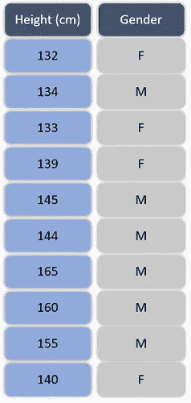
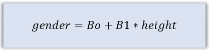
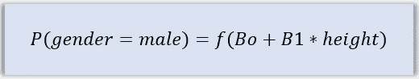
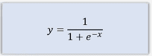
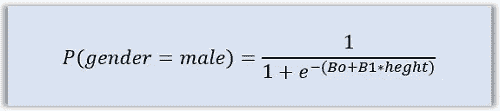
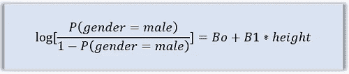
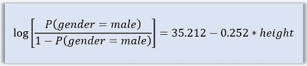

# 逻辑回归——概念和应用

> 原文：<https://towardsdatascience.com/logistic-regression-idea-and-application-a9664c0444dd?source=collection_archive---------50----------------------->


在 [Unsplash](https://unsplash.com/s/photos/2-colors?utm_source=unsplash&utm_medium=referral&utm_content=creditCopyText) 上由 [Janita Sumeiko](https://unsplash.com/@aajanita?utm_source=unsplash&utm_medium=referral&utm_content=creditCopyText) 拍摄的照片

本文将尝试:

*   讨论逻辑回归背后的思想
*   通过一个例子进一步解释

你应该已经知道的

*   [基础概率论](https://en.wikipedia.org/wiki/Probability_theory)
*   [线性回归](https://en.wikipedia.org/wiki/Linear_regression)
*   [乙状结肠功能](https://en.wikipedia.org/wiki/Sigmoid_function)

给你一个问题，根据一个人的身高预测他/她的性别。首先，给你提供 10 个人的数据，已知他们的身高和性别。要求您在这些数据中拟合一个数学模型，使您能够预测某个已知身高值但我们不知道其性别的人的性别。这类问题属于监督机器学习的分类领域。如果问题要求你进行各种分类，如真、假**或**富人、中产阶级、穷人**或**失败、成功等等，那么你就是在处理分类问题。它在机器学习中的对应部分是一个回归问题，该问题要求我们预测一个连续值，如分数= 33.4%，体重= 60 Kg 等。本文将讨论一种称为逻辑回归的分类算法。

虽然有许多分类算法，它们的复杂程度各不相同，如**线性判别分析**、**决策树**、**随机森林、**等，但逻辑回归是最基本的算法，非常适合学习分类模型。让我们跳到上述问题，假设，给我们十个人的数据如下:



这个问题完全不同于其他数学预测问题。原因是，一方面，我们有连续的身高值，但另一方面，我们有性别的分类值。我们的数学运算知道如何处理数字，但处理分类值却是一个挑战。为了克服分类问题中的这一挑战，无论它们是通过逻辑回归还是其他算法解决的，我们总是计算与类相关的概率值。在给定的上下文中，我们将计算与男性类或女性类相关的概率。另一个类别的概率不需要明确计算，但是可以通过从一个类别中减去先前计算的类别的概率来获得。

在给定的数据集中，我们以身高为自变量，性别为因变量。目前，如果我们假设它是一个回归问题，它将通过计算回归模型的参数得到解决，如下所示:



简而言之，我们会计算出 **Bo** 和 **B1** ，问题就解决了。分类问题不能以这种方式解决。如前所述，我们无法计算性别的价值，但可以计算与特定性别阶层相关的概率。在逻辑回归中，我们从线性回归中获得灵感，并使用上面的线性模型来计算概率。我们只需要一个函数，将上述线性模型作为输入，并给我们的概率值作为输出。在数学形式中，我们应该有这样的东西:



上面的模型计算了男性职业的概率，但是我们可以在这里使用这两个职业中的任何一个。等式右侧所示的函数应该满足这样的条件，即它应该接受任何实数输入，但应该只给出 0 和 1 范围内的输出，原因是显而易见的。以下所示的称为 Sigmoid 或逻辑函数的函数满足上述条件:



Sigmoid 函数的定义域为 *-inf* 到 *inf* ，取值范围为 0 到 1，非常适合逻辑回归中的概率计算。如果我们将线性模型代入 Sigmoid 函数，我们将得到如下所示的结果:



上面的等式可以很容易地重新排列，以给出更简单和容易理解的形式，如下所示:



等式的右边正是我们在线性回归模型中得到的&左边是几率概率的对数，也称为 logit。因此，上述等式也可以写成:

***logit(性别=男性)= Bo+B1 *身高***

这是逻辑回归背后的思想。现在让我们解决给我们的问题，看看它的应用。

我们将使用 Python 代码，使用给定的数据来训练我们的模型。我们先导入必要的模块。我们需要来自 *sklearn 的 *NumPy* 和*logistics regression*类。*

```
*from sklearn.linear_model import LogisticRegression*
```

现在模块被导入了，我们需要创建一个 LogisticRegression 类的实例。

```
*lg = LogisticRegression(solver = ‘lbfgs’)*
```

使用的求解器是 [**lbfgs**](https://en.wikipedia.org/wiki/Broyden%E2%80%93Fletcher%E2%80%93Goldfarb%E2%80%93Shanno_algorithm) 。现在是时候创建我们将用来训练模型的数据集了。

```
*height = np.array([[132,134,133,139,145,144,165,160,155,140]])**gender = np.array([1,0,1,1,0,0,0,0,0,1])*
```

注意，sklearn 只能处理数值，所以这里我们用 1 表示女性类，用 0 表示男性类。使用上述数据集，我们来训练模型:

```
*lg.fit(height.reshape(-1,1),gender.ravel())*
```

一旦模型被训练，你将得到同样的确认信息。现在我们有了一个训练好的模型，让我们检查一下参数，截距( **Bo** )和斜率( **B1** )。

```
*lg.coef_**lg.intercept_*
```

运行上面的行将显示截距值 35.212 和斜率值-0.252。因此，我们的训练模型可以写成:



我们可以使用上面的等式来预测任何给定身高的人的性别，或者我们可以直接使用如下所示的训练模型来查找身高= 140cm 的人的性别值:

```
*lg.predict(np.array([[140]]))*
```

试试上面的代码，你会明白的。请注意，该模型实际上给出了与给定类别相关的概率值，由我们来决定概率的阈值。默认值被认为是 0.5，即所有与高于 0.5 的雄性类相关联的概率值都被认为是雄性&如果小于 0.5，则雄性类的概率被认为是雌性。此外，逻辑回归中的分离边界是线性的，这可以很容易地用图形确认。

**进一步阅读**

[线性判别分析](https://www.wildregressor.com/2020/03/linear-discriminant-analysis-basics.html)

[决策树](https://www.wildregressor.com/2020/04/decision-trees-how-to-draw-them-on-paper.html)

这都在逻辑回归中。关于这篇文章的任何疑问，你可以通过 [**LinkedIn**](https://www.linkedin.com/in/tanvirhurra/) 联系我

谢谢，

祝你玩得愉快😊

*原载于 2020 年 4 月 20 日 https://www.wildregressor.com*[](https://www.wildregressor.com/2020/04/logistic-regression-idea-and-application.html)**。**