# 使用 Python 的分类模型中的逻辑回归:机器学习

> 原文：<https://towardsdatascience.com/logistic-regression-in-classification-model-using-python-machine-learning-dc9573e971d0?source=collection_archive---------4----------------------->

## 学习如何使用 python 构建机器学习中的基本逻辑回归模型


马库斯·温克勒在 [Unsplash](https://unsplash.com/s/photos/machine-learning?utm_source=unsplash&utm_medium=referral&utm_content=creditCopyText) 上的照片

逻辑回归是各种行业(如银行、医疗保健)中常用的模型，因为与其他分类模型相比，逻辑回归模型很容易解释。

## 二元分类

二元分类是最常用的逻辑回归。二元分类问题的一些例子是:

*   一家金融公司想知道客户是否违约
*   预测电子邮件是否是垃圾邮件
*   无论一个人是否患有糖尿病

二元分类总是只有两种可能的结果，要么是‘是’&‘否’，要么是‘1’&‘0’等等。

就像上一篇文章《 [**多元线性回归模型**](/multiple-linear-regression-model-using-python-machine-learning-d00c78f1172a) 》中所说的，一个自变量往往不足以捕捉逻辑回归的目标变量的所有不确定性。

现在让我们在 Jupyter 笔记本中使用 python 构建一个逻辑回归模型。

> 对于整篇文章，我们使用来自 [Kaggle](https://www.kaggle.com/bandiatindra/telecom-churn-prediction/data?select=WA_Fn-UseC_-Telco-Customer-Churn.csv) 的数据集。

我们将关注电信客户流失预测数据集。它有 21 个与客户行为相关的变量，用于预测特定客户是否会转向另一家电信提供商(即，客户流失与否)。

## 导入必要的库和数据

首先，我们将从导入必要的库到笔记本开始，并将`.csv`文件转换成 pandas 数据框。

数据集看起来像这样，

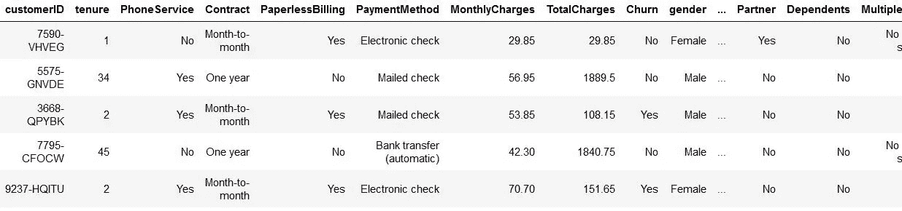

作者图片— **电信流失数据集**

上面数据集中的目标变量是`Churn`列。

## 检查数据帧

让我们用`.shape`、`.describe`和`.info`的方法检查数据帧。

代码的输出将是，

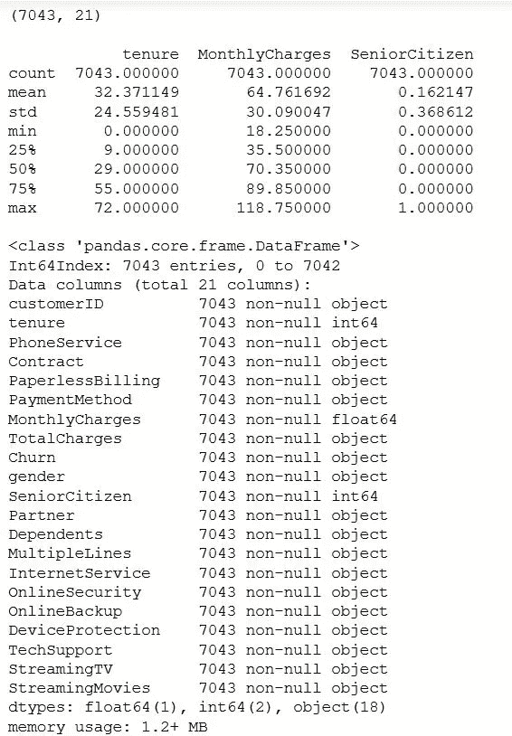

图片由作者提供— **检查数据**

正如我们所看到的，数据集中有`7043 rows`和`21 columns`，数值变量的值从最小值到最大值也没有明显的跳跃，并且数据集没有空值。

## 数据准备

现在，让我们通过将变量中的“是”和“否”值转换为“1”和“0”来准备数据。我们将通过定义一个函数并将“是”和“否”值映射到“1”和“0”来将值映射到“1”和“0”。

映射值后，数据集如下所示。

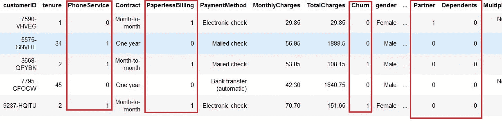

图片由作者提供— **为二进制列映射值**

**创建虚拟变量** 对于具有两个以上值的列，我们将创建类似于在“ [**多元线性回归模型**](/multiple-linear-regression-model-using-python-machine-learning-d00c78f1172a) ”文章中创建的虚拟变量。

输出将是，

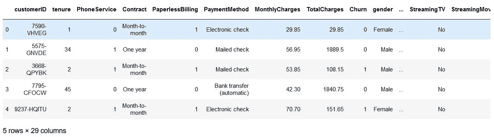

作者图片— **创建虚拟变量**

如果我们观察上面的数据集，列的数量从`21 columns`增加到`29 columns`。

我们正在为剩余的分类变量创建虚拟变量。

为所有变量创建虚拟变量后的数据集将是，

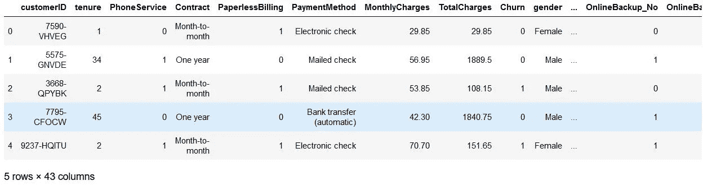

作者图片— **为所有剩余的列创建虚拟变量**

**删除原来的变量** 现在我们将删除我们为其创建虚拟变量的变量，如果它们之间有任何差异，我们将转换列的数据类型。

数据集的信息看起来像，

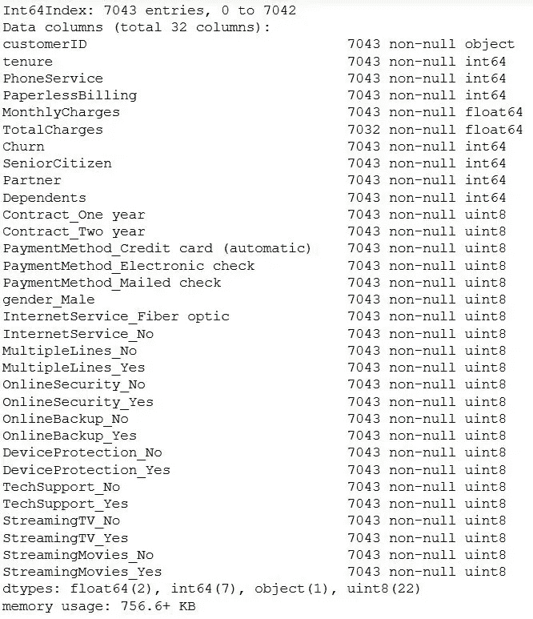

图片由作者提供— **创建所有必要虚拟变量后的数据集**

**异常值和缺失值** 现在，在继续建模之前，让我们再次检查数据集中的异常值和空值。

输出将是，

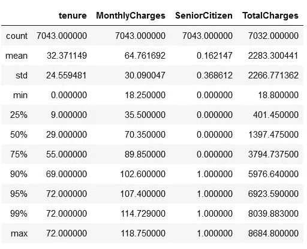

作者图片— **连续变量在不同百分位数的分布**

从分布数据中，我们可以看到数据中没有异常值。人数在逐渐增加。

现在让我们检查数据集中缺失的值并处理数据。

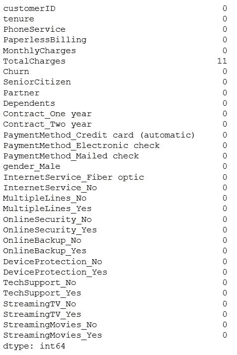

作者图片— **列中的空值**

让我们检查列中 null 值的百分比，以便就如何处理这些值做出明智的决定。

输出是，

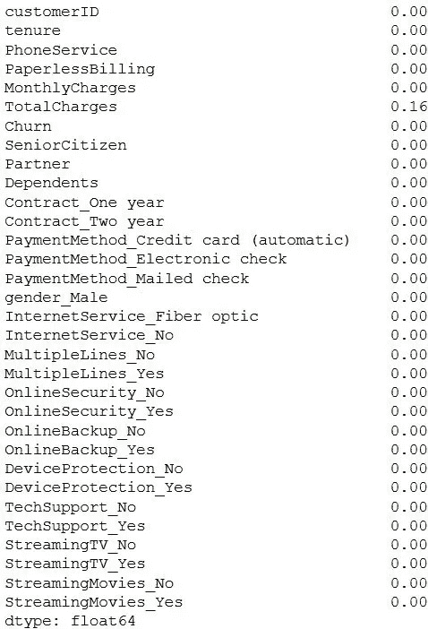

作者图片— **空值的百分比**

如果我们观察，`Total Charges`列的空值不到 0.2%。因此，最好是删除这些行，而不是向其中输入一些值。

处理空值后的输出将是，

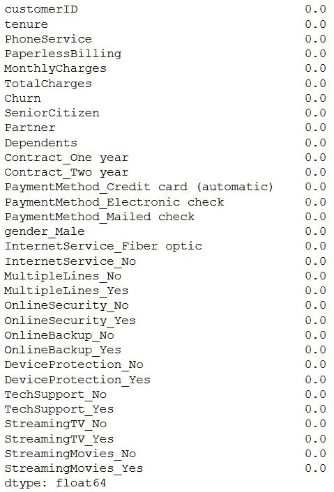

按作者排序的图像— **删除列后空值的百分比**

既然我们已经处理了空值，现在让我们继续构建模型。

## 模型结构

在建立模型之前，我们将数据分成`train`和`test`数据，类似于线性回归模型。因此，我们将使用`train`数据建立模型，并根据`test`数据评估模型。

## 测试列车分离

通过使用`sklearn`库，我们将导入`test_train_split`来分割数据。但是在分割数据之前，我们将数据集分成两个数据帧 X 和 y。

我们将删除`customerID`列，因为它对我们的模型没有用，并删除`churn`列，因为它是我们的目标变量。测试数据看起来像这样，

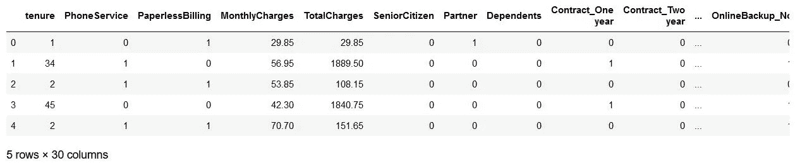

作者图片— **拆分后的测试数据**

让我们将目标变量指定为 y，并将数据分成测试集和训练集。

“y”数据集看起来像这样，

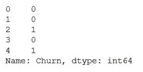

作者图片— **y 数据集**

## 缩放变量

如果我们观察数据，数据集中的所有数值都在不同的范围内。一个在 100 以下的区间，一个在 200 的区间，还有一个在 1500 以上。如果我们使用这些值构建模型，模型的系数将是不同的单位，因此不容易比较它们来做出明智的决定。

为此，我们将重新调整所有连续变量。为此，我们将使用来自`sklearn`的`StandardScaler`方法。

缩放特征后的数据集，

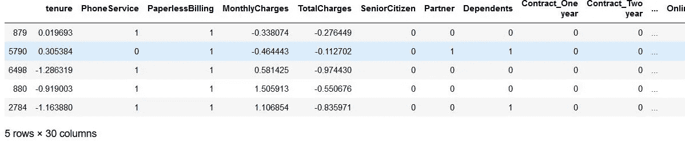

按作者分类的图像— **缩放后的数据集**

让我们检查从数据集中流失的客户的百分比，以了解有多少客户转移到了其他网络。

产量是 26.578498293515356
因此，我们有将近 27%的流失率。

## 相关

让我们看看变量之间的相关性。假设变量之间的相关性很高。在这种情况下，我们可以删除列，因为如果两个变量高度相关，那么就没有必要使用这两个变量来构建模型。我们可以用这两个变量中的一个来解释目标变量。

变量之间的关联热图看起来像这样，

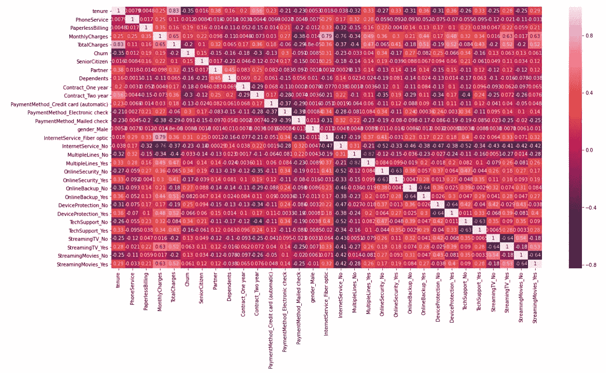

由作者提供的图片— **数据集中的关联热图**

如果我们观察热图，一些变量彼此高度相关。所以我们将从数据集中删除这些变量。

**删除高度相关的虚拟变量** 我们将从上面创建的 X_train 和 X_test 数据集中删除高度相关的变量。

现在，让我们重新检查 X_train 数据集中的相关性。

删除变量后的关联热图，

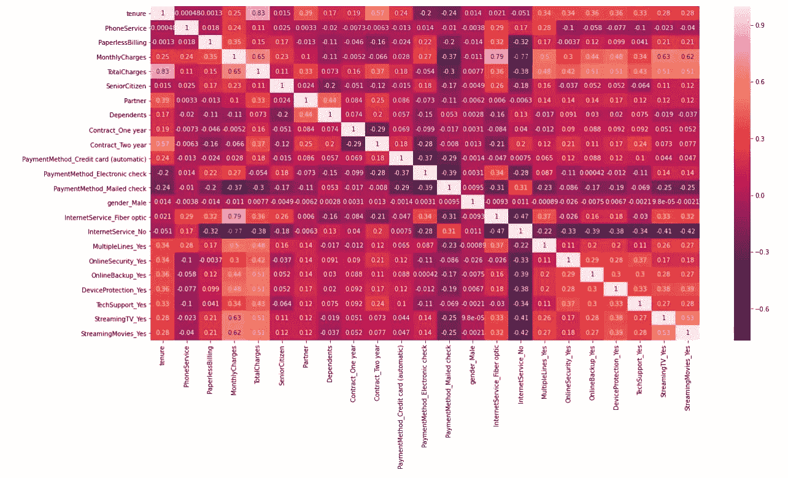

作者图片— **删除变量后的关联热图**

还有一些相关性很高的变量，但是我们可以在建模的时候去掉。就这么办吧。

## 运行我们的第一个培训模型

我们将使用`stasmodel`库来构建我们的第一个模型。让我们看看，如果我们考虑所有的变量，我们的模型是什么样的。

我们第一个模型的统计数据是，

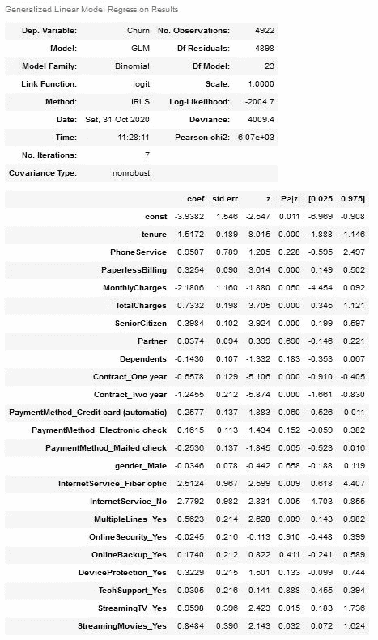

作者图片— **我们第一款**的统计

上面的模型不是一个好的模型，因为一些变量具有高 p 值，这意味着这些变量是无关紧要的。我们将使用一种叫做 RFE 的方法来选择模型的前 15 个变量，并根据 p 值和 VIF 值删除不太重要的变量，而不是一次删除一个变量并一次又一次地建立模型。

## 使用 RFE 的特征选择

我们将选择前 15 个变量，这有助于在我们的逻辑回归中建立模型。

前 15 个变量是，

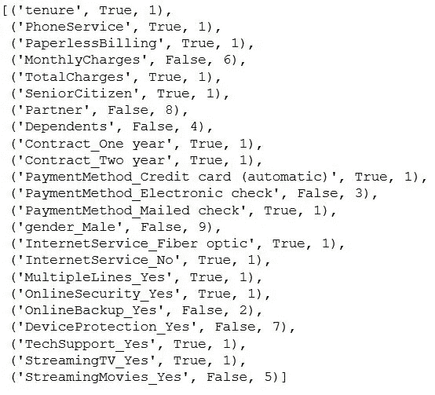

作者图片— **使用 RFE 的前 15 个变量**

显示为`True`的变量是我们感兴趣的变量，如果我们想要添加 15 个以上的变量，我们可以根据它们各自的排名逐一添加。

**使用上述 15 个变量建立模型** 让我们使用从 RFE 得到的 15 个变量建立第二个模型。

模型统计将是，

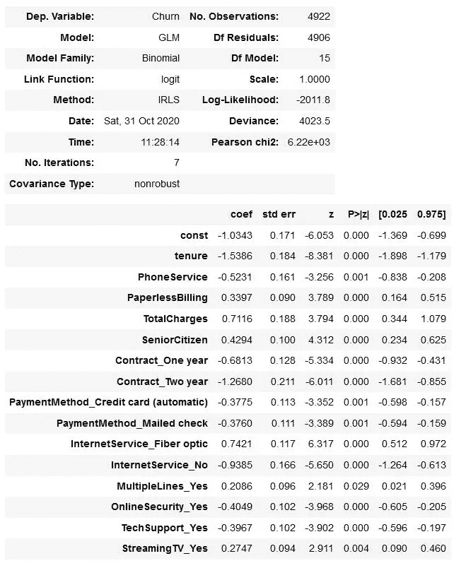

图片由作者提供— **使用 RFE 变量的逻辑回归模型**

这里我们使用来自`statsmodels.api`库的 **GLM(广义线性模型)**方法。`Binomial`in family 参数告诉`statsmodels`它需要用 logit 曲线拟合二项式数据(即目标变量只有两个值，在本例中为‘流失’和‘非流失’)。

一个简单的 logit 曲线看起来像这样，

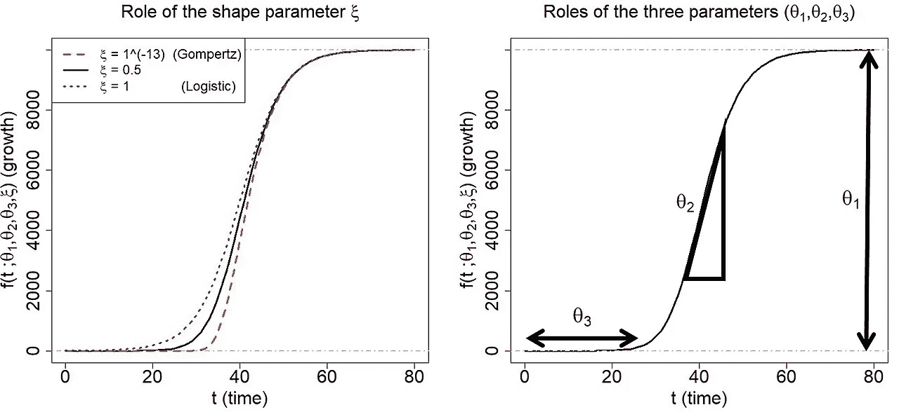

按统计数学-自己的工作，抄送 BY-SA 4.0，[https://commons.wikimedia.org/w/index.php?curid=92801334](https://commons.wikimedia.org/w/index.php?curid=92801334)

**预测产出概率** 逻辑回归曲线给我们带来了**搅动和不搅动的概率**。我们可以通过简单地使用**‘predict’**函数来得到这些概率。

预测的概率是

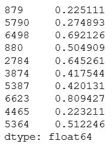

按作者分类的图片-预测概率

现在，让我们创建一个包含实际流失列和预测概率的数据框架。

上述程序的数据框架如下。

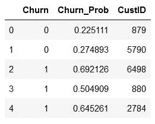

按作者分类的图像——实际流失及其概率的数据框架

由于逻辑曲线给出的是概率，而不是**‘流失’**和**‘非流失’**的实际分类，我们需要找到一个**阈值概率**来将客户分类为‘流失’和‘非流失’

这里，让我们选择 0.5 作为任意临界值，其中如果特定客户流失的概率小于 0.5，我们会将其分类为**“非流失”，**，如果大于 0.5，我们会将其分类为**“流失”**

**创建新列** 在这个阶段，0.5 的选择完全是任意的，我们将学习如何在“模型评估”中找到最佳临界值

选择任意截止值后，数据帧如下所示。

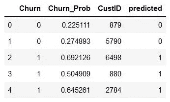

按作者分类的图像—任意截断后的数据帧

这里，我们使用 0.5 的临界值将客户分为'**流失客户**'和'**非流失客户**'既然这些都是概率，那就一定会有误差。

我们会遇到两种类型的错误:

*   **'流失**'客户被错误归类为'**非流失**'
*   **'非流失**'客户被错误分类为'**流失**'

## 混淆矩阵

为了找到这些错误和模型的健康状况，我们将使用一种叫做“混淆矩阵”的现象

典型的混淆矩阵如下所示。

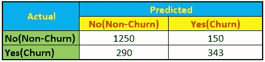

作者图片-混淆矩阵

> 注意:以上矩阵中显示的值只是一个示例

如果我们观察上面的矩阵:

*   第一行第一列(1250)是实际有'**未搅过**'的客户数；该模型还预测它们为“**未搅动**”这一列被称为**真阴性(TN)。**
*   第一行和第二列(150)是实际上'**没有搅动**，'但模型预测他们为'**搅动**'的客户数量这一列被称为**假阳性(FP)。**
*   第二行第一列(290)是实际上'**搅动了**，'但是模型预测他们为'**没有搅动**'此列称为**假阴性(FN)。**
*   第二行第二列(343)是实际“**搅了**”的客户数；此外，该模型还预测它们会被“搅动”**。这一列被称为**真阳性(TP)。****

**我们可以通过从`sklearn`导入`metrics`库，在 python 中创建这个混淆矩阵。**

**上述代码的混淆矩阵如下所示。**

**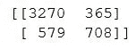**

**作者图片-混淆矩阵**

**评估模型的方法有很多种；我们为上述模型测量的指标之一是**准确性**。**

## **准确(性)**

**准确度是正确预测的标签的百分比。从矩阵中正确预测的标签将是:**

*   ****真阳性(TP):** 流失客户被预测为**流失****
*   ****真阴性(TN):** 非流失客户被预测为非流失客户。**

***准确度=(正确预测的标签)/(标签总数)***

**准确度= (TN+TP )/ (TN+FP+FN+TP)**

**根据我们上面的模型，**

**TN = 3270
FP = 365
FN = 579
TP = 708**

**精确度将是，**

**ACC =(3270+708)/(3270+365+579+708)= 0.808 = 80.8%**

**我们建立的模型大约有 81%的准确性。**

**我们可以直接用 python 计算精度，**

**我们通过上面的代码得到的精度是**

```
0.8082080455099553
```

## **检查 VIF**

**现在让我们检查上述模型的 VIF 值，看看是否有任何变量高度相关。**

> **我已经在我的上一篇文章“多元线性回归”中解释了 VIF 及其工作原理我们将遵循同样的程序。**

**让我们看看模型中变量的 VIF 值。**

**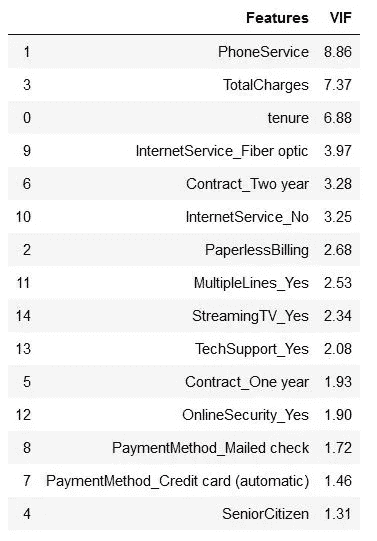**

**按作者分类的图像-用于查找多重共线性的 VIF 值**

**高 VIF 有几个变量。最好放弃这些变量。变量`PhoneService`具有最高的 VIF。因此，让我们从放弃它开始，重新构建模型。**

**上面代码的模型是，**

**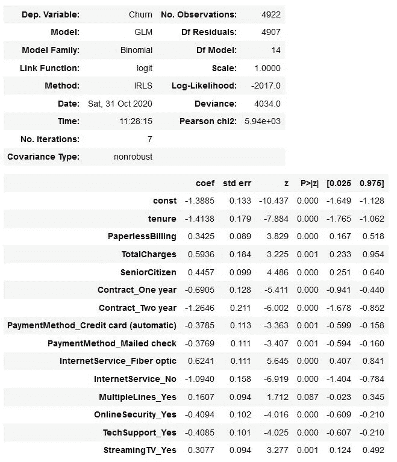**

**按作者分类的图像-逻辑回归模型统计**

**接下来，我们将预测这些值，并打印由原始流失值和预测值组成的数据帧。**

**数据帧看起来像这样，**

**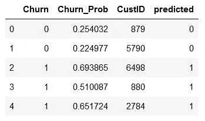**

**按作者分类的图像-原始值和预测值的数据框架**

**让我们检查模型的准确性。**

**模型的准确性将是**

```
0.8051605038602194
```

**这与原来的差距并不大。我们必须重新检查 VIF 值，删除变量，建立模型，并计算精确度。我们将继续下去，直到每个变量的 VIF 值都小于 5。**

**对于最终的模型，在反复遵循上述过程后，我们得到的混淆矩阵是，**

**矩阵看起来像这样，**

```
array([[3269,  366],
       [ 595,  692]],)
```

**最终矩阵的精确度= 0.80。18866.888888888687**

**现在，出现的问题是——准确性是我们用来评估我们建立的模型的好坏的唯一标准吗？
答案是**否****

****考虑一个例子:**假设我们试图为癌症患者建立一个逻辑回归模型，其中 1 表示患者“患癌”，0 表示患者“未患癌”在这种情况下，如果我们错误地预测一些患者“没有患癌症”，这将是非常危险的。在这种情况下，我们不考虑整体精度，而是正确预测 1。**

**在另一种情况下，如果我们为银行构建一个模型来阻止客户识别欺诈，其中 1 表示阻止，0 表示不阻止，我们更关心 0 是否正确。是因为我们不想把好客户挡在门外。**

**理解我们试图解决的整体业务问题，了解我们想要使用的度量标准是至关重要的。**

**因此，除了**准确性，**我们还有另外三个更重要的指标:**

*   ****灵敏度/召回率****
*   ****特异性****
*   ****精度****

## ****灵敏度/召回率****

**对于癌症类型的问题，我们使用敏感性。所以我们应该建立一个模型，这个模型的结果是高灵敏度，即 **FN(假阴性)**的值应该尽可能的低。**

> **灵敏度= (TP)/(TP+FN)**

## ****特异性****

**对于欺诈交易类型的案件，我们建立一个具有高特异性的模型，即 **FP(False Positive)** 的值应该尽可能低。**

> **特异性= (TN)/(TN+FP)**

## ****精度****

**如果我们想要建立一个模型来预测一封电子邮件是否是垃圾邮件，我们将使用精确度指标**。**在这种情况下，我们必须开发具有高精度的模型，即 **FP(假阳性)**的值应该尽可能低。**

> **精度= (TP)/(TP+FP)**

**现在，让我们找出我们之前建立的最终模型的灵敏度和特异性的值。**

**首先，我们将从最终矩阵中分配 TP、TN、FP 和 FN 值。**

**这里，**混淆**是我们之前创建的矩阵的名字。**

**现在，让我们找出不同指标的值。**

**上述代码的灵敏度和特异性值是，**

```
**# Sensitivity**
0.5376845376845377**# Specificity**
0.8993122420907841
```

**因此，我们的模型具有**高准确性(80.4%)** 和**高特异性(89.9%)** ，但**低****【53.7%)**，我们对识别可能流失的客户感兴趣，因此我们需要处理这一点。但是是什么导致了如此低的敏感度呢？**

**如果我们记得，当预测模型为 0 和 1 时，我们选择了 0.5 的截止值，这个截止值是随机选择的，没有特定的逻辑。**

**预测的标签完全取决于我们选择的截止值。对于低截止值，我们将有更多的客户预测为 1，这意味着更多的客户被识别为“流失”类似地，对于高截止值，我们将低数量的客户预测为 0，这意味着高数量的客户被识别为“非流失客户”**

## **寻找最佳截止点**

**在我们的问题中，我们试图找到一个最佳的临界值，在灵敏度和特异性之间取得平衡。首先，我们将找到从 0.1 到 0.9 的不同临界值的预测值**

**不同截止值下的流失概率看起来像，**

**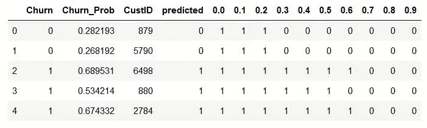**

**按作者分类的图像—不同截止点的流失概率**

**现在，让我们计算这些临界值的准确性、敏感性和特异性。**

**度量的不同值将是，**

**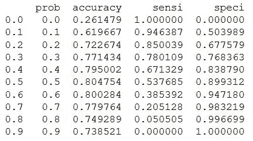**

**按作者分类的图像—准确性、敏感性和特异性值**

**让我们绘制一个线形图，看看在这些概率下准确性、敏感性和特异性是如何表现的。**

**线形图如下所示，**

**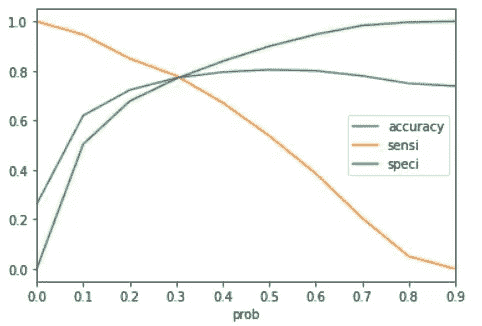**

**按作者分类的图像-折线图**

**从上面的曲线来看，0.3 或稍大一点是将其作为截止概率的最佳点。为了便于理解，我们将 0.3 作为临界值。**

**让我们使用这个 0.3 作为最终截止值来预测模型。**

**输出将是**

**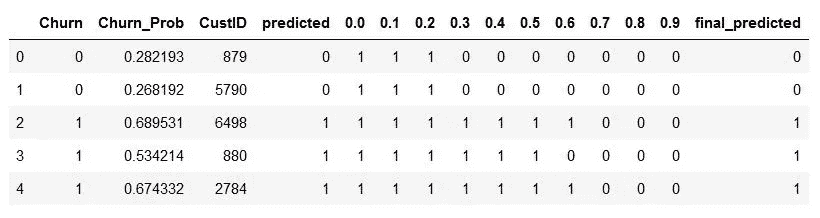**

**作者图片—最终预测**

**让我们找出准确性、特异性、敏感性和混淆矩阵。**

**上述代码的输出是:**

```
**# Accuracy**
0.771434376269809**# Confusion Matrix** array([[2793,  842],
       [ 283, 1004]])**# Sensitivity**
0.7801087801087802**# Specificity** 0.768363136176066
```

**既然我们有了最终的模型，让我们根据测试数据来评估我们的模型。**

## **模型评估**

**让我们使用最终模型对测试数据进行预测。首先，我们将扩展测试数据，类似于我们在分割后对训练数据所做的那样。**

**测试集看起来像这样，**

**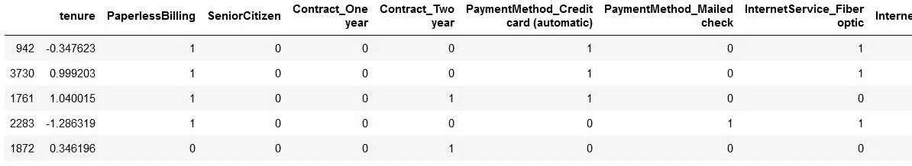**

**按作者排序的图像—缩放后的测试集**

**让我们现在对测试数据进行预测，仔细遵循下面的代码；我们正在对数据集进行许多更改。**

**最终数据集是在所有更改完成后生成的，**

**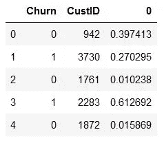**

**按作者分类的图像-最终数据集**

**为了便于理解，让我们重命名该列并重新排列它们。**

**数据集看起来像，**

**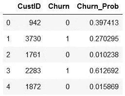**

**按作者分类的图像-最终数据集**

**让我们使用 0.3 作为截止值来预测模型，这是我们之前在训练数据集上获得的。**

**测试集的预测值是，**

**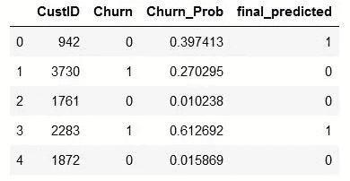**

**按作者分类的图像-预测值**

**让我们检查测试数据的准确性、敏感性和特异性值，并进行比较。**

**测试集的值是:**

```
**# Accuracy**
0.7440758293838863**# Confusion Matrix**
array([[1150,  378],
       [ 162,  420]],) **# Sensitivity**
0.7216494845360825**# Specificity** 0.7526178010471204
```

**如果我们比较训练数据集的准确性，敏感性和特异性值，没有太大的变化。因此，我们建立的模型足以预测任何未来的电信数据。**

# **结论**

**总而言之，我们已经看到了构建基本逻辑回归模型所需的步骤。我们还可以学习更多的概念，如 ROC 曲线、精确度、召回率等。但是要构建一个基本的逻辑回归模型，我们在本文中看到的过程已经足够好了。一旦我们掌握了这个过程，我们就可以在这个模型中探索更多的东西。**

****感谢您阅读**和**快乐编码！！！****

# **点击这里查看我以前的文章**

*   **[**使用 Python 的多元线性回归模型:机器学习**](/multiple-linear-regression-model-using-python-machine-learning-d00c78f1172a)**
*   **[**使用 Python 的简单线性回归模型:机器学习**](/simple-linear-regression-model-using-python-machine-learning-eab7924d18b4)**
*   **[**探索性数据分析(EDA): Python**](/exploratory-data-analysis-eda-python-87178e35b14)**
*   **[**中心极限定理(CLT):数据科学**](/central-limit-theorem-clt-data-science-19c442332a32)**
*   **[**推断统计:数据分析**](/inferential-statistics-data-analysis-e59adc75c6eb)**
*   **[**Seaborn:Python**](/seaborn-python-8563c3d0ad41)**
*   **[**熊猫:蟒蛇**](https://levelup.gitconnected.com/pandas-python-e69f4829fee1)**
*   **[**Matplotlib:Python**](https://levelup.gitconnected.com/matplotlib-python-ecc7ba303848)**
*   **[**NumPy: Python**](https://medium.com/coderbyte/numpy-python-f8c8f2bbd13e)**

# **参考**

*   ****机器学习—逻辑回归:**[https://www . tutorialspoint . com/Machine _ Learning _ with _ python/Machine _ Learning _ with _ python _ classification _ algorithms _ Logistic _ Regression . htm](https://www.tutorialspoint.com/machine_learning_with_python/machine_learning_with_python_classification_algorithms_logistic_regression.htm)**
*   ****逻辑回归:**[https://machine learning mastery . com/Logistic-Regression-for-machine-learning/](https://machinelearningmastery.com/logistic-regression-for-machine-learning/)**
*   ****逻辑回归:**[https://ml-cheat sheet . readthedocs . io/en/latest/Logistic _ Regression . html](https://ml-cheatsheet.readthedocs.io/en/latest/logistic_regression.html)**
*   ****用于机器学习和分类的逻辑回归:**[https://kambria . io/blog/Logistic-Regression-For-Machine-Learning/](https://kambria.io/blog/logistic-regression-for-machine-learning/)**