# Python 中的逻辑回归

> 原文：<https://towardsdatascience.com/logistic-regression-in-python-2f965c355b93?source=collection_archive---------26----------------------->

## 详细的逻辑回归


照片由 [Trace Hudson](https://www.pexels.com/@tracehudson?utm_content=attributionCopyText&utm_medium=referral&utm_source=pexels) 从 [Pexels](https://www.pexels.com/photo/car-on-road-2770933/?utm_content=attributionCopyText&utm_medium=referral&utm_source=pexels)

# Python 中的逻辑回归

逻辑回归用于机器学习中的分类问题。它用于处理二值分类和多值分类。在逻辑回归中，目标变量/因变量应该是离散值或分类值。

**二元分类→** 有两个类值的问题比如男/女，是/否，真/假，0/1，通过/失败。

**多类分类→** 超过 2 个类值的问题。

让我们在这个故事中了解一下二元分类的逻辑回归。

# 涵盖的主题

1.  为什么不是线性回归？
2.  Sigmoid 或 Logit 函数
3.  对数损失函数
4.  准确度分数
5.  为什么称之为逻辑回归？
6.  线性回归与逻辑回归
7.  使用 sklearn 实现逻辑回归

# 为什么不是线性回归

问题:如果一个学生学习了 x 个小时，他通过的可能性有多大？

这是一个分类问题。这里我们必须预测一个学生通过/失败的可能性。在逻辑回归中，目标变量不应该是字符串类型。我们必须将通过/失败转换为 0/1。所以，预测的范围是从 0 到 1。但在线性回归中，范围是从 **-∞到+∞。**

如果我们想预测一个学生学习 x 个小时所获得的分数，这将是一个线性回归问题。

让我们取大约 20 名学生的数据，学习时间与结果(通过/失败)

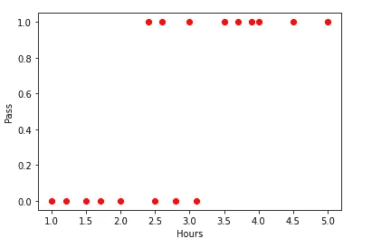

作者图片

从数据点来看，我们可以解释，学习时间越长，结果越倾向于 1(通过)。

如果我们试着拟合一条线性回归线，它会是这样的。

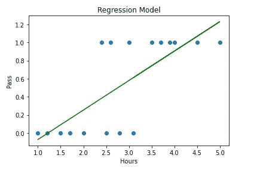

作者图片

线性回归线范围从 **-∞到+∞。但是对于我们的分类问题，结果应该属于 0 或 1，或者我们必须预测介于 0 和 1 之间的概率。
我们的数据看起来不像是一条直线。我们强行排成一条直线。大部分数据点没有经过那条直线。
**解决方法:**
1。我们的线应该穿过大部分数据点。
2。它应该介于 0 和 1 之间。
3。类似于`S curve`的东西会穿过大多数数据点。
4。使用 sigmoid 函数将最佳拟合线转换成 S 曲线。**

线性回归方程: `y=mx+c`

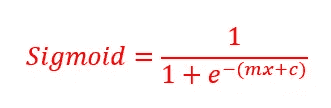

作者图片

使用此公式将最佳拟合线转换为 S 曲线。

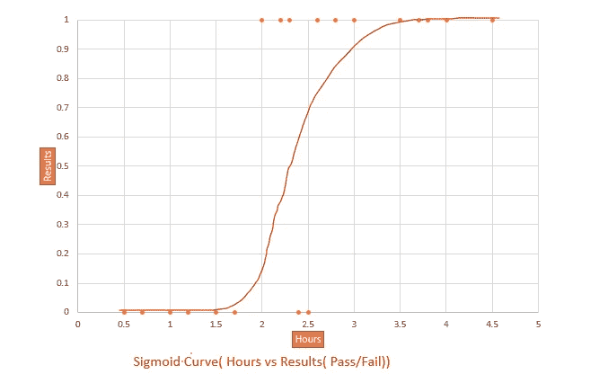

作者图片

# Sigmoid 或 logit 函数

我们来看看 sigmoid 公式的解释。该函数也称为 Logit 函数。

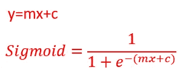

作者图片

e →欧拉常数

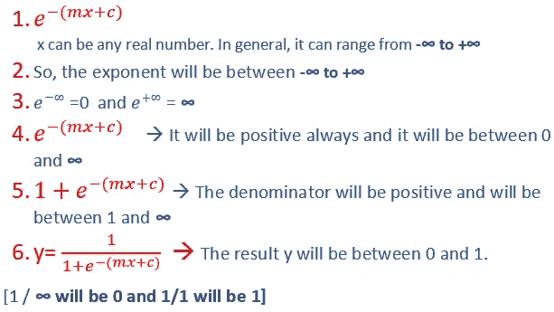

作者图片

因此，通过使用 sigmoid 方程，我们可以保证 y 总是在 0 和 1 之间。

这个等式还有另一种解释。

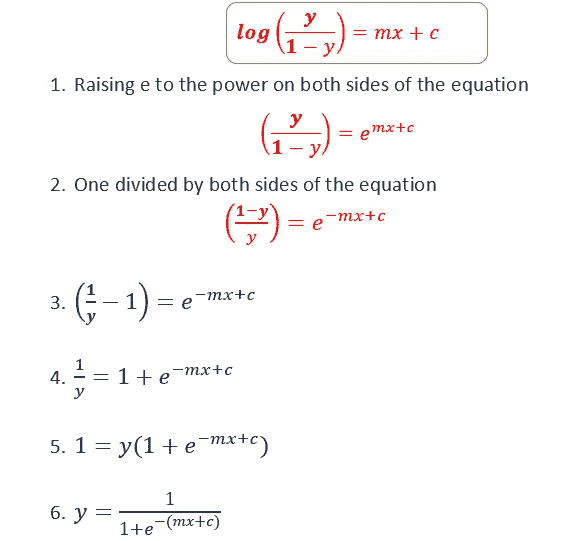

作者图片

这两个等式是一样的。

# 对数损失函数

方程中 m 和 c 怎么算？

在**线性回归方程**中，最佳拟合线将最小化**平方和误差**。通过找出观察值和预测值之间的差异来计算误差平方和。我们把所有的误差平方，然后求和。

在**逻辑回归方程**中，最佳曲线将最小化 **logloss 函数。**

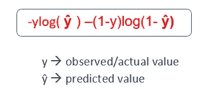

作者图片

y 值将始终为 0 或 1。

ŷ值将介于 0 和 1 之间。

有两种情况

1.  如果 y=0

`logloss=-log(1-ŷ)`

(因为`ylog(ŷ)`会变成 0)

2.如果 y=1

`logloss=-log(ŷ)`

[因为`log(1-ŷ)`会变成 0]

通过最小化 logloss 函数，观测值和预测值会更接近。

# 准确度分数

准确度分数用于确定模型的整体预测准确度。

**混淆矩阵**

**混淆矩阵**是一个表格，通常用于描述一个分类模型对一组真实值已知的测试数据的性能。矩阵的每一行代表预测类中的实例，而每一列代表实际类中的实例(反之亦然)

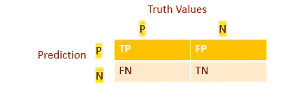

作者图片

TP →真阳性
FP →假阳性
FN →假阴性
TN →真阴性

**准确度得分**

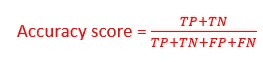

作者图片

# 为什么称之为逻辑回归？

术语**“逻辑”**来源于用于分类的**“逻辑函数”**。
使用术语**“回归”**是因为我们使用了类似于**线性回归的技术。**

# 线性回归与逻辑回归

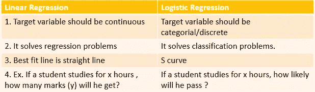

作者图片

# 使用 sklearn 实现逻辑回归

1.  导入库
2.  加载数据
3.  电子设计自动化(Electronic Design Automation)
4.  数据争论(清理数据)
5.  将特征分配给 x 和 y
6.  培训和测试
7.  计算准确度
8.  预言；预测；预告

## **1。导入库**

```
**import** numpy **as** np
**import** pandas **as** pd
**import** seaborn **as** sns
**import** matplotlib.pyplot **as** plt
```

## **2。加载数据**

数据集 results.csv 包含小时与结果。[学生学习的小时数与他们的成绩通过/未通过]。它包含 `StudentId`列也。

```
df=pd.read_csv(**"results.csv"**)
df.head(5)
```

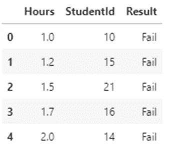

`df.shape`

`(20,3)`

数据集包含 20 行和 3 列

`df.info()`

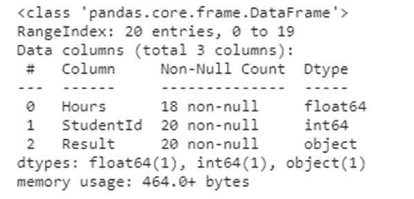

它包含三列 Hours、StudentID 和 Result

## **3。EDA**

通过创建不同的图来分析数据，以检查变量之间的关系。

```
sns.countplot(x=**"Result"**,data=df)
```

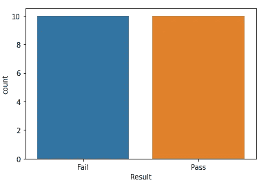

**散点图**

```
plt.scatter(df.Hours,df.Result,color=**'red'**)
plt.xlabel(**"Hours"**)
plt.ylabel(**"Pass"**)
```

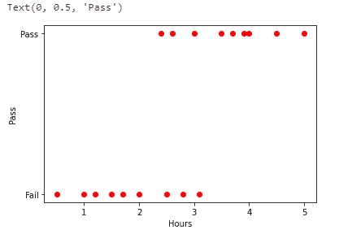

从散点图中，我们可以看出学习时间越长的学生越有可能通过考试。

## **4。数据争论**

*   **检查是否有数据缺失**

`df.isnull().sum()`

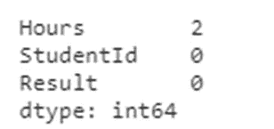

只有小时列有两个缺失数据。我们可以不排了。如果我们的数据集有许多列，意味着我们不能删除行。我们可能需要来自其他列的数据，在这种情况下，我们可以通过均值替换缺失的值。

```
df.dropna(inplace=**True**)
df.shape
```

`(18,3)`

删除缺少值的两行。现在数据集中只有 18 行。

*   **移除不需要的柱**

在我们的数据集中，不需要`StudentID`列。我们不打算对 StudentID 列进行任何分析。我们将根据学生学习的小时数来预测结果。

```
df1=df.drop(**"StudentId"**,axis=1)
df1.head()
```

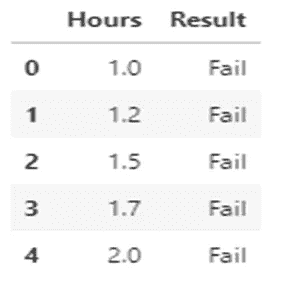

`StudentID`列现在已从数据集中删除。

*   在逻辑回归中，它不会处理字符串数据类型。我们要预测结果→通过/失败。我们可以将该列转换为离散变量 0 和 1。

```
result=pd.get_dummies(df[**"Result"**])
result.head(3)
```

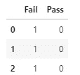

现在，我们可以保留失败/通过列，删除另一列。

```
result=pd.get_dummies(df[**"Result"**],drop_first=**True**)
result.head(3)
```

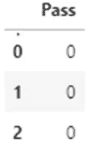

在“通过”列中，0 表示失败，1 表示通过。

现在将传递列连接到数据帧

```
df1=pd.concat([df1,result],axis=1)
df1.head(3)
```

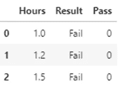

现在我们可以从 dataframe 中删除`Result`列。我们已经将结果列转换为`Pass`列。

```
df1=df1.drop(**"Result"**,axis=1)
df1.head(3)
```

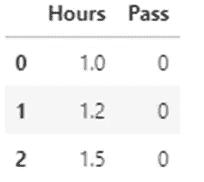

## **5。给 x 和 y 分配特征**

```
x=df1.iloc[:,0:1]
x.head(3)
```

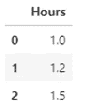

```
y=df1.iloc[:,1:]
y.head(3)
```

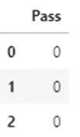

## 6.训练和测试数据

```
**from** sklearn.model_selection **import** train_test_split
xtrain,xtest,ytrain,ytest=train_test_split(x,y,test_size=0.2,random_state=2)
**from** sklearn.linear_model **import** LogisticRegression
log_reg=LogisticRegression()
log_reg.fit(xtrain,ytrain)
```

## 7.计算准确度

```
predictions=log_reg.predict(xtest)
**from** sklearn.metrics **import** confusion_matrix
cm=confusion_matrix(ytest,predictions)
print (cm)
```

**输出:** [[2 1]
[0 1]]

```
**from** sklearn.metrics **import** accuracy_score
accuracy_score(ytest,predictions)
```

**输出:** 0.75

准确度得分为 0.75。

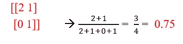

根据混淆矩阵计算准确度分数[图片由作者提供]

## 8.预言；预测；预告

我们来预测一下，如果一个学生学习 7 个小时，这个学生通过的可能性有多大？

`log_reg.predict(np.array([[7]]))`

**输出:**数组([1]，dtype=uint8)

`1`表示通过。

**预测概率**

`log_reg.predict_proba(np.array([[7]]))`

**输出:**数组([[0.00182823，0.99817177]])

0.00182823 →表示学生不及格的概率
0.99817177 →表示学生及格的概率

# Github 链接。

这里使用的代码可以作为 [Jupyter 笔记本从我的 GitHub 下载。](https://github.com/IndhumathyChelliah/LogisticRegression)

# 我关于机器学习的其他博客

[](/line-of-best-fit-in-linear-regression-13658266fbc8) [## 线性回归中的最佳拟合线

### 相关系数、决定系数、模型系数

towardsdatascience.com](/line-of-best-fit-in-linear-regression-13658266fbc8) [](/an-introduction-to-support-vector-machine-3f353241303b) [## 支持向量机简介

### 如何在分类问题中使用 SVM？

towardsdatascience.com](/an-introduction-to-support-vector-machine-3f353241303b) [](/an-introduction-to-k-nearest-neighbours-algorithm-3ddc99883acd) [## K-最近邻算法简介

### 什么是 KNN？

towardsdatascience.com](/an-introduction-to-k-nearest-neighbours-algorithm-3ddc99883acd) [](https://pub.towardsai.net/naive-bayes-classifier-in-machine-learning-b0201684607c) [## 机器学习中的朴素贝叶斯分类器

### 使用 sklearn 的数学解释和 python 实现

pub.towardsai.net](https://pub.towardsai.net/naive-bayes-classifier-in-machine-learning-b0201684607c) [](https://pub.towardsai.net/naive-bayes-classifier-in-machine-learning-b0201684607c) [## 机器学习中的朴素贝叶斯分类器

### 使用 sklearn 的数学解释和 python 实现

pub.towardsai.net](https://pub.towardsai.net/naive-bayes-classifier-in-machine-learning-b0201684607c) 

请关注此空间，了解更多关于 Python 和数据科学的文章。如果你喜欢看我的更多教程，就关注我的 [***中***](https://medium.com/@IndhumathyChelliah)[***LinkedIn***](https://www.linkedin.com/in/indhumathy-chelliah/)*[***Twitter***](https://twitter.com/IndhuChelliah)***。****

****点击此处成为中等会员:****

*[*https://indhumathychelliah.medium.com/membership*](https://indhumathychelliah.medium.com/membership)*