# 逻辑回归模型拟合和寻找相关性、P 值、Z 值、置信区间等

> 原文：<https://towardsdatascience.com/logistic-regression-model-fitting-and-finding-the-correlation-p-value-z-score-confidence-8330fb86db19?source=collection_archive---------12----------------------->


照片由[汉尼斯·沃尔夫](https://unsplash.com/@hannes_wolf?utm_source=medium&utm_medium=referral)在 [Unsplash](https://unsplash.com?utm_source=medium&utm_medium=referral) 上拍摄

## 静态模型拟合，并使用 Python 的 Statsmodels 库从拟合的模型中提取结果，其中包含一个真实的示例

大多数没有强大统计学背景的数据科学家可能会认为逻辑回归是一种机器学习模型。确实如此。但是在统计学上已经存在很久了。

统计学是数据科学和机器学习中非常重要的一部分。因为对于任何类型的探索性数据分析或机器学习算法来说，了解数据集的特征、它们如何相互关联、一个特征如何影响其他特征以及整体输出都是至关重要的。

幸运的是 python 有一个神奇的库，叫做“statsmodels”库。这个库有很好的功能来理解数据集，我们也可以使用这个库来进行预测。Statsmodels 库已经内置了模型，这些模型可以拟合数据以查找特征之间的相关性、学习系数、p 值、测试统计、标准误差和置信区间。

本文将通过一个例子解释一种统计建模技术。我将在这里解释二元结果变量的逻辑回归模型。这意味着结果变量只能有两个值，0 或 1。

我们还将分析:

1.预测变量(将用于预测结果变量的输入变量)之间的相关性，

2.如何从模型结果中提取有用的信息，

3.更好地呈现和理解数据的可视化技术

4.对结果的预测。**我假设你有统计学和 python 的基础知识。**

## 讨论的顺序:

1.  一元基本逻辑回归模型拟合
2.  通过示例了解赔率和对数赔率
3.  双变量 Logistic 回归模型拟合
4.  三变量 Logistic 回归模型拟合
5.  拟合模型的可视化
6.  预言；预测；预告

如果您需要复习置信区间和假设检验，请查看这些文章以清楚地理解这些主题:

[](/confidence-interval-calculation-and-characteristics-1a60fd724e1d) [## 置信区间、计算和特征

### 什么是置信区间，如何计算它，以及它的重要特征

towardsdatascience.com？](/confidence-interval-calculation-and-characteristics-1a60fd724e1d) [](/hypothesis-testing-characteristics-and-calculation-ba3bdf516ea5) [## 假设检验、特征和计算

### 什么是假设检验，它的重要特征，以及如何进行假设检验

towardsdatascience.com](/hypothesis-testing-characteristics-and-calculation-ba3bdf516ea5) 

# 使用的工具

对于本教程，我们将使用:

1.  [Numpy 库](https://numpy.org/)
2.  [熊猫图书馆](https://pandas.pydata.org/)
3.  [Matplotlib 库](https://matplotlib.org/)
4.  [海洋图书馆](https://seaborn.pydata.org/)
5.  [Statsmodels 库](https://www.statsmodels.org/v0.10.1/)
6.  [Jupyter 笔记本](https://jupyter.org/)环境。

# 资料组

我使用了来自 [Kaggle](https://www.kaggle.com/) 的心脏数据集。我在我的 GitHub 存储库中有它。如果您想跟进，请从该链接免费下载:

[](https://github.com/rashida048/Datasets/blob/master/Heart.csv) [## rashida 048/数据集

### 在 GitHub 上创建一个帐户，为 rashida048/Datasets 开发做出贡献。

github.com](https://github.com/rashida048/Datasets/blob/master/Heart.csv) 

让我们导入必要的包和数据集。

```
%matplotlib inline
import matplotlib.pyplot as plt
import seaborn as sns
import pandas as pd
import statsmodels.api as sm
import numpy as npdf = pd.read_csv('Heart.csv')
df.head()
```

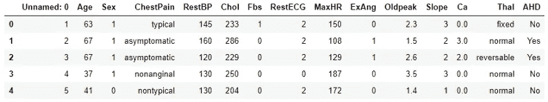

作者图片

最后一栏“AHD”只包含“是”或“否”，它告诉你一个人是否有心脏病。用 1 和 0 替换“是”和“否”。

```
df['AHD'] = df.AHD.replace({"No":0, "Yes": 1})
```

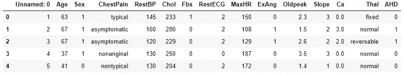

作者图片

逻辑回归模型提供了一个事件的可能性。

# 单变量基本逻辑回归

让我们深入建模。我会解释每一步。**我建议，在你阅读的时候，不断地为自己运行代码，以便更好地吸收材料。**

> *逻辑回归是线性回归的改进版本。*

提醒一下，下面是线性回归公式:

Y = AX + B

这里 Y 是输出，X 是输入，A 是斜率，B 是截距。

让我们深入到建模部分。*我们将用一个* [***广义线性模型***](https://www.statsmodels.org/v0.10.1/glm.html)***【GLM】****为例。*

变数太多了。哪一个可能是那个变量？

众所周知，一般来说，心脏病大多发生在老年人群中。年轻人口不太可能患心脏病。我现在把“年龄”作为唯一的协变量。我们稍后将添加更多的协变量。

```
model = sm.GLM.from_formula("AHD ~ Age", family = sm.families.Binomial(), data=df)result = model.fit()
result.summary()
```

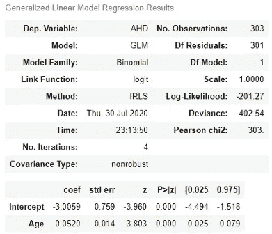

作者图片

结果总结看起来很复杂很吓人吧？我们将主要关注这一部分。

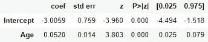

作者图片

现在，让我们来理解上面所有的术语。

**系数**

首先，我们有系数，其中-3.0059 是 B，0.0520 是 A(想想线性回归公式 Y = AX + B)。

根据表中的 p 值，如果一个人的年龄增加 1 个单位，他/她患心脏病的几率将增加 0.052 个单位(上表中与年龄相关的系数)。

**标准错误**

标准误差为 0.014，表示估计斜率与真实斜率的距离。

**z**

z 统计值为 3.803 意味着预测的斜率将比零高 3.803 个单位。

**置信区间**

最后两列是置信区间(95%)。这里的置信区间是 0.025 和 0.079。稍后，我们将可视化整个数据长度的置信区间。

# 赔率和对数赔率

逻辑回归模型提供了事件的“可能性”。记住，“几率”是不同尺度上的概率。公式如下:

如果事件的概率为 p，

那件事的概率是 p/(1-p)

赔率是概率的变换。**根据这个公式，如果概率是 1/2，那么‘赔率’就是 1。**

为了清楚地理解概率和对数概率，让我们来看一个例子。我们将使用性别变量。

**因为一个分类变量对此是合适的。**检查数据集中患有心脏病的男性和女性的比例。

```
df["Sex1"] = df.Sex.replace({1: "Male", 0:"Female"})
c = pd.crosstab(df.Sex1, df.AHD)
c = c.apply(lambda x: x/x.sum(), axis=1)
```


作者图片

让我们计算一下男性和女性患心脏病的几率。

```
c["odds"] = c.loc[:, 1] / c.loc[:, 0]
```

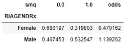

作者图片

“几率”显示，女性患心脏病的概率大大低于男性(32%比 53%)，这在几率中得到了很好的反映。在处理两个人群时，比值比是常用的。

```
c.odds.Male / c.odds.Female
```

这个比率是 3.587，这表明男性患心脏病的几率是女性的 3.587 倍。

> 记住，个体概率不能从奇数比率中计算出来

另一个重要的惯例是使用对数比数，即对数标度的比数。

回想一下，概率的中性点是 0.5。使用“赔率”的公式，0.5 的赔率是 1，“对数赔率”是 0(1 的对数是 0)。

> 在我们的实验中，男性患心脏病的几率更大，几率在 1 到无穷大之间。与此同时，女性患心脏病的几率为 0 比 1。

下面是对数赔率的计算:

```
c['logodds'] = np.log(c.odds)
```

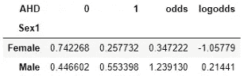

作者图片

这里，女性人口的对数优势为负，这表明不到 50%的女性患有心脏病。

男性的对数比是正的，略大于 0，这意味着超过一半的男性患有心脏病。

**从下面的模型总结中，log odds 和 logistic 回归之间的关系会更加清晰。**让我们看看仅使用性别变量的模型摘要:

```
model = sm.GLM.from_formula("AHD ~ Sex1", family = sm.families.Binomial(), data=df)result = model.fit()
result.summary()
```

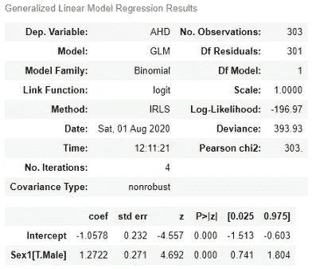

作者图片

看上面的系数。

男性的逻辑回归系数为 1.2722，应该等于男性的对数优势减去女性的对数优势。

```
c.logodds.Male - c.logodds.Female
```

这个差值正好是 1.2722。

# 一个有三个协变量的逻辑回归模型

我们可以使用多个协变量。我在这里同时使用了“年龄”和“性别 1”变量。在我们深入研究这个模型之前，我们可以对分类变量进行初步分析。检查数据集中患有心脏病的男性和女性的比例。

```
df["Sex1"] = df.Sex.replace({1: "Male", 0:"Female"})
c = pd.crosstab(df.Sex1, df.AHD)
c = c.apply(lambda x: x/x.sum(), axis=1)
```

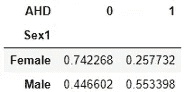

作者图片

现在，使用“年龄”和“性别”变量生成一个模型。

```
model = sm.GLM.from_formula("AHD ~ Age + Sex1", family = sm.families.Binomial(), data=df)
result = model.fit()
result.summary()
```

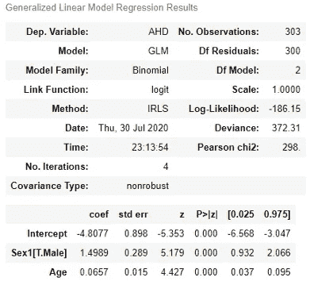

作者图片

**更好地理解系数**。将性别添加到模型中会稍微改变“年龄”参数的系数(0.0520 到 0.0657)。

根据这个拟合模型，老年人比年轻人更容易患心脏病。**心脏病的对数几率每年增加 0.0657 个单位。**

> 如果一个人老了 10 岁，他或她患心脏病的几率会增加 0.0657 * 10 = 0.657 个单位。

在性别变量的情况下，女性是参考，因为它没有出现在输出中。

在比较同龄的男性和女性时，男性患心脏病的几率要高 1.4989 个单位。

现在，让我们看看性别和年龄的影响。如果将 40 岁的女性与 50 岁的男性进行比较，男性患心脏病的对数优势比女性大 1.4989 + 0.0657 * 10 = 2.15559 个单位。

> 所有的系数都是对数比标度。您可以对这些值取幂，将其转换为赔率

# 一个有三个协变量的逻辑回归模型

现在，我们将拟合一个有三个协变量的逻辑回归。这一次，我们将添加“胆固醇”或“年龄”和“性别 1”的胆固醇变量。

```
model = sm.GLM.from_formula("AHD ~ Age + Sex1 + Chol", family = sm.families.Binomial(), data=df)
result = model.fit()
result.summary()
```

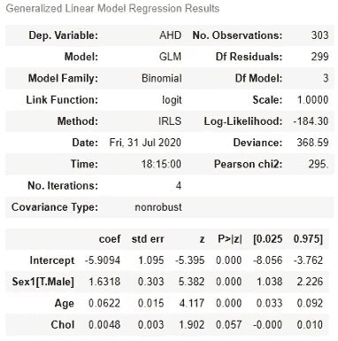

作者图片

如你所见，在添加了“Chol”变量后，“Age”变量的系数降低了一点,“Sex1”变量的系数升高了一点。

“性别 1”系数的变化大于“年龄”系数。这是因为与“年龄”协变量相比，“胆固醇”与“性别 1”协变量的相关性更好。让我们检查一下相关性:

```
df[['Age', 'Sex', 'Chol']].corr()
```

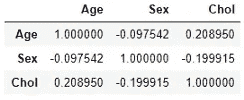

作者图片

# 拟合模型的可视化

我们将从绘制回归模型定义的不同亚人群的心脏病人口比例开始。我们将绘制心脏病发病率随年龄变化的曲线图。

我们将修正一些我们希望在可视化中关注的值。我们将设想“年龄”对胆固醇水平为 250 的女性人口的影响。

```
from statsmodels.sandbox.predict_functional import predict_functionalvalues = {"Sex1": "Female", "Sex":0, "AHD": 1, "Chol": 250}pr, cb, fv = predict_functional(result, "Age", values=values, ci_method="simultaneous")ax = sns.lineplot(fv, pr, lw=4)
ax.fill_between(fv, cb[:, 0], cb[:, 1], color='grey', alpha=0.4)
ax.set_xlabel("Age")
ax.set_ylabel("Heart Disease")
```

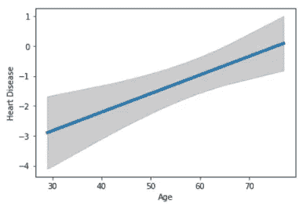

作者图片

我们刚刚绘制了患心脏病概率的拟合对数比数和 95%的置信区间。置信带更合适。信心带看起来是弯曲的，这意味着它在整个年龄范围内是不一致的。

我们可以用概率而不是对数几率来形象化。可以使用公式 1 / (1 + exp(-lo))从对数优势计算概率，其中 lo 是对数优势。

```
pr1 = 1 / (1 + np.exp(-pr))
cb1 = 1 / (1 + np.exp(-cb))
ax = sns.lineplot(fv, pr1, lw=4)
ax.fill_between(fv, cb1[:, 0], cb[:, 1], color='grey', alpha=0.4)
ax.set_xlabel("Age", size=15)
ax.set_ylabel("Heart Disease")
```

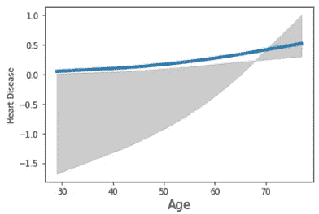

作者图片

这就是概率尺度有时存在的问题。

> 虽然概率值限于 0 和 1，但置信区间不受限制。

上面的图描绘了平均值。平均来说，如果胆固醇水平为 250，那么女性患心脏病的概率就是这样。接下来，我们将以一种不同的方式可视化，这种方式称为部分剩余图。

在这个图中，它将只显示一个协变量的影响，而其他协变量是固定的。这显示了更小的差异。所以，剧情不会像以前那样一帆风顺。记住，如果样本量不是很大，那么小的差异是不可靠的。

```
from statsmodels.graphics.regressionplots import add_lowess
fig = result.plot_partial_residuals("Age")
ax = fig.get_axes()[0]
ax.lines[0].set_alpha(0.5)
_ = add_lowess(ax)
```

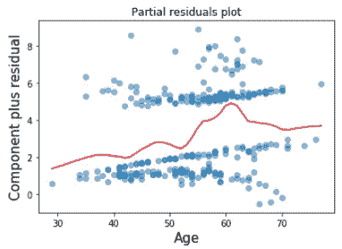

作者图片

这张图显示，从 53 岁到 60 岁，心脏病发病率迅速上升。

# 预言；预测；预告

利用模型的结果，我们可以预测一个人是否患有心脏病。我们之前拟合的模型是为了解释模型参数。为了预测的目的，我将使用数据帧中的所有变量。因为我们没有太多的变量。让我们检查变量之间的相关性。

```
df['ChestPain'] = df.ChestPain.replace({"typical":1, "asymptomatic": 2, 'nonanginal': 3, 'nontypical':4})df['Thal'] = df.Thal.replace({'fixed': 1, 'normal': 2, 'reversable': 3})
df[['Age', 'Sex1', 'Chol','RestBP', 'Fbs', 'RestECG', 'Slope', 'Oldpeak', 'Ca', 'ExAng', 'ChestPain', 'Thal']].corr()
```

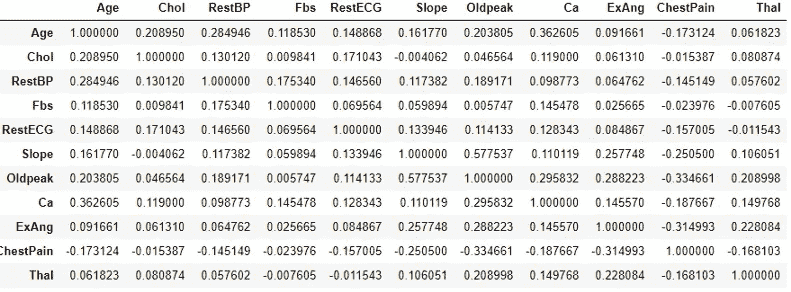

作者图片

我们可以看到，每个变量都与其他变量有一定的相关性。我将使用所有的变量来得到一个更好的预测。

```
model = sm.GLM.from_formula("AHD ~ Age + Sex1 + Chol + RestBP+ Fbs + RestECG + Slope + Oldpeak + Ca + ExAng + ChestPain + Thal", family = sm.families.Binomial(), data=df)
result = model.fit()
result.summary()
```

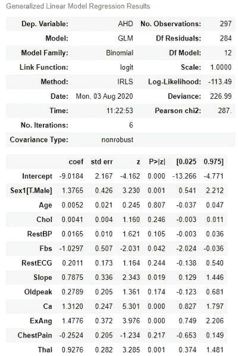

作者图片

我们可以使用预测函数来预测结果。但是预测函数只使用数据帧。因此，让我们准备一个包含变量的数据框架，然后使用 predict 函数。

```
X = df[['Age', 'Sex1', 'Chol','RestBP', 'Fbs', 'RestECG', 'Slope', 'Oldpeak', 'Ca', 'ExAng', 'ChestPain', 'Thal']]
predicted_output = result.predict(X)
```

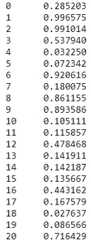

作者图片

预测输出应该是 0 或 1。当输出大于或等于 0.5 时为 1，否则为 0。

```
for i in range(0, len(predicted_output)):
    predicted_output = predicted_output.replace()
    if predicted_output[i] >= 0.5:
        predicted_output = predicted_output.replace(predicted_output[i], 1)
    else:
        predicted_output = predicted_output.replace(predicted_output[i], 0)
```

现在，将该预测输出与指示心脏病的数据帧的“AHD”列进行比较，以确定准确性:

```
accuracy = 0
for i in range(0, len(predicted_output)):
    if df['AHD'][i] == predicted_output[i]:
        accuracy += 1
accuracy/len(df)
```

精度达到 0.81%或 81%，非常好。

# 结论

在本文中，我试图解释统计模型拟合，如何解释拟合模型的结果，一些可视化技术来呈现置信区间的对数优势，以及如何使用拟合模型结果预测二元变量。我希望这有所帮助。

欢迎在[推特](https://twitter.com/rashida048)上关注我，并喜欢我的[脸书](https://www.facebook.com/rashida.smith.161)页面。

更多阅读:

[](/a-complete-guide-to-hypothesis-testing-in-python-6c34c855af5c) [## 数据科学家假设检验完全指南，Python 示例

### 用样本研究问题、解决步骤和完整代码清楚地解释

towardsdatascience.com](/a-complete-guide-to-hypothesis-testing-in-python-6c34c855af5c) [](/a-complete-guide-to-confidence-interval-and-examples-in-python-ff417c5cb593) [## 置信区间的完整指南，以及 Python 中的示例

### 对统计学中一个非常流行的参数——置信区间及其计算的深入理解

towardsdatascience.com](/a-complete-guide-to-confidence-interval-and-examples-in-python-ff417c5cb593) [](/univariate-and-multivariate-gaussian-distribution-complete-understanding-with-visuals-97951897503c) [## 单变量和多变量高斯分布:用视觉完全理解

### 详细的高斯分布及其与均值、标准差和方差的关系

towardsdatascience.com](/univariate-and-multivariate-gaussian-distribution-complete-understanding-with-visuals-97951897503c) [](/great-quality-free-courses-to-learn-machine-learning-and-deep-learning-1029048fd0fc) [## 学习机器学习和深度学习的优质免费课程

### 顶级大学高质量免费课程的链接

towardsdatascience.com](/great-quality-free-courses-to-learn-machine-learning-and-deep-learning-1029048fd0fc) [](/a-complete-guide-to-numpy-fb9235fb3e9d) [## Numpy 完全指南

### 日常工作中需要的所有数字方法

towardsdatascience.com](/a-complete-guide-to-numpy-fb9235fb3e9d) [](/all-the-datasets-you-need-to-practice-data-science-skills-and-make-a-great-portfolio-857a348883b5) [## 练习数据科学技能和制作优秀投资组合所需的所有数据集

### 一些有趣的数据集提升你的技能和投资组合

towardsdatascience.com](/all-the-datasets-you-need-to-practice-data-science-skills-and-make-a-great-portfolio-857a348883b5)