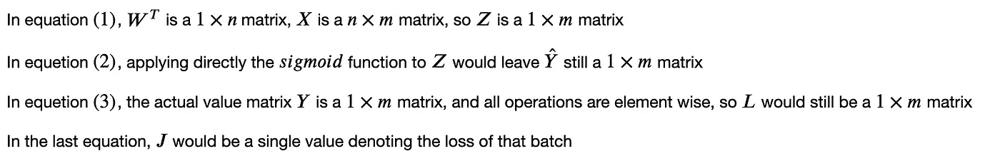

# 逐步实施逻辑回归

> 原文：<https://towardsdatascience.com/logistic-regression-step-by-step-implementation-f032a89936ca?source=collection_archive---------35----------------------->

## 从理论到实践

假设我们正在执行一个经典的预测任务，其中给定一个包含$n$个变量的输入向量:

并预测 1 个响应变量$y$(可能是明年的销售额、房价等。)，最简单的形式是使用线性回归进行预测，公式如下:

其中$W$是维数为$n$的列向量。比如现在我们的问题变了一点，我们希望预测一个概率，比如明天下雨的概率是多少？在这种意义上，这种线性回归可能有点不合适，因为线性表达式可以是无限的，但我们的概率范围是$[0，1]$。

# Sigmoid 函数

为了将我们的预测限制在$[0，1]$，广泛使用的技术是应用一个`sigmoid`函数:

使用`numpy`,我们可以很容易地将功能可视化。

# 损失函数

逻辑回归的损失函数的定义是:

其中,`y_hat`是我们的预测值，范围是＄[ 0，1]＄而`y`是真实值。当实际值为`y = 1`时，等式变为:

`y_hat`越接近 1，我们的损失就越小。而`y = 0`也是如此。

# 梯度下降

给定这个实际值`y`，我们希望将损失`L`最小化，我们这里要应用的技术是梯度下降(细节已经在[这里](/gradient-descent-explanation-implementation-c74005ff7dd1)说明)，基本上我们需要做的是对我们的变量应用导数，并将它们稍微向下移动到最优值。

这里我们有两个变量，`W`和`b`，对于这个例子，它们的更新公式是:

其中`W`是一个列向量，其`n`权重对应于`x^(i)`的`n`维度。为了得到我们目标的导数，将应用链式法则:

你可以自己试着推导，唯一棘手的部分是`sigmoid`函数的导数，要得到一个好的解释你可以参考[这里的](https://math.stackexchange.com/questions/78575/derivative-of-sigmoid-function-sigma-x-frac11e-x)。

# 批量训练

上面给出了向前和向后更新的过程，如果我们一次一个地输入我们的训练模型，这足以实现逻辑回归。然而，在大多数培训案例中，我们不会这样做。取而代之的是，训练样本被分批馈送，并且反向传播用该批次的平均损失来更新。

这意味着对于一个一次输入`m`个样本的模型，损失函数将是:

其中`i`表示`ith`训练样本。

# 批量训练的正向传播

现在，代替使用单个向量`x`作为我们的输入，我们指定大小为`n x m`的矩阵`X`，其中如上所述，`n`是特征的数量，`m`是训练样本的数量(基本上，我们在矩阵中排列`m`个训练样本)。现在公式变成了:

注意，这里我们使用*大写字母*来表示我们的矩阵和向量(注意这里的`b`仍然是单个值，更正式的方式是将`b`表示为向量，但是在 python 中，将单个值添加到矩阵会自动广播)。

让我们逐个分解矩阵的大小。

# 生成分类任务

我们的公式到此结束，让我们实现我们的算法，在此之前需要生成一些数据来完成分类任务(整个实现也在我的 [git repo](https://github.com/MJeremy2017/deep-learning/tree/main/logistic-regression) 中)。

# 履行

现在一切都准备好了，让我们开始实现吧。

## 助手功能

1.  接受数组的 sigmoid 函数
2.  将`W`和`b`初始化为零的权重函数
3.  精度函数来衡量我们的二进制预测的准确性

## 预言；预测；预告

我们的`predict`函数将简单地通过给定训练权重的正向过程

## 培养

注意，对于`train`函数，`X`的输入形状需要具有`n x m`的形状，`Y`需要具有`1 x m`的形状，其中`m`是批量大小。

*输入需要转置，以适应我们的培训要求。*

## 班级中的合奏

现在让我们把所有的东西集成到一个类中，看起来更有结构。为完整起见，还将实施分批培训

完整的培训详情可点击查看[。](https://github.com/MJeremy2017/deep-learning/tree/main/logistic-regression)