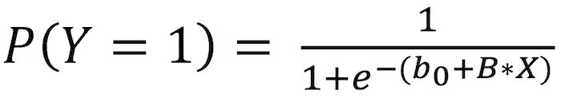
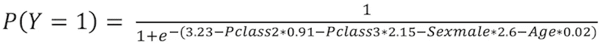
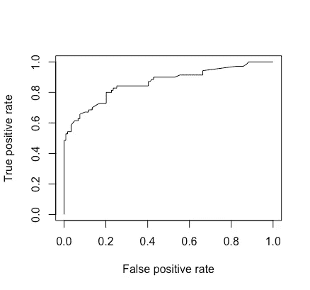

# 逻辑回归:基础

> 原文：<https://towardsdatascience.com/logistic-regression-the-basics-b1716661c71b?source=collection_archive---------19----------------------->


尼克·霍克斯在 [Unsplash](https://unsplash.com?utm_source=medium&utm_medium=referral) 上的照片

## 理解逻辑回归技术的基础

## 介绍

逻辑回归是一种模拟事件概率的技术。就像[线性回归](/linear-regression-the-basics-4daad1aeb845)一样，它帮助你理解一个或多个变量与一个目标变量之间的关系，只不过，在这种情况下，我们的目标变量是二元的:它的值不是 0 就是 1。例如，它可以允许我们说“吸烟会使你患肺癌的风险增加 20%”，因为患肺癌是一个二元变量:你要么有，要么没有(希望没有)。由此，我们可以推断出分类问题的答案。例如，它可以帮助我们做出有根据的猜测，如果某人不吸烟，住在污染的城市，并且有肺癌家族史，他/她是否会患肺癌。

也就是说，逻辑回归的结构也类似于线性回归模型的结构:你有一组解释变量(X1，X2…)和我们的目标二元变量(Y)。然而，其背后的功能有点复杂:



P(Y=1)表示 Y 等于 1 的概率，而 b0 是与 X 无关的参数，B 是系数向量，表示 Y 与 X1、X2 等中的每一个之间的关系。

然后，逻辑回归将估计更适合您的数据的 b 参数值，通常使用[最大似然法](https://en.wikipedia.org/wiki/Maximum_likelihood_estimation)。一旦我们有了这些估计量，我们就可以计算新数据点的 P(Y=1 ),或者坚持这个概率，或者使用它根据一个阈值(例如:如果某人患肺癌的概率大于 50%，我们可以有根据地猜测他们会得肺癌)。

为了更好地理解线性回归和逻辑回归之间的差异，假设我们在 Y 轴绘制了肺癌变量(如果患者患有肺癌，Y = 1，否则为 0 ),在 X 轴绘制了患者的年龄。下面是每次回归的结果线。哪一个似乎更符合我们的数据？


来源:[https://bit.ly/35MhQwg](https://bit.ly/35MhQwg)

## 开始弄脏我们的手

处理分类问题的最著名的数据集之一是[泰坦尼克号数据集](https://www.kaggle.com/c/titanic/data)，其中有泰坦尼克号乘客的名单，他们的一些特征，如年龄、性别和姓名，以及他们是否在灾难中幸存(出于某种原因，许多分类问题往往与坏事有关，如肺癌和在灾难中死亡)。我们将在 R 中工作，但是如果你愿意，你可以在 Python 中做同样的事情。

让我们先来看看可用的变量:

```
**IN:** path = 'insert you file path here'
data = read.csv(paste(path,'train.csv', sep = ""))
colnames(data)**OUT:**
 [1] "PassengerId" "Survived"    "Pclass"      "Name"        "Sex"         "Age"         "SibSp"      
 [8] "Parch"       "Ticket"      "Fare"        "Cabin"       "Embarked"
```

所以，除了 Id，我们还有一些可能有用的信息，比如他们在船上的级别(第一、第二或第三)和他们的性别。

## 数据清理

在我们开始建模之前，我们必须清理我们的数据。但是，请记住，本文的目标是介绍逻辑回归，而不是数据清理，所以我们在这里不做太深入的讨论。

```
**IN:** data$Age[is.na(data$Age)] = median(data$Age,na.rm=T)
data$Pclass = as.factor(data$Pclass)
```

我们必须首先用年龄的中位数来代替缺失的年龄。然后，我们将乘客类特性转化为一个因子:这意味着，R 将把它作为一个类别读取，而不是作为整数读取，这在这种情况下更有意义。

## 训练/测试分割

下一步是将我们的数据集分为训练和测试，这样我们就可以构建我们的模型，然后在另一个数据集中计算我们的模型尚未使用的一些准确性指标。我们为训练集选择了一个任意的大小，但它通常是原始数据集的 70%到 80%左右。

```
**IN:**
train = data[1:700,]
test = data[701:889,]
```

## 系统模型化

对于我们的第一个模型，让我们选择一些我们凭直觉认为可能与泰坦尼克号灾难幸存概率有某种联系的变量。我个人认为，乘客的阶级、年龄和性别可以帮助我们预测他们是否幸存:

```
**IN:**
model = glm(Survived ~ Pclass + Sex + Age,
             family = binomial(link = 'logit'), data = train)
summary(model)**OUT:**
Call:
glm(formula = Survived ~ Pclass + Sex + Age, family = binomial(link = "logit"), 
    data = train)Deviance Residuals: 
    Min       1Q   Median       3Q      Max  
-2.5352  -0.7055  -0.4390   0.6186   2.3728Coefficients:
             Estimate Std. Error z value Pr(>|z|)    
(Intercept)  3.226908   0.398636   8.095 5.73e-16 ***
Pclass2     -0.908714   0.288174  -3.153 0.001614 ** 
Pclass3     -2.153203   0.268262  -8.026 1.00e-15 ***
Sexmale     -2.603025   0.209018 -12.454  < 2e-16 ***
Age         -0.027199   0.008157  -3.334 0.000855 ***
---
Signif. codes:  0 ‘***’ 0.001 ‘**’ 0.01 ‘*’ 0.05 ‘.’ 0.1 ‘ ’ 1(Dispersion parameter for binomial family taken to be 1)Null deviance: 934.43  on 699  degrees of freedom
Residual deviance: 645.20  on 695  degrees of freedom
AIC: 655.2Number of Fisher Scoring iterations: 4
```

哇，一下子这么多信息，对吧？但是现在让我们把注意力集中在基础上，从我们如何构建模型开始:

> glm(存活~ Pclass +性别+年龄，家庭=二项式(link = 'logit ')，数据=训练)

我们首先调用一个名为 *glm* 的函数，用于拟合广义线性模型。为了使它像逻辑回归一样工作，我们设置*家庭=二项式*和*链接=‘logit’。*对于我们的问题，我们也可以将 link 设置为' *probit'* 或' *cochit'* ，但是我们将坚持使用 logit 函数。它们之间的差异主要是理论上的，它们的结果通常是相当相似的。

```
Coefficients:
             Estimate Std. Error z value Pr(>|z|)    
(Intercept)  3.226908   0.398636   8.095 5.73e-16 ***
Pclass2     -0.908714   0.288174  -3.153 0.001614 ** 
Pclass3     -2.153203   0.268262  -8.026 1.00e-15 ***
Sexmale     -2.603025   0.209018 -12.454  < 2e-16 ***
Age         -0.027199   0.008157  -3.334 0.000855 ***
```

现在，继续讨论系数，我们可以看到它们都是负的(看一下*估计值*栏)，这意味着所有这些变量都与生存概率负相关。那就是:作为一名男性或处于 2 类或 3 类(而不是作为一名女性或处于 1 类)使你在泰坦尼克号灾难中幸存的可能性更小。年龄系数也是负的，所以，年龄越大，存活的可能性越小。为了解释系数的精确值，让我们回到概率函数:


这里的*截距*系数是 b0，其他系数是向量 b。我们的模型看起来像这样(为了更好的可读性，我将系数四舍五入):



其中，如果乘客在 2 等舱，Pclass2 = 1，否则为 0(其他变量类似，除了年龄，年龄等于乘客的实际年龄)。除了是我们概率方程的一部分之外，它们还帮助我们解释几率:性别男性的系数为-2.6 意味着当你是男性时存活的几率是女性时存活几率的 0.07 倍。

表中另一个重要的列是 Pr(>|z|)，我们称之为 p 值。它显示了我们对估计系数显著性的确信程度(越接近零，我们越有信心)。如果我们有一些高 p 值的系数，我们可能不应该在我们的模型中包括相关的变量。

最后，我们将讨论的最后一项是 Akaike 信息标准(AIC)，显示在模型总结的末尾。简而言之，AIC 是对我们将模型应用于测试样本时的误差的估计，它有助于我们比较模型(AIC 越小越好)。

现在，让我们尝试第二个模型，添加票价变量(乘客为机票支付了多少钱):

```
**IN:**
model2 = glm(Survived ~ Pclass + Sex + Age + Fare,
 family = binomial(link = ‘logit’), data = train)
summary(model2)**OUT:**
Call:
glm(formula = Survived ~ Pclass + Sex + Age + Fare, family = binomial(link = "logit"), 
    data = train)Deviance Residuals: 
    Min       1Q   Median       3Q      Max  
-2.5225  -0.7060  -0.4382   0.6187   2.3749Coefficients:
              Estimate Std. Error z value Pr(>|z|)    
(Intercept)  3.2957397  0.4738515   6.955 3.52e-12 ***
Pclass2     -0.9500899  0.3265572  -2.909 0.003621 ** 
Pclass3     -2.2016346  0.3229743  -6.817 9.31e-12 ***
Sexmale     -2.6085804  0.2100784 -12.417  < 2e-16 ***
Age         -0.0275303  0.0082521  -3.336 0.000849 ***
Fare        -0.0006707  0.0024848  -0.270 0.787211    
---
Signif. codes:  0 ‘***’ 0.001 ‘**’ 0.01 ‘*’ 0.05 ‘.’ 0.1 ‘ ’ 1(Dispersion parameter for binomial family taken to be 1)Null deviance: 934.43  on 699  degrees of freedom
Residual deviance: 645.13  on 694  degrees of freedom
AIC: 657.13Number of Fisher Scoring iterations: 4
```

请注意，票价的 p 值很高，这意味着它不是一个重要的变量，AIC 增加了，这意味着模型稍微差一些。一种可能是，由于我们已经考虑了乘客的等级，机票票价并没有增加太多新的信息。为了测试这一点，让我们运行第三个模型，使用 fare 但删除 Pclass:

```
**IN:**
model3 = glm(Survived ~  Sex + Age + Fare,
             family = binomial(link = 'logit'), data = train)
summary(model3)**OUT:**
Call:
glm(formula = Survived ~ Sex + Age + Fare, family = binomial(link = “logit”), 
 data = train)Deviance Residuals: 
 Min 1Q Median 3Q Max 
-2.2015 -0.6174 -0.5889 0.8093 1.9786Coefficients:
 Estimate Std. Error z value Pr(>|z|) 
(Intercept) 0.835415 0.250798 3.331 0.000865 ***
Sexmale -2.429141 0.192294 -12.632 < 2e-16 ***
Age -0.005092 0.007294 -0.698 0.485142 
Fare 0.009933 0.002412 4.119 3.81e-05 ***
 — -
Signif. codes: 0 ‘***’ 0.001 ‘**’ 0.01 ‘*’ 0.05 ‘.’ 0.1 ‘ ’ 1(Dispersion parameter for binomial family taken to be 1)Null deviance: 934.43 on 699 degrees of freedom
Residual deviance: 701.47 on 696 degrees of freedom
AIC: 709.47Number of Fisher Scoring iterations: 4
```

这一次，我们的 AIC 显著恶化，票价有一个重要的系数，但年龄不再重要。知道为什么吗？在这里评论你的假设:)

现在，让我们将我们的第一个模型应用于测试样本，看看效果如何，该模型的性能优于以下两个模型:

```
**IN:**
predictions = ifelse(predict(model, newdata = test) > 0.5, 1, 0)accuracy = mean(predictions == test$Survived)
print(paste(‘Accuracy :’, accuracy))**OUT:**
"Accuracy : 0.825396825396825"
```

我们首先将我们的模型应用于测试集，并声明如果计算的概率大于 0.5，则乘客幸存。我们计算的第一个指标是准确性，它代表我们正确预测的比率。0.82 的准确度意味着我们 82%的预测是正确的。不错吧？嗯，看情况。想象一下 99%的乘客都死了。然后，我们可以预测所有乘客死亡，我们的准确率将达到 99%,而不需要为此建立模型。因此，我们应该在我们的度量中考虑幸存者的比率。这就是 ROC 曲线和 AUC 出现的原因。

ROC 代表接收器操作特性，它是真阳性率(当实际值为 1 时预测为 1 的概率)与假阳性率(当实际值为 0 时预测为 1 的概率)的曲线图。当我们绘制曲线并计算其下方的面积时，我们得到 AUC，代表曲线下的面积。该区域始终在 0.5 和 1 之间，考虑到 1 和 0 的样本分布，这为我们提供了衡量模型性能的良好尺度。

为了在 R 中进行这些计算，我们需要 ROCR 包:

```
**IN:**
library(ROCR)probabilities = predict(model, newdata = test)
prediction_object = prediction(probabilities, test$Survived)
roc = performance(prediction_object, measure = "tpr", x.measure = "fpr")
plot(roc)**OUT:**
```



我们第一个模型的 ROC 曲线

曲线下的面积越大，我们的模型就越好，所以我们希望曲线尽可能靠近图的左上角。请注意，在我们的代码中，我们是如何使用 performance()函数创建它的，并对 x.measure 使用“fpr ”,对 measure 使用“tpr”。FPR 代表假阳性率，TPR 代表真阳性率。为了计算 auc，我们再次使用 performance()函数，但是这次我们输入“AUC”作为测量值:

```
**IN:**
perf_auc = performance(prediction_object, measure = “auc”)
auc = perf_auc@y.values[[1]]
print(paste(‘AUC :’, auc))**OUT:**
"AUC : 0.863385354141657"
```

我们有一个 0.86 的 AUC，这对于一个分类问题来说是相当不错的。

## 结论

逻辑模型用于分类问题，与更复杂的替代方案相比，它们的优势之一是可解释性:它们的结果很容易用外行人的话来解释。我们已经看到了如何在 R 中运行逻辑回归，理解它的结果，如何比较不同的模型并评估它们的性能。正如标题所示，这是一篇介绍性文章，我鼓励您深入挖掘由此产生的所有可能性。您可以通过为 glm()函数设置不同的链接或者添加/删除变量来尝试改进这个模型。也许有一种自动化的方法，比如线性回归？

你可以在这里访问完整的 R 脚本[。](https://github.com/arthurmello/statistics/tree/master/2.%20Logistic%20regression)