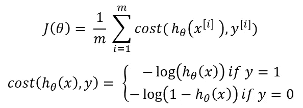

# 逻辑回归-理论与实践

> 原文：<https://towardsdatascience.com/logistic-regression-theory-and-practice-6442ed0692ff?source=collection_archive---------25----------------------->


照片由 [ja ma](https://unsplash.com/@ja_ma?utm_source=medium&utm_medium=referral) 在 [Unsplash](https://unsplash.com?utm_source=medium&utm_medium=referral)

# 简介:

在这篇文章中，我将解释如何使用回归的概念，在具体的逻辑回归涉及分类的问题。分类问题在我们身边无处不在，经典的问题包括邮件分类、天气分类等。如果需要，所有这些数据可以用于训练逻辑回归模型，以预测任何未来实例的类别。

# 背景:

本文将涵盖以下子主题:

1.  分类问题介绍。
2.  逻辑回归及其所有性质，如假设、决策边界、成本、成本函数、梯度下降及其必要分析。
3.  使用 python、pandas、matplotlib 和 seaborn 从头开始开发逻辑回归模型，并在乳腺癌数据集上对其进行训练。
4.  使用乳腺癌数据集训练来自 sklearn 的内置逻辑回归模型，以验证之前的模型。

# **分类问题介绍:**

分类问题可以基于乳腺癌数据集来解释，其中有两种类型的肿瘤(良性和恶性)。它可以表示为:


在哪里


这是一个有两类的分类问题，0 和 1。通常，分类问题有多个类别，比如 0、1、2 和 3。

# 数据集:

本文中使用的乳腺癌数据集的链接如下:

[](https://www.kaggle.com/uciml/breast-cancer-wisconsin-data) [## 乳腺癌威斯康星州(诊断)数据集

### 预测癌症是良性还是恶性

www.kaggle.com](https://www.kaggle.com/uciml/breast-cancer-wisconsin-data) 

1.  让我们将数据集导入熊猫数据框架:

```
import pandas as pd
read_df = pd.read_csv('breast_cancer.csv')
df = read_df.copy()
```

2.获得以下数据帧:

```
df.head()
```


```
df.info()<class 'pandas.core.frame.DataFrame'>
RangeIndex: 569 entries, 0 to 568
Data columns (total 33 columns):
 #   Column                   Non-Null Count  Dtype  
---  ------                   --------------  -----  
 0   id                       569 non-null    int64  
 1   diagnosis                569 non-null    object 
 2   radius_mean              569 non-null    float64
 3   texture_mean             569 non-null    float64
 4   perimeter_mean           569 non-null    float64
 5   area_mean                569 non-null    float64
 6   smoothness_mean          569 non-null    float64
 7   compactness_mean         569 non-null    float64
 8   concavity_mean           569 non-null    float64
 9   concave points_mean      569 non-null    float64
 10  symmetry_mean            569 non-null    float64
 11  fractal_dimension_mean   569 non-null    float64
 12  radius_se                569 non-null    float64
 13  texture_se               569 non-null    float64
 14  perimeter_se             569 non-null    float64
 15  area_se                  569 non-null    float64
 16  smoothness_se            569 non-null    float64
 17  compactness_se           569 non-null    float64
 18  concavity_se             569 non-null    float64
 19  concave points_se        569 non-null    float64
 20  symmetry_se              569 non-null    float64
 21  fractal_dimension_se     569 non-null    float64
 22  radius_worst             569 non-null    float64
 23  texture_worst            569 non-null    float64
 24  perimeter_worst          569 non-null    float64
 25  area_worst               569 non-null    float64
 26  smoothness_worst         569 non-null    float64
 27  compactness_worst        569 non-null    float64
 28  concavity_worst          569 non-null    float64
 29  concave points_worst     569 non-null    float64
 30  symmetry_worst           569 non-null    float64
 31  fractal_dimension_worst  569 non-null    float64
 32  Unnamed: 32              0 non-null      float64
dtypes: float64(31), int64(1), object(1)
memory usage: 146.8+ KB
```

## 数据分析:

让我们画出丛的平均面积和它的分类，看看能否找到它们之间的关系。

```
import matplotlib.pyplot as plt
import seaborn as sns
from sklearn import preprocessing
label_encoder = preprocessing.LabelEncoder()
df.diagnosis = label_encoder.fit_transform(df.diagnosis)
sns.set(style = 'whitegrid')
sns.lmplot(x = 'area_mean', y = 'diagnosis', data = df, height = 10, aspect = 1.5, y_jitter = 0.1)
```


我们可以从图中推断出，大多数面积小于 500 的肿瘤是良性的(用 0 表示)，而面积大于 1000 的肿瘤是恶性的(用 1 表示)。平均面积在 500 到 1000 之间的肿瘤既有良性的也有恶性的，因此表明分类取决于除平均面积之外的更多因素。还绘制了线性回归线用于进一步分析。

# 为什么线性回归不是完美的拟合？

如果我们要基于绘制的线性回归线进行预测，我们可以将阈值分类器输出值设置为 0.5。


这意味着平均面积小于阈值(y 轴上对应于 0.5 的面积)的肿瘤将被分类为良性，而平均面积大于阈值的肿瘤将被分类为恶性。


但是从图中，我们可以陈述线性回归不是完美模型的以下原因。

1.  对于具有小于 0.5 的相应假设值的 x 值，将其预测为 0(或恶性)以及反之亦然是不合适的。
2.  我们还可以看到，假设值大于 1，在某些情况下小于 0，这不可能是真的(因为只有两个类 0 和 1)。

这就是逻辑回归发挥作用的地方。逻辑回归是一种专门用于分类问题的回归模型，即输出值是离散的。

# 逻辑回归简介:

我们从上面的部分观察到，当使用线性回归时，假设值不在[0，1]的范围内。这是逻辑回归的基本要求。


这意味着所有的预测都应该在 0 和 1 之间。

# 假设:

线性回归的假设由下式给出:


对于逻辑回归，上述假设稍加修改:


其中:


z 是一个实数。g(z)被称为 **Sigmoid 函数或逻辑函数**(这给了我们逻辑回归的名字)。

将上面给出的两个等式放在一起:


# **标绘物流功能:**

让我们看看逻辑函数的形状:

```
def sigmoid(x):
 return 1/(1+ np.exp(-x))
x = np.linspace(-10,10,num = 1000)
fig = plt.figure(figsize = (10,10))
sns.set(style = 'whitegrid')
sns.lineplot(x = x, y = sigmoid(x))
```


我们可以从图表中推断出以下几点:

1.  它在 0.5 处穿过 y 轴。
2.  当 z 趋于无穷大时，逻辑函数在 1 处渐近，当 z 趋于负无穷大时，逻辑函数在 0 处渐近。
3.  当 g(z)取(0，1)范围内的值时，h(x)的值也位于(0，1)之间。

假设是这样的:


我们需要找到适合训练示例的参数，以便可以使用假设进行预测。

# 假设的解释:

假设 h(x)给出的输出可以解释为对于给定的输入 x，y = 1 的概率。

以乳腺癌数据集为例。特征平均面积的特征向量可以形成为:


假设假设 h(x)给我们的上述特征向量的值是 0.7。因为我们用 1 表示恶性肿瘤，用 0 表示良性肿瘤，所以我们可以说肿瘤是恶性的概率是 70%。

这可以用数学方法表示如下:


RHS 可以读作

> 给定 x，用θ参数化，y=1 的概率

由于这是一个分类问题，我们知道 y 只能等于两个值 0 或 1(在这种情况下)。这既适用于训练示例，也适用于我们做出的任何未来预测。因此，给定假设 h(x ),我们也可以如下计算 y=0 的概率:


# 进一步分析假设:

考虑我们上面绘制的逻辑函数:


假设做出 y=1 和 y=0 的预测时，我们更好理解。

假设预测 y=1 发生在


从该图中，我们注意到上述情况发生为:


即，当 z 为正时，g(z)取大于 0.5 的值。

因此考虑到我们的假设 h(x ),我们可以说:


类似地，假设预测 y=0 发生在


通过与上面类似的论证:


我们可以利用上述结论更好地理解逻辑回归的假设是如何做出预测的。

# 决策界限:

考虑下面显示的简单训练集:

```
os = np.array([[0, 0.5], [0.5, 0.5], [1.5, 0.5], [1, 0.5], [0.5, 0.5], [0.5, 1.5], [0, 1.5], [0,2.5]])
xs = np.array([[1.5, 3], [2, 3.5], [2, 3], [2, 2.5], [2.5, 3.5], [3, 3], [3, 1.5], [3, 2], [3, 1], [3.5, 1.5]])
fig = plt.figure(figsize = (10,10))
sns.set(style = 'whitegrid')
ax = sns.scatterplot(x = os[:,0], y = os[:,1], marker = 's', s = 100, color = 'r')
ax = sns.scatterplot(x = xs[:,0], y = xs[:,1], marker = 'x', s = 100, color = 'k')
ax.set(xlabel = 'x1', ylabel = 'x2')
```


我们假设 X 对应于 y = 1，正方形对应于 y = 0。认为它的假设是:


其中 x1 和 x2 是两个特征。

假设我们最终选择了符合方程的参数(选择参数的过程将在后面讨论):


参数向量会是:


参考上一节中的论点，预测 y=1 发生在以下情况:


根据我们最后得到的参数，我们得到


绘制直线 x1+x2 = 3:

```
x = np.linspace(0, 3, num = 10)
ax = sns.lineplot(x = x, y = 3-x)
```


我们可以看到，线右侧的区域对应于条件 x1+x2≥3，假设预测 y=1，如果在该区域，反之亦然。划分两个区域的这条线被称为该训练数据集的判定边界，并且它精确地对应于 h(x)=0.5。

非常清楚的是，决策边界和区域是假设及其参数的属性，而不是训练数据集的属性。

# 非线性决策界限:

考虑下面给出的有点复杂的数据集:

```
os = np.array([[0,0], [0,0.5], [0.5,0.5], [0.5,0], [-0.5,0.5], [-0.5,0], [-0.5,-0.5], [0,-0.5], [0.5, -0.5],])
xs = np.array([[1,1], [-1,1], [1,-1], [-1,-1], [0,1.5], [-1.5,0], [0,-1.5], [1.5,0]])
fig = plt.figure(figsize = (10,10))
sns.set(style = ‘whitegrid’)
ax = sns.scatterplot(os[:,0], os[:,1], marker = ‘s’, s = 100, color = ‘r’)
ax = sns.scatterplot(xs[:,0], xs[:,1], marker = ‘x’, s = 100, color = ‘k’)
```


如上例所示，X 属于区域 y=1，正方形属于区域 y=0。假设我们的假设是这样的:


假设我们最终选择参数值为:


那么我们的参数向量看起来像:


根据我们之前的讨论，假设将预测 y=1，当:


我们可以看到，上面的等式对应的是一个以原点为圆心，半径为 1 的圆。

绘制方程式:

```
theta = np.linspace(0, 2*np.pi , 1000)
r = np.sqrt(1)
x = r*np.cos(theta)
y = r*np.sin(theta)
ax.plot(x,y, color = 'b')
```


圆圈是我们的决策边界，圆圈外的区域对应于 y=1，圆圈内的区域对应于 y=0。我们可以看到，决策边界不一定是直线，也可以是更复杂的形状，如圆形、椭圆形和任何其他不规则形状。同样，决策边界是假设及其参数的属性，而不是训练数据集的属性。

# 成本:

逻辑回归问题的成本由下式给出:


其中，如前所述，h(x)是假设的预测，y 是实际的类别标签。

# 绘制成本图:

让我们画出这个函数，看看它是如何对应每种情况的。我们需要将 h(x)的极限设为[0，1]，因为它位于逻辑回归的范围内。

1.  如果 y=1

```
x = np.linspace(0,1, num = 100)
fig = plt.figure(figsize = (10,10))
sns.set(style = 'whitegrid')
ax = sns.lineplot(x = x, y = -np.log(x))
ax.set(xlabel = 'h(x)', ylabel = 'cost')
```


从这个情节可以得出以下推论:

a.当 h(x)=1 且 y=1 时，成本变为零。这是显而易见的，因为假设预测 y 为 1，这是真的，那么成本将为零。

b.当 h(x)接近零时，成本趋于无穷大。这种情况的发生是因为该图特定于 y=1，但是当 h(x)预测其为 0 时，成本趋于无穷大。

2.如果 y=0

```
ax = sns.lineplot(x = x, y = -np.log(1-x))
```


如上所述，可以推断出以下情况:

a.当 h(x)=0 且 y=0 时，成本变为零。

b.由于 y=0，当 h(x)接近 1 时，成本趋于无穷大。

# 成本函数:

逻辑回归的成本函数由下式给出:



需要注意的是，在有两个类别的分类问题中，y=0 或 1 总是存在的。

成本可以用一行表示，如下所示:


这是成本的更简洁的表示。因此，成本函数可以写成如下:


# 梯度下降:

我们需要找到参数，使成本函数值最小。这在数学上可以表示为:


微分项由下式给出:


将其代入梯度下降方程:


# 从头开始使用 python 进行逻辑回归:

让我们使用上述等式对乳腺癌数据集执行逻辑回归。

```
x = df.area_mean
y = df.diagnosis
x = preprocessing.scale(x)
theta_0_gd = 0
theta_1_gd = 0
alpha = 0.01
h_theta_0_gd = 1
h_theta_1_gd = 1
epoch = 0
m = len(x)
fig = plt.figure(figsize = (10,10))
sns.set(style = 'whitegrid')
ax = sns.scatterplot(x,y)
while h_theta_0_gd != 0 or h_theta_0_gd != 0:
    if epoch > 5000:
        break
    h_theta_0_gd = 0
    h_theta_1_gd = 0
    for i in range(len(x)):
        h_theta_0_gd += ((1/(1+np.exp(-(theta_0_gd + (theta_1_gd * x[i]))))) - y[i])
        h_theta_1_gd += (((1/(1+np.exp(-(theta_0_gd + (theta_1_gd * x[i]))))) - y[i]) * x[i])
    h_theta_0_gd = (1/m) * h_theta_0_gd
    h_theta_1_gd = (1/m) * h_theta_1_gd
    theta_0_gd -= (alpha * h_theta_0_gd)
    theta_1_gd -= (alpha * h_theta_1_gd)
    epoch += 1
ax = sns.lineplot(x,(1/(1+np.exp(-(theta_0_gd + (theta_1_gd * x))))) , color = 'r', linewidth = 3)
```


θ_ 0 和θ_ 1 的值为:

```
print(theta_0_gd, theta_1_gd)output>>-0.4173702618170074 3.0623106036104937
```

我们还可以在每个时期之后绘制成本函数值，以检查算法的收敛性:

```
x = np.array(df.area_mean)
y = np.array(df.diagnosis)
x = preprocessing.scale(x)
theta_0_gd = 0
theta_1_gd = 0
alpha = 0.01
h_theta_0_gd = 1
h_theta_1_gd = 1
epoch = 0
Epoch = []
m = len(x)
j = 0
J = []
fig = plt.figure(figsize = (20,10))
ax1 = fig.add_subplot(1,2,1)
ax2 = fig.add_subplot(1,2,2)
style.use('ggplot')
ax1.scatter(x,y)
while h_theta_0_gd != 0 or h_theta_0_gd != 0:
    if epoch > 5000:
        break
    h_theta_0_gd = 0
    h_theta_1_gd = 0
    for i in range(len(x)):
        h_theta_0_gd += ((1/(1+np.exp(-(theta_0_gd + (theta_1_gd * x[i]))))) - y[i])
        h_theta_1_gd += (((1/(1+np.exp(-(theta_0_gd + (theta_1_gd * x[i]))))) - y[i]) * x[i])
    h_theta_0_gd = (1/m) * h_theta_0_gd
    h_theta_1_gd = (1/m) * h_theta_1_gd
    theta_0_gd -= (alpha * h_theta_0_gd)
    theta_1_gd -= (alpha * h_theta_1_gd)
    for i in range(m):
        j += ((y[i] * (np.log(1/(1+np.exp(-(theta_0_gd + (theta_1_gd * x[i]))))))) - ((1-y[i]) * np.log(1-(1/(1+np.exp(-(theta_0_gd + (theta_1_gd * x[i]))))))))
    J.append((-1/m) * j)
    epoch += 1
    Epoch.append(epoch)
ax1.scatter(x,(1/(1+np.exp(-(theta_0_gd + (theta_1_gd * x))))) , color = 'k')
ax2.plot(Epoch,J)
plt.show()
```


我们可以看到，该算法在大约 500 个时期收敛，此时成本函数达到最小值-30，之后开始增加，直到 5000 个时期。这是因为学习率(0.01)非常大，所以算法在某一点后开始发散。考虑进一步降低学习率。


上述曲线对应于 0.001 的学习率。我们可以看到，在成本函数值为-375 时，该算法在大约 6000 个时期收敛，之后它再次开始增加。我们可以由此得出结论，降低学习率有助于微调参数以获得成本函数的更小值，但是该算法需要更多的历元，即需要更多的时间来收敛。

# 使用 sklearn 逻辑回归模型:

让我们检查在我们的模型中获得的参数值是否与逻辑回归的 sklearn 模型相当

```
X **=** x.reshape(**-**1,1)
x_train, x_test, y_train, y_test **=** model_selection.train_test_split(X, y, test_size **=** 0.33)
clf **=** LogisticRegression(max_iter **=** 5000)
clf.fit(x_train, y_train)
clf.coef_
output>> array([[3.5028]])
clf.intercept_
output>> array([-0.31180412])
```

正如我们所看到的，当比较时，参数具有足够接近的值。我们甚至可以使用获得的参数绘制回归线，以检查我们是否得到了类似的曲线。

```
Theta_1 = clf.coef_
Theta_0 = clf.intercept_
fig = plt.figure(figsize = (10,10))
ax = sns.scatterplot(X,y)
ax = sns.lineplot(X, (1/(1+np.exp(-(Theta_0 + (Theta_1[0] * X))))), color = 'r')
```


# 结论:

在本文中，我们已经看到了分类问题在数学上的含义，线性回归在分类问题中的作用，逻辑回归及其假设，成本，成本函数，决策边界和梯度下降。我们还从 scratch 建立了一个逻辑回归模型，并使用乳腺癌数据集对其进行了训练。我们还使用了 sklearn 的内置模型进行验证。

# 推论:

1.  我正在从这个 Youtube 播放列表中学习大多数关于机器学习的概念。这很有帮助，也很容易理解。

[](https://scikit-learn.org/stable/modules/generated/sklearn.linear_model.LogisticRegression.html) [## sklearn.linear_model。逻辑回归-sci kit-学习 0.23.1 文档

### 逻辑回归(又名 logit，MaxEnt)分类器。在多类的情况下，训练算法使用一对其余…

scikit-learn.org](https://scikit-learn.org/stable/modules/generated/sklearn.linear_model.LogisticRegression.html) 

2.考虑检查 sklearn 的逻辑回归分类的官方文档，以便进一步使用。