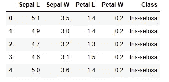
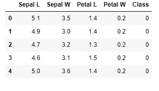
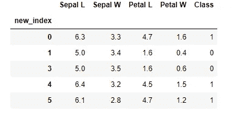
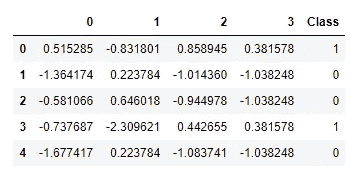
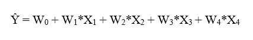
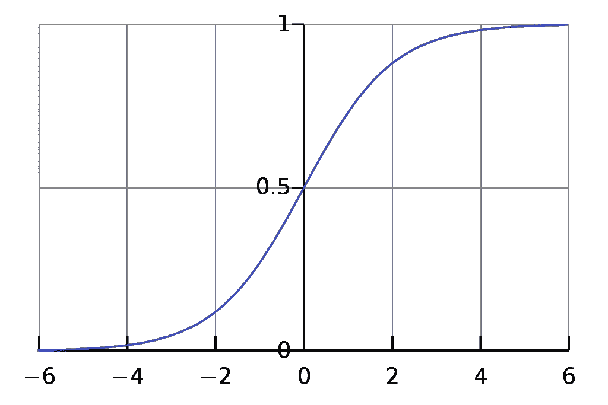
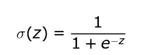
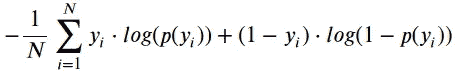
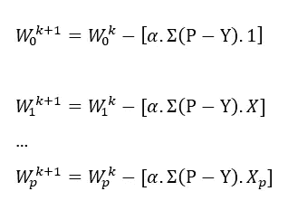
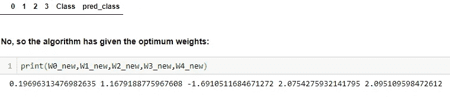

# Python 中使用梯度下降优化器的逻辑回归

> 原文：<https://towardsdatascience.com/logistic-regression-using-gradient-descent-optimizer-in-python-485148bd3ff2?source=collection_archive---------9----------------------->

由 [Unsplash](https://unsplash.com?utm_source=medium&utm_medium=referral) 上的 [chuttersnap](https://unsplash.com/@chuttersnap?utm_source=medium&utm_medium=referral) 拍摄

在本文中，我们将对逻辑回归进行硬编码，并将使用梯度下降优化器。如果你需要梯度下降的复习，可以看看我之前的[文章](https://link.medium.com/fyYd61gnU1)。在这里，我将使用著名的 [Iris 数据集](https://archive.ics.uci.edu/ml/machine-learning-databases/iris/iris.data)来预测使用逻辑回归的类，而不使用 scikit-learn 库中的逻辑回归模块。开始吧！

## 导入库

让我们从导入所有需要的库和数据集开始。这个数据集有 3 个类。但是为了让你更容易理解，我将用两个类来演示梯度下降法。数据集有 150 个实例，3 个类中的每一个都有 50 个实例。因此，让我们只考虑前 100 个实例中的两个类:

## 标签编码

这里的类必须[标签编码](https://medium.com/@contactsunny/label-encoder-vs-one-hot-encoder-in-machine-learning-3fc273365621)算法才能工作。让我们通过 scikit-learn 的 LabelEncoder 模块来完成它。

这个虹膜数据集是一个相当简单和直接的数据集。如你所见，只有 4 节课。没有空值和差异，因为在标签编码后它是纯数字的。

## 洗牌和分割数据帧

这些类在数据帧中被排序，因此它需要被打乱并分成两部分——训练和测试。使用 scikit-learn 中的 [train_test_split](https://scikit-learn.org/stable/modules/generated/sklearn.model_selection.train_test_split.html) 只需一行即可完成。但是让我们在没有它的情况下做，看看在引擎盖下会发生什么。这个方法可能不是 train_test_split 的实际工作方式，但这肯定是一种实现方式。

此外，让我们使用 scikit-learn 的 StandardScaler 对数据进行标准化，即使它的规模几乎相同:

现在我们的数据看起来像这样:

将训练和测试数据 70:30 分开，

数据准备好应用**梯度下降优化器**。下一步将应用 GD 来寻找损失最小的权重的最佳值。由于有 4 个参数影响类别，因此使用的公式为:

其中，ŷ是预测值，w 是权重，x 是输入数据。但是我们需要将类预测为 0 和 1，因此我们需要修改上面的*回归方程*，以便输出成为*默认类*的概率，该概率将在 0 和 1 之间。如果高于 0.5，我们将其分配到 1 类，反之，如果低于 0.5，我们将其分配到 0 类。

因此，为了修改回归方程，我们将它与 [**sigmoid**](https://en.wikipedia.org/wiki/Sigmoid_function#targetText=A%20sigmoid%20function%20is%20a,given%20in%20the%20Examples%20section) 函数、 **σ** 相乘，其输出如下:

[来源](https://en.wikipedia.org/wiki/Sigmoid_function#targetText=A%20sigmoid%20function%20is%20a,given%20in%20the%20Examples%20section)

sigmoid 函数定义为:

逻辑函数和大多数二元分类器中使用的损失函数是二元交叉熵损失函数，由下式给出:

求解上述方程，我们得到误差为(P - Y ),其中 P 是属于默认类别的预测概率。因此，权重的更新规则如下:

现在让我们在准备好的训练数据集上实现它，看看结果。

完整的代码可以在我的 [Git](https://github.com/chayankathuria/LogReg01) 上找到。预测概率后，实例被分成两类。如果概率是> 0.5，则分配给等级 1，否则为 0。权重被更新，并且运行 70 次迭代。现在权重已经达到它们的新值，这应该是最佳值。

现在我们必须评估模型的表现。让我们检查一下模型是否对任何实例进行了错误分类。此外，让我们来看看算法最后一次迭代后更新的权重:

现在为了评估，我们将构建一个 [**混淆矩阵**](/understanding-confusion-matrix-a9ad42dcfd62) 。混淆矩阵包含 4 个值:真阳性，假阳性，真阴性，假阴性。

我们得到以下值——TP:34，FP: 0，TN: 36，FN: 0，混淆矩阵为:

[来源](/understanding-confusion-matrix-a9ad42dcfd62)

酷毙了。现在，让我们最后将学习到的权重应用到我们的测试数据中，并检查它的表现如何。

完成了。现在，让我们通过构建混淆矩阵来检查它的表现如何:

好吧！我们得到了 TP: 16，FP: 0，TN: 14，FN: 0。这意味着 100%的精确度和 100%的召回率！你也可以继续检查 F1 的分数。

这是一个非常小的玩具数据集，因此结果是准确的。当您处理稍大的数据集时，情况就不一样了。但是本文的目的是向您展示使用梯度下降的逻辑回归到底是如何工作的。