# 使用 Minitab 进行逻辑回归

> 原文：<https://towardsdatascience.com/logistic-regression-using-minitab-d58a80ec548a?source=collection_archive---------43----------------------->

**鲍鱼图片来自** pixabay

当输出变量取离散值时，逻辑回归有效。更一般地说，输出变量由分类值组成的问题称为分类问题。例如，传入的电子邮件不是垃圾邮件或垃圾邮件，或者血液值具有诸如生病或未生病的输出值。让我们创建一个分类器来决定收到的邮件是否是垃圾邮件。如果我们使用线性回归，我们会说 1 代表垃圾邮件，0 代表非垃圾邮件。例如，如果阈值为 0.4，我们将标记值为 0.41，而不是 0.39 及以下，而不是垃圾邮件。然而，在这种情况下，由于概率值的范围从 0 到 1，我们将无法找到值在-∞ +∞之间的分类结果。因此，我们得出结论，简单的回归对于这种类型的分类是不够的。输出变量不限于线性回归。因此，在分类问题中应该建立逻辑回归作为回归模型。逻辑回归中的独立变量，即输入变量，可以是连续数据，也可以是离散数据。

在逻辑回归中，通过查看输出变量将采用的值来进行区分。有 3 种类型的逻辑回归，它们是:

1.  二元逻辑回归:因变量可以取值 0 或 1。比如垃圾邮件-非垃圾邮件，病人-病人，非故障-非故障。
2.  多重逻辑回归:当有两个以上的类别时适用。像图像处理的结果由像猫、狗、鸟这样的类别组成。
3.  有序逻辑回归:如果因变量由序列值组成，则使用有序逻辑回归。如差、中、好输出。

在逻辑回归中，属于类别的概率作为输出给出。因此，它们没有被命名为量词。相反，逻辑回归用于创建分类器。属于某一类别的概率按以下公式计算。

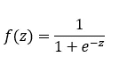

当线性回归中的方程写成 z 值，即输出变量；

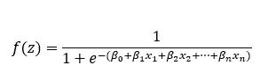

这里的方程称为 Sigmoid 函数或 logistics 函数。返回它连续接收的介于 0 和 1 之间的值。如果输出值为无穷大，分类结果将取值 1。如果输出值趋于-无穷大，分类结果将取值 0。为了确定数据属于哪一类，首先确定一个阈值。根据所确定的阈值来决定数据的类别。例如，如果在垃圾邮件或非垃圾邮件示例中阈值为 0.5，则小于 0.5 的值可以被称为垃圾邮件。

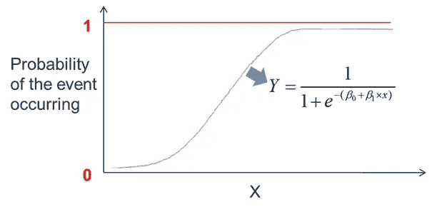

奇数是通过将一个事件的概率除以非事件的概率得到的。

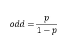

# 样本研究

在这个例子中，让我们根据一些度量标准对男性和女性的骨骼建模。数据集可以在[这里](http://archive.ics.uci.edu/ml/datasets/Abalone)找到。或者准备好 Minitab 的 csv 文件可以从[这里](https://drive.google.com/file/d/1c3abjPvneDX5ymDciGN61sy-Tl4w-1Jx/view?usp=sharing)下载。
要在 minitab 中打开 csv 格式的样本数据集，我们需要选择>文件>打开。

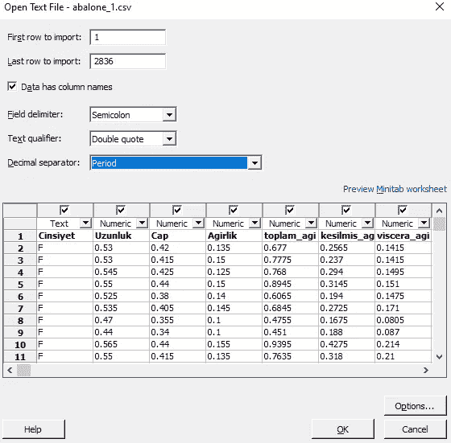

那么我们的数据就准备好了。

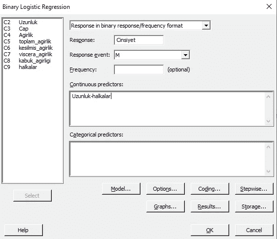

stat > > Regression > > Binary Logistic Regression > > Fit Binary Logistic Model 选项被选中。如下图所示，变量确定，调用 OK。

通过单击结果菜单，可以按如下方式创建报告文件。

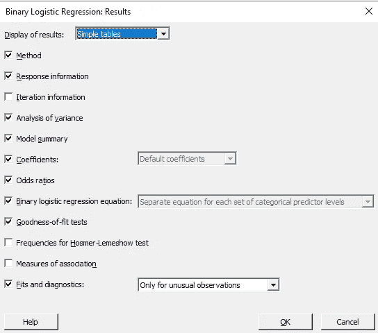

说“确定”, Minitab 报告屏幕打开。

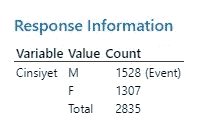

我们已经把作为 M 的状态，也就是男性，作为一个参考事件。

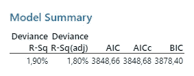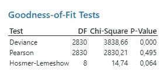

在模型总结和拟合优度测试表中，它显示了我们建立的模型在多大程度上是由参数解释的。在这里的例子中，这些值是不好的，但是让我们继续统计研究。

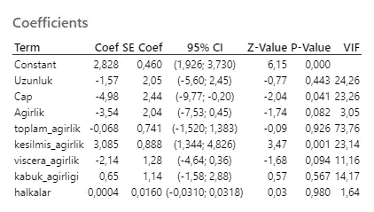

在系数表中，我们可以看到所有自变量得到的系数及其显著性水平。例如，在本例中，权重变量的系数为-3.54，p 值为 0.082。我们可以说该变量具有统计显著性，因为 P 值显著性水平小于 0.05。当所有其他变量保持不变时，权重变量的 1 个单位的变化实现了因变量的 3.54 个单位的减少。为了使模型有意义，所有自变量的 P 值的显著性水平必须小于 0.05。让我们找到具有最高 p 值的变量，并将其从模型中减去。在这里，由于 ring(halkalar)变量具有最高的显著性，因此它首先从模型中删除。

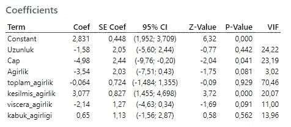

这一次，总重量(toplam_agirlik)从模型中移除，因为它具有最高的 p 值。

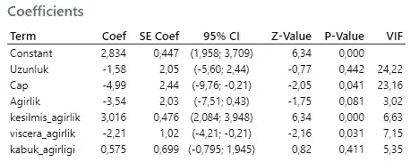

高度(Uzunluk)也从模型中删除。

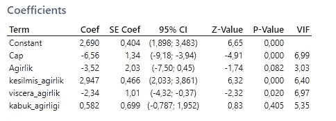

和卡布克-阿吉利吉

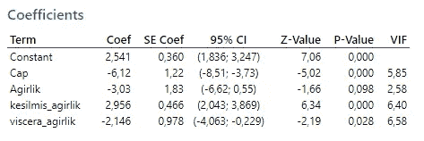

现在所有的 p 值都小于 0.05。我们的模式变得有意义了。

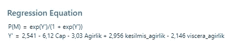

回归模型如上。现在我们可以使用该模型进行估算。

# 参考

辛塔斯、佩德罗·格里马、Lluis Marco-Almagro 和 Javier turt-Martorell Llabres。*用 Minitab 进行工业统计*。威利在线图书馆，2012 年。

埃哈特、埃里克 b、爱德华 j .贝德里克和罗纳德 m .施拉德。“高级数据分析-课堂笔记”，2016 年。

卡拉格兹，穆拉特。i̇statistik·恩特姆勒里。第 9 版。ekin kita bevi yaynlar，2015 年。

Khan，Rehman M. *使用 Minitab 解决问题和分析数据:六适马方法的简明指南*。约翰·威利的儿子们，2013 年。

Lesik，Sally A. *使用 MINITAB* 进行统计推断。CRC 出版社，2018。

"分类变量的多元回归."2020 年 3 月 30 日访问。[http://psych stat 3 . missourstate . edu/Documents/multi book 3/MLT 07 . htm](http://psychstat3.missouristate.edu/Documents/MultiBook3/Mlt07.htm)。

牛顿艾萨克。*迷你食谱*。帕克特出版有限公司，2014 年。

"支持| Minitab。"2020 年 3 月 29 日访问。【https://www.minitab.com/en-us/support/】T4。