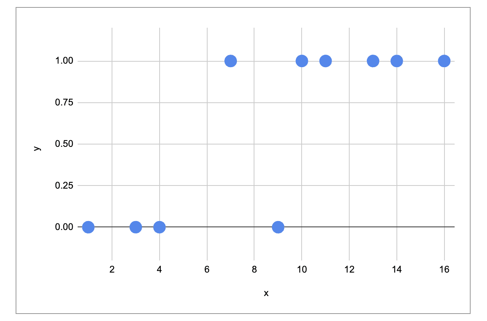
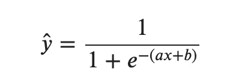
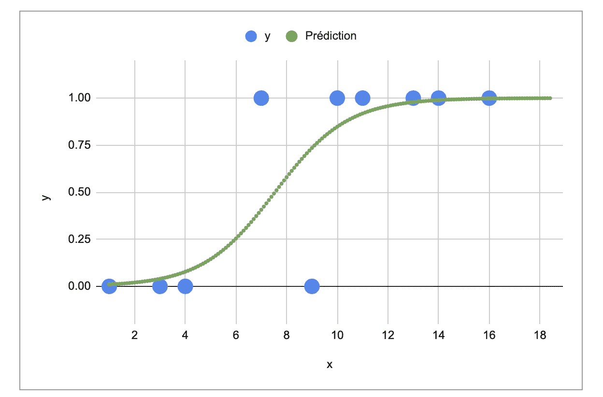
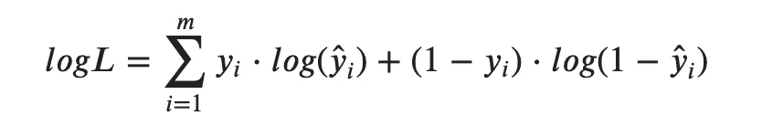
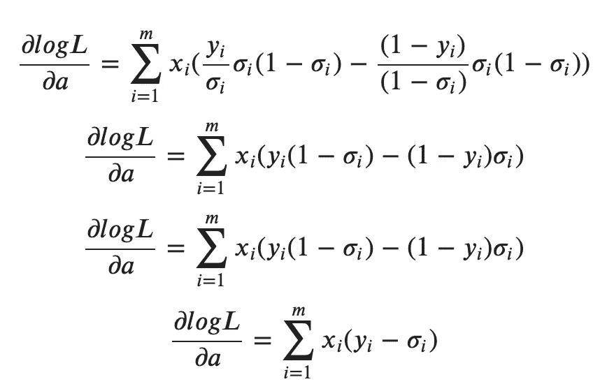
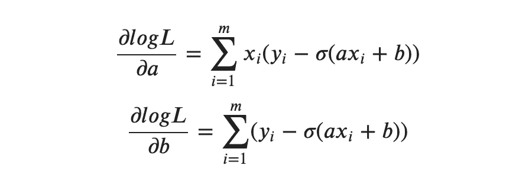
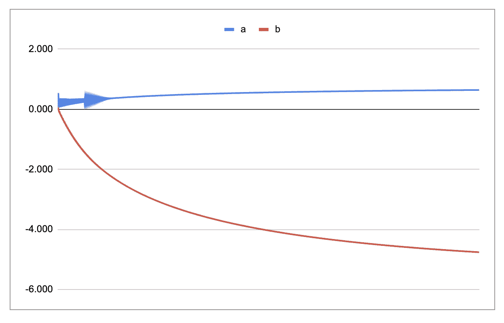

# Excel 中的梯度下降逻辑回归

> 原文：<https://towardsdatascience.com/logistic-regression-with-gradient-descent-in-excel-52a46c46f704?source=collection_archive---------35----------------------->

## 这样你就能更好地理解逻辑回归是如何工作的

虽然使用 Excel/Google Sheet 来解决机器学习算法的实际问题可能是一个坏主意，但使用**简单公式**和**简单数据集**从头实现该算法对于理解算法如何工作非常有帮助。

在一系列文章中，我将介绍如何在 Excel 中从头开始实现不同的算法。

*   [Excel 中带梯度下降的线性回归](/linear-regression-from-scratch-in-excel-3d8192214752) /Google Sheet
*   [Excel 中带梯度下降的逻辑回归](/logistic-regression-with-gradient-descent-in-excel-52a46c46f704) /Google Sheet
*   [Excel 中的神经网络从无到有](/neural-network-from-scratch-in-excel-4774f6131cdb)
*   [K-Excel 中从头开始的意思](/k-means-from-scratch-in-excel-bb60778d186e)

在这篇文章中，我将分享我如何实现一个简单的****逻辑回归**和**梯度下降**。**

**现在让我们开始吧！**

****

**照片由 [Sushil Ghimire](https://unsplash.com/@hipcravo?utm_source=medium&utm_medium=referral) 在 [Unsplash](https://unsplash.com?utm_source=medium&utm_medium=referral) 拍摄**

# **从零开始为 ML 的谷歌表**

**如果你想得到谷歌表，请在 Ko-fi 上支持我。**

**你可以得到我创建的所有谷歌表单(梯度下降的线性回归，逻辑回归，神经网络，KNN，k-means，等等)。)和下面的链接。**

**[https://ko-fi.com/s/4ddca6dff1](https://ko-fi.com/s/4ddca6dff1)**

# **使用简单的数据集**

**首先，我使用一个非常简单的数据集和一个特征，您可以看到下图显示了目标变量 y 和特征变量 x。**

****

# **创建模型**

**逻辑回归使用以下模型:**

****

**我们可以在 Excel 文件的“res”表中看到最终的模型，有 a 和 b。**

****

**那么 a 和 b 是如何确定的呢？让我们在下一页“mlh”中查看最大可能性。**

# **模型的成本函数**

**首先我们可以考虑模型的**可能性**，我们必须最大化:**

****

**然后我们取可能性的对数。为了得到损失函数，我们必须取对数似然的反面**。****

****

**我们也将这个损失函数命名为**逻辑损失**、**交叉熵**或**对数损失**。**

**您可以修改参数 a 和 b，以查看模型的可能性会发生变化。**

****

# **梯度下降**

**现在让我们找出最优参数 a 和 b。**

**为此，我们必须找到损失函数对 a 和 b 的导数。**

********

**在工作表“graddesc”中，您将找到实现梯度下降的所有 Excel 公式。尽情享受吧！**

****

**各种公司的人都用 Excel 工作。虽然它不会被用来做机器学习，但它是一个理解原理的优秀工具，因为你可以看到所有的计算是如何完成的，并可视化所有中间步骤的图形。这种方法对于那些想要了解机器学习算法如何工作以及还不太擅长编码的人来说也非常有帮助。**

**现在，如果你能够理解并在 Excel 中实现逻辑回归，你也可以对一个简单的神经网络进行逻辑回归，你可以阅读这篇文章以获得所有的公式。接受挑战？**

** [## 想象一下神经网络是如何从头开始工作的

### 通过可视化每一步的结果，您可以更好地理解神经网络的工作原理

towardsdatascience.com](/visualize-how-a-neural-network-works-from-scratch-3c04918a278)**