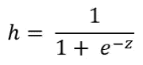
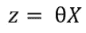
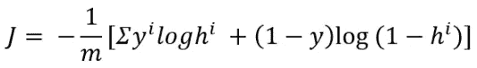
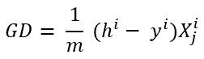
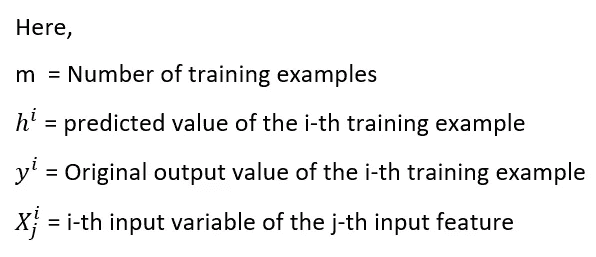
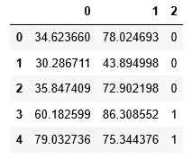
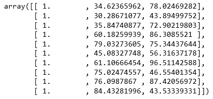
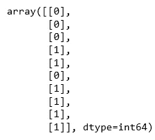

# 使用优化函数的 Python 逻辑回归

> 原文：<https://towardsdatascience.com/logistic-regression-with-python-using-optimization-function-91bd2aee79b?source=collection_archive---------19----------------------->

## 学习用 python 编写逻辑回归算法来执行二元分类


资料来源:Franck V. 的 Unsplash

逻辑回归是一个强大的分类工具。只有当因变量是分类变量时，它才适用。有几种不同的方法来实现它。今天我将解释一个简单的方法来执行二进制分类。我将使用 python 中可用的优化函数。

## 概念和公式

逻辑回归使用 sigmoid 函数来估计返回值从 0 到 1 的输出。因为这是二进制分类，所以输出应该是 0 或 1。这是 sigmoid 函数:



这里 z 是输入变量 X 和随机初始化的系数θ的乘积。



需要为每个输入要素初始化一个θ值。成本函数中一个非常重要的参数。成本函数给出了预测与实际产出的差距。下面是成本函数的公式:



这里，y 是原始输出变量，h 是预测输出变量。我们的目标是尽可能降低成本。现在，我们需要更新θ值，以便我们的预测尽可能接近原始输出变量。如果我们用θ对成本函数进行偏导数，我们将找到θ值的梯度。我不想在这里讨论微积分。我们用来更新θ的梯度下降将会是:



如果你不理解所有的方程式，先不要担心。请看实现部分。希望你能理解如何使用所有的方程。

## 逻辑回归的 Python 实现

1.  导入必要的包和数据集。我从吴恩达在 Coursera 上的机器学习课程中找到了这个数据集。

```
import pandas as pd
import numpy as np
import matplotlib.pyplot as plt
df = pd.read_csv('ex2data1.txt', header=None)
df.head()
```



2.将输入变量和输出变量分开。在该数据集中，列 0 和 1 是输入变量，列 2 是输出变量。所以我们必须预测第二列。

```
X = df.iloc[:, :-1]
y = df.iloc[:, -1]
```

3.向 x 添加一个偏差列。偏差列的值通常为 1。

```
X = np.c_[np.ones((X.shape[0], 1)), X]
X[:10]
```



4.这里，我们的 X 是二维数组，y 是一维数组。让我们把“y”做成二维的，以匹配维度。

```
y = y[:, np.newaxis]
y[:10]
```



5.定义 sigmoid 函数

```
def sigmoid(x, theta):
    z= np.dot(x, theta)
    return 1/(1+np.exp(-z))
```

6.使用此 sigmoid 函数写出预测输出的假设函数:

```
def hypothesis(theta, x):
    return sigmoid(x, theta)
```

7.使用上面解释的公式写出成本函数的定义。

```
def cost_function(theta, x, y):
    m = X.shape[0]
    h = hypothesis(theta, x)
    return -(1/m)*np.sum(y*np.log(h) + (1-y)*np.log(1-h))
```

8.根据上式写出梯度下降函数:

```
def gradient(theta, x, y):
    m = X.shape[0]
    h = hypothesis(theta, x)
    return (1/m) * np.dot(X.T, (h-y))
```

9.导入一个优化函数，为我们优化 theta。这个优化将把要优化的函数、梯度函数和要传递给函数的参数作为输入。在这个问题中，要优化的函数是成本函数。因为我们希望最小化成本，梯度函数将是 gradient_descent，参数是 X 和 y。该函数还将采用“x0 ”,这是要优化的参数。在我们的例子中，我们需要优化θ。所以，我们必须初始化θ。我把θ值初始化为零。正如我前面提到的，我们需要为每个输入特征初始化一个θ值。我们有三个输入特性。如果你看 X，我们有 0 和 1 列，然后我们增加了一个偏差列。所以，我们需要初始化三个θ值。

```
theta = np.zeros((X.shape[1], 1))
from scipy.optimize import minimize,fmin_tnc
def fit(x, y, theta):
    opt_weights = fmin_tnc(func=cost_function, x0=theta, fprime=gradient, args=(x, y.flatten()))
    return opt_weights[0]
parameters = fit(X, y, theta)
```

参数出来是[-25.16131854，0.20623159，0.20147149]。

10.使用这些参数作为θ值和假设函数来计算最终假设。

```
h = hypothesis(parameters, X)
```

11.使用假设来预测输出变量:

```
def predict(h):
    h1 = []
    for i in h:
        if i>=0.5:
            h1.append(1)
        else:
            h1.append(0)
    return h1
y_pred = predict(h)
```

12.计算准确度。

```
accuracy = 0
for i in range(0, len(y_pred)):
    if y_pred[i] == y[i]:
        accuracy += 1
accuracy/len(y)
```

最终准确率为 89%。

您也可以使用梯度下降作为优化函数来执行此逻辑回归。下面是一篇实现梯度下降优化方法的文章:

1.  [梯度下降优化逻辑回归。](/logistic-regression-in-python-from-scratch-to-end-with-real-dataset-12998f7b5739)
2.  [用梯度下降法进行多类分类。](/multiclass-classification-with-logistic-regression-one-vs-all-method-from-scratch-using-python-853037783616)
3.  [Python 中的多项式回归从无到有。](/polynomial-regression-from-scratch-in-python-a8d64845495f)

转到此页面获取数据集:

[](https://github.com/rashida048/Machine-Learning-With-Python/blob/master/ex2data1.txt) [## rashida 048/用 Python 进行机器学习

### Permalink GitHub 是 5000 多万开发人员的家园，他们一起工作来托管和审查代码、管理项目以及…

github.com](https://github.com/rashida048/Machine-Learning-With-Python/blob/master/ex2data1.txt) 

以下是完整的工作代码:

[](https://github.com/rashida048/Machine-Learning-With-Python/blob/master/logisticRegressionWithOptimizationFunc.ipynb) [## rashida 048/用 Python 进行机器学习

### permalink dissolve GitHub 是超过 5000 万开发人员的家园，他们一起工作来托管和审查代码，管理…

github.com](https://github.com/rashida048/Machine-Learning-With-Python/blob/master/logisticRegressionWithOptimizationFunc.ipynb)