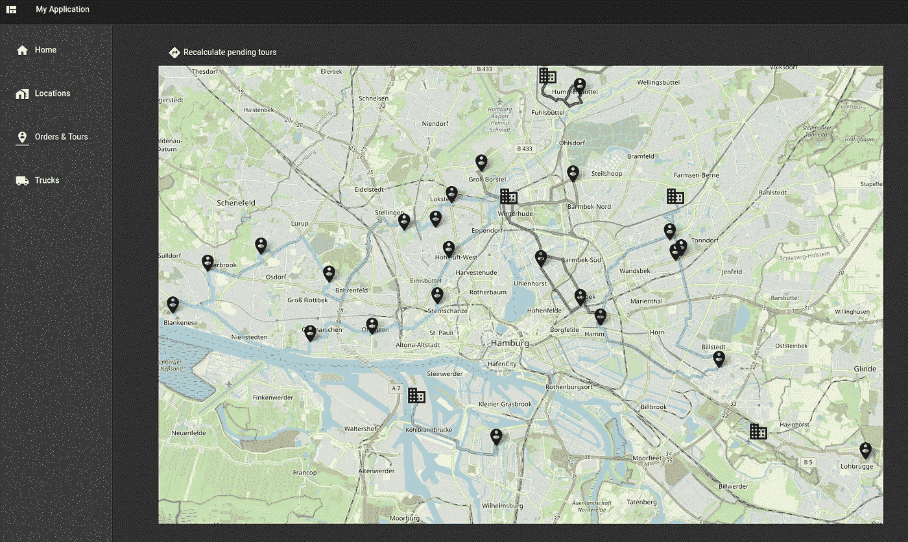
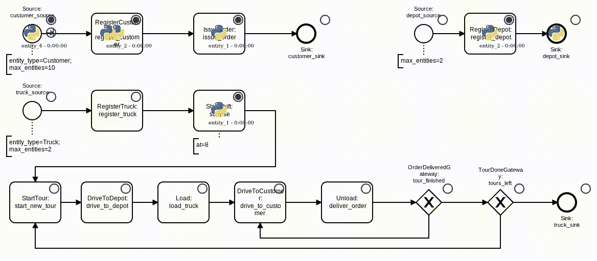
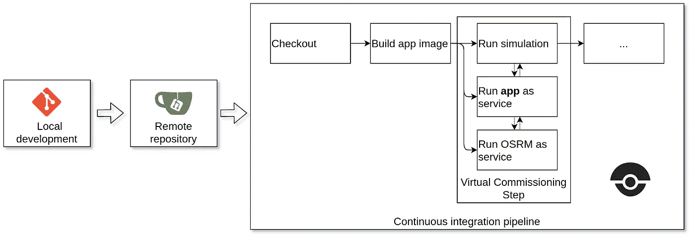
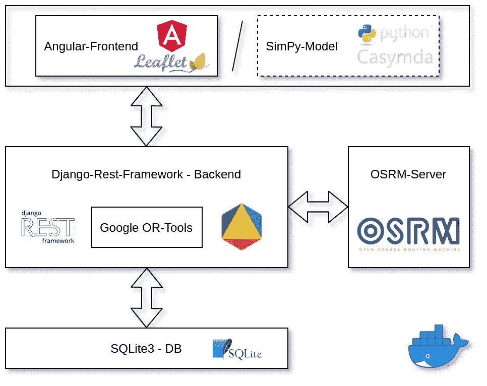
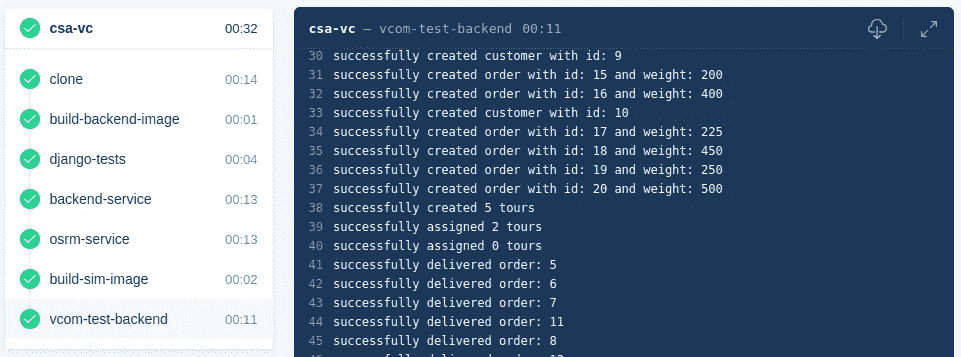

# 自动化集成测试的物流过程模型

> 原文：<https://towardsdatascience.com/logistics-process-models-for-automated-integration-testing-bce081553ef5?source=collection_archive---------66----------------------->

## 物流软件持续集成和虚拟调试案例研究



物流系统的规划和设计——包括供应链和内部物流——通常由模拟研究支持，用于比较设计方案，评估其可行性，以及估计关键绩效指标，如提前期或吞吐量。

当谈到物流系统的实现时，主要的挑战与控制和操作 it 系统的开发有关。鉴于这些系统的测试、集成、试运行(和错误修复)往往会消耗实现阶段的很大一部分，很明显，尽早测试一个开发的系统是非常有益的——甚至在任何物理设置发生之前。
[*虚拟调试*](https://www.sciencedirect.com/science/article/pii/S2212827119305839) 描述了针对系统的数字对应物的软件测试，利用*模拟*模型*模拟*真实世界的交互。

这篇文章将展示一个将基于模拟的测试集成到当今敏捷软件开发过程中的例子，调查一个订单管理和交付优化的案例研究。

> *获得回购:*[https://github.com/fladdimir/csa-vcom](https://github.com/fladdimir/csa-vcom)

# 1.场景和范围

还记得汉堡-阿尔托纳的一家小法国面包店 La Pâ tisserie 吗？这家面包店正在经历一场需求的大规模转移，他们的甜点正被送上门。

在创新的开源城市配送网络模拟方法的帮助下，评估了如何扩展其业务模式的不同选项后，不断增长的网络现在变得越来越难以管理，需要增加对面包店日常物流运营的基于软件的支持…

# 2.流程和要求

为了能够专注于他们的核心竞争力(变出美味的点心，而不是与难以处理的不一致的电子表格数据作斗争)，我们的面包店决定采用基于 web 的物流规划应用程序。
要支持的核心流程有:

*   登记客户，并跟踪他们的订单
*   管理仓库的位置，以计划最佳可能的交付
*   跟踪卡车，根据计划路线运送货物

下面的 BPMN 图显示了这些过程和一个简单的令牌流动画:



带有令牌流动画的简单订购和交付流程

# 3.测试优先:模拟模型+构建管道

为了确保所开发的软件能够充分支持所有需要的流程，我们面包店的软件开发部门选择了测试驱动的方法，由一个构建管道来支持，该管道会自动检查推送到仓库的所有代码。基于指定的业务流程，一个 [Casymda](https://fladdimir.github.io/post/casymda) 仿真模型被生成，准备好模拟实际系统，开发的软件应该与该系统一起工作。随着应用程序的过程和范围的变化，模拟模型可以以敏捷的方式发展。

[Gitea](https://gitea.io/) 和 [Drone](https://drone.io/) 构成了持续集成设置的基础。作为虚拟调试步骤的一部分，管道在服务容器中启动应用程序，模拟模型根据服务容器运行测试场景，模拟交互并验证软件的预期行为:



作为持续集成管道一部分的虚拟调试

管道由一个 [*.drone.yml*](https://github.com/fladdimir/csa-vcom/blob/github/.drone.yml) 文件描述。注意，可以以各种方式改进流水线，例如，通过适当地等待 app(服务)变得可用于模拟步骤。一个 [docker-compose.yml](https://github.com/fladdimir/csa-vcom/blob/github/gitea/docker-compose.yml) 允许使用单实例设置在本地启动 gitea+drone，这[并不理想](https://docs.drone.io/server/provider/gitea/)，但足以用于演示:

```
docker-compose -f gitea/docker-compose.yml up
```

# 4.应用程序设计和实施

我们面包店的应用程序正在处理客户、订单、仓库、旅游和卡车的数据管理。此外，还需要通过计算有效行程并将其分配给可用卡车来支持交付流程的规划。

该应用程序采用了一个基本的三层结构，包括一个基于浏览器的用户界面，一个包含业务逻辑和优化算法的后端，以及一个持久数据库。下图总结了设置，包括在自动构建管道中充当客户端的模拟模型:



具有基于模拟的测试客户端的 3 层应用程序

后端用 Python 实现，使用[Django](https://www.djangoproject.com/)+[Django-Rest-Framework](https://www.django-rest-framework.org/)，依靠 [Google-OR-Tools](https://developers.google.com/optimization) 完成优化任务。旅游规划被建模为一个有容量限制的多站点车辆路径问题(CVRP)。对于未完成的行程到可用卡车的最优分配，OR-Tools 提供了一个[最小成本流](https://developers.google.com/optimization/assignment/assignment_min_cost_flow)求解器，用于相应的二分图上。

所需的距离矩阵从[开源路由机器](https://github.com/Project-OSRM/osrm-backend)中获得，以现成的 Docker 图像( [OSRM 盒](https://hub.docker.com/r/osrm/osrm-backend/))的形式提供。OSRM 提供了一个方便的 API，在创建新的客户或仓库时同步使用。开放街道地图数据可从[https://download . geofabrik . de](https://download.geofabrik.de/)下载。[汉堡](https://download.geofabrik.de/europe/germany/hamburg.html)的地图大小约为 35 MB，OSRM 预处理(汽车轮廓)大约需要 30 秒(i5 双核笔记本 cpu)。

[SQLite](https://www.sqlite.org/index.html) 提供了一个简单的数据库解决方案，然而，Django 使得切换到像 [Postgres 或 MariaDB](https://docs.djangoproject.com/en/3.0/ref/databases/) 这样的客户机/服务器 RDBMS 变得很容易。

前端采用[棱角](https://angular.io/)、[材质](https://material.angular.io/)、[小叶. js](https://leafletjs.com/) (得益于[ngx-小叶](https://github.com/Asymmetrik/ngx-leaflet)，易于集成)。

要在本地启动应用程序，通过 [http://localhost:4200](http://localhost:4200) 为前端提供服务，只需在存储库根访问 docker-compose.yml。

# 5.结果

下面的截屏从用户的角度展示了工作流程。它包括注册新客户、发布订单、规划旅程、分配卡车，以及随着旅程的进行跟踪交付情况:

通过网络前端进行客户注册和旅游规划的截屏

所示流程与虚拟调试管道构建步骤中仿真模型执行的流程相匹配，确保软件每个版本的稳定功能:



作为无人机管道的一部分，成功的基于模拟的集成测试

使用模拟模型进行广泛的自动化集成测试有助于支持和保持软件质量，尤其是在以流程为中心的物流应用环境中。正如我们所看到的，今天的软件开发工具和标准允许将模拟技术和虚拟调试方法有效地集成到开发工作流中。