# 使用早期语言阶段数据的 LOL 匹配预测|机器学习

> 原文：<https://towardsdatascience.com/lol-match-prediction-using-early-laning-phase-data-machine-learning-4c13c12852fa?source=collection_archive---------30----------------------->

## 使用大约 10K 游戏的前 10 分钟数据来预测高 ELO 等级游戏的结果

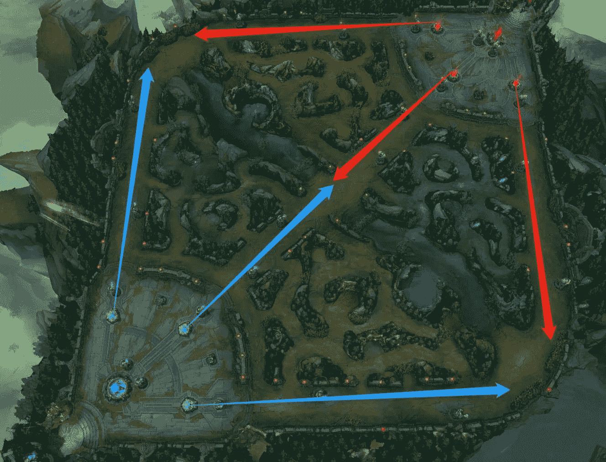

英雄联盟:蓝队(左)对红队(右)|图片作者

# 介绍

**英雄联盟**是一款以团队为基础的策略游戏，两队五名强大的冠军对抗，摧毁对方的基地。(【https://na.leagueoflegends.com/en-us/how-to-play/】T2

一场典型的英雄联盟游戏通常持续 30 到 45 分钟，每场游戏可以分为三个阶段:游戏开始阶段、游戏中期和游戏后期。玩家通常会花前 10 到 15 分钟在他们自己的球道(顶部，中部，机器人，JG)耕作，以获得早期的建造和等级优势。在游戏中期，玩家开始关注宏观层面:推车道，拿下塔，获得地图目标，和群体战斗。在游戏后期，如果游戏还没有结束，每个队都要决定如何结束游戏，比如:逼一个男爵/长老龙或者 1–4 推等。

在这个项目中，我使用了名为“米歇尔的粉丝”的 Kaggle 收集的数据，数据集包含第一个 10 分钟。大约的统计数据。从高 ELO(钻石 I 到大师)开始的 10k 排名游戏(单人队列)。你可以在这里找到完整的描述和数据来源。

每支队伍的冠军组合将显著影响游戏的结果，因为一些冠军在游戏的早期很强，而其他冠军将在游戏的中期和后期有很大的发展。这就是为什么所有的排名赛和职业赛在赛前都会有一个禁赛/选赛阶段。然而，很多玩家可以用他们的技能和地图意识对游戏产生的影响不会在冠军连击中体现出来。尤其是一些球员，比如 RNG。无论对手是否有反挑，简自豪都可以在拉宁阶段获得显著优势。

此外，正如我们所看到的，在许多高水平的游戏中，团队组合，特别是游戏后期的组合，并不总是如预期的那样工作，因为拉宁阶段往往比游戏中期和后期阶段有更多的不确定性，例如其中一个团队能够创造一个差距，这个差距对于另一个团队来说太大了，无法在游戏后期填补。我的目标是了解拉宁阶段的表现(前 10 分钟)如何影响最终结果。

我使用 Jupyter 笔记本和 R studio 作为代码编辑器。我用 Pandas、NumPy 和 Matplotlib 包做了一些数据探索。然后，我实现了九个模型，包括一个集成模型、一个堆叠模型和七个其他分类器。最一致的模型是堆叠模型，其交叉验证的平均准确度得分为 0.732158，标准偏差为+/- 0.005171。

# 数据浏览

数据集总共有 9879 场比赛的信息，蓝队赢了其中的 4930 场，占 49.9%。这是一个非常平衡的数据集。

图 1 显示了两个团队杀死的数量。紫色点代表红队获胜，黄色点代表蓝队赢得比赛。我了解到蓝队在前 10 分钟杀死 15 只以上就赢得了所有的比赛。蓝队的胜率在戏剧性地干掉 7 个之后开始增加。

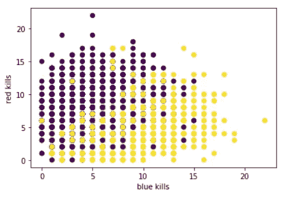

图 1:蓝色与红色的杀戮

图 2 显示了两队的助攻次数。这和谋杀案有着相同的模式。然而，在拉宁阶段，每支球队只有一场比赛获得 20 次以上的杀球，而在拉宁阶段，有许多比赛两支球队都能够获得 20 次以上的助攻。这表明大部分的杀戮可能来自最底层的车道，或者丛林者经常开枪。


图 2:蓝色与红色在助攻上的对比

图 3 显示了黄金对比。这个图给了我一个明显的暗示，如果蓝队能在前 10 分钟内获得超过 20，000 枚金牌，他们极有可能赢得比赛。我还手动设置了一个“绿色区域”，它涵盖了蓝队在前 10 分钟内能够获得超过 21，055 枚金牌的游戏。在这个数据样本中，蓝队赢得了所有落在“绿区”的比赛。

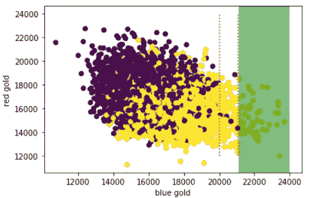

图 3:金色中的蓝色与红色

然后，我研究了蓝队在比赛阶段的金牌差距和比赛结果之间的关系。图 4 显示，当蓝队在前 10 分钟(红区)有-6324 和 6744 之间的金牌差距时，游戏非常轻率，最终结果可能有利于任何一方。

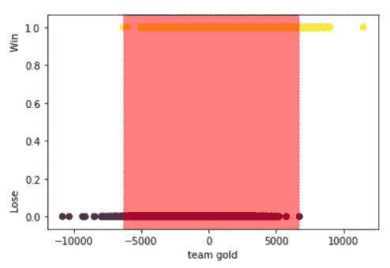

图 4:蓝队的金牌差距(W/L)

在英雄联盟的游戏中，游戏中后期视野较好的队伍会更容易获得主动权。然而，愿景在早期游戏中有多重要？图 5 并没有显示出早期游戏中视觉的重要性，这有点出乎我的意料。

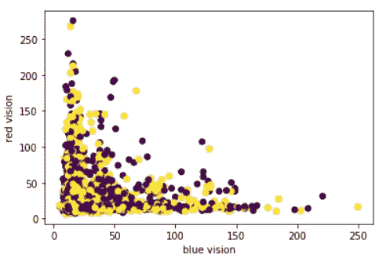

图 5:视觉中蓝色与红色的对比

图 6 说明了蓝队在比赛阶段的经验差异和比赛结果之间的关系。游戏实际上是 50-50，而前 10 分钟的体验差异大约是+/- 5000 XP。在一个正常的框架游戏中，中巷和顶巷可以达到 8 级，机器人巷和丛林可以分别达到 6 级，大约需要 10 分钟。从 7 级到 8 级需要 1150 XP，从 5 级到 6 级需要 880 XP。5000 经验值的优势意味着在早期游戏中，每条通道平均高出大约 1 级(1150*2+880*3=4940)。

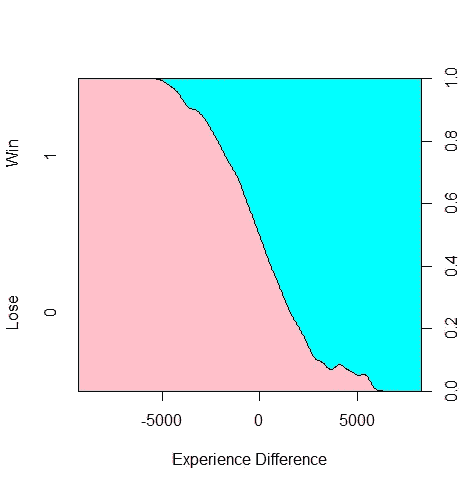

图 6:蓝队在 W/L 的体验差异

除了以上这些，我还想分享一些有趣的数据:

1.  当蓝队的 KDA 在前 10 分钟大于或等于 3 时，他们有 76.51%的胜率。
2.  当蓝队可以在前 10 分钟摧毁一座塔时，他们有 75.43%的胜率。
3.  蓝队在前 10 分钟能有 8 杀的时候，胜率是 69.86%。

# 特征工程

既然有很多值大的特性，比如经验，总金等。我将 StandardScaler()和 MinMaxScaler()应用于这些特性。经过测试，我决定对项目的其余部分使用 StandardScaler()转换。

我还创建了以下功能:

**蓝 KDA** / **红 KDA** :蓝队前 10 分钟的杀伤率。是通过[(蓝杀+蓝助攻)/蓝死]计算出来的。我也使用相同的过程来创建 redKDA。

**KDADiff** :两队的 KDA 差。计算为[blueKDA-redKDA]。

**blueGoldAdv** :该特征是一个二元变量。它表明蓝队在比赛的前 10 分钟是否有至少 20，000 金的优势。

**blueDiffNeg** :该特征是一个二元变量。它指示蓝队在比赛的前 10 分钟内是否有小于或等于-6324 的负金差。

**blueDiffPos** :该特征是一个二元变量。它指示蓝队在比赛的前 10 分钟是否有大于或等于 6744 的正金牌差值。

# 建模

因为我没有真正的维持集来测试我的模型的有效性，所以我选择使用交叉验证技术，并使用准确性和 ROC 作为评估指标。

我测试了以下九种型号:

AdaBoostClassifier，CatBoostClassifier，XGBoostClassifier，支持向量分类器，LogisticRegression，RandomForestClassifier，KNeighborsClassifier，EnsembleVoteClassifier，StackingClassifier

```
eclf = EnsembleVoteClassifier(clfs=[cat,logreg, knn, svc,ada,rdf,xgb], weights=[1,1,1,1,1,1,1])labels = ['CatBoost','Logistic Regression', 'KNN', 'SVC','AdaBoost',"Random Forest",'XGBoost','Ensemble']cv=KFold(n_splits = 5, random_state=2022,shuffle=True)for clf, label in zip([cat,logreg, knn, svc, ada, rdf, xgb,eclf], labels): scores = cross_val_score(clf, info_x, info_y, 
                             cv=cv, 
                             scoring='accuracy',
                             n_jobs=-1) print("[%s] Accuracy: %0.6f (+/- %0.6f) Best: %0.6f " 
          % (label,scores.mean(), scores.std(), scores.max()))
```

图 7 显示了九个模型的输出。超参数调整后，叠加模型的平均精度为 0.732158，是第三好的分数。尽管如此，它也有最低的标准偏差，表明它在交叉验证测试中在防止过度拟合方面做得最好。集合模型和堆叠模型也具有最好和第二好的 ROC 分数。这个结果与我在上一篇文章中讨论的一致:[简单加权平均集成|机器学习](https://medium.com/analytics-vidhya/simple-weighted-average-ensemble-machine-learning-777824852426)。

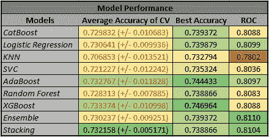

图 7:模型性能表

图 8 是我上面提到的所有模型的 ROC 图:

```
plt.figure()
lw = 1#knn
knn.fit(X_train,y_train)
knn_pred = knn.predict_proba(X_test)
fpr, tpr, threshold = roc_curve(y_test,knn_pred[:,1])
roc_auc = auc(fpr, tpr)
plt.plot(fpr, tpr, color='tab:blue',
             lw=lw, label='KNN ROC curve (area = %0.4f)' % roc_auc)
... ...plt.plot([0, 1], [0, 1], color='navy', lw=lw, linestyle='--')
plt.xlim([-0.02, 1.0])
plt.ylim([0.0, 1.05])
plt.xlabel('False Positive Rate')
plt.ylabel('True Positive Rate')
plt.title('ROC curve')
plt.legend(loc="lower right")
plt.show()
```

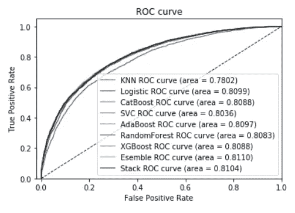

图 8:测试数据集上的 ROC 图

# 错误预测分析

在这个项目结束时，我以 7 比 3 的比例将数据集分为训练数据集和测试数据集，并用堆叠模型拟合训练数据集。然后，我对我的模型错误预测的实例做了更多的分析。我想知道在什么样的条件下比赛会变得更加不可预测。

图 9 和图 10 说明了前 10 分钟两队的总金和总经验。这两幅图清楚地表明，在金牌和经验方面具有早期优势的球队最终输掉了比赛。测试集中有 799 个错误的预测。

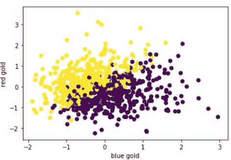

图 9:错误预测的蓝色和红色

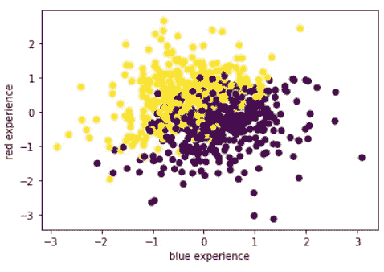

图 10:蓝色和红色在错误预测中的对比

我还进一步观察了丛林者的表现，因为在拉宁游戏中，两个队的队员通常都需要丛林者的帮助来获得主动权。图 11 显示了荣格勒的性能。这是整个测试数据集、错误预测和正确预测的“blueTotalJungleMinionsKilled”和“redTotalJungleMinionsKilled”之间的平均差异。错误预测的“JGDiff”小于整个测试数据集的平均水平，这意味着当蓝色丛林者的表现超过平均水平时，预测将变得有点困难。

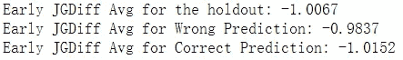

图 11:荣格勒的性能

# 结论

我的模型显然遇到了瓶颈，因为它们都不能产生高于 0.75 的准确度分数。我的假设是最终的数据集只包含 44 个特征，这是一个非常低维的数据集，因为英雄联盟可能会从每个游戏中捕捉数百个变量。对于进一步的实验，我建议加入一些特性，比如冠军组合，时间范围，特定玩家的冠军熟练程度等等。进入分析。

《英雄联盟》是过去十年全球最受欢迎的游戏之一。它将来自不同大陆的玩家聚集在一起，让他们在召唤师裂缝中分享快乐。尽管我试图预测排名赛的结果，但我一直认为，让比赛保持精彩的唯一方法是尽可能让它变得不可预测。最激动人心的时刻总是在终极群殴之后，紧接着是大反击。著名的容格勒，RNG。MLXG，曾经说过，“如果你不知道如何翻转一个失败的游戏，为什么要去玩英雄联盟。”

— — — —

你可以在我的 [GitHub 库](https://github.com/jinhangjiang/LOLAnalysis-10mins)中找到这个项目的代码。

***请随时与我联系***[***LinkedIn***](https://www.linkedin.com/in/jinhangjiang/)***。***