# 用图卷积网络预测伦敦自行车骑行

> 原文：<https://towardsdatascience.com/london-bike-ride-forecasting-with-graph-convolutional-networks-aee044e48131?source=collection_archive---------18----------------------->


人们在伦敦海德公园的林荫道上骑自行车，摄于 istockphoto.com

## 端到端 PyTorch 深度学习从概念到验证

深度学习方法的名册上最近增加了一个新成员是*图卷积网络* (GCN)。像其著名的祖先[卷积神经网络](/a-comprehensive-guide-to-convolutional-neural-networks-the-eli5-way-3bd2b1164a53) (CNN)一样，可学习的卷积运算是关键，因为已知输入和预测输出之间的大量非线性关系串在一起。然而，广义细胞神经网络中的卷积运算与细胞神经网络中的不同。

我将分享 GCN 对一个问题的实际端到端应用，对于该问题，读者应该能够将 GCN 中的数学实体与现实世界的前兆联系起来。英国伦敦自行车共享的时间序列预测是我构建并展示的 GCN 的具体应用。

一个实用、简单、真实的介绍是我这次探索的目标。肯定会有遗漏，高级读者可以在别处找到复杂的数学处理方法。我的实现使用了 [PyTorch](https://pytorch.org) 和 [PyTorch Geometric](https://pytorch-geometric.readthedocs.io/en/latest/index.html) ，代码片段在整个文本中共享。

## 为什么要用图表呢？

CNN 是根据其维度来描述的，例如一维或二维。这对应于一个给定的*结构*的问题。文本或语音分析可以被视为沿着一个维度构建的问题。图像分析或物体识别可以被看作是沿着两个维度构造的问题。

然而，有许多问题在结构上并不那么规则——它们可能并不完全适合欧几里得空间。

一个*图*是一个通用的数学结构，许多问题都被映射和分析在上面。生物学中有大量的抽象图形，例如[交互组](https://www.nature.com/articles/468851a)或[代谢网络](https://www.genome.jp/kegg/pathway.html)。社交媒体上有趣或可怕的模因扩散与图表上的动态有关，这也适用于病毒传播和传染病。

交通是另一个很好的例子。在国王十字车站跳上一辆自行车，在用力踩踏板之后，在查尔斯·狄更斯博物馆下车，这是一个涉及图表中两个*顶点*的时空运输事件。

城市交通主要沿着两个方向进行。然而，在相同距离的城市中的两对顶点在各自的顶点之间可能经历非常不同的交通，因为在顶点处或顶点之间存在什么商业活动、住宅或道路。城市环境是异质的，地点和道路很少可以互换。欧几里得距离(或者曼哈顿距离)在许多运输问题的模型中是不够的，因此城市图是优选的。

因此，GCNs 可以应用于城市图上的运输问题。这些是*时空*问题——事件的时间和地点以及它们的耦合性质。显而易见，定义问题结构的图是 GCNs 的核心。

## 桑坦德自行车数据集的描述性统计

在 GCN 建立和应用之前，我对伦敦自行车共享数据集进行了简明的描述性分析，因此概念清晰，直觉明确。我过去做过一个更[详细的伦敦自行车共享的数据分析](https://medium.com/@AJOhrn/data-footprint-of-bike-sharing-in-london-be9e11425248)。

在英国伦敦市，有一个自行车共享系统*桑坦德自行车*，也被称为*鲍里斯自行车*，以 2010 年引入该系统的前市长鲍里斯约翰逊命名。伦敦(TfL) 交通局详细记录了自行车的使用情况。

原始数据中的一行对应于单个运输事件:自行车从哪个自行车站出发的时间，以及所述自行车到达另一个(或同一个)自行车站的时间。原始数据不包含关于自行车在出发和到达时间之间的位置的信息。

每个自行车站点可以理解为拥有两个与时间相关的数据流:在一个时间间隔内自行车出发的数量和自行车到达的数量。

在必要而乏味的数据争论(总结在脚注中)之后，我考虑 2017 年和 2018 年 709 个自行车站的双重数据流，除非另有说明。

这些站点在数据流方面有多大的不同？下面的直方图显示了伦敦有多少个自行车站有特定的每周发车和到达次数。

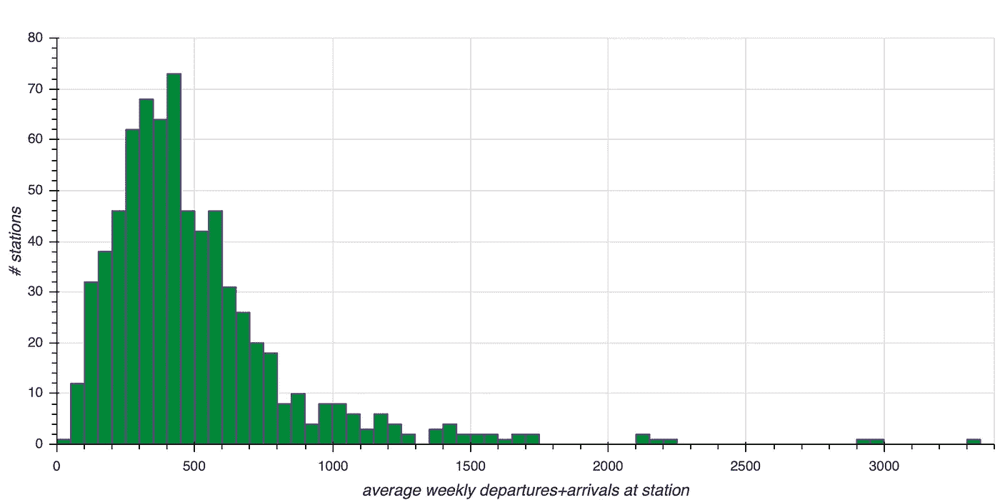

大多数车站一周有 200 到 600 人到达和离开，而少数车站有更多。这显然是*而不是*只是一个普通平均值的正常变化。

也有季节性变化。2017-2019 年每周自行车租赁总数如下所示。这三个尖点对应着伦敦温暖少雨的月份。

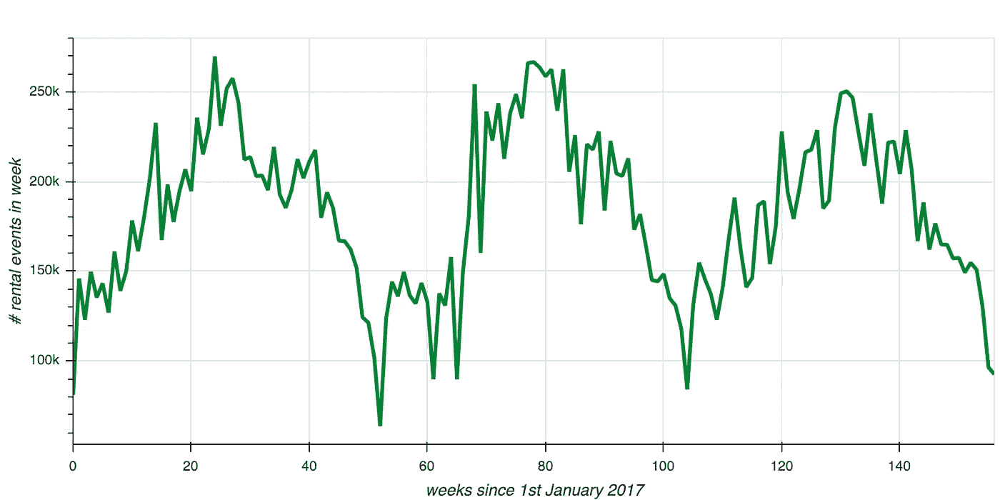

一周之内，几天之内，都会有变化。下图显示了 2017 年连续五天内每半小时发生的租赁总数。周末和工作日在性质上是不同的。

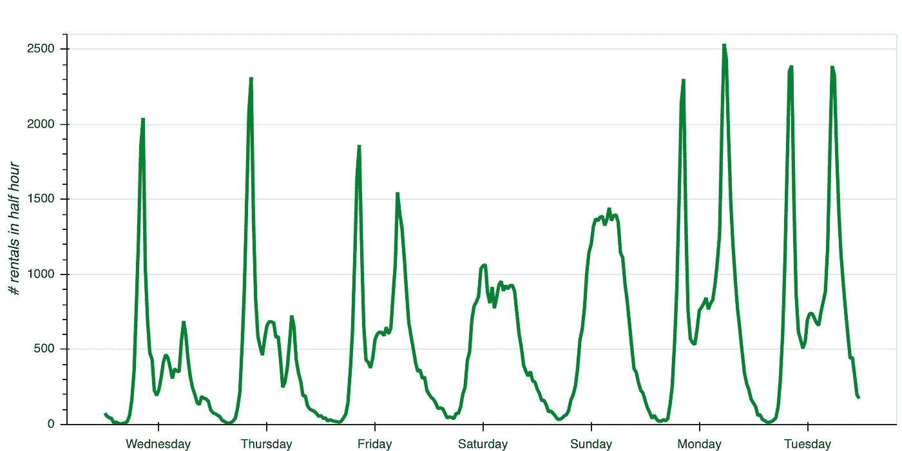

因此，自行车租赁活动随时间变化很大。这种时间上的变化有着直观的意义:在雨中和寒冷中骑自行车不那么吸引人了；上下班主要发生在工作日的早上和晚上。

顺便提一下，由于新冠肺炎疫情引起的主要时间变化可以通过通勤数据签名的变化来跟踪。

709 个站点之间的空间关系。根据原始数据，我确定从某一特定车站出发的列车到达另一个车站的百分比。人们经常骑自行车的一对车站是*联系更紧密的*，或者用非欧几里得空间的术语来说，是图中*靠得更近的*。

站与站之间行程百分比的聚类热图如下所示，红色-黄色表示相应站对之间的联系较强，蓝色表示相反，绿色表示中间关系。

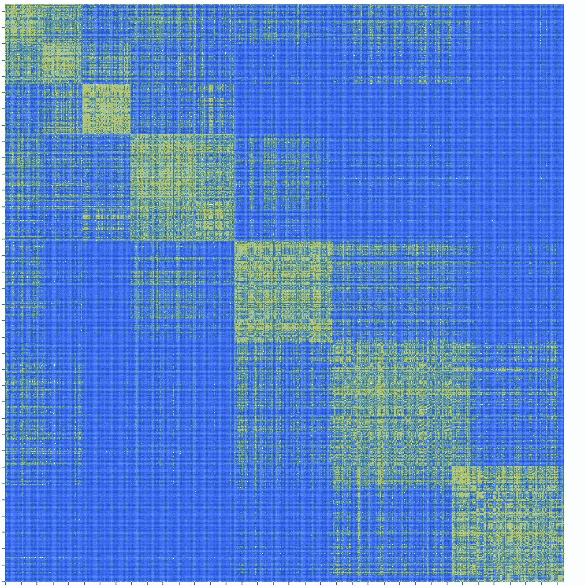

热图显然是聚集的。非对角线颜色不是均匀分散的。因此子集站可以具有与其他站的相同子集相似的距离。

可见的星团大致与伦敦的地理相吻合。

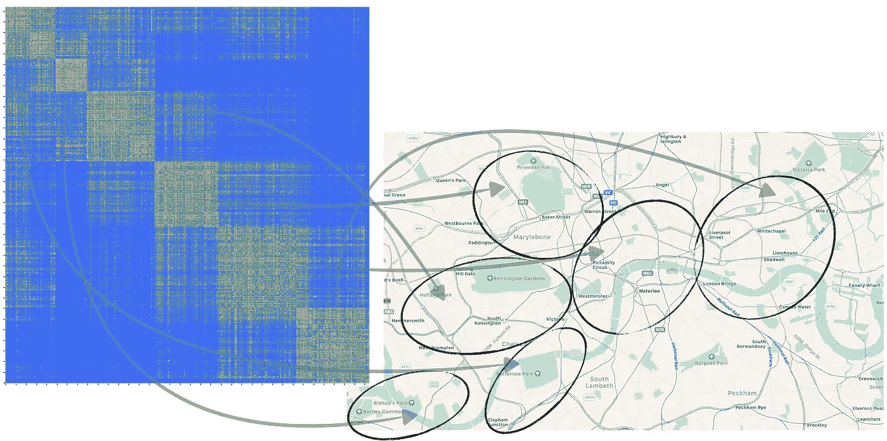

左上角的集群包括巴特西公园和克拉彭枢纽附近的车站。下一个小而独特的集群包括富勒姆和普特尼附近的车站。下一个更大的集群包括海德公园和整个肯辛顿附近的车站。然后沿着试剂公园、马里波恩周围的车站，尤其是主要通勤枢纽国王十字车站。这个庞大但相当分散的集群包含了伦敦市中心的大多数车站，包括索霍区、威斯敏斯特区、利物浦街以及滑铁卢站。最后，维多利亚公园白教堂最东边的车站形成了一个相当独特的集群，肖尔迪奇周围的车站是伦敦中心集群的关键。

因此，空间关系类似于二维度量将产生的空间关系。这有助于我们理解这个方法。然而，该图隐含地体现了城市自行车交通在方向和范围上的异质性，这是欧几里德度量所没有的。

与上面的热图一致的加权有向*邻接矩阵*是下面的图卷积的关键。

## 图形卷积应该做什么

邻接矩阵说明了数据流是如何耦合的。如果从一个车站出发的人数突然增加，那么在不久的将来到达其他车站的人数突然增加的概率是不一致的。

因此，邻接矩阵可以定义 i [感应偏差](https://www.lesswrong.com/posts/H59YqogX94z5jb8xx/inductive-bias)。直观地说，我们对问题结构的了解应该允许我们指导归纳、推理或机器学习拟合。像 CNN 中的标准正方形卷积窗口，其偏向于发现最接近像素中的特征，图形卷积操作应该能够挖掘图形中具有预测性的局部关系。

是时候建立模型并找出答案了。

## 时空图卷积网——逐步构建

我下面描述和探索的深度学习模型是建立在[于等人关于交通预测](https://arxiv.org/abs/1709.04875)的工作基础上的。他们将该方法应用于北京和加州的公路交通数据。偶尔会出现与他们的模型和我下面介绍的有所不同的情况。尽管如此，他们定义了架构，理应受到表扬。

我的目标是*而不是*为手头的任务开发另一种最先进的模型。这将需要更多的架构和合适的元参数。相反，我从于等人的模板模型中建立了一个模型，描述了它的组成部分和它们的作用，并探索了在自行车问题导向的过程中 gcn 可以是什么。

据我所知，这是伦敦自行车数据集上的第一个预测任务，因此至少在这方面，我提出了新颖的工作。

展示模型的后续步骤:

1.  首先通过一维卷积加上门控激活的时间维度。
2.  首先用图卷积穿越空间维度，以及它们在概念上和实践上的作用。
3.  第二次沿时间传递，也使用层规格化。
4.  在使用多层感知器得出最终预测之前，重复步骤 1-3。

## 沿时间维度的第一次通过:1D 卷积

特定自行车站的时间信号以[一维卷积](https://e2eml.school/convolution_one_d.html)开始，随后是门控线性单元激活。如上所述，每个车站有两个输入通道:到达人数 *s1* 和离开人数 *s2* 。

九个最近的数据点沿着单个时间维度进行卷积，核大小为 3。左侧两行方框的动画演示了这些步骤。

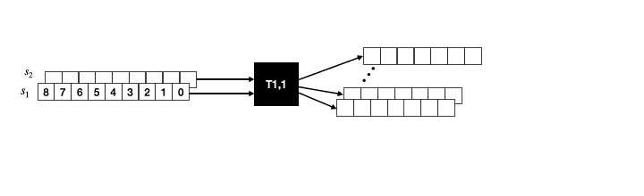

卷积是两个输入通道(每次三个连续数据点)到 128 个输出通道的线性变换。动画中的变换权重和偏差 *W* 和 *b* 是可学习的参数。另请注意，卷积没有任何填充，因此输出的长度比输入的长度少两个，在此过程中为七个。

[*门控线性单元* (GLU)](https://arxiv.org/abs/1612.08083) 为非线性激活功能。到 GLU 的一个通道充当门的控制器，第二个通道充当可以或不可以通过门的数据。严格来说，门是一个二进制的开或闭系统。由于不连续的函数难以优化，门被模拟成一个连续的 sigmoid 函数，𝝈，介于 0 和 1 之间。

因此，GLU 消耗两个长度为 7 的数据通道，并产生一个长度为 7 的通道。动画仅显示了应用于 128 个通道中的两个通道的 GLU。在所有通道都被处理后，64 个通道的数据是任何特定站的结果。

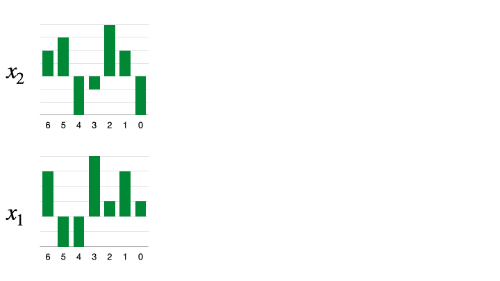

下面的代码片段显示了使用 Pytorch 执行卷积和非线性激活的自定义类的关键部分。省略了关于如何分割和连接数据张量的细节。

对所有 709 个自行车站点应用相同的卷积核集合的这些步骤，并且维度 709x2x9 的输入数据张量变成维度 709x64x7 的输出数据张量。

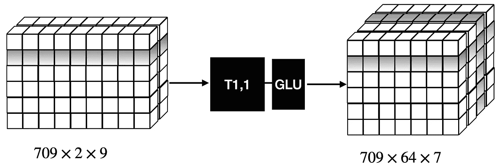

第一遍时间变换的输入和输出张量；灰色阴影框表示图中省略的行和列。

我简要地指出，像这样对时间序列问题建模的更常见的方法是递归神经网络(RNNs)。最近发现一维卷积也表现得很好。

打个比喻来说，一维卷积是为沿着时间维度发现多达 64 个特征而定制的机器，如*急剧增加*、*相反趋势的出发和到达*、*自行车出发从零开始的短暂跳跃*、*急剧减少* —与输入数据流中几个连续点相关的属性。这是留给训练的方法，以了解什么功能是有用的，在最终的预测，但更多关于这一点。

## 第一次穿越空间维度:图形卷积

接下来，时间特征之间的空间关系将被转换成另一组特征。这就是时空特征开始出现的地方，也就是说，空间中特定点之间随时间的变化是相关的。

由于图中可能存在多种局部结构，在所述多种结构上一致地进行卷积的适当方式并不明显。因此，自 2005 年第一种以来，大量不同的图卷积被公式化并发表，所有这些图卷积都有其假定的优点。这里不适合[调查所有选项](https://arxiv.org/abs/2005.03675)或整理它们的逻辑关系。相反，我使用两种类型的图卷积，并集中描述定性和概念性的属性。这两种类型是:

*   来自 2016 年的 [Kipf 和 Welling 的 GCN 方法。](https://arxiv.org/abs/1609.02907)
*   [杜等人的 TAGCN 方法，来自 2018](https://arxiv.org/abs/1710.10370) 。

在进入细节之前，我从图卷积的共享属性开始。

时间卷积之后的输入张量首先被切片，使得仅考虑七个时间维度中的一个。因此，709 个顶点或自行车站的 64 个数据通道构成了输入，请参见下面动画图像中的左侧块。

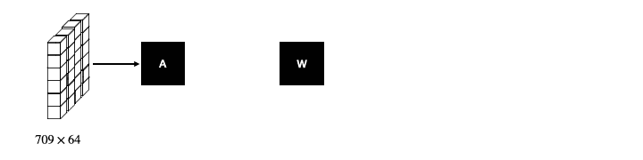

操作 *A* 选择自行车站点的子集*ω1*，并重新称重相应的数据。选择和重新加权由图、其权重和拓扑来控制，这些是邻接矩阵中表示的属性。在前面的部分中，伦敦桑坦德自行车的集群矩阵显示为热图。

重新加权的子集*ω1*用可学习的参数 *W* 进行线性变换。站子集的 64 个数据信道变成 16 个输出数据信道。众所周知的 [*整流线性单元* (ReLU)](https://www.kaggle.com/dansbecker/rectified-linear-units-relu-in-deep-learning) 被用作非线性激活，并且已经获得第一时间维度的第一自行车站的输出向量。

下一个:第二个自行车站，第一个时间维度。进行不同的局部选择和重新加权，*ω2*，而带有可学习参数的线性变换和带有 ReLU 的非线性激活与之前相同。由此获得第二自行车站的时空特征。

不断重复，直到计算并收集了所有自行车站点和所有时间维度的输出。

在图形卷积结束时，获得了 709×16×7 维的张量。它代表了 709 个自行车站点的本地时空特征。如前所述，卷积跟踪的精确特征是那些被证明对预测任务有用的特征，如在方法训练期间所揭示的。

简要说明:我在中描述的步骤顺序并不是它是如何实现的。有许多方法可以评估累积算法并得到相同的输出——实际上是神经网络的优点之一，它使[能够有效地实现](https://www.quora.com/Why-and-how-are-GPUs-so-important-for-Neural-Network-computations-Why-cant-GPU-be-used-to-speed-up-any-other-computation-what-is-special-about-NN-computations-that-make-GPUs-useful)。该描述旨在帮助概念更加清晰，而不是作为实现规范。

下图详细介绍了 Kipf 和 Welling 对伦敦自行车站的选择和重新称重方法。左边的图表显示了七个自行车站点以及站点之间自行车的相对流量。在模型的这一层，每个站有 64 个数据通道。

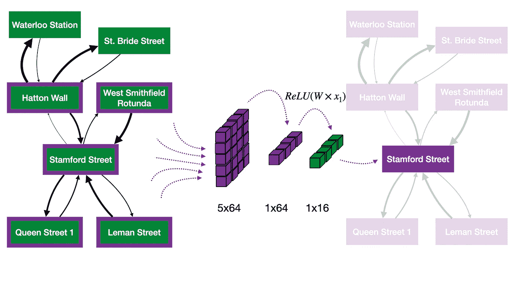

为了获得斯坦福德街站的输出，选择了图中连接到斯坦福德街的其它站。带有紫色粗边框的五个站点定义了该子集。相关数据作为图权重和图拓扑的函数被重新加权并求和。获得 1×64 张量。

重新加权取决于在图中的拓扑中进出斯坦福德街的权重。定性地说，这意味着平衡更强连接和弱连接的站，以及归一化一些站比其他站具有更多的邻居(更高的程度)。这些是图卷积的独特问题。精确的等式需要一个更正式的证明，这可以在链接的文章中找到。

斯坦福德街站输出计算的最后一步是使用可学习的权重将 64 个通道的数据线性转换为 16 个通道的数据。最后，用 ReLU 完成非线性激活。

下图说明了 Hatton Wall bike station 的等效步骤及其在图中的本地环境。

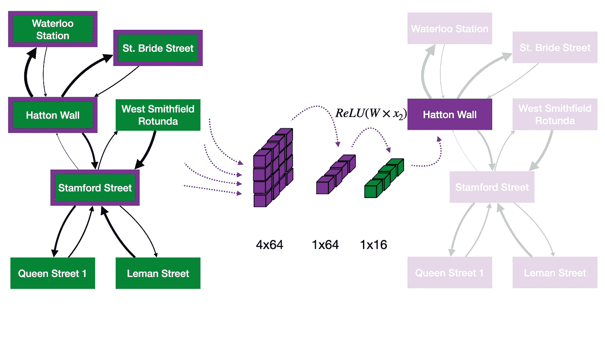

最后，对另一种图形卷积方法 TAGCN 进行了说明。它也为感兴趣的自行车站选择本地环境。然而，该环境不仅包括直接相邻的站。相反，它考虑长度小于或等于上限的站之间的所有路径，我在下面的计算中将上限设置为 2。重新加权基于路径上权重的总和。

查看 TAGCN 的另一种方式就像不同内核大小的两个卷积的聚合——一个是直接邻居，一个是直接邻居的邻居。CNN 中的一个类似物是不同大小的方形核的集合，它已经被用于一些图像识别任务中。

下面的代码片段显示了使用 Pytorch 和 Pytorch Geometric 执行图形卷积和非线性激活的类的关键部分。省略了关于如何分割和连接数据张量的细节。

我将操作 *A* 和 *W* 表示为一个空间操作， *S1* ，我们现在进入模型的更深一层。

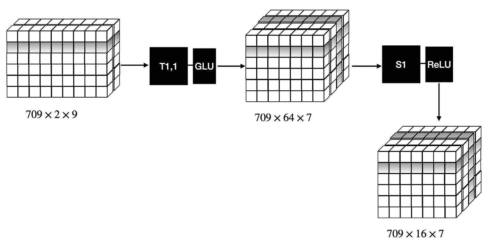

我使用的邻接矩阵是上一节中彩色热图的调整版本。成对的自行车站之间很少有人骑行，有时一年只有一次。相关的重量非常小。稀疏矩阵导致更快的计算，许多微小的权重充其量是空间无信息的，但也有增加噪声的风险。

由于这些原因，将测试重量的两个较低阈值。任何低于 1%或 2%的连接都不予考虑。为了了解稀疏性，邻接矩阵如下所示，1%或以上的权重为黑点，1%以下的权重为空白。

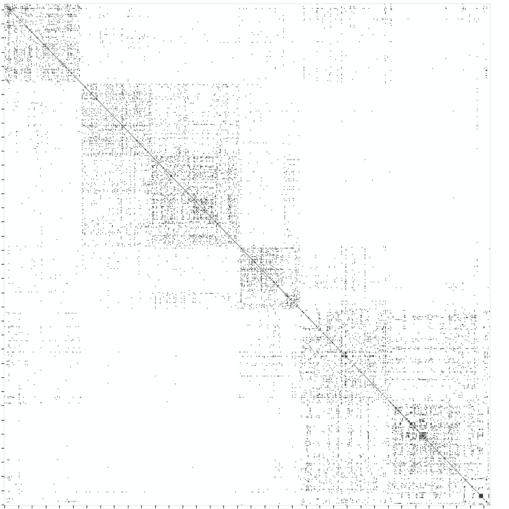

## 沿时间维度的第二遍:1D 卷积

图形卷积和激活之后是时间维度上的另一个一维卷积。操作与第一遍相同。然而，可学习的参数可以不同，并且时间维度的长度是 7，而不是 9。此外，特定站点的每个数据元素不仅包含该站点的过去数据，而且由于图形卷积，数据元素取决于给定站点本地站点的趋势。

到目前为止的图层如下图所示。

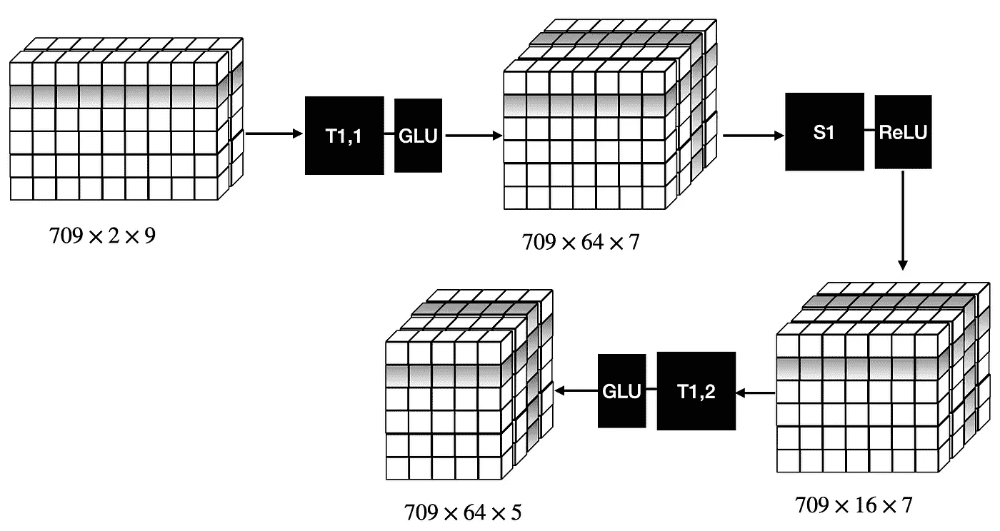

## 标准化数据

具有许多层的神经网络对于优化和训练是具有挑战性的。已经发现某种形式的标准化在这方面有所帮助。这种增强的一个常见原因是，通过归一化操作对网络施加的数值限制消除或回拨了可能通过许多连接层放大的数值问题，其中主要是[协变移位](https://chatbotsmagazine.com/countering-internal-covariate-shift-with-batch-normalization-f79d132a7812)。

接下来增加的是一个[图层归一化](https://arxiv.org/abs/1607.06450)，这里直观描述为。它拟合每个站点和时间维度的参数，以便将 64 个通道中的数据缩放到大约零平均值和单位标准偏差。

适当的 PyTorch 类被初始化

```
layer_norm_1 = torch.nn.LayerNorm([n_spatial_dim, n_temporal_dim - 2 * time_conv_length + 2])
```

其中空间维度是 709，时间维度 9 减去与长度为 3 的核的卷积的影响，即 5。

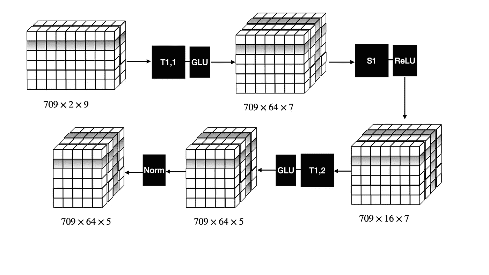

## 所有的，再来一次

接下来的卷积步骤是上述步骤类型的重复。即，每个自行车站点随时间变化的一维卷积、每个时间维度的图形卷积以及另一个一维卷积加图层归一化。可学习的参数不同，但概念相同。

因为随着时间的推移，每个卷积沿时间轴收缩张量，所以卷积后的输出仅由沿时间轴的一个切片组成。

该方法的压缩说明:

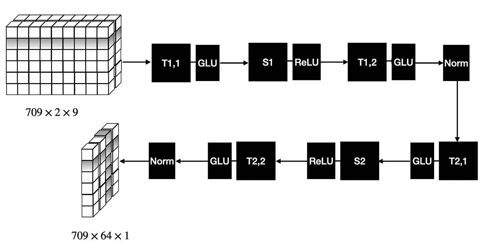

## 从特性到预测

卷积旨在发现和表示有用的时空特征。最后一步是计算回归，该回归基于时空特征预测未来某个时间站点的自行车到达和离开。

神经网络的主力[多层感知器(MLP)](https://medium.com/biaslyai/pytorch-introduction-to-neural-network-feedforward-neural-network-model-e7231cff47cb) 用于此目的。它有一个隐藏层，ReLU 激活，并完全连接。它将卷积序列的输出作为输入，并返回 709 个站点的出发和到达的预测值，换句话说，就是一个 709x2 张量。

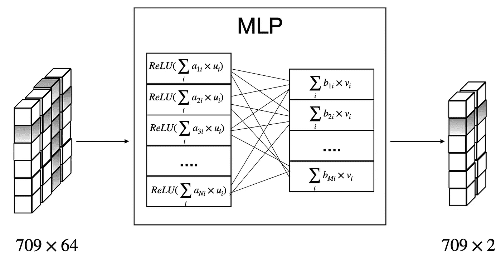

返回值不是整数，而是实数值。在现实世界的问题中，只能有整数的到达和离开。由于这个原因，输出被解释为可能的整数值分布的*集中趋势*(像平均值或模态值)。我没有以其他方式描述这种分布，尽管原则上这是可能的。

从头到尾的模型:

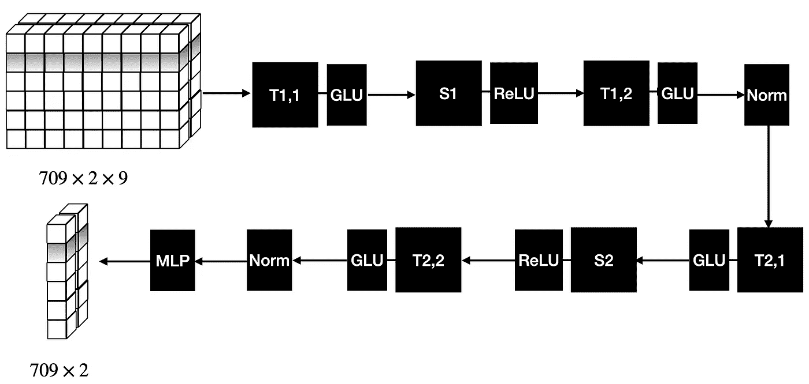

## 定义要训练的回归

将使用的时间间隔是 15 分钟。也就是说，9 个时间输入中的每一个都描述了 709 个自行车站点中每一个站点在 15 分钟间隔内的自行车出发和到达数量。这些是给该方法的已知输入。

我选择的预测目标是比最近的输入超前四步，换句话说，超前一小时。想象一下这样一个场景，我们希望预测某个特定时刻一小时后的自行车流量。

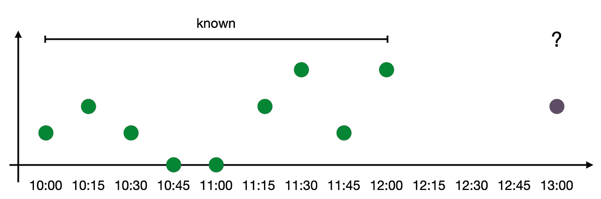

我使用 2017 年的数据作为训练数据。因此，大约有 35，000 个可能的训练数据实例可用。我随机选择其中的 17%用于训练。这意味着训练数据涵盖早上、晚上、工作日、周末、夏天、冬天等。

培训的目标是与 2017 年选定的地面真实数据相比，最小化所有车站的预测自行车到达和离开的均方差。

## 优化和批处理

优化神经网络有大量的艺术和科学，它们的大小意味着一个数学和计算上的棘手问题。然而，我不会深究这些细节。这里有[一个](https://medium.com/@sdoshi579/optimizers-for-training-neural-network-59450d71caf6)或[两个](/neural-network-optimization-7ca72d4db3e0)或[三个](https://ruder.io/optimizing-gradient-descent/)不错的地方可以去看看。我在训练中使用随机梯度下降法。

*批次*是深度神经网络训练中的附加概念。我建议读者去[其他来源](https://machinelearningmastery.com/how-to-control-the-speed-and-stability-of-training-neural-networks-with-gradient-descent-batch-size/)了解这是什么以及为什么这是一种常见的做法。对于图形神经网络来说，实现批处理是很自然的。如 [Pytorch 几何文档](https://pytorch-geometric.readthedocs.io/en/latest/notes/batching.html)中所述，一批，比如说 64 个训练数据点可以被表示为一个具有 64✕709 顶点的图，但是其中 64 个子图是不相交的。因此，对于这种较大的不相交子图连接，大部分计算可以保持原样。

训练可以开始了。培训代码的基本部分如下面的代码片段所示。

上面描述的模型是用定制类 *STGCN* 初始化的，在前面的小节中显示了其中的代码片段。

类 *LondonBikeDataset* 做了大量繁重的工作来解析、切片、格式化和过滤原始数据。正如在处理现实世界的问题时经常发生的那样，这是必须为不一致的数据实践付出代价的混乱部分，在第一百万行附近草率地使用分隔符是一个令人头疼的问题。熊猫图书馆是无价之宝。

我在 GPU 上运行的部分培训可从 [Google Colab](https://colab.research.google.com/notebooks/intro.ipynb) 获得——对于没有免费专业配置的计算机集群的实验者来说，这是一个惊人的资源。

## 六月在斯坦福德街的结果图解

斯坦福街是一个车站，没什么特别的。我用它来说明结果是怎样的——所有测试数据的汇总统计数据将在后面给出。Kipf 和 Welling 的图形卷积方法与邻接矩阵一起使用，对于权重具有 2%的较低阈值。

所有测试数据都选自 2018 年，因此保证不是训练数据的一部分。

在六月的四天中，在斯坦福德街站观察到的自行车到达数据显示为带有细连接线的紫色圆圈。相应的预测数据显示为绿线。

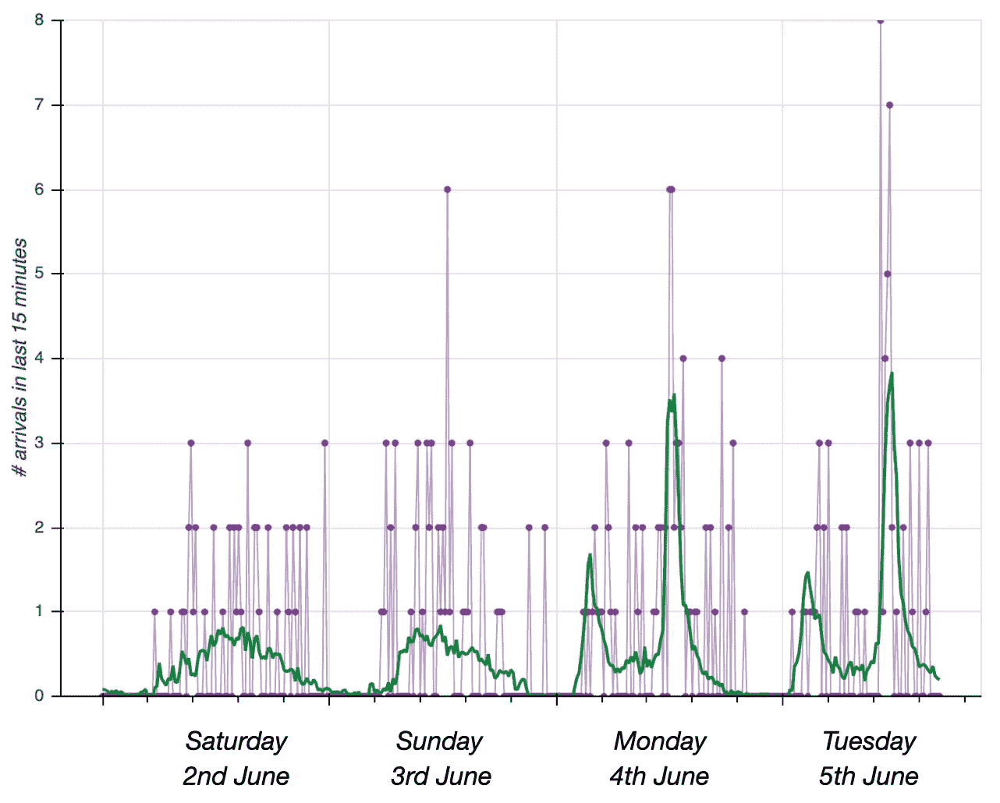

事实上，15 分钟内自行车到达的数量通常很少，在一些情况下为零，这意味着观察到的数据是有噪声的。为什么在一个季度没有到达，而在下一个季度有三个到达，除了偶然之外，通常没有别的原因。在处理小数字时，这个过程的随机性是很明显的。

为了消除噪声，对观测数据计算五窗口滚动平均值。

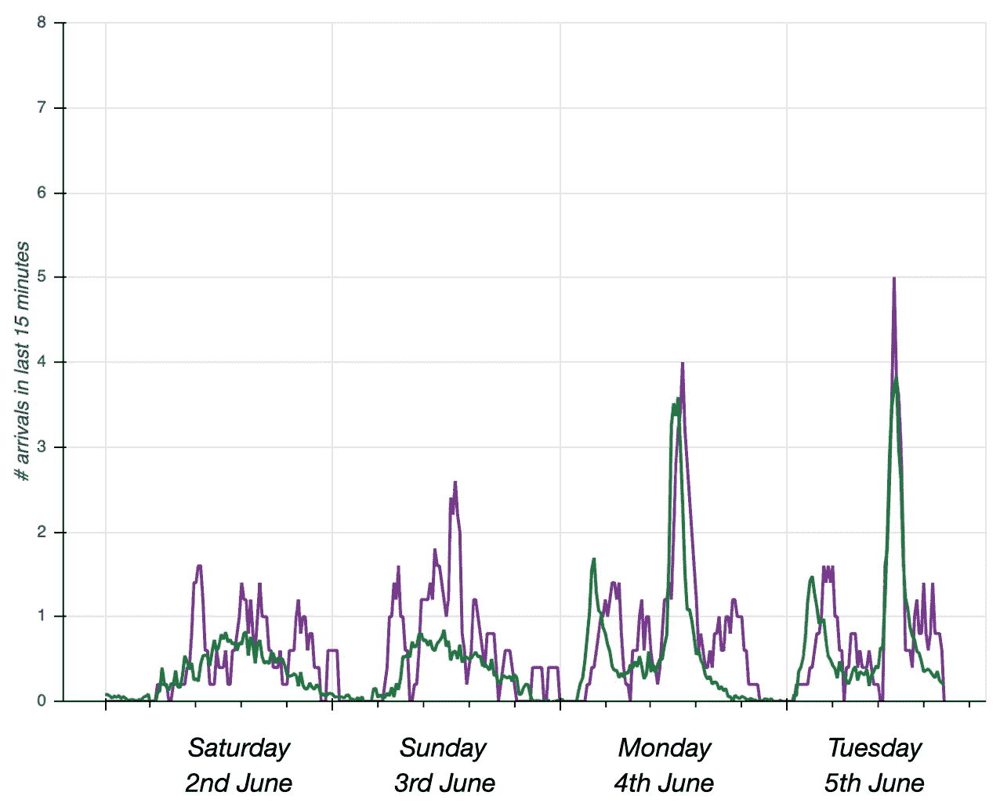

平滑后更容易看出观测值和预测值之间的异同。捕捉到工作日早晚的明显峰值。请注意，该模型并不明确知道它要预测一周中的哪一天。尽管如此，观测值和预测值之间的偏差仍然明显存在。

## 海德公园和隐藏的天气参数

海德公园角是另一个车站——这是*不一般的*，它是最繁忙的车站之一，尤其是在周末。由于天气原因，该站在周末之间变化很大。显示了 2018 年 9 月四个周日的平滑观测(紫色)和预测(绿色)数据。

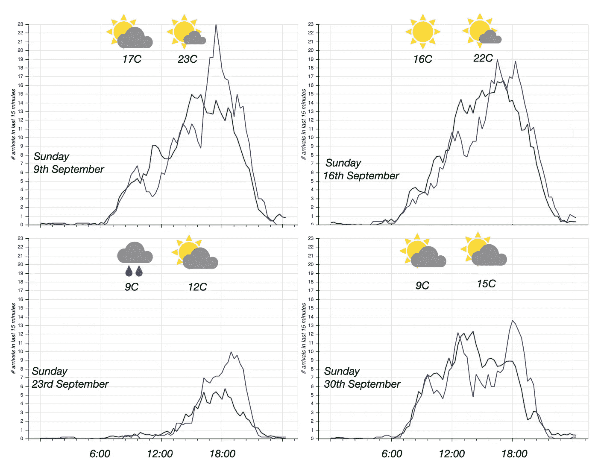

该模型没有明确说明对天气的依赖性。但由于一种持续的模式，在训练中间接学到了一些天气的结果。9 月 23 日早上下雨的事实必须在输入数据的某个地方表现出来，这样 9:00 左右租金的通常增长就不是预测的一部分。

这说明，仅仅因为该模型没有直接考虑星期几、天气、季节或一大堆其他因素，而这些因素直觉上应该影响伦敦人在公园里兜风的胃口，但所述因素的累积影响在某种程度上仍然由该模型处理。

## 空间卷积有用吗？

简而言之:有一点，但没那么多。

为了进行公平的比较，我运行了上面模型的一个版本，其中邻接矩阵的所有非对角线元素都设置为零。因此，在卷积步骤期间，图中顶点之间的时间特征不会混合。

我比较了这种纯时间模型的均方误差(到达 0.657，离开 0.683)和一些具有图形卷积的变量(Kipf 和 Welling 具有 1%和 2%的阈值，TAGCN 具有相同的阈值)。相对而言，图卷积模型的均方误差始终低 2%-6%。这两种图形卷积的表现大致相同，对到达的预测比离开的好一些。

一个额外的复杂因素是少数电视台有更多的租赁活动。因此，适度减少的误差主要来自这几个台站的变化。我称之为复杂性，而不是缺陷，因为这是对还是错取决于应用程序的最终目标是什么。也许高流量站才是我们关心的？

我还训练了一个具有邻接矩阵的模型，该矩阵将所有权重替换为相同的值(1.0)，假设它们高于 1%阈值。称之为对问题结构信息的有意破坏。均方误差远高于纯时间模型。这个测试表明，对问题结构的糟糕描述会使结果变得更糟。简单就是错的时候少错。

## 更好的图形清晰度？

结果表明，平均而言，图卷积对伦敦城市交通的预测帮助不大。有很多模型元参数的其他变化可供尝试。

不过，我想知道，一刀切的邻接矩阵是否对精确度设置了更严格的限制？周末和工作日是桑坦德自行车最明显的不同使用时段。因此，从非欧几里德图的角度来看，在工作日靠近的两个站在周末可能不那么靠近。问题的结构本身是动态的，并且依赖于全局变量，因此平均结构有其作为归纳偏差的基本限制。

因此，也许可以扩展架构，使用不同的邻接矩阵并行包含两个(或更多)图卷积？或者为周末和工作日，或者中午之前和中午之后，或者晴天和雨天训练完全不同的模型？

为了更深入地挖掘，在给定这种类型的输入数据流的情况下，任何方法所能预测的内容肯定是有限的。桑坦德自行车骑行的图表是高度分支的。因此，在没有附加信息的情况下，在一个车站的已知的发车增加在大量可能的终点车站上被抹杀。伦敦自行车共享是高熵的。这不是一条道路分布狭窄的高速公路。为了提高精度，需要其他类型的输入数据流。

解决这个问题需要更多的工作、灵感、数据挖掘、数据争论和宝贵的 GPU 时间。这些山不是今天就能爬上去的，而是留给未来的探索和实践——任何一个好的知识获取项目都应该得出这样的结论。

这有用或有趣吗？或者仅仅是值得鼓励？亲切的鼓掌。

## 脚注

*   总共约 800 个站点中包括 709 个站点。排除集包括在至少一周的时间段内总共停止运行至少四周的台站，其中包括退役台站。
*   少数租赁活动持续时间非常长，或者从未结束。他们被排除在考虑之外。
*   训练误差非常接近测试误差，表明在 2017 年和 2018 年之间没有发生过拟合，也没有发生明显的概念漂移。
*   不同模型的测试误差是在 2018 年数据的相同 17%样本上计算的。