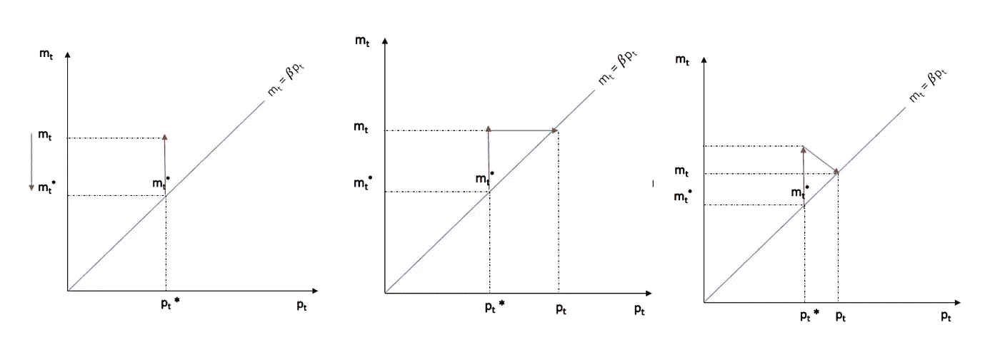
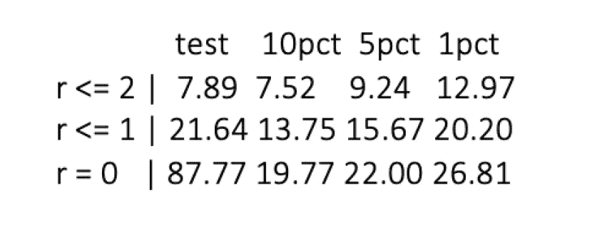

# 长期联系:Johansen 协整方法简介

> 原文：<https://towardsdatascience.com/long-run-linkages-a-briefer-on-the-johansen-cointegration-methodology-6744ee253012?source=collection_archive---------28----------------------->

## 经济变量能有长期关系吗？是啊！



## 协整背后的动机

在经济学中，有许多变量一开始看起来可能是非平稳的，但是当这些非平稳序列进行线性组合时，该线性组合可以被描述为平稳的。虽然大多数经济学家认为协整是某种深层的理论建构，但其定义实际上是本文的第一句话。理论上，它不需要任何形式的理论来推动。然而，经济学家认为，一些潜在的长期趋势或稳定状态可能会拉动这些变量一起运动。就像一个人在公园遛狗，脖子上拴着皮带，即使狗被长凳左手边的大花或另一只在角落里吠叫的狗分散了注意力，他们也会一起移动。

## 约翰森的方法论

在计量经济学领域，最流行的方法是基于 Soren Johansen 的协整检验。

Johansen 的方法是基于这样一种想法，即估计的秩给了我们关于 pi 是否存在协整以及这些协整关系的数量的信息。根据定义，π的秩是这个矩阵中独立向量的最大数量。如果我们有三个内生变量，我们只能有三个独立的向量，不能再多了。等级可以是零或至多三或该范围内的任何值。也就是说，秩不能超过系统中内生变量的个数。

如果 pi 的秩等于零，那么就说不存在协整。这意味着 pi = 0，你可以在等式中看到这一点。如果你把它代入方程，那么所有的误差修正项都将消失，因此系统将崩溃为一个简单的变量差。如果的秩等于我们称为满秩的内生变量的数量，那么它表明所有变量都是 I(0)或者变量都是平稳的。所以在这种情况下，我们不能谈论非平稳变量之间的协整，因为变量已经是平稳的。因此，您可以在不同的级别上运行 VAR。如果的秩严格介于零和内生变量数之间，0

约翰森方法中有两种类型的测试。第一个是每个秩 r 的跟踪统计量。在我们的模型中有三个内生变量，r 是 0、1 或 2。第二个是每个秩 r 的最大特征值统计。零假设是秩等于秩(pi)而另一个假设是秩是秩(pi) + 1。

## R 中的示例

是时候为 r 中的协同集成提供一个实际的示例测试了。为此，我们需要使用“urca”包，其中包含 ca.jo 命令来实现测试。首先，我们加载所需的包，并使用 read_csv()命令加载数据集“VECM_LectureNotes.csv”。数据集和代码可以在这里找到:[https://drive . Google . com/drive/folders/1 qhuws 83 gauovnxnoi-OZ6-shmtwo 8 MDB？usp =共享](https://drive.google.com/drive/folders/1QHUwS83GAUOVnxnoi-OZ6-shmTwo8mdB?usp=sharing)

```
library(urca)
library(forecast)
library(tidyverse)data <- read_csv(file.choose())head(data)
```

然后，我们使用 ts()命令声明我们的时间序列变量。我们注意到这个系列从 2001 年的 Q1 开始，一直到 2020 年的 Q1。这显然是季度数据，因此我们将频率设置为四次。

```
GDP <- ts(data$lnGDP, start = c(2003,1,31), frequency = 4)
CPI <- ts(data$lnCPI, start = c(2003,1,31), frequency = 4)
M3 <- ts(data$lnM3, start = c(2003,1,31), frequency = 4)
```

在将系列声明为 ts 对象后，我们需要将变量绑定到一个单一系统中。为此，我们使用 cbind()命令。我们把这个系统存储到一个对象中，在这个例子中是数据集

```
dset <- cbind(GDP,CPI,M3)
```

之后，我们需要选择最佳的滞后阶数。现在回想一下，在 VECM(或协整假设)中，使用的最佳滞后阶数是 p -1。为了确定最佳的滞后数量，我们使用 VARselect()命令。

```
lagselect <- VARselect(dset, lag.max = 7, type = "const")
lagselect$selection
```

由于汉南奎因和最终预测误差中出现了 5，我们选择使用 4 滞后。鉴于数据的频率是每季度一次，预计会有 4 次滞后。现在我们已经完成了滞后选择，我们可以继续指定测试。正如我们提到的，约翰森测试有两种变体。这些是最大特征值和跟踪统计方法。方便的是，ca.jo()命令允许我们轻松地指定这些。

我们从跟踪统计方法开始。同样，ca.jo()命令请求在我们的系统(dset)上使用 Johansen 协集成方法。在这种情况下，我们使用指定为类型的“跟踪”统计方法。接下来，我们指定我们的规范有一个常量(ecdet = "const ")，并且我们使用 4 个滞后。

```
ctest1t <- ca.jo(dset, type = "trace", ecdet = "const", K = 4)
summary(ctest1t)
```

如果您正确运行了测试，您应该会看到下表。



Johansen 协整检验结果

在表中，您应该看到 4 列。test 列包含测试统计信息，而其他三列包含 10%、5%和 1%级别的临界值。在这种情况下，作为标准做法，我们通常使用 5%的临界值作为参考。表中的 r 代表等级，我们知道这是协整关系数量的某种指示。当 r = 0 时，测试统计值 87.77 > 22。这意味着我们拒绝了 r > 0 的零假设。因此，存在一些协整关系。当 r <1, 21.64 > 15.67。这再次意味着我们拒绝了 r > 1 的零假设。最后，当 r < 2 时，我们不能拒绝零假设，因为 7.89 < 9.24。因此，我们得出结论，最多存在 2 个协整关系。

我们也可以使用下面的命令，使用最大特征值变量来运行测试。

```
ctest1e <- ca.jo(dset, type = "eigen", ecdet = "const", K = 4)
summary(ctest1e)
```

正如我们所看到的，我们得到了与跟踪方法相似的结果。总的来说，我们可以得出结论，至少存在两种协整关系。到现在为止，你应该已经把这两个关系联系起来了，这两个关系可能是价格和货币供应量，以及价格和 GDP。一旦我们正式估算了 VECM，我们将在后面讨论这个问题。

为了更好的解释，请查看下面我的 YouTube 视频链接。

# 参考

[1]布鲁克斯，C. *金融计量经济学导论*。(2019)剑桥大学出版社。

[2]汉密尔顿，j .时间序列计量经济学。(1994) *普林斯顿大学出版社，普林斯顿*。