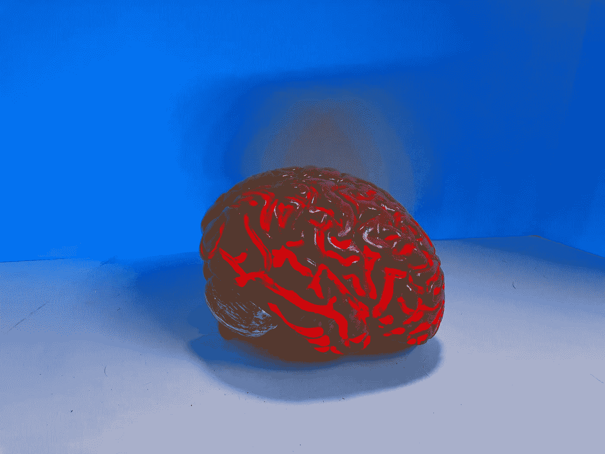

# Keras 的长短期记忆(LSTM)

> 原文：<https://towardsdatascience.com/long-short-term-memory-lstm-in-keras-2b5749e953ac?source=collection_archive---------13----------------------->

## 在这篇文章中，你将学习如何在 Keras 建立一个 LSTM 网络。在这里，我将解释所有的小细节，这将有助于您立即开始使用 LSTMs。

娜塔莎·康奈尔在 Unsplash 上拍摄的照片

在本文中，我们将首先关注单向和双向 LSTMs。我将解释从为训练准备数据到定义 LSTM 模型的所有步骤。在本文中，我将只解释顺序模型。在本文中，我将使用 LSTMs 对亚马逊美食评论进行情感分析。所以让我们开始吧。

## **矢量化和输入格式:**

在本节中，您将学习如何对数据进行矢量化，并将其作为输入传递给架构。我将举一个例子，这样你就能学会根据你的数据集给出输入。在这里，我将使用亚马逊评论数据集来展示如何向量化您的数据。您可以在此 下载 [**的数据集。**](https://www.kaggle.com/snap/amazon-fine-food-reviews)

在继续之前，首先让我们看看数据，并做一些数据清理。首先，我们将加载。csv 文件使用熊猫图书馆。我们将把那些评级不等于 3 星的评论视为 3 星评级的评论是中性的。下面是做同样事情的代码。

过滤掉中立评论的代码。

现在，我们将通过删除 HTML 标签、停用词和重复项来进行标准的数据预处理。你可以在这里看到细节。清理数据集后，我们将有两列。一个包含评论，另一个包含标签 1 或 0。1 表示正面评价，0 表示负面评价。

现在下一步是对数据进行矢量化。我们将使用 Keras 模块的 tokenizer 类对数据进行矢量化。这将为每个唯一的单词分配一个整数。所以现在每个单词都将由一个整数来标识。下面是具体实现这一点的代码。

向量化文本数据的代码。

每个单词都应该用一个向量来表示，以便模型能够理解它们。有两种方法:一种是使用预先训练的单词嵌入，如 word2vec 和 glove，另一种是为数据集训练自己的单词嵌入。在训练我们的深度学习模型时，我们可以通过使用 Keras 模块的嵌入层来实现这一点。嵌入层采用词汇量、词向量维数和每次评论的输入长度。这里我们将维度保持为 32。那么在训练完成后，每个单词将由长度为 32 的向量表示。我们已经将评论的最大长度固定为 150。下面是定义嵌入层的代码。

定义嵌入层。

你可以看到嵌入层是模型的第一层。我们必须指定以下三个参数。

1.  **vocab size** :这是训练集中唯一单词的数量。如果字被编码为从 0 到 100，那么 vocab 的大小将是 101。
2.  **输出维度**:这是训练集中每个单词将被编码的维度。可以选择任意维度。例:8、32、100 等。这里我们选择了 32 个。
3.  **输入长度**:输入序列的长度。如果你的数据的所有输入序列都是 100，那么这个值将是 100。对于我们的例子，我们选择了 150。

## 模型架构:

在本节中，我们将定义模型。在我们的建筑中，我们将使用两层 LSTM，每层 128 个单元，一个堆叠在另一个上。普通 LSTM 比 CuDNNLSTM 慢 3 到 4 倍。因此，如果你是在 GPU 上训练，那么使用 CuDNNLSTM 训练。你会发现训练速度会神奇地提高 3 到 4 倍。下面是定义架构的代码。

定义模型的代码。

如果要使用 LSTM 的堆叠图层，请在将输入传递到下一个 LSTM 图层之前使用 return_sequences=True。对于最后一个 LSTM 层，不需要使用 return_sequences=True。您可以更改使用的单位数。这里我们用了 128，你可以用适合你的情况。您可以改变这些值并保持最佳值。你也可以尝试其他激活功能，看看哪五个性能最好，然后你可以选择最好的一个。你也可以尝试堆叠更多的层，并检查是否有所改善。

## 模型培训:

在本节中，我们将训练上面定义的模型。我们可以使用“模型.拟合”方法来训练模型。这需要以下参数:

1.  **x_train** :这是用于训练的矢量化数据。在这里，我们对评论进行了矢量化，并将其存储在 x_train 中。
2.  y_train :它包含了被矢量化的评论的标签。
3.  **batch_size** :这是模型看到的数据点的数量，之后模型将更新权重。不要保持这么低，因为训练时间会增加。尝试一堆值，找到最适合你的情况的值。这里我们取批量= 1024。
4.  **时期**:在训练结束之前，模型将在训练期间看到数据的次数。
5.  **validation_split** :这是在训练过程中将进行验证的数据的百分比。
6.  **回调**:这些是在训练过程中调用的函数，用来监控模型在训练过程中的状态。训练时，我们不知道什么时候停止，因为模型只会在达到提到的次数后停止。有时，模型可能会在这些次数之前达到最优，但它仍然继续训练并过度拟合。为了防止这种情况，我们将使用回调来监控训练期间模型的丢失。如果损失在一些时期内没有减少，那么我们停止模型的训练。对于这种情况，我们已经决定，如果损失在 4 个时期后仍未减少，那么我们将停止。

下面的代码做了上面提到的事情。

开始训练的代码。

使用这种架构，我们在测试数据集上获得了 83%的准确率。使用双向 lstm 代替单向 lstm 给了我们 92%的准确率。下面是使用双向 LSTMs 的代码。

双向 LSTM 模型代码。

现在的问题是使用双向 LSTMs 背后的直觉是什么。在单向 LSTM 中，我们通过查看单词左边的单词来对单词进行编码。在双向 LSTM 中，我们通过查看单词左侧和右侧的单词来对单词进行编码。很明显，如果我们也观察单词的左右两边，我们可以更好地对单词进行编码。对吗？

我们可以从已经取得的结果中看到这一点。使用双向模型将我们模型的准确率从 83%提高到 92%，这是一个显著的飞跃。

我希望这将有助于您开始使用 LSTMs。我将提供 jupyter 笔记本的链接以供进一步参考。可以在这里 查看笔记本 [**。**](https://github.com/riteshranjan110/MediumBlogsCode/blob/master/LSTMblog1.ipynb)

如果你有任何疑问，请告诉我。

参考资料:

1.  [https://keras.io/getting-started/sequential-model-guide/](https://keras.io/getting-started/sequential-model-guide/)
2.  [http://www.bioinf.jku.at/publications/older/2604.pdf](http://www.bioinf.jku.at/publications/older/2604.pdf)
3.  [https://keras.io/callbacks/](https://keras.io/callbacks/)
4.  [https://keras.io/layers/recurrent/](https://keras.io/layers/recurrent/)