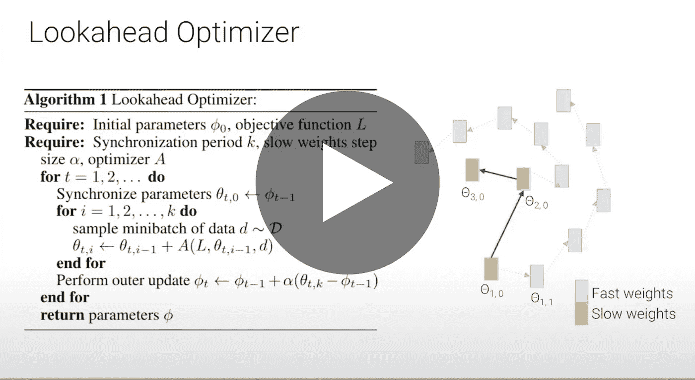

# 前瞻优化器:向前 k 步，向后 1 步

> 原文：<https://towardsdatascience.com/lookahead-optimizer-k-steps-forward-1-step-back-b18ffbae1bdd?source=collection_archive---------66----------------------->

## [活动讲座](https://towardsdatascience.com/event-talks/home)

## 迈克尔·张| TMLS2019

[在多伦多机器学习峰会上的演讲](https://torontomachinelearning.com/)

## 关于演讲者

Michael Zhang 是多伦多大学和 Vector Institute 的博士生，导师是 Jimmy Ba。他目前的研究重点是优化和深度学习。他之前在加州大学伯克利分校，在 Pieter Abbeel 的小组中从事强化学习和机器人方面的研究。

## 关于谈话

绝大多数成功的深度神经网络是使用随机梯度下降(SGD)算法的变体来训练的。最近改进 SGD 的尝试可以大致分为两类:(1)自适应学习速率方案，如 AdaGrad 和 Adam，以及(2)加速方案，如重球和内斯特罗夫动量。在本文中，我们提出了一种新的优化算法，Lookahead，它与以前的方法正交，并迭代更新两组权重。直观地说，该算法通过预测由另一个优化器生成的“快速权重”序列来选择搜索方向。我将讨论如何分析神经网络算法，并展示前视提高了学习稳定性，降低了内部优化器的方差，而计算和内存开销可以忽略不计。然后，我将展示经验结果，证明前瞻可以显著提高 SGD 和 Adam 的性能，即使在 ImageNet、CIFAR-10/100、神经机器翻译和 Penn Treebank 上使用它们的默认超参数设置。

[前瞻优化器:前进 k 步，后退 1 步](https://www.youtube.com/watch?v=TxGxiDK0Ccc) | Michael Zhang