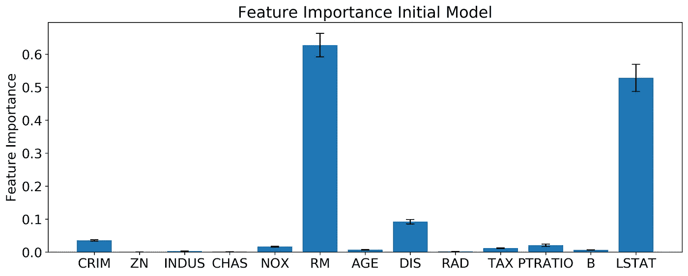
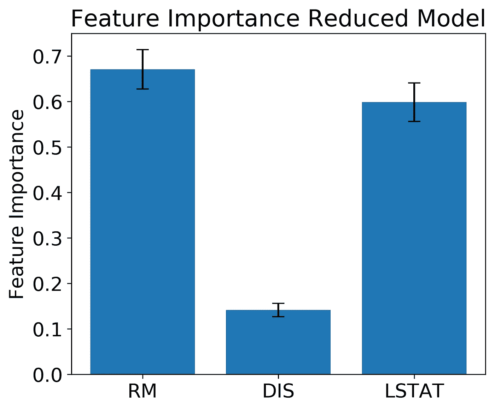
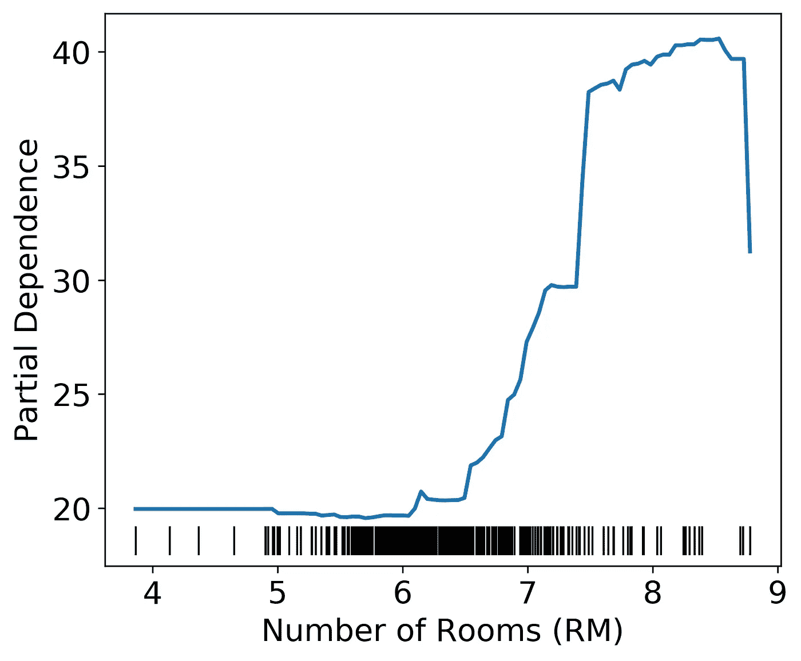
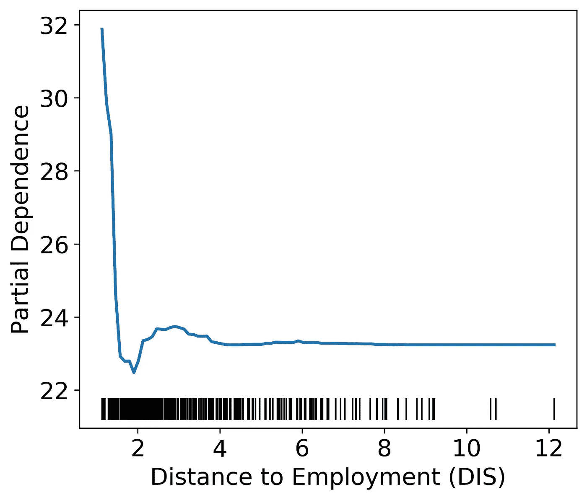
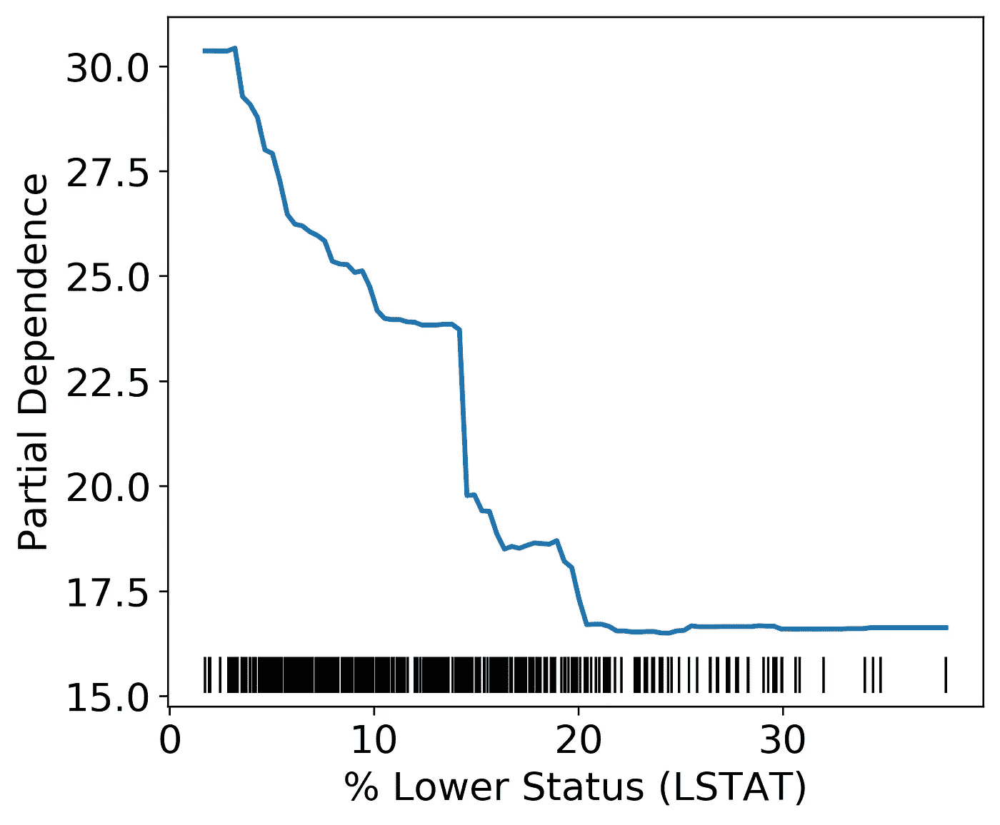
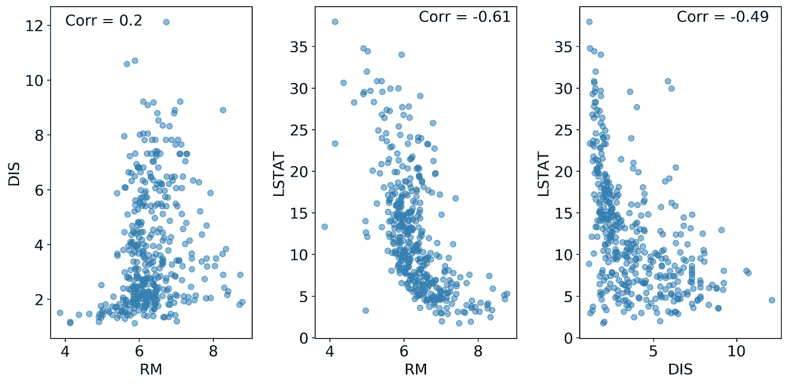
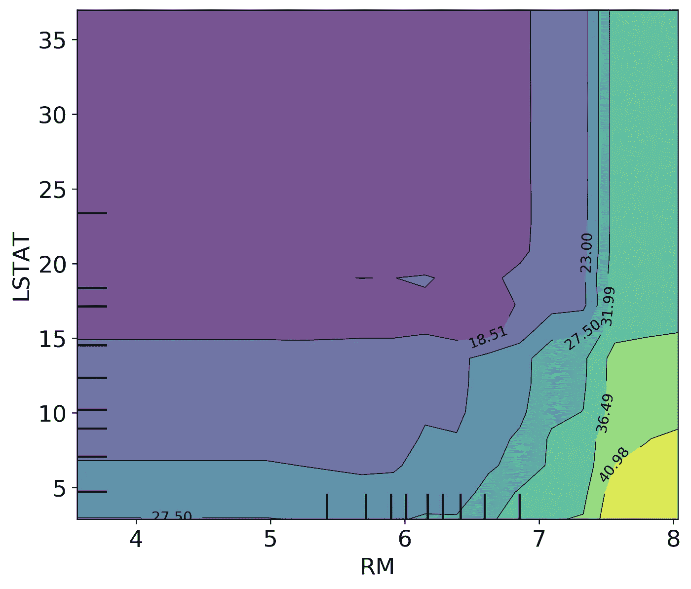
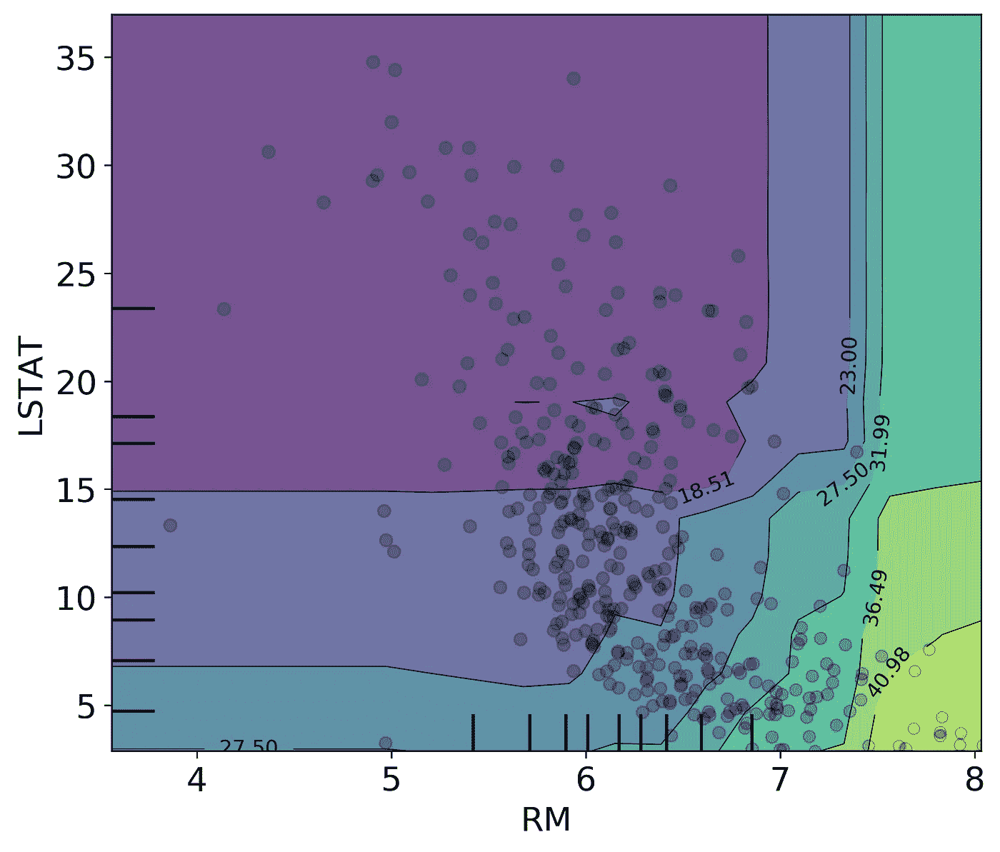

# 超越特性的重要性

> 原文：<https://towardsdatascience.com/looking-beyond-feature-importance-37d2807aaaa7?source=collection_archive---------22----------------------->

## 如何在 Python 中使用部分依赖图

约翰·塔在 [Unsplash](https://unsplash.com/) 上拍摄的照片

[许多](https://machinelearningmastery.com/calculate-feature-importance-with-python/) [文章](https://datawhatnow.com/feature-importance/) [讨论](/explaining-feature-importance-by-example-of-a-random-forest-d9166011959e)如何使用特征重要性来选择特征和分析你的机器学习模型。当您选择了您的重要特征并重新运行您的模型时会发生什么？特征重要性对于理解**是什么**在驱动我们的模型非常有用，但是它没有告诉我们**那个特征**如何与模型预测相关。本文介绍了如何超越要素重要性，并使用绘图方法来更深入地了解模型中的要素是如何驱动模型预测的。

# 特征重要性

在我们讨论特性重要性之前，我们需要定义特性重要性，并讨论何时使用它。

在最高级别上，要素重要性是对特定预测变量(要素)对模型预测准确性的影响程度的度量。您可以使用特征重要性来修剪模型，并通过删除低性能特征来减少过度拟合。

如果您使用 scikit-learn (sklearn)，计算特性重要性的默认方法取决于您正在构建的模型的类型。例如，我将在本文中使用随机森林回归模型。sklearn 对随机森林模型的默认特征重要性是通过[归一化每个特征通过分割该特征的“杂质减少”帮助预测的样本分数](https://scikit-learn.org/stable/modules/ensemble.html#feature-importance-evaluation)来计算的。然而，要获得线性模型(线性回归、逻辑回归)的特征重要性，您可以查看由特征的标准偏差缩放的参数系数值。

就个人而言，我更喜欢特性重要性的模型不可知方法。默认的 sklearn 随机森林特性重要性对我来说很难掌握，所以我使用了一种排列重要性方法。Sklearn 实现了一种排列重要性[方法](https://scikit-learn.org/stable/modules/generated/sklearn.inspection.permutation_importance.html)，其中通过随机排列每个特征中的数据并计算相对于基线的 MSE(或您选择的分数)的平均差异来确定特征的重要性。这种类型的特征重要性具有更大的计算负荷，但是可以跨不同类型的模型来完成，这对于标准化您的建模方法是很好的。

通常，一旦我们找到了一个合理的特征集，可以准确预测我们的响应变量，我们就可以停下来。然而，有时深入了解我们的模型和系统如何工作是有用的。为此，我们需要一个单独的方法来提取特性和响应变量之间的关系。

现在的问题是，我们将何去何从？

# **部分依赖情节:下一代**

你可以从我之前的[文章](/how-to-analyze-stratified-random-sampled-data-e3933199ae74)中看出，我非常喜欢使用图表和可视化来理解数据中的关系。在大多数情况下，目视检查方法适用于各种数据分布和方法。对于机器学习，确定特征与响应变量的关系的最直接的方法之一是使用部分相关图(PDP)。

构建 PDP 非常直观:

1.  选择您感兴趣的功能(FOI)
2.  对于连续 foi:
    -为分类 FOIs 创建一个从特征
    的最小值到最大值的序列:
    -为分类特征中的每个级别(n-1)创建一个虚拟变量
3.  用序列中的值替换 FOI 中的每个值。
4.  从这个新的特征集中获取预测，并对所有预测进行平均。将平均值存储在向量中。
5.  对特征序列中的每个值重复步骤 3 和 4
6.  根据特征序列本身绘制平均预测

这个算法有[数学](https://christophm.github.io/interpretable-ml-book/pdp.html)描述。本质上，这个算法显示了我们的 FOI 对模型预测的边际效应。

在本文的其余部分，我将向您展示如何构建 PDP 以及如何解释它们。我将向你展示如何使用 sklearn 创建这些情节，以及如何自己直接构造这些情节。最后，我将讨论使用 PDP 时需要注意的潜在缺陷以及如何解决这些问题。

# 一维部分相关图

## **读入并分割数据**

对于这个分析，我将使用 scikit-learn 包中的波士顿住房数据集进行随机森林回归。

波士顿住房数据集中有 13 个特征，你可以在[这里](https://scikit-learn.org/stable/datasets/index.html#boston-dataset)了解它们。在我们做了一些初步的特性选择后，我将分解更重要的特性代表什么。该数据集中的目标变量是“以 1000 美元为单位的自有住房的中值”。所以本质上，这里的任务是根据一组特征来预测房价。

## **建造初始模型**

读入数据后，我创建了一个随机森林回归。我选择了最大树深度和给出良好模型性能的估计器数量，并且没有进行任何超参数调整。

一旦我创建了模型，我就提取了特征的重要性。上面的要点显示了如何用两种不同的方法来实现这一点，或者是默认的。来自 sklearn 的 feature_importances_ method 或使用 sklearn 中的 permutation_importance 函数。我在下面绘制了 permutation_importance 函数的结果。

条形的高度表示平均特征重要性，误差条形是每个特征平均值的一个标准偏差。

根据置换特性的重要性，RM、DIS 和 LSTAT 特性比其他特性几乎高出一个数量级！置换特征重要性也给我们一个特征重要性方差的估计。根据对误差线的快速查看，RM 和 LSTAT 可能对最终模型有统计上不可区分的影响，DIS 显然是第二重要的。这些特征代表什么？

*   RM:每个住宅的平均房间数
*   DIS:到五个波士顿就业中心的加权距离
*   LSTAT: %人口的较低地位

请记住，仅凭特征重要性，我们无法了解这些特征与我们的响应变量(中值住房价值)之间的关系。你可能会对这些关系的未来做出一些有根据的猜测。

## **用 reduce 特征集构建模型**

现在，让我们用一组性能最好的特性来重做这个模型。

对于我们的分析，简化模型预测测试集足够好，测试集上的 R 为 0.82。我还在上面的代码片段中包含了从训练集和测试集中获取 MSE 的代码，以了解该模型中过度拟合有多糟糕。

如果您在这里检查特性的重要性，您会看到一个类似的模式，RM 最高，LSTAT 次之，DIS 最低。同样，RM 和 LSTAT 的特征重要性的差异看起来好像这两个特征的影响在统计上并不明显。

条形的高度表示平均特征重要性，误差条形是每个特征平均值的一个标准偏差。

## **构建部分相关图**

Sklearn 有一个快速的脏函数，它会为您绘制所有的特征，或者您可以执行 run a 函数，只获取部分依赖项而不绘制它们。在下面的代码片段中，我既有 sklearn 方法，也有一个 quick 函数，它说明了幕后发生的事情。

关于 sklearn 函数有两点需要注意。sklearn 函数中的默认网格从数据的 5%到 95%边界，我在绘图中使用了完整的数据范围。此外，如果您正在构建许多功能的 PDP，plot _ partial _ dependence 函数允许您使用“n_jobs”参数并行进行计算。

让我们看看我们的部分依赖模式在我们的模型中是什么样子的。每个图都有一条代表部分相关性的线(当所有特征值都设置为一个值时模型的平均响应)和一个沿着底部的[凹凸图](https://en.wikipedia.org/wiki/Rug_plot)。

随着家中房间数量的增加，预测的家庭价值会增加，直到某一点，然后开始减少。一般来说，随着房间数量的增加，房屋价值也会增加。但是，有了 PDP，我们可以更进一步了解这一点。有趣的是，对房间数量的反应是相当非线性的，当超过 6 个房间时，房屋价值迅速增加。我们可以推测这种情况发生的一些原因，也许超过 7 个房间的房子有其他豪华的住宿设施(也许有一个大厨房？).我还想指出的是，我们需要小心解读这个图表的右边。观察到的中值住宅值的降低发生在非常大的值上，这些值在训练集中不经常出现。

到波士顿就业中心的距离只在距离很近的情况下对房屋价值有影响。再次，我们可以推测原因。对这种模式的一种可能的解释是，只有当员工可以步行、骑自行车或乘坐公共交通工具去工作场所时，靠近就业中心才是有价值的。在很短的距离之外，汽车可以让所有的距离都同样吸引人。换句话说，在更高的距离上缺乏关系可能是由于其他因素淹没了距离对价格的任何影响。

随着较低地位百分比的增加，住房价值下降，直到达到 20%左右。这种效应可能表明波士顿房地产市场已经触底，在其他因素的作用下，房地产价格不太可能下降超过某个值。

# **多维部分相关图**

到目前为止，我们已经分别研究了每个特性的部分相关性。我们也可以使用上述相同的算法来构建部分相关的二维图。二维图将允许我们研究变量组合如何影响模型输出。

一维 PDP 假定特征之间是独立的；因此，相关的特征可能导致 PDP 中的伪图案。如果两个特征相关，那么我们可以在我们的 PDP 算法中创建非常不可能的数据点。看看下面的情节。您可以看到，RM 和 LSTAT 特征与-0.61 的[皮尔逊相关系数](https://en.wikipedia.org/wiki/Pearson_correlation_coefficient)呈负相关。这将如何影响我们的 PDP？

让我们以 FOI 的 RM 特性为例。当我们构建 RM PDP 时，我们用 min(RM)和 max(RM)之间的序列中的值替换 RM 的每个值。在 LSTAT 的高值时，没有观察到 RM 的高值，这意味着随着我们在 RM 序列中的进展，我们最终将创建 RM 和 LSTAT 的组合，这些组合对于特征集来说是不符合逻辑的，从而对我们的训练数据中没有出现的值进行预测。[这本书的第](https://christophm.github.io/interpretable-ml-book/pdp.html#disadvantages-5)部分以身高和体重的相关性为例，清楚地解释了这个问题。简而言之，你不会期望一个 6 英尺高的人有 50 磅重，但是 PDP 算法没有做出这样的区分。

我们怎样才能解决这个问题呢？在这种情况下，您可以使用二维 PDP 图，只检查与相关性重叠的值。下面是使用 sci kit-learn plot _ partial _ dependency()函数构建的 LSTAT 和 RM 的 2D PDP 图。如果我们不批判性地思考我们的数据，我们可以假设 RM 比 LSTAT 有更大的影响，如图表右侧所示。

等高线描绘了预测中值家庭价值分布的中断。暖色对应着较高的中值房价。

然而，如果我们覆盖 LSTAT 和 RM 数据点之间的散布，我们可以看到，在我们的训练集中，图的右手侧的接近垂直的等高线没有被表示。在高 RM 和高 LSTAT 没有数据点。我们应该只考虑与数据点重叠部分的模型部分响应。从这里，我们可以确定，当房间数量增加时，当较低地位人口的百分比下降时，住房价格增加，非线性模式仍然表现良好。如果您有兴趣更正式地执行此操作，您可以解包 plot _ partial _ dependence 函数的输出，并且只绘制出现在二维特征分布的 95%范围内的值。

# **部分依赖陷阱**

PDP 很难在非常大的特征集中进行解释。通常，我只检查我的特性集中最重要的特性的 PDP。一旦超过 3 或 4 个特征，立即可视化多个特征的 PDP 几乎是不可能的。

我想重申，你的特征之间的相关性使得 PDP 难以解释。高度相关的特征会产生不准确的部分相关性预测，因为相关的特征可能不是独立的。通过设置多维特征分布之外的值(例如，高 RM 和高 LSTAT)来计算预期模型响应实际上是在训练数据之外进行外推。我们可以通过构建多维部分相关图并只关注多维特征分布内的区域来解决这个问题。你也可以使用一个[累积的局部效果](https://christophm.github.io/interpretable-ml-book/ale.html)图，在[这个 python 库](https://github.com/blent-ai/ALEPython)中实现。

最后，重要的是要记住，PDP 是模型对相关特性的平均响应。在随机森林模型中，该功能可用于预测决策树中多种类型的响应。根据数据集的其余部分，特征和响应变量可能在某些情况下正相关，而在其他情况下负相关(参见[此处](https://blogs.sas.com/content/subconsciousmusings/2018/06/12/interpret-model-predictions-with-partial-dependence-and-individual-conditional-expectation-plots/)的示例)。PDP 将是一条水平线，不会反映响应的异质性。如果您认为这发生在您的数据集中，您可以为每个数据点绘制单独的线，而不是这些线的平均值(这种类型的绘图称为[单独条件期望](https://christophm.github.io/interpretable-ml-book/ice.html#ice)绘图)。

# 就这样结束了！

像许多数据科学方法一样，PDP 应该小心使用，并与其他测试和数据检查结合使用。然而，我认为它们是理解黑盒模型中正在发生的事情的一种非常有用的方式，并且是一种超越特性重要性的方式。

如果你想要这篇文章中的任何代码，都可以在 [Github](https://github.com/j-sadowski/FromRtoPython/blob/master/PartialDependencePlots.ipynb) 上找到。

# **延伸阅读**

*   Christoph Molnar 的“可解释的机器学习”是学习如何解释你的模型的一个很好的资源，并涉及许多不同的方法。此处可在线[获取。我向那些希望自己的模型不仅仅是一个黑匣子的人强烈推荐它。](https://christophm.github.io/interpretable-ml-book/)
*   scikit-learn 文档中有一些关于如何构建不同类型的 PDP 的好例子。
*   Kaggle 也有一篇[文章](https://www.kaggle.com/dansbecker/partial-dependence-plots/)讨论 PDP 的一些来龙去脉。