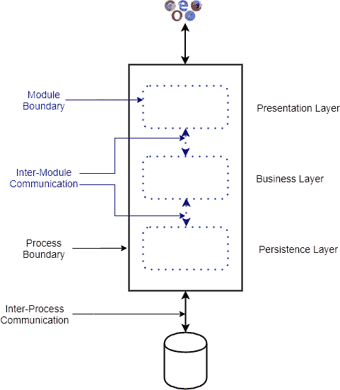
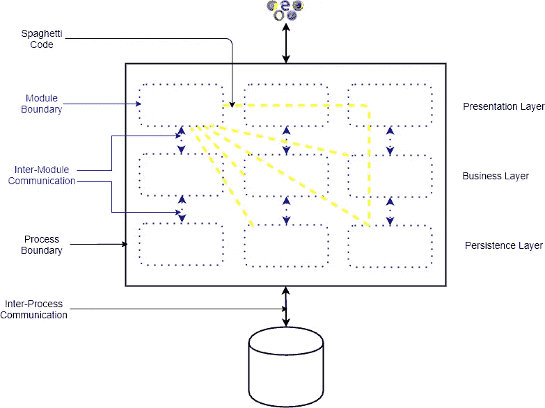
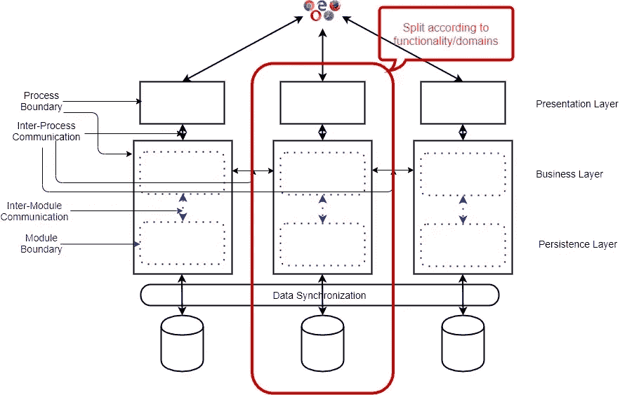
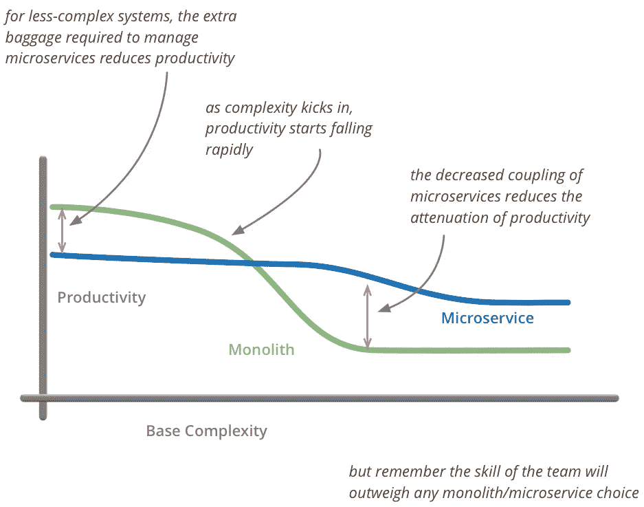

# 透过宣传看:模块化整体软件架构真的死了吗？

> 原文：<https://towardsdatascience.com/looking-beyond-the-hype-is-modular-monolithic-software-architecture-really-dead-e386191610f8?source=collection_archive---------4----------------------->

现代软件开发中模块化整体软件体系结构的真实性检验

来源: [Shutterstock](http://www.shutterstock.com)

在 2010 年，许多网络规模的公司，如**网飞、亚马逊、Spotify、优步**都有特殊的要求:应用规模、开发规模、更短的上市时间。他们还发现，现有的模块化整体架构或面向服务的架构(SOA)无法解决他们的需求。于是，2012 年诞生了一种新的软件架构风格:**微服务软件架构**。

从那以后，微服务的受欢迎程度一路飙升，声势浩大，令人乐观。会议充满了微服务讲座和研讨会。正如我们经常看到的，炒作和神话一起出现。

微服务架构是许多用例的正确选择。但是像任何其他软件架构一样，它也有甜蜜点(它擅长的地方)和极限情况(它失败的地方)。

可惜很多人以为**微服务是银弹**，解决了软件开发的所有问题。他们也抛弃了其他的建筑风格，如模块化整体建筑。还有，就像任何被炒作的技术一样，有些人把微服务想成了“**金锤**”，并试图在各种软件开发中使用它，而不考虑上下文。

人们被闪亮的新微服务迷住了，他们把**模块化单片软件架构说成是一种可怕的架构风格**，这种风格很快就会消亡，在现代软件开发中没有立足之地。同样，如果你是一名软件开发人员或软件架构师，并且**支持模块化整体软件架构，那么你将会在你的公司中被抛弃**。你的同行会把你看作是一个阻碍软件栈现代化的老派人物。

另一方面，如果你**在设计会议上提到“微服务架构”**这个术语，那么你的同事会对你充满敬意和敬畏。

所有这些关于模块化整体软件架构的批评都是合理的吗？在 Docker、Kubernetes、云、大数据和更快的发布周期的时代，它是否已经死亡，在现代软件开发中没有一席之地？

在本文中，我将更深入地研究模块化整体软件架构及其在当今软件开发环境中的相关性。

# 模块化整体架构

自从软件开发的早期(20 世纪 50 年代)，软件系统被作为一个单一的系统开发，并作为一个单一的过程部署。这种软件系统被称为**单片软件系统**。下面是一个典型的整体式 Web 应用程序的示例:

整体 Web 应用程序

在上面的设计中，整个设备被分成多个层(表示层、业务层、持久层)，整个应用程序被部署在应用服务器/Web 服务器上。

随着软件系统开始变得越来越复杂(从 20 世纪 70 年代开始)，软件工程师通过将整个系统分解成“**松散耦合、高度内聚的**”模块来解决复杂性。这个系统被称为**模块化单片软件架构**。以下是我对模块化整体软件架构的定义:

> **一个软件系统可能由多个层或六边形组件组成，每个层或六边形组件被分解成“松散耦合、高度内聚的模块”,但整个系统作为一个整体部署，这被称为模块化整体软件架构。**

下面是一个大型复杂 Web 应用程序中模块化整体架构的示例:

由 Md Kamaruzzaman[开发的模块化单片网络应用](https://medium.com/@md.kamaruzzaman)

在上面的例子中，每一层被分成多个松散耦合、高度内聚的模块(例如 Java 库)，这些模块内部连接(通过方法调用或函数调用)是语言相关的。

以下是模块化整体架构的**特征**:

*   整个软件系统作为一个整体进行部署(要么全部部署，要么全部不部署)
*   模块化的边界是内部的，很容易被跨越，这可能导致意大利面条式的代码(如上面的黄线所示)
*   应用程序作为单个进程运行
*   这是一种通用的解决方案，即一种解决方案适用于所有规模的应用
*   模块之间没有严格的数据所有权

像所有的架构风格一样，模块化整体架构有优点也有缺点，我将简单讨论一下。

**优点:**

*   Monolith 有**几个移动部分**(例如，一个进程、一个应用服务器、一个数据库)。因此，设计、部署和测试(系统测试、e2e 测试)一个单一的应用程序变得更加容易。
*   由于运动部件的数量较少，它具有更小的**表面积来攻击**。因此，保护单片应用程序更加容易。
*   低操作复杂性
*   单一应用程序只有一个 OLTP 数据库。因此，管理交易和数据共享变得更加容易。

**缺点:**

*   由于共享的代码库(通常是意大利面条式的代码)和共享的数据源，在多个团队中并行化工作是**困难的。所以，开发规模是可怕的。**
*   大型整体代码库(通常是意大利面条式的代码)给开发人员带来了**巨大的认知复杂性**。结果就是发展速度差。
*   粒度扩展(即扩展应用程序的一部分)是不可能的。
*   多语言编程或多语言数据库具有挑战性。
*   **由于单片应用程序“全有或全无”的特性，现代化是复杂的**。

# 微服务架构

在 2010 年代，网络规模的公司发现，对于极其大型的应用程序，模块化的单片软件架构并不合适，并创建了**微服务软件架构**。以下是我对微服务的定义:

> **微服务架构还将大型复杂系统垂直(根据功能或业务需求)划分为更小的子系统，这些子系统是流程(因此可独立部署)，这些子系统通过轻量级、语言无关的网络调用(例如 REST、gRPC)相互通信**

如果我们考虑以前的大型复杂 Web 应用程序，那么这就是该应用程序基于微服务的架构:

Md Kamaruzzaman 的微服务架构

以下是微服务架构的**特征:**

*   整个应用程序被**分割成独立的进程，每个进程可以包含多个模块**。
*   与模块化单片或 SOA 相反，微服务应用是垂直分割的(根据功能或领域)
*   **微服务边界在外部**。因此，微服务通过网络调用相互通信。
*   每个微服务都有自己的数据库，而不是一个单独的数据库。
*   **由于“每个微服务的数据库”，需要额外的数据同步**。

在之前的帖子中，我已经详细讨论了微服务架构:

 [## 微服务架构:简要概述以及为什么您应该在下一个项目中使用它

### 微服务架构的背景以及微服务架构相对于整体架构的优势

towardsdatascience.com](/microservice-architecture-a-brief-overview-and-why-you-should-use-it-in-your-next-project-a17b6e19adfd) 

与炒作和神话相反，微服务有许多优点，也有相当多的缺点，如下所示:

**优点:**

*   **更好的开发伸缩性**因为团队可以自主地在不同的微服务上并行工作，几乎没有外部依赖性
*   微服务的规模相对较小。它将低认知复杂性放在开发人员的头上，开发人员会更有效率。
*   由于每个微服务都是一个独立的进程，因此可以独立部署。因此，微服务架构提供了更快的发布周期**。**
*   **粒度扩展**，即扩展应用的一部分，是可能的。
*   粒度数据所有权，因为每个微服务都有自己的数据库
*   只要维持外部契约，一个微服务就能像乐高积木一样迅速被替代。所以，微服务应用**更容易现代化**。

**缺点:**

*   垂直分割整个系统是艺术，而不是科学，需要极端的技巧。此外，将一个数据库分成多个数据库，然后在它们之间共享数据是一项艰巨的任务。所以，**设计整个系统比较复杂**。
*   代码复杂度经常被替换为**操作复杂度**。
*   由于多个数据库(通常是分布式的)，**数据共享和事务管理**极具挑战性。
*   由于众多移动部件(许多进程、数据库、网络调用、容器、虚拟机)，完整的**应用程序更加难以保护**。
*   由于外部网络调用，整个应用程序的**整体延迟要高得多**。

# 模块化整体架构死了吗？

总之，答案是:**没有**。在最近接受 [**Go Time 播客**](https://changelog.com/gotime/114) 采访时，云和 Kubernetes 大师[**Kelsey Hightower**](https://twitter.com/kelseyhightower)已经预示了未来几年模块化整体架构的回归。此外，在之前的一篇文章“关于 2020 年软件发展趋势的 20 个预测”**中，我预测了使用模块化单片集成电路的增长趋势。也有太多的文章描述了公司迁移微服务架构的尝试是如何失败的，他们转向了单片软件架构。**

**当微服务第一次出现时，许多人只是被冲昏了头脑，认为这是统治所有人的“**一种架构。”**他们认为微服务架构是解决软件系统的所有组织限制和技术复杂性的灵丹妙药，并试图在任何地方使用它。在某种意义上，这让我想起了 **SQL/NoSQL 之争**。**

**在 2010 年代，当 NoSQL 出现时，许多人都在讨论 **SQL 作为一种技术是如何过时的，并且在行业中没有一席之地**。毕竟，NoSQL 提供横向扩展，并被谷歌、脸书、亚马逊等公司所使用。因此，他们采用了 NoSQL 的数据库，没有考虑到他们的用例与谷歌或脸书的用例不同。很快，各公司艰难地认识到，他们不能用非 ACID NoSQL 数据库替换他们的跨国 SQL 数据库。随着炒作的平息，我们现在知道**行业需要 OLTP 数据库(SQL)和 OLAP 数据库(NoSQL)** 。**

**在这里，我列出了模块化整体软件架构在现代软件开发中仍然适用并且不会很快消亡的原因:**

*   ****应用多样性:**有许多大公司和网络规模的公司需要微服务架构。但是也有很多公司的微服务架构是错误的选择。对于他们来说，模块化整体架构是最佳选择。**现代软件应用前景相当多样化**。它为模块化单片和微服务软件架构提供了空间。**
*   ****统一解决方案**:模块化单片软件架构的最大优势之一就是它给出了一个经过时间考验的解决方案。如果它适合应用程序的规模，那么 Ruby on Rails 或 Spring Boot 提供了一组定义良好的标准模式来开发应用程序。相反，微服务架构就像狂野的西部，它总是取决于许多因素(应用程序大小、上下文)。如果不仔细设计，微服务可以很快变成“**分布式的 Monolith** ”，具有 Monolith 的所有缺点和微服务的所有复杂性。**
*   ****诀窍:模块化单片软件架构从 20 世纪 70 年代就有了**，大多数开发人员都知道如何开发模块化单片软件架构。**微服务相对较新，缺乏专家**。此外，垂直分解应用程序是艺术而不是科学，需要大量的技巧和实践。许多公司可以使用成熟的模块化整体软件架构来更快地开发软件，而不是新的微服务软件架构。最终用户不关心底层架构或技术；他只关心功能性。**

# **模块化整体架构用例**

**在这里，我列出了一些模块化单片软件架构将在 **2020 年及以后**使用的用例:**

## **小而简单的应用**

****

**来源:[马丁福勒](https://martinfowler.com/bliki/MicroservicePremium.html)**

**正如先锋微服务专家 **Martin Fowler** 所展示的那样，**模块化单片软件架构是特定规模和复杂性应用的更好选择**。就开发人员的工作效率而言，达到一定规模的 Ruby on Rails 或 Spring Boot 应用程序可以轻而易举地击败复杂的微服务架构。如果一个公司有一个开发团队(6-8 个开发人员)，那么他们应该使用模块化整体软件架构。**

## **现代模块化整体式建筑**

**不幸的是，在过去的十年中，模块化独石几乎没有创新，因为它可能正在等待死亡。但随着模块化的 Monoliths 经受住了微服务的冲击，我们可以期待一些创新。微服务有许多新概念，Monoliths 可以采用。**

**一个这样的**现代模块化整体框架是**[**inertia . js**](https://inertiajs.com)。它结合了简单、高效的服务器端 Web 开发框架，如 Ruby On Rails、Django 和基于 JavaScript 的 SPA，如 React、Vue。诀窍是他们将两个世界的精华与任何 API 结合在一起。**

**这样的框架将极大地推动模块化整体软件开发。**

## **棕色地带应用**

**微服务非常适合绿地应用。但通常情况下，公司已经有了现有的设计不佳的单一应用程序。处理现有单片应用程序的一种方法是将其退役，并开发新的微服务。我们都知道让一个正在运行的应用程序退役几乎是不可能的。此外，用新的微服务替换该应用程序(这将受到初期问题的困扰)将令人望而生畏。更好的方法可能是将设计糟糕的整体应用程序重构为模块化的整体应用程序，并保持原样。**

## **复杂领域的应用**

**微服务都是垂直拆分一个复杂的系统，也就是按照领域逻辑切割。有时候，**有些应用的域是纠缠在一起的，要解开这些域是很复杂的**。如果把纠结的域拆分成微服务，那么就导致了分布式的 Monolith，带有 Monolith 和微服务的所有不好的东西。在这种情况下，模块化整体可能是更好的邪恶。**

## **非商业、特殊用途的应用**

**并非所有应用程序都是企业应用程序。在许多应用中(例如电信、汽车)，延迟和更快的响应更为关键。此外，在许多特定领域(例如，机器学习、深度学习、数据存储)，CPU 吞吐量或网络吞吐量是最重要的标准。在这些领域，模块化单片软件架构将比微服务更具优势。**

## **内部工具**

**每个公司都有一些内部工具。通常，这些工具不会遭受不受监管的增长。对于内部工具开发，模块化整体软件架构将是比微服务架构更好的选择。**

# **类似文章:**

** [## 微服务架构:简要概述以及为什么您应该在下一个项目中使用它

### 微服务架构的背景以及微服务架构相对于整体架构的优势

towardsdatascience.com](/microservice-architecture-a-brief-overview-and-why-you-should-use-it-in-your-next-project-a17b6e19adfd)  [## 有效的微服务:10 个最佳实践

### 正确实施微服务架构的 10 个技巧

towardsdatascience.com](/effective-microservices-10-best-practices-c6e4ba0c6ee2)  [## 微服务架构及其 10 个最重要的设计模式

### 微服务架构、每个微服务的数据库、事件源、CQRS、Saga、BFF、API 网关、扼杀者、电路…

towardsdatascience.com](/microservice-architecture-and-its-10-most-important-design-patterns-824952d7fa41)**