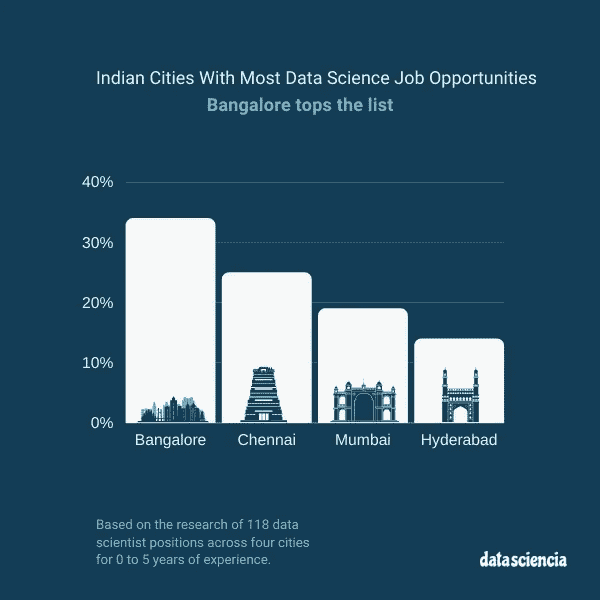
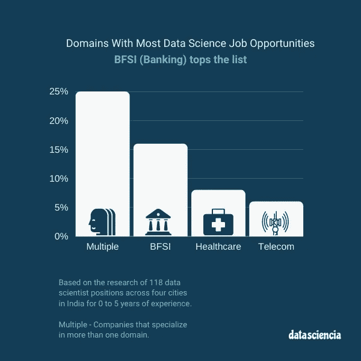
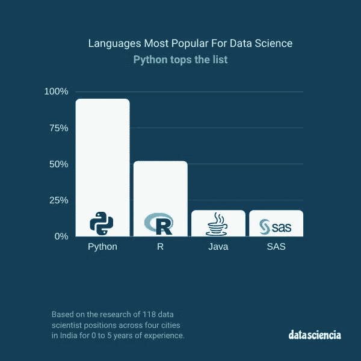
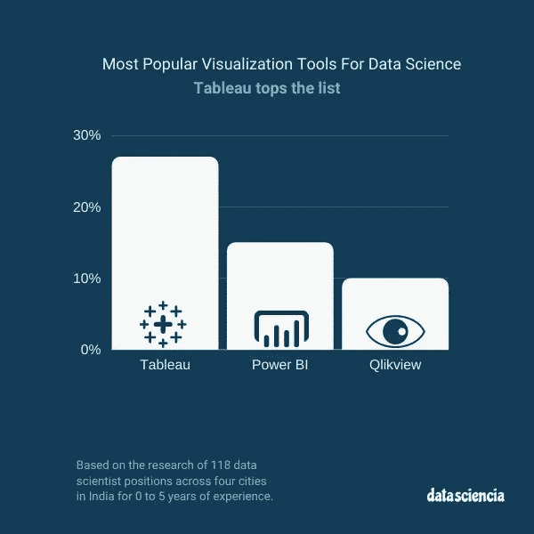
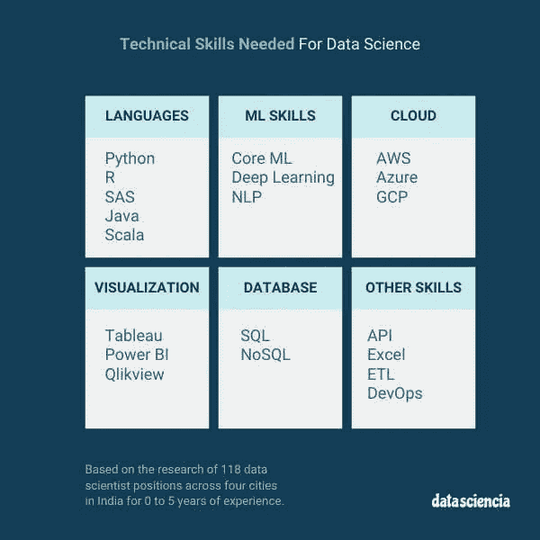
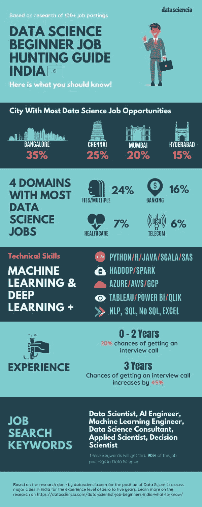

# 寻找数据科学家的工作-这里是你应该知道的！

> 原文：<https://towardsdatascience.com/looking-for-data-scientist-jobs-here-is-what-you-should-know-758d28df4010?source=collection_archive---------71----------------------->

## 基于对 100 多个数据科学职位发布的审查的有用见解

[datasciencia.com](https://datasciencia.com)

**注:这项研究是基于印度列出的数据科学家招聘信息进行的。**

学习数据科学可能很难，如果你是初学者，在数据科学领域找工作可能同样很难。作为一个初学者，了解公司的机会和期望将有助于你做出更好的决定。

我也有其他问题。

*   我至少需要什么样的相关经验才能接到面试电话？
*   我能全面了解数据科学家所需的所有技能吗？我应该专注于哪些技术？
*   深度学习知识对于找工作有必要吗？
*   领域知识是必需的吗？公司需要吗？
*   我应该专注于哪个领域/垂直行业？

正如我们开始的任何与数据相关的项目一样，我开始挖掘数据。阅读并分析了印度四个不同城市的两个工作门户网站上的 100 多个招聘信息，工作经验为 0 至 5 年。

在这篇文章的最后，如果你有和我一样的问题，你将会得到很好的信息来做出正确的决定。这篇文章的目的是帮助你在简历中加入所需的技能和经验水平。如果你刚刚开始学习数据科学，这将有助于初学者对数据科学的就业市场有一个现实的看法。

## 研究范围

*   这项研究仅限于**印度就业市场**。就业市场因国家而异。这在一定程度上可以推广到其他国家。
*   对过去 30 天(23/6/20 至 23/7/20)发布的职位进行了分析
*   主要城市的招聘信息被纳入调查范围——钦奈、班加罗尔、孟买、海德拉巴，以及一些二线城市的招聘信息，如古尔冈和诺伊达。
*   总共分析了 118 份招聘信息
*   [**【naukri.com】**](https://naukri.com/)**和**[**【indeed.com】**](https://indeed.com/)中的招聘启事拿来学习。
*   用于搜索工作的关键字—初级数据科学家、数据科学家
*   **经验限于 0 至 5 年** —即，这是求职所需的最低经验要求。

一些公司用多个名称称呼数据科学家，如机器学习工程师、数据科学顾问、决策科学家等。这些不同标题下列出的所有与数据科学相关的工作都在范围内。

## 极端值

我不得不**过滤掉符合上述标准的工作**，因为它们太具体或太模糊。我称之为离群值。以下是标准

*   工作描述不完整的工作
*   像计算机视觉这样的小众工作
*   只需要 IIT/IIM/NIT 毕业生的工作
*   需要博士学位的工作
*   兼职、实习或自由职业的工作
*   避免数据工程师职位——过多投入开发运营、构建管道和协助数据科学家等工作。
*   需要丰富软件工程经验的工作，即明显不太关注机器学习、寻找核心开发人员的工作。

**注意:**我已经看了每一份工作描述，并准备了一份资料供你参考。你可以订阅我的时事通讯，并获得一份数据集的副本，用于进一步的分析和公司链接发布的实际工作。

让我们开始分析吧！

## 哪个城市的数据科学家职位空缺最多？

如果你猜的是班加罗尔，那就对了！。班加罗尔或孟加拉印度的硅谷拥有最多的数据科学家职位，如亚马逊、花旗、Genpact 和霍尼韦尔等公司。在所分析的工作岗位中，班加罗尔约占 **35%** 。

如果你刚开始从事数据科学，并且只有几年的相关经验，班加罗尔是一个不错的选择。钦奈以 25%的职位排名第二。

作者图片

## 两个平台中的哪一个——事实上/ Naukri 是最适合初学者的？

**最好**这个词是主观的。对我来说，一个不用四处寻找重要信息就能帮助快速轻松找到工作的网站是最好的。在过去的 30 天里，纳克里和实际上有几乎相同数量的招聘信息——分别是 61 条和 57 条。使用 Naukri，工作搜索范围很广，可以搜索多个职位，如数据科学家、数据分析师等。你可以一次选择不同的城市。事实上，我能找到的最好的方法是选择一个城市或一个职位。我觉得这很压抑。绝对不是最好的体验。

我也觉得这的确是一份松散的工作清单。Naukri 有一个专门的工作地点、最低工资、最高工资、兼职/全职信息，这些信息与工作描述的其余部分分开。事实上，它无处不在，很难快速找到信息。

**当心！我发现不到 10%的招聘信息是重复的——既有在 Naukri 发布的，也有在 entire 发布的。这意味着当你申请工作时，在两个网站上发布。**

我没有在 Linked-in 上找工作，这是另一个找工作的绝佳资源。你可能需要探索其他的网站。

## 发布的数据科学职位是否必须有数学背景(正规教育)？

几乎所有发布的职位都要求对数学有足够的了解，在统计、概率和其他定量方法方面有很强的技能。尽管如此，只有 11%的职位空缺明确要求具备出色的数学技能。否则，如果你是数据科学的自学者或者有不错的数学技能，你还是应该找份工作。

## 搜索数据科学家职位用什么关键词最好？

这是显而易见的。**数据科学家**关键词搜索将涵盖数据科学家、首席数据科学家、高级数据科学家、机器学习工程师，并应涵盖 **80%** 的职位空缺。如果招聘人员没有正确标记职位空缺，那么你可能会考虑其他关键词，如人工智能工程师、数据科学顾问、应用科学家、决策科学家等。

用于该搜索的数据集中存在全部的关键字。请参见数据集中的“角色”列。

## 哪个垂直/领域的数据科学家职位最多？

首先，这里的域指的是公司的行业类型。例如银行业、零售业、制造业等。

大多数软件服务公司现在让客户能够根据数据做出决策，我看到这些公司中有 25%在多个领域工作。这是一个好消息，因为你可以申请这些职位中的任何一个，而不考虑专业领域。没有特定领域知识的要求。

但是，如果你想通过竞争或者瞄准一个感兴趣的特定领域，这三个领域有最多的职位发布。银行和金融服务(BFSI) **16%** ，医疗保健 **8%** 和电信 **5%**

如果你想瞄准媒体、房地产或游戏等利基领域，你有职位，但不多。请参考数据集中的准确数字和公司列表。

作者图片

## 作为数据科学家，公司是否特别要求特定领域的知识？

你当然可以用你的领域知识来击败你的竞争对手。此外，如果你有领域知识，数据会更有意义，你可以交付更多的商业价值。

它是强制性的吗？只有 12%的公司在寻找特定领域的知识。你可以使用这两种方式——剩下的 88%的公司你可以申请，你被选中的机会更大，或者你可以专门瞄准 12%的公司，因为你在那里有优势，可以在竞争中胜出。

## 数据科学家起步需要深度学习知识吗？

**37%的公司正在寻找某种深度学习的体验——尤其是像 Tensorflow 这样的软件包。**

## **除了核心 ML 之外，公司对 NLP 这样的专门 ML 领域感兴趣吗？**

**简短的回答是**是的**。大约 **30%** 的公司要求像 NLP(自然语言处理)这样的文本分析技能。**

## **公司热衷于云体验吗？如果是，他们最需要的技术体验是什么？**

**大约 **20%的招聘信息**需要在云上部署模型的经验。其余 80%不热衷于云体验。如果你没有云经验，申请大公司是合乎逻辑的，大公司可能有单独的团队来照顾这一要求。规模较小或拥有小型数据科学团队的公司将期待这种体验，因为他们依赖云来获得计算能力和可扩展性。**

**这些 **20%** 的公司期待什么样的云技术？— **暴露于 Azure/AWS** 将使您被覆盖在 **99%** 的案例中。**

****实际数据:23118**公司需要云体验。其中，**2223**公司需要 AWS/Azure 方面的经验。**

## **这些公司大部分用于数据科学的编程语言是什么？**

****Python** 是这里无可争议的领导者，将近 95%的公司使用它进行数据争论、分析和机器学习。**

**其次是 R，52%的公司将其列为他们使用的统计工具之一。**

**大多数情况下，组织都在寻找这两种工具。拥有 R 知识可以给你一个优势。**

**除了这两种语言， **SAS 和 Java** 也很受欢迎，有 **18%** 的公司希望获得这些语言方面的经验。**

****

**作者图片**

## **我需要接触大数据技术吗？**

**像 **Hadoop 和 Spark** 这样的大数据技术受到 **25%** 招聘公司的追捧。**

**除此之外，Hive、Pig、Sqoop 等相关技术也受到追捧——尽管我没有在数据集中捕捉到这些数字，因为它们属于大数据领域。**

## **数据科学家经常忽视的最被低估的技术，但公司会问！？**

**大多数数据科学家的志向和爱好者专注于机器学习算法和编程语言，他们错过了公司习惯的基础技术。几乎所有的公司都有某种关系数据库来存储结构化数据，并期待有人能够利用这些结构化数据。这使得 SQL 专业知识成为一项有价值的技能。**

****58%的公司期望数据科学家角色编写 **SQL** 语句来处理结构化数据。也就是说，公司也在寻找没有 SQL 数据库技能的人——有 15%的公司要求像 MongoDB 这样的非结构化数据库的专业知识。****

## ****数据科学家最期待的可视化工具技能？****

******Tableau** 是业内最受欢迎的工具，有 **27%** 要求这个技能。**力量 BI** 第二**15%**Qlikview 第三 **10%** 求这些技能。****

********

****作者图片****

## ****还有其他公司感兴趣的技术吗？****

****如果你让自己接触以下工具和框架，这将增加你被选中的几率。按重要性顺序排列****

*   ****ETL 工具的工作知识****
*   ****使用 Excel 的专业知识****
*   ****API 知识(例如 REST API)****
*   ****接触敏捷方法****
*   ****一些 DevOps 的经验不会有坏处！****

********

****作者图片****

## ****最重要的问题—入门级数据科学家的平均最低经验是什么？****

****如果你是一个有着**零到两年经验**的新手，得到面试电话的**可能性**大约为 **20%** 。****

****如果你有**三年的经验**，得到面试电话**的**可能性**增加 45%。******

**根据分析，我认为入门级数据科学家的平均最低经验是**三年。****

## **摘要**

**这是总结一切的信息图。**

****

**[datasciencia.com](https://datasciencia.com/blog/data-scientist-job-beginners-india-what-to-know/)**

## **获取数据集的访问权限**

**通过在此 注册简讯 [**获取数据集。您将收到一封电子邮件，其中包含下载数据集的链接。数据集以`.xlsx`格式提供。**](https://mailchi.mp/4408a0fde736/datasciencia)**

**通过数据集，您可以获得进一步的见解。**

*   **访问寻找本研究中使用的数据科学技能的公司。我把每家公司都链接到了自己的网站上，这样可以节省你亲自查看这些公司的时间。**
*   **获取在制造、零售、电子商务等领域工作的公司列表。**
*   **列出的每个工作的工作描述的链接。**
*   **对只从事机器学习技术的创业公司做进一步的研究。**
*   **你应该联系招聘/人才管理机构，以加快你的求职速度。**

**如果你喜欢阅读，考虑在你的社交网络上分享这篇文章。您还可以在社交媒体上关注我们 [**【脸书】**](https://www.facebook.com/Datasciencia-110682290664089/posts/)**[**推特**](https://twitter.com/hafizulazeez) 和 [**链接在**](https://www.linkedin.com/in/hafizulazeez/)****

****这篇文章最初贴在[这里](https://datasciencia.com/blog/data-scientist-job-beginners-india-what-to-know/)感谢阅读！****