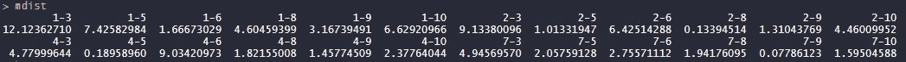
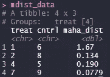

# 了解 Mahalanobis 度量匹配

> 原文：<https://towardsdatascience.com/looking-inside-mahalanobis-metric-matching-4e43cca46a6?source=collection_archive---------55----------------------->

## 它实际上是如何工作的？


安妮·尼加德在 [Unsplash](https://unsplash.com?utm_source=medium&utm_medium=referral) 上拍摄的照片

我之前的[帖子](https://medium.com/@bowenchen_9406/matching-estimator-is-powerful-and-simple-82350f08515a)展示了如何使用 13 行 *R* 代码实现倾向评分匹配。通过这些代码，您可以看到匹配更多的是关于数据预处理。我们的想法是找到与治疗单位相当的控制单位，这样我们就可以更有把握地将治疗组之间的结果差异归因于治疗。此外，我想说匹配实际上很简单，所以你不应该被它吓到。

今天，我研究了一个流行的替代倾向评分匹配的方法:Mahalanobis 度量匹配。这两种匹配方法的不同之处主要在于 MM 匹配使用 Mahalanobis 度量而不是倾向得分来查找匹配。我将一步一步向你展示在实践中如何使用最简单的 *R* 代码完成 MM 匹配。这些步骤嵌入在进行匹配的程序中，但它们通常是不可见的。

# 进行马氏度量匹配的 r 码

与我之前的[帖子](https://medium.com/@bowenchen_9406/matching-estimator-is-powerful-and-simple-82350f08515a)类似，我为数据练习模拟了一个小数据集。从[这里](https://github.com/cbw1243/rfuncs/blob/master/do1.R)可以找到生成模拟数据的 *R* 代码。模拟数据有两个连续协变量(W1，W2)，一个二元处理(A)，和一个连续结果(Y)。为了简单起见，我只生成 10 个数据点，其中 4 个显示为处理过的单元。

生成数据的代码是:

```
library(Matching)
library(dplyr)
library(tidyr) # call libraries 
set.seed(123) # seed for reproducibility
data <- generateData(10) # generate 10 data points (need to download # the function provided in the main text)
```

模拟数据值为:


图一。模拟数据值

第一步。定义一个函数来计算马氏距离

计算马氏距离的数学公式为:MD =(**X1**-**X2**)’**S**(**X1**-**X2**)，其中 **X1、X2** 分别为处理单元和对照单元的协变量(本例中为 W1 和 W2)的向量。 **S** 是数据的样本协方差的倒数。注意，我们可以计算每一对的距离(处理对对照)。我们不计算治疗单位之间的距离，因为我们是在治疗组之间匹配，而不是在同一治疗组内。

让我们定义一个函数，它可以计算一对观察单元的 MD。然后我们可以循环遍历所有的线对。该函数如下所示。每一行代码都是不言自明的，所以我在这里不再提供更多的讨论。

```
mahalDist <- function(Tr, Cn, inv.cov, dataset) {
 covars <- dimnames(inv.cov)[[1]] # get covariate names
 xtreat <- as.matrix(dataset[Tr, covars]) # get X1 (treated)
 xcntrl <- as.matrix(dataset[Cn, covars]) # get X2 (control)
 xdiffs <- as.matrix(xtreat — xcntrl) # calculate differences
 out <- as.numeric(xdiffs %*% inv.cov %*% t(xdiffs)) # MD
 names(out) <- paste0(Tr, ‘-’, Cn) # Set a name for the output
 return(out)
}
```

第二步。计算每个治疗/对照对的马氏距离

现在，我们使用以下代码计算每个处理/对照对的 MD:

```
icv <- solve(cov(data[, c(‘W1’, ‘W2’)])) # Inverse of the variance
treat.rows <- which(data$A == 1) # treated rows
cntrl.rows <- which(data$A == 0) # control rowsmdist <- mapply(function(x,y) mahalDist(x, y, inv.cov = icv, data = data), rep(treat.rows, each = length(cntrl.rows)),
       rep(cntrl.rows, times = length(treat.rows)))
```

请注意，最后一个 *mapply* 函数只是简单地循环计算 MD(由 *mahalDist* 定义)，基于所有可能的处理/控制对的行号。下面报告了 *mdist* 的输出，例如，位于第 1 行的处理单元和位于第 3 行的控制单元之间的 MD 为 12.12。该值似乎是与位于第 1 行的处理单元相关的所有 MDs 中最大的。与位于第 6 行的控制单元相关的最小 MD 是 1.67。



图二。mdist 的输出

第三步。寻找距离最短的最佳匹配

由于样本量很小，我们可以很容易地找到每个处理单元的最佳匹配(最低 MD)。但是下面是一些自动找到最佳匹配的代码:

```
mdist_data <- 
 data.frame(pairs = names(mdist), maha_dist = unlist(mdist),
 stringsAsFactors = F) %>% # Create a data frame to save pair names #and MD values. 
 separate(pairs, into = c(‘treat’, ‘cntrl’), sep = ‘-’) %>% # get #separate names for treated and control units.
 group_by(treat) %>% # Search for the lowest MD by each treated unit
 filter(maha_dist == min(maha_dist)) # return the lowest MD 
```

*mdist_data* 的输出为:



图 3。mdist_data 的输出

您可以看到，四个 MD 最低的对照单位与四个治疗单位相匹配。相对而言，最后一对(即第 7 行的处理单位-第 9 行的对照单位)是最接近的一对，而第一部分(即第 1 行的处理单位-第 6 行的对照单位)是最不同的一对。事实上，如图 1 所示，第 1 行的处理单元恰好具有最低的 w 1 和最高的 W2。因此，很难为它找到一个好的匹配(与其他人太不同)。

经过三个步骤和少量代码，我们完成了基于马氏距离匹配的数据预处理。人们可以用匹配的数据做进一步的分析。我希望你喜欢这本书！