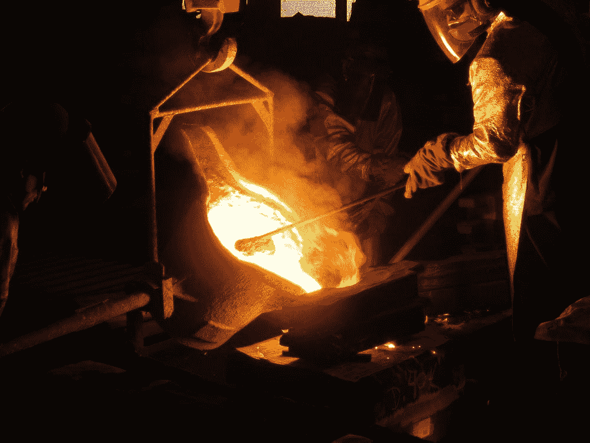
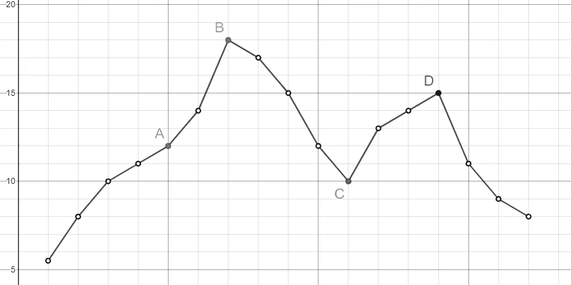
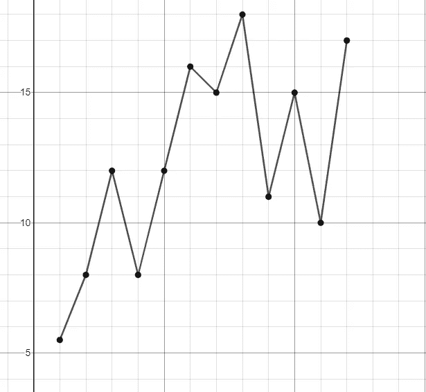

# 向自然寻求优化

> 原文：<https://towardsdatascience.com/looking-to-nature-for-optimization-359bc327229c?source=collection_archive---------53----------------------->



弗朗西斯科·费尔南德斯在 [Unsplash](https://unsplash.com/) 上退火的照片

## [思想与理论](https://towardsdatascience.com/tagged/thoughts-and-theory)

## 利用宇宙一直知道的东西

优化问题在现代计算和经济学中无处不在。他们致力于在具有多种可能性的复杂空间中寻找“最佳”解决方案。大自然对此感到不可思议！自从事物存在以来，大自然就一直在寻找尽可能好的做事方式。让我们看看如何利用自然中发现的技术来解决现代问题。

为了形式化一个优化问题，一个**解空间**被认为是解决问题的可能方法。每个解决方案都有一个我们寻求最大化的价值。然而，当解决方案空间如此之大，以至于要花太长时间来检查每个解决方案时，这可能是一个难以置信的挑战。

优化的一个常见例子是[旅行推销员问题](https://en.wikipedia.org/wiki/Travelling_salesman_problem)。在最基本的版本中，地图上有许多随机的点。你必须找到连接它们的总距离最小的路径。在这个微小的变化中，我们寻求*最小化* **K** (或者我们可以最大化 **-K)。**

让我们看一个简单的解空间来帮助我们形象化！



图 1:示例解决方案空间，在 [Desmos](https://www.desmos.com/) 中制作

图 1 为我们的问题提供了不同的解决方案。我没有包括标度或单位，因为在这个例子中它们是任意的。每个点代表不同的配置。一个解附近的点代表相似解的一个**邻域**。这样做是为了从一个点移动到下一个点只需要对解决方案做最小的改变。对于旅行推销员问题，一个解决方案与另一个解决方案相邻意味着它们是相同的，除了路线上两个相邻的“站”交换了顺序。我们希望相邻的解决方案只有微小的差异，这样它们的 K 就相似了。

在图 1 的 y 轴上，我们有 **K** 。这是我们试图最大化的变量。快速浏览一下图表，就会发现点 **B** 显然是最佳答案。在点 **D** 还有一个局部极大值，我们必须考虑。记住，这是大大简化了的！很多优化问题会有万亿个解，解空间会不止一个维度。

现在我们有了一个解空间，让我们看看两种不同的算法如何处理这个问题。

# 病爬

我们的第一个方法不是在自然界中发现的。然而，这是迄今为止最容易理解的算法，并将作为解决这个问题的起点。我将用伪代码展示它，并附上书面解释。这个代码将简称为 *HillClimb* 。

```
point = RandomPoint
while True
   newpoint = Blankfor p in point.Neighborhood
      if point.k < p.k and newpoint.k < p.k
         newpoint = pif newpoint != Blank
      point = newpoint
   else
      break
```

要开始*爬山*，选择一个随机的解决方案 **S** 。然后，检查 **S** 邻域内每个点的 **K** (根据问题不同，邻域可以有多种不同的定义方式)。如果 **S** 的邻域中的任何点的 **K** 比 **S** 高，则将该点设置为新的 **S** 。如果多个点的 **K** 比 **S** 高，则选择最高的一个。如果出现平局，从给出的最高分中随机选择一分。继续这样做，直到 **S** 的邻域没有比 **S** 本身具有更高 **K** 的点。

爬山有一个非常简单的优点。它也适用于只有一个最大值的解空间。但是，它无法处理具有许多不同最大值的空间，例如图 1 中的两个最大值 **B** 和 **D** 。

让我们看看*爬山*如何处理图 1 中的不同点。

假设我们碰巧从最佳方案开始:点 **B** 。*爬山*将检查它旁边的两个点，并查看两个点都没有更高的 **K** 并退出。我们完全凭运气找到了正确答案！

但是如果*爬山*从 **D 点开始呢？**紧挨着 **D** 的两个点都没有更高的 **K** ，所以它会停下来说 **D** 是最优解，基于解空间这显然是不成立的。这说明了*爬山*的问题:它没有办法处理局部最大值。相反，*爬山*必须依靠运气从一个随机点开始，这将导致它达到真正的最大值，例如点 **A** 。

基于此*爬山*演示，如果从图 1 中的点 **C** 开始，会给出什么“最佳”解决方案？答案在本页末给出！

这个问题的严重程度取决于问题的性质。如果找到最高的 **K** 不是绝对关键，而是只要找到一个相对较高的 **K** 的解决方案，*爬山*就可以了。该算法还可以重复运行，以增加找到更好解决方案的可能性，因为它非常依赖于起始点。 *HillClimb* 确实与非常“锯齿状”的解决方案空间作斗争，如下图 2 所示。这是因为它通常会很快找到一个“最佳”解决方案，而不是因为大量的局部最大值而搜索更好的解决方案。



图 2:参差不齐的解决方案空间

爬山很好，但肯定有一些问题。主要是它不能处理局部最大值，并且严重依赖于初始起点。我们如何解决这个问题？一种可能的方法是在我们的算法中引入一些随机性。如果有时候，我们的道路没有把我们带到附近更好的地方，而是一个 K 值更低的地方呢？我们需要小心这一点，我们不能随机地从一个点到另一个点，然后选择一个。我们的新算法应该具有随机的能力，但也仍然以一个合理的答案结束。让我们看看这是如何工作的！

# 模拟退火

我们可以从一个自然过程中寻找一种方式来改变*爬山*。[退火](https://en.wikipedia.org/wiki/Annealing_(metallurgy))是金属从受热状态冷却时发生的过程。当加热时，金属中的原子可以自由移动，当金属冷却时，会寻找更节能的排列方式。高**温度** ( **T** )意味着原子更有可能四处移动，暂时变得能量效率更低，以可能找到更好的排列。随着 T 降低，原子变得不太可能进行这种赌博。这种最终状态将比金属最初被加热时更节能。大自然有一个很好的方法来优化金属中原子的排列。

我们如何将此添加到*爬山*中？让我们有一个变量， **T** ，它表示我们的算法选择一个具有较低 **K** 的邻近解的可能性。它还应该取决于我们当前点和新点之间的差异。换句话说，如果一个点比我们现在拥有的差很多，我们的算法就不太可能选择一个更差的点。我将在下面展示算法*退火*的伪代码。别急，后面会有文字解释！

```
point = RandomPoint
T = StartingTemperature
delT = ChangeInTemperaturewhile True
   newpoint = Blank
   T = T - delTfor p in point.Neighborhood
      if point.k > p.k
         if random[0,1] < exp((p.k - point.k) / T)
            newpoint = p
            break
      elseif point.k < p.k and newpoint.k < p.k
         newpoint = pif newpoint != Blank
      point = newpoint
   else
      break
```

让我们慢慢地浏览一下*退火*的伪代码。你首先应该注意的是开头的两个新变量。我们有 **T** ，起始温度，和 **delT** ，它告诉我们每一步减少 **T** 多少。另一个主要的区别发生在循环当前点 **S** 附近的点时。如果我们正在检查的点的 **K** 比 **S** 低，我们运行另一个检查。在 0 和 1 之间选择一个随机数，然后检查它是否在下面的表达式中:


我将此称为 **prob** 。记住 **prob** 指的是我们选择一个不太有利的解决方案(较低的 **K** )的概率。如果我们选择了一个不太有利的点，我们停止寻找新的点，移动到那个点，然后重新开始。剩下的*退火*和*爬山* ***一样。*** 最终，附近将不再有具有较高 **K** 的点，并且 **prob** 将如此之低，以至于不会移动到具有较低 **K** 的点。

**prob** 将总是小于 1，因为 *p.k < point.k* 使得指数为负。 *p.k* 和*p . k*之间的巨大差异导致更负的指数，使得 **prob** 更小。大的 **T** 导致较小的负指数，这使得 **prob** 更大。随着 **T** 变小(但保持正值)，指数值将趋向于越来越负，使得 **prob** 变小。

这很复杂，所以我鼓励你花点时间，确保你理解这个算法。下面有个例子。

我们对*退火*的行为有很多控制。这里有很多随机性，但我们有一些空间来调整它。主要是，我们可以改变 T21 如何变化。*退火*每次迭代减少 **T** 达 **delT** 。我们可以调整 **T** 和 **delT** 的尺寸。这将影响*退火*的持续时间，以及移动到不太有利的解决方案的自由度。另一种可能是让 **T** 以指数函数递减，只要它在递减。记住 **T** 必须始终保持正值。我没有将它包含在*退火*的伪代码中，但是如果它变得太小，应该有检查来保持 **T** 为正。

让我们重新检查一下图 1，我把它复制到这里，这样您就不用来回滚动了。


图 1 的副本

首先，我们看看从点 **B** 开始时会发生什么。早在*退火*的时候，**的概率**就很高。我们可能会远离 **B** ，然后随着 **prob** 减少，移回**B**，然而，我们总是有可能过于靠近 **D** ，一旦 **prob** 变得非常低， *Anneal* 将卡在该区域，并在 **D** 处结束。这是*退火*的权衡。虽然我们更有可能获得具有更高 **K** 的最终点，但我们也更有可能跳过具有真正高值 **K** 的点。从某种意义上来说，*退火*使我们的最终 **K** 相对于*爬坡居中。我们很少得到很低和很高的 K 值。有趣的是，我们的算法有更多的随机性，*退火*，导致最终点的随机性减少。*

从 **A** 开始通常会导致 **B** 的最终答案，但是仍然有可能会向右移动太多，并在 **D** 处结束。

让我们来看看 **C** ，这将揭示出我给出的*退火**pseuodcode 中的一个缺陷。*退火*在 **C** 时**总是**右移，不管 **prob** 是什么。这是因为*退火*仅在相邻点的 **K** 低于我们当前点时检查 **prob** 。如果所有相邻的点都有一个更高的 **K** ，那么*退火*也会选择最高的一个来移动。这也意味着从点 **D** 开始永远不会导致在 **B** 结束。*

*看看能不能写点伪代码解决这个问题！下面是一个潜在解决方案的简要描述。如果我们生成一个小于**概率**的随机数，总是移动到比另一个相邻点具有更低 **K** 的相邻点。如果是一条领带，随便挑一条。那里！现在我们的算法不会卡在 **C** 上，如果它从 **D** 开始，可能会移动到 **B** 。*

*有许多其他方法可以解决这个问题。他们中的许多人也从其他自然过程中获得灵感！例如，[量子退火](https://en.wikipedia.org/wiki/Quantum_annealing)使用**概率**函数，如下所示:*

**

***探针**用于量子退火*

*该函数还考虑了分隔这两点的最大宽度。量子退火更有可能穿过非常高但也非常薄的局部极大值。这种算法还有其他变体！*

*我个人最喜欢的是那套[遗传算法](https://en.wikipedia.org/wiki/Genetic_algorithm)。这些算法从物种的自然进化中获得灵感。这个过程将从大量的随机解开始，而不是从一个随机解开始。这叫第一代。每个解决方案都有一个 K 值，我们称之为“适应性”有一个概率函数**再现**随 **K** 增加，随时间减少。对于每个“步骤”，对照**检查每个解决方案，在当前世代中再现**。因此，更“适合”的解决方案有更高的重现机会。将通过的解决方案随机配对。对于每一对，以某种方式组合解决方案，产生一个具有双亲特征的后代。此外，检查每一个后代是否有**突变**的概率，如果通过了，就会对其进行随机改变。现在对新一代的后代重复这个过程！*

*遗传算法有很多种。虽然它可能非常有效，但有许多步骤，可能比攀爬或退火需要更长的时间。还有如何组合解决方案的问题。有些问题有明显的组合，有些问题就模糊得多。*

*其他一些有趣方法包括[蚁群优化](https://en.wikipedia.org/wiki/Ant_colony_optimization_algorithms)、[粒子群集](https://en.wikipedia.org/wiki/Particle_swarm_optimization)以及[更多](https://en.wikipedia.org/wiki/List_of_metaphor-based_metaheuristics#Political_Optimizer_(PO)_(Qamar_Askari,_Irfan_Younas_&_Mehreen_Saeed_2020))！尽情探索吧！*

*感谢阅读！如果您对本文有任何想法或问题，请发表评论。*

*如果你喜欢我的作品，那就考虑用[这个链接](https://medium.com/@colefp/membership)报名成为一个中等会员吧！每月只需 5 美元，使用该链接直接支持我。你也可以[给我买杯咖啡](https://www.buymeacoffee.com/colefp)！如果有的话，先谢谢你了！*

*解决*爬山*问题的方法是点 **D** 。尽管事实上与 **C** 相邻的两个点都较高，但它总是向右移动，因为那是最高的。该算法将最终停留在 **D.***