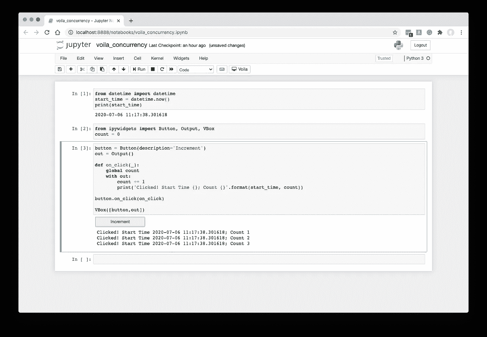
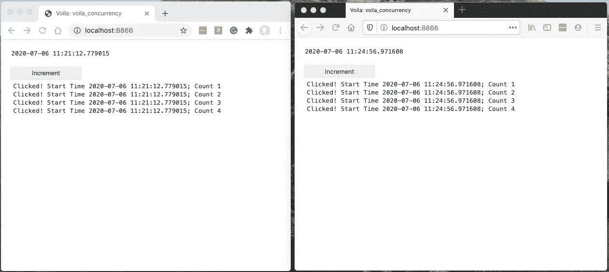
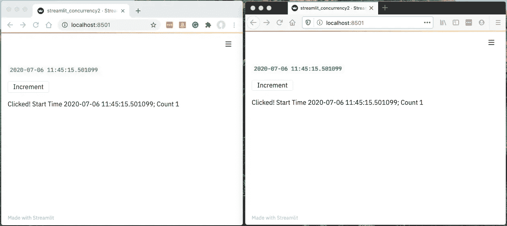
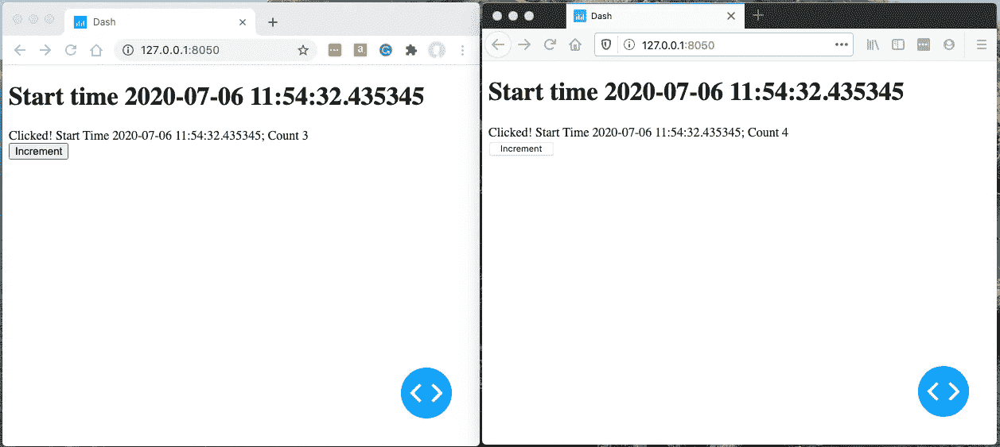

# 查看引擎盖下的仪表板框架

> 原文：<https://towardsdatascience.com/looking-under-the-hood-at-the-dashboarding-frameworks-f87d8b4f3f7a?source=collection_archive---------51----------------------->

## 编写简单的实验代码，突出流行的仪表板框架 Voila、Streamlit 和 Plotly Dash 背后的不同执行模型

如今，数据科学家拥有广泛的开源工具，允许他们为自己的模型构建用户界面，而无需学习任何 Javascript，甚至无需考虑 UI，只需声明用户可以选择哪些变量。

一旦他们相信这是可以实现的承诺，接下来的问题就围绕着性能和编程细节:

*   我的仪表板上的每个用户每次在初始数据处理期间都需要等待吗？
*   如果我想在未来超越简单的 UI，我选择的框架有多大的可扩展性？还是我会碰壁，试图让它做得更多？
*   当两个用户同时访问应用程序时，他们会开始看到彼此的数据，计算会不同步吗？

有时你需要做的只是运行一些简单的代码测试来理解框架是如何运作的。本文将展示三个流行框架的执行模型:Voila、Streamlit 和 Plotly Dash。我们将在每个框架中编写一个版本的基本 UI，让两个不同的用户同时访问它，然后我们将观察这会如何影响我们的模拟数据。


内森·范·埃格蒙德在 [Unsplash](https://unsplash.com?utm_source=medium&utm_medium=referral) 上拍摄的照片

# 测试

我们将模拟仪表板的两个主要组件:启动计算和用户交互。

通常，仪表板在首次启动时需要读入或计算预测模型。当数据科学家开始构建仪表板时，一个常见的抱怨是“每次新用户访问仪表板时，他们都必须等待模型重新计算”。我们想了解我们的代码为每个新用户缓存模型有多容易。

我们要做的不是实际计算一个模型，而是将当前时间存储在一个变量中。如果每次运行都显示相同的时间，我们就知道“模型”没有被重新计算——我们使用的是在初始服务器启动时缓存的时间变量。如果它在每次按下按钮时都发生变化，我们就会知道一切都是从零开始重新计算的。

用户交互将是真实的(不需要模拟)。我们将提供的只是一个“增量”按钮，它将增加计数器的值并再次显示。我们可以观察这一点，以了解多个用户是否看到彼此相同的值，或者他们是否正在运行隔离的环境。计数器是否为每个用户成功递增，或者每次按下按钮都会重置，因为框架正在从头开始重新计算整个脚本？

我们将在 Chrome 和 Firefox 中访问仪表板，以模拟两个完全不同的用户同时访问 web 应用程序。

# 瞧

[瞧](https://voila.readthedocs.io/)这是一个将您的 Jupyter 笔记本显示为独立网络应用的解决方案。本质上，它默认隐藏代码单元，并简单地从上到下运行您的笔记本，然后最终允许用户与页面上定义的任何小部件进行交互。以下是我们测试笔记本中的代码:

```
from datetime import datetime
start_time = datetime.now()
print(start_time)from ipywidgets import Button, Output, VBox
count = 0button = Button(description='Increment')
out = Output()def on_click(_):
    global count
    with out:
        count += 1
        print('Clicked! Start Time {}; Count {}'.format(start_time, count))

button.on_click(on_click)VBox([button,out])
```



Jupyter 笔记本电脑，随时可供使用

运行 Jupyter 笔记本类似于使用 Voila 作为服务器，您可以在上面看到笔记本正在做我们预期的事情:start_time 变量在计算后保持不变，并且计数器在每次单击按钮时递增。

让我们试着在 Voila 服务器上运行。我们将分别在 Chrome 和 Firefox 中打开。我们将在每个浏览器中交替单击“Increment ”,以查看计数器是否按预期工作:



瞧，在 Chrome 和 Firefox 上运行的笔记本

计数器按预期工作——每个用户获得一个独立的值。在每台笔记本电脑的运行过程中，时间也保持不变。但是你可以看到每个浏览器的时间是不同的，这意味着“启动计算”是为每个用户独立运行的。这意味着每个用户在每次访问 web 应用程序时都必须耐心等待任何长时间运行的模型计算。

这使我们能够理解 Voila 执行模型，并思考它对于任何项目的局限性和优势。(有意地)与 Jupyter 笔记本模型有相似之处；就好像每个用户都将笔记本加载到一个新的内核中，然后按 shift+键进入所有的单元格。一旦到了底层，我们最终会得到一个 Python 内核状态——即内存中设置的一些变量。真的不会再发生什么了…除非我们已经连接了一些小部件来运行 Python 代码作为回调。这就是我们对按钮小部件所做的。但是此时会忽略笔记本代码单元——此时发生的所有事情都基于 Python 内存状态，包括现在只是从内存而不是笔记本单元运行的按钮单击回调函数。

如果您是这方面的新手，理解细节并不重要，但是希望与其他两个框架相比，结果会更有意义。

Voila 中“启动计算成本”问题的一些解决方法将在后面讨论。

# 细流

这是一个用 [Streamlit](https://streamlit.io/) 构建的类似仪表板:

这一次的结果非常不同:


Streamlit 并发测试 1

我们不仅最初会在每个浏览器中看到不同的时间，而且每次我们单击增量按钮时，都会生成一个新的时间，并且计数器不会超过 1！

这是因为 Streamlit 中的执行模型是不同的:每次用户与它交互时，整个脚本都从上到下重新运行。这听起来效率很低，确实如此，但是它允许简单的声明式脚本风格工作。在 Streamlit 代码中，您可以看到按钮的点击功能就在“if”语句中。与 Voila 窗口小部件相比，根本不需要真正的回调机制，在 Voila 窗口小部件中，我们连接了一个在单击按钮时执行的回调函数。

为了解决这个潜在的低效率问题，Streamlit 提供了一个缓存装饰器。下面是一个更新的 Streamlit 示例:

现在，我们发现获取当前时间的“启动计算”只运行一次。



Streamlit 并发测试 2

两个浏览器中的时间完全相同，当按下任何一个“增量”按钮时，时间都不会改变。虽然 cache decorator 简单而有用，但它仅限于缓存可以在 Python 中“腌制”的对象，即转换成可以从磁盘加载或保存到磁盘的格式。

和以前一样，计数从不增加。这种每用户状态的遗漏是 Streamlit 正在寻求解决的问题，并且有一个[解决方法](https://discuss.streamlit.io/t/two-people-on-same-session-state/3211)可用。但实际上真正需要它并不常见:在大多数仪表板中，状态通常保存在小部件中，这些小部件由 Streamlit 基于每个用户维护。例如，用户可以拖动滑块来改变模型的输入，它的新值*不会在代码重新运行后失效。*

# 阴谋破折号

下面是 Plotly Dash 框架的类似脚本:

这里的代码从一开始就有点复杂，但这确实导致了更好的控制。



Plotly Dash 并发示例

这里的“启动计算”(时间)在两个浏览器中保持不变，当点击增量按钮时也不会改变。此外，计数器确实成功地并且独立于每个用户递增。这使用了 Plotly Dash 的按钮组件的`n_clicks`属性，它将该组件绑定到所呈现的每个物理 HTML 按钮。

请注意，在 Plotly Dash 示例中，每次按下按钮时，输出都会被覆盖。瞧，每按一个按钮就会有新的输出。在任一框架中，这种行为都很容易改变。

# 结论

如果您再次查看 Plotly Dash 的代码，您会发现 web 服务器更明显地暴露在您自己的代码中。我们代码的`app.run_server`调用是服务器‘循环’实际运行的地方。相比之下，在 Voila 和 Streamlit 中，服务器在很大程度上是在我们自己的脚本之外——它是在外部“加载”我们的脚本来为自己处理它。

对于 Plotly Dash 来说，这凸显了我们*正在*构建一个传统的 web 应用，Dash 框架提供的真正好处是展示了无需编写任何 Javascript 或 HTML 就可以使用的用户界面组件。

一般来说，Voila 和 Streamlit 对于非程序员来说更容易开始，但是如果你想构建更传统的“web app”功能，扩展性可能会受到限制。

这并不是说这些框架中的任何一个天生就比其他任何一个更好。它们都有不同的设计，适合不同的场景。

最终，Plotly Dash 在处理每用户状态和维护“启动计算”方面的便利来自于它没有试图将我们从标准 Python 编程环境中移除。另一方面，对于来自纯 Jupyter 背景的人来说，编码有更高的学习曲线——瞧，Streamlit 允许他们在通常的自顶向下的过程代码中添加一些小部件。

事实是，掌握底层编程语言应该能够让您克服所讨论的任何问题。例如，Voila 将很容易让我们编写自己的代码来保存我们的“启动计算”到磁盘，并在下次运行时读取它们。但这在笔记本环境中感觉不太自然。

实际上，对于这些框架中的任何一个，基本的工作仪表板都是使用从文档或 web 上的类似示例中找到的复制粘贴代码片段构建的！要开始构建仪表板，您可能想知道它需要多长时间才能发展成一个更大的 web 应用程序，但是选择一个框架进行试验的最佳方式是了解您已经最熟悉的环境和编码风格。

*本文的示例代码为* [*，可在 GitHub*](https://github.com/danlester/exec-model-tests) *上获得。*

*丹·莱斯特是*[*ContainDS*](https://containds.com/)*的联合创始人，这是一个为从事离散项目的团队提供的数据科学平台。*