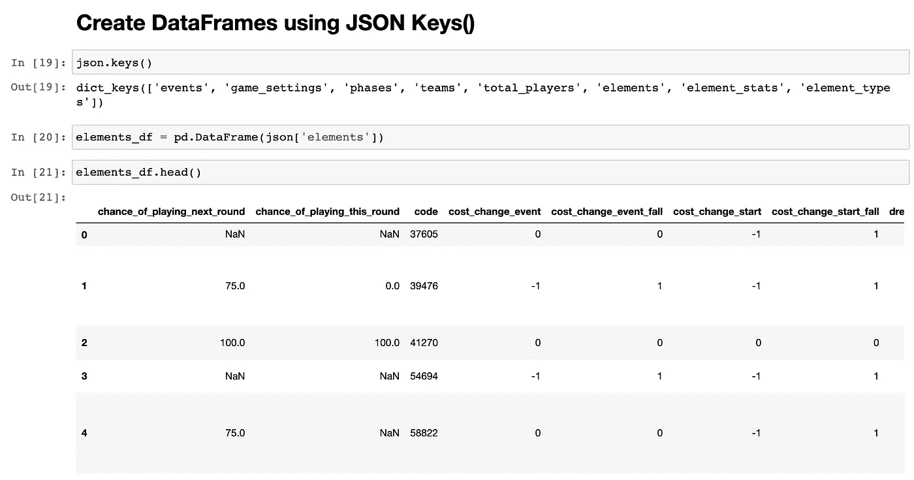

# 通过梦幻英超 API“元素-概要”端点循环下载 Python 和 Pandas 的球员历史

> 原文：<https://towardsdatascience.com/looping-through-the-fantasy-premier-league-api-element-summary-endpoint-to-download-player-df4ab5151fcb?source=collection_archive---------18----------------------->


图片由[免费提供-照片](https://pixabay.com/photos/?utm_source=link-attribution&utm_medium=referral&utm_campaign=image&utm_content=918830)来自 [Pixabay](https://pixabay.com/?utm_source=link-attribution&utm_medium=referral&utm_campaign=image&utm_content=918830)

## 用于创建当前赛季所有玩家游戏周历史和所有过去赛季历史的主数据框架的文档

大家好。看起来我的第一个 FPL API 教程很成功，所以我又为你们带来了另一个 Python/Pandas Fantasy Premier League API 教程。

这一次，我们将创建两个不同的数据帧:(1)包含每个玩家当前赛季游戏周历史的数据帧，以及(2)包含每个玩家所有过去赛季历史的数据帧。

这将是对使用 Requests 包访问 API 端点并构建数据帧的极好介绍，也是对使用 Python“For 循环”迭代一系列玩家 id 并访问每个玩家的`/api/element-summary/{element_id}`的极好介绍。

在赛季结束时，你将能够将这第一个数据帧(每个球员的 FPL 个人资料的“本赛季”部分中可用的相同数据)保存为 CSV 或 Pickle，允许你建立自己的 FPL 数据库，明年将无法通过 FPL API 获得。


第二个数据框架将允许转换和分析在每个球员的 FPL 档案的“前几个赛季”部分中可用的完全相同的数据。将这些数据与其他玩家放在一起进行对比将会很有趣，而且可能会有所启发。


让我们开始吧！

# 目录

1.  入门指南
2.  进口
3.  点击 API 并创建带有请求的响应对象
4.  用 Json()方法将响应对象转换成 JSON
5.  使用 JSON `Keys()`创建数据帧
6.  构建并测试 For 循环
7.  遍历所有元素，用 f 字符串格式构建主数据帧
8.  保存到 CSV 并保存

## 步骤 0:开始

如果您是 Python、Pandas 和 Jupyter 笔记本的新手，请阅读下面我的文章“Python、Pandas 和 Jupyter 笔记本入门”,然后回到这里继续学习本教程。

[](https://medium.com/dev-genius/getting-started-with-python-pandas-and-jupyter-notebooks-bd08c963914) [## Python、Pandas 和 Jupyter 笔记本入门

### 用 Jupyter 笔记本设置您的机器并开始用 Python 编程所需的所有文档…

medium.com](https://medium.com/dev-genius/getting-started-with-python-pandas-and-jupyter-notebooks-bd08c963914) 

## 步骤 1:导入和设置

对于这个任务，我们需要`pandas`和`requests`。启动新的 Jupyter 笔记本，然后在第一个单元格中，导入您的包:

```
import pandas as pd
import requests
```

如果你喜欢键盘快捷键，你会喜欢按住“shift”键的同时按下“enter”键来运行每个单元格。


我还喜欢更新笔记本中的设置，这样我就可以左右滚动，看到任何给定数据帧中的所有列。如果您以前在 Jupyter 笔记本上玩过，您可能会经历过这样一个恼人的时刻:由于数据框包含“太多”列，所以您看不到部分数据框。运行下一个单元格以更新显示设置:

```
pd.options.display.max_columns = None
```


附言:如果你想知道我是如何在这些截图中创建这些部分标题的，请尝试选择一个单元格，然后将该单元格从“Code”转换为“Markdown”，方法是选择该单元格并点击“m”键，或者选择该单元格，然后从菜单的下拉菜单中选择“Markdown”。当您使用键盘快捷键“m”时，单元格高亮显示应为蓝色，而不是绿色:


## 步骤 2:点击 API 并创建带有请求的响应对象

接下来，我们将目标 url 设置为 FPL API 的主端点:

```
url = '[https://fantasy.premierleague.com/api/bootstrap-static/'](https://fantasy.premierleague.com/api/bootstrap-static/')
```

然后，我们需要使用`GET`方法创建一个带有请求包的响应对象:

```
r = requests.get(url)
```


## 步骤 3:用 Json()方法将响应对象转换成 JSON

接下来，我们将使用`json()`方法将响应对象的正文解析成 JSON。

如果您尝试在一个单元格中运行响应对象`r`，您将看到的只是响应:`<Response [200]>`。


响应对象有各种不同的属性和方法！点击查看他们的列表[。](https://www.w3schools.com/python/ref_requests_response.asp)

对于我们当前的目的，我们真的只关心使用`json()`方法，但是知道这些其他方法是可用的也很好。

现在让我们继续将响应体转换为 JSON 对象:

```
json = r.json()
```


## 步骤 4:使用 JSON `Keys()`创建数据帧

接下来，我们将使用`keys()`方法来查看 JSON 字典中有哪些类型的键可用:

```
json.keys()
```

这将返回一个键列表:


因为我已经研究了这些键中的每一个都提供了什么，所以我已经确切地知道我想要从哪个键构建我的第一个数据帧:

```
elements_df = pd.DataFrame(json['elements'])
```

创建新的数据帧后，我将使用`head()`方法检查前 4 行:

```
elements_df.head()
```



这个数据帧对于在下一节循环游戏中的所有玩家元素是必要的。

## 步骤 5:构建并测试 For 循环

现在我们有了要迭代的元素列表，我们可以构建 For 循环并点击`element-summary`端点，在每次迭代中注入玩家的`element_id` :

```
url = f'[https://fantasy.premierleague.com/api/element-summary/{element_id}/'](https://fantasy.premierleague.com/api/element-summary/{element_id}/')
```

当我们解决这个问题时，请记住，我不一定要分享如何进行 For 循环的“最佳实践”。我确信有更有效的做事方法。这就是我做这件事的方式。

警告结束后，让我们首先构建一个 For 循环的微型示例，并确保我们的迭代器将为我们工作:

```
for x in elements_df.index[:5] :
    element_id = elements_df.id[x]
    element_name = elements_df.first_name[x]
    print(x)
    print(element_id)
    print(element_name)
```


注意这里的一些事情。首先，这个拼图的`for x in elements_df.index[:5]:`部分。

我已经要求计算机使用 DataFrame 索引作为迭代器，遍历`elements_df` DataFrame 的前 5 个元素。

这里的`[:x]`语法有助于将循环限制在前 5 个元素。

`[:x]`语法是一种非常常见的 Pandas 操作，用于按行分割数据帧。例如，`elements_df[:5]`实际上和`elements_df.head()`是一回事。

我们可以使用这个切片操作来帮助测试我们的 For 循环，因为我们绝对不想遍历整个数据帧来测试我们的循环。

这里的`x`变量表示我们正在循环的每一行的索引。如果您检查`elements_df.head()`，您会在一个未命名的列中看到数据帧最左边的数据帧索引:


我们可以使用索引来访问数据帧中的任何值。例如，让我们使用索引获取第一行的`first_name`:

```
elements_df.first_name[0]
```

这将返回`‘Mesut’`，DataFrame 中第一个元素的名字。


我们可以批量执行这个操作，使用一个索引列表来单独遍历每一行，并给一个变量赋值。现在让我们再做一次，但是这次得到前 10 个元素:

```
for x in elements_df.index[:10] :
    element_id = elements_df.id[x]
    element_name = elements_df.first_name[x]
    print(x)
    print(element_id)
    print(element_name)
```


太好了！我们的 For 循环运行良好。

## 步骤 6:遍历所有元素，用 f 字符串格式构建主数据帧

你会注意到我们在上面设置的一个变量是`element_df.id`。这个`id`对于我们的下一个 API 调用至关重要。

我们将使用`id`传递到`/api/element-summary/{element_id}`端点，为每个玩家获取`element-summary`。

这是通过 [f 字符串格式化](https://www.datacamp.com/community/tutorials/f-string-formatting-in-python?utm_source=adwords_ppc&utm_campaignid=898687156&utm_adgroupid=48947256715&utm_device=c&utm_keyword=&utm_matchtype=b&utm_network=g&utm_adpostion=&utm_creative=332602034352&utm_targetid=aud-392016246653:dsa-429603003980&utm_loc_interest_ms=&utm_loc_physical_ms=2784&gclid=EAIaIQobChMIkMrorcmE7AIVQeDICh07xAVAEAAYASAAEgLDavD_BwE)完成的。让我们用一个例子来快速回顾一下 f-string 格式:有 f-string 格式的*和没有*的*:*

**不带 f 字符串格式:**

```
your_name = "David"
print("Hi, my name is {your_name}"
```


嗯，不是我们想要的。

现在，让我们尝试将变量`your_name`传递到我的字符串语句中:

```
your_name = "David"
print(f"Hi, my name is {your_name}"
```


啊，是的！f-string 允许我们将自己的变量注入到字符串中。这很重要，因为`/api/element-summary/{element_id}`端点将被设置为字符串，但我们需要在每次点击 url 时将`element_id`注入 URL。像这样:

```
url = f'[https://fantasy.premierleague.com/api/element-summary/{element_id}/'](https://fantasy.premierleague.com/api/element-summary/{element_id}/')
```

让我们看一个例子:

```
url = f'[https://fantasy.premierleague.com/api/element-summary/1/'](https://fantasy.premierleague.com/api/element-summary/1/')
r = requests.get(url)
json = r.json()
json.keys()
```

这将返回`JSON` blob 的密钥:


和以前一样，我们将使用这些键来创建数据帧:

```
json_fixtures_df = pd.DataFrame(json['fixtures'])
json_history_df = pd.DataFrame(json['history'])
json_history_past_df = pd.DataFrame(json['history_past'])
```

然后，让我们使用`head()`方法查看每个数据帧:

```
json_fixtures_df.head()
```


```
json_history_df.head()
```


```
json_history_past_df.head()
```


看完这些数据帧后，我对为所有玩家保存`json_history_df`和`json_history_past_df`感兴趣，但我现在对`json_fixtures_df`不太感兴趣。

我们有了所有的部分，让我们继续把它们放在我们的 For 循环中:

```
for x in elements_df.index[:5] :
    print(x)
    element_id = elements_df.id[x]
    url = f'[https://fantasy.premierleague.com/api/element-summary/{element_id}/'](https://fantasy.premierleague.com/api/element-summary/{element_id}/')
    r = requests.get(url)
    json = r.json()
    json_history_df = pd.DataFrame(json['history'])
    json_history_past_df = pd.DataFrame(json['history_past'])
```

`print(x)`通过查看屏幕，可以帮助我了解操作位置。它充当一种“进度条”

其余的手术我们已经经历过了。

不过这还不够好，因为每次我们循环一个新的`element_id`，我们都会覆盖保存在`json_history_df`和`json_history_past_df`数据帧中的数据。

我们需要另一个数据框架来存储所有这些数据！

我们将通过创建两个名为`all_history_df`和`all_history_past_df`的新数据帧来处理这个问题，然后将每个新的`json_history_df`数据帧和每个新的`json_history_past_df`数据帧附加到这些主`all_history_df`和`all_history_past_df`数据帧中:

```
for x in elements_df.index[:5] :
    print(x)
    element_id = elements_df.id[x]
    url = f'[https://fantasy.premierleague.com/api/element-summary/{element_id}/'](https://fantasy.premierleague.com/api/element-summary/{element_id}/')
    r = requests.get(url)
    json = r.json()
    json_history_df = pd.DataFrame(json['history'])
    json_history_past_df = pd.DataFrame(json['history_past'])

    if x == 0 :
        all_history_df = json_history_df
        all_history_past_df = json_history_past_df
    else : 
        all_history_df = all_history_df.append(json_history_df)
        all_history_past_df = all_history_past_df.append(json_history_past_df)
```

如果这是我们第一次运行这个循环——我们通过索引号`x==0`知道它——将`json_history_df`和`json_history_past_df`数据帧复制为`all_history_df`和`all_history_past_df`。

但是，如果这是第一个索引之后的任何内容*，则将新数据帧附加到主数据帧。这只是将每个玩家的个人历史数据帧一个接一个地堆叠到一个包含所有玩家的核心数据帧中。*

让我们用前 5 个元素来测试一下:


查看`all_history_df`数据帧的前 10 行，我们可以看到我们的循环成功了！


这个`all_history_past_df`也好看！


现在，让我们通过移除`[:5]`切片，让她撕开整个 FPL 球员数据库:

```
for x in elements_df.index :
    print(x)
    element_id = elements_df.id[x]
    url = f'[https://fantasy.premierleague.com/api/element-summary/{element_id}/'](https://fantasy.premierleague.com/api/element-summary/{element_id}/')
    r = requests.get(url)
    json = r.json()
    json_history_df = pd.DataFrame(json['history'])
    json_history_past_df = pd.DataFrame(json['history_past'])

    if x == 0 :
        all_history_df = json_history_df
        all_history_past_df = json_history_past_df
    else : 
        all_history_df = all_history_df.append(json_history_df)
        all_history_past_df = all_history_past_df.append(json_history_past_df)
```

## 第七步:保存到 CSV 和泡菜

这一步是可选的，但当 2020/21 赛季结束时，你会希望将`all_history_df`数据帧保存到你的本地计算机上，以确保你仍然可以访问那些辉煌的数据。您可以将此数据帧保存为 CSV 或 Pickle 文件。

不确定 Python 中的**泡菜**是什么？

来自 geeksforgeeks.org:

> Python pickle 模块用于序列化和反序列化 Python 对象结构。Python 中的任何对象都可以被腌制，以便保存在磁盘上。pickle 所做的是在将对象写入文件之前先“序列化”对象。Pickling 是一种转换 python 对象(list、dict 等)的方法。)转换成字符流。这个想法是，这个字符流包含在另一个 python 脚本中重建对象所需的所有信息。

Pickle 是一种更好的存储 python 对象的格式，因为它“包含了在另一个 Python 脚本中重建对象所需的所有信息”

CSV 通常也是一种可靠的方式，但泡菜是一种更安全、更有效的方式。

我们将在下面介绍这两种方法:

**保存**

```
all_history_df.to_csv('/Users/davidallen/fpl_python/all_history_df_1920.csv')all_history_past_df.to_csv('/Users/davidallen/fpl_python/all_history_past_df_1920.csv')
```

**保存**

```
all_history_df.to_pickle('/Users/davidallen/fpl_python/all_history_df_2021_09252020.pickle')all_history_past_df.to_pickle('/Users/davidallen/fpl_python/all_history_past_df_2021_09252020.pickle')
```

当您想读取您的 pickle 或 CSV 文件时，您需要做的就是将文件分配给一个变量，如下所示:

```
#READING A CSVall_history_df = pd.read_csv('/Users/davidallen/fpl_python/all_history_df_2021_09252020.csv')all_history_past_df = pd.read_csv('/Users/davidallen/fpl_python/all_history_past_df_2021_09252020.csv')#READING A PICKLEall_history_df = pd.read_pickle('/Users/davidallen/fpl_python/all_history_df_2021_09252020.pickle')all_history_past_df = pd.read_pickle('/Users/davidallen/fpl_python/all_history_past_df_2021_09252020.pickle')
```

唷。我们做到了。

下次见…干杯。


如果你喜欢阅读这样的故事，并想支持我成为一名作家，可以考虑报名成为一名媒体成员。每月 5 美元，让您可以无限制地访问数以千计的 Python 指南和数据科学文章。如果你使用[我的链接](https://deallen7.medium.com/membership)注册，我会赚一小笔佣金，不需要你额外付费。

[](https://deallen7.medium.com/membership) [## 通过我的推荐链接加入媒体-大卫艾伦

### 阅读大卫·艾伦(以及媒体上成千上万的其他作家)的每一个故事。您的会员费直接支持…

deallen7.medium.com](https://deallen7.medium.com/membership)