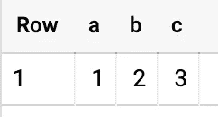
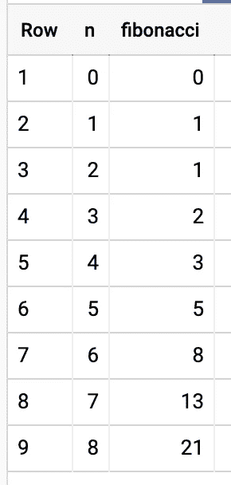

# BigQuery 中的循环

> 原文：<https://towardsdatascience.com/loops-in-bigquery-db137e128d2d?source=collection_archive---------5----------------------->

## 了解如何使用 BigQuery 脚本通过 for 循环计算斐波那契数

E ver 想在 SQL 中循环？嗯，**你可以用脚本**。让我们看看如何用循环在 BigQuery 中计算**斐波那契数。**

在 BigQuery 中执行循环！—[Claire Satera](https://unsplash.com/@daisybisley?utm_source=unsplash&utm_medium=referral&utm_content=creditCopyText)在 [Unsplash](https://unsplash.com/s/photos/loop?utm_source=unsplash&utm_medium=referral&utm_content=creditCopyText) 上拍摄的照片

> 我之前展示了如何用 JavaScript UDF(用户定义的函数)在 BigQuery 中实现 [Fibonacci，也讨论了 BigQuery](/fibonacci-series-with-user-defined-functions-in-bigquery-f72e3e360ce6) 中的[数组，所以如果你是 BigQuery 的新手，先看看这些。](/fizzbuzz-in-bigquery-e0c4fbc1d195)

# 脚本基础

在我们开始计算斐波那契数列之前，让我们先讨论一下 SQL 脚本的构建模块。在编程语言(比如 Python)中，用一些值设置变量，然后处理这些变量是很自然的，而在 SQL 中，通常是从表中的一些数据开始。

> 要获得所有媒体文章的完整信息——包括我的——请点击这里订阅[。](https://niczky12.medium.com/membership)

使用 SQL 脚本，你可以声明变量，然后在计算中使用它们。问题是(对于那些来自动态类型语言的人来说)你需要在开始使用它们之前**声明每个变量的类型**，这些类型永远不会改变。

> 使用 SQL 脚本，您可以声明变量，然后在计算中使用它们，执行 for 循环等。

让我们声明第一个变量，并将其打印到控制台:

我们在这里执行的步骤是:

*   关键字`DECLARE`用名称`uninteresting_number`和类型`INT64`实例化我们的变量。
*   we `SET`中的**号的值**到 [1729](https://en.wikipedia.org/wiki/Interesting_number_paradox) 。
*   最后，我们只需选择数字，将其打印到控制台。

> 如果想把变量的声明和设置一气呵成，也可以使用`DEFAULT`实参:`DECLARE my_number INT64 DEFAULT 1729;`。

如果我们想更新我们的变量，那么我们再次使用`SET`关键字来这样做:

这里，我们首先将`c`设置为等于`a`，然后将`c`增加`b`，得到如下结果:

看，妈妈，我会做数学！

# 斐波那契数列

现在我们知道了如何声明和设置变量，**让我们开始循环**。首先，我们需要弄清楚我们的算法将如何工作。这里有一个让它工作的方法:

1.  设置一个数组`[0,1]`——斐波那契数列的前两个元素。
2.  要求用户输入`n` —我们将产生序列的前 n 个数字。
3.  在每次迭代(`n`次)中，将数组最后 2 个元素的和追加到数组中。

这使我们得到以下结果:

看看我们在做 WHILE 循环！— [来源](https://tenor.com/view/rick-and-morty-poopybutthole-oooweee-meme-chalkboard-gif-16063441)

代码中的注释解释了大部分内容，但只是澄清一下:

*   我们声明`n`来知道我们需要生成多少个数字。
*   我们声明我们的斐波纳契数列为`f=[0,1]`——这是我们的第 0 和第 1 个斐波纳契数列的起点。*仅供参考，* `*f*` *代表斐波那契。*😃
*   我们声明`i`，我们的计数器知道我们已经生成了多少个数字。我们将此设置为 1，因为我们在`f`中已经有了第 0 和第 1 个数字。
*   然后，对于每次迭代，我们通过反转数组找到最后 2 个数字`f`——遗憾的是，BigQuery 中没有负索引——将它们相加并添加到数组中。对于你们这些聪明的笨蛋来说，你可以把新元素添加到开头，这样就没有必要在每一步都颠倒了。)
*   哦，别忘了增加`i`！不要迷失在无限循环中。

# 没有数组

上面的是可行的，但是如果我们只需要第 n 个数而不是整个序列呢？那么我们就可以不用数组来完成整个过程。我们需要做的就是**跟踪序列中的最后 2 个数字**。

我们从上面删除了`i`,取而代之的是，在每一步递减`n`,直到达到 1。在每个步骤中，我们执行以下操作:

*   将`b`存储在一个临时变量中。
*   将`b`设置为新值，即`a`和`b`之和。
*   将`a`设置为临时变量——之前的`b`。

这为我们提供了带有`a < b`的序列的最后两个数字。

> 我将让您来弄清楚那个`IF`声明是怎么回事，以及我们为什么需要它。

# 摘要

阅读完本文后，您现在已经了解了以下内容:

*   SQL 脚本是为 BigQuery 中的循环做的事情
*   如何用变量的名称和类型声明变量
*   如何设置变量的值
*   如何追加到数组中
*   如何执行 WHILE 循环

今天学了新东西，给自己一点鼓励。哦，如果我在这篇文章中说了一些愚蠢的话，请在评论中指出来。😉

干得好，SQL 忍者！—[Guillermo la Torre](https://unsplash.com/@superwillyfoc?utm_source=unsplash&utm_medium=referral&utm_content=creditCopyText)在 [Unsplash](https://unsplash.com/s/photos/applause?utm_source=unsplash&utm_medium=referral&utm_content=creditCopyText) 上拍摄的照片

*关于斐波那契数列和数组的其他 BigQuery 文章，请参见这些:*

 [## BigQuery 中的斐波那契数列

### 在 BigQuery 中使用用户定义的 JavaScript 函数来计算 Fibonacci

towardsdatascience.com](/fibonacci-series-with-user-defined-functions-in-bigquery-f72e3e360ce6)  [## BigQuery 中的 FizzBuzz

### BigQuery 中的 FizzBuzz，而不是 BigQuery 中的 Java 或 Python。使用 SQL，为什么不呢？

towardsdatascience.com](/fizzbuzz-in-bigquery-e0c4fbc1d195)