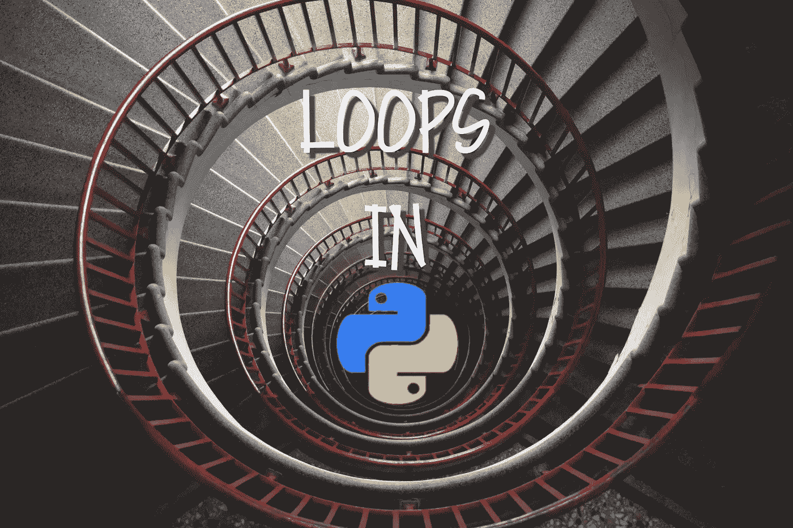
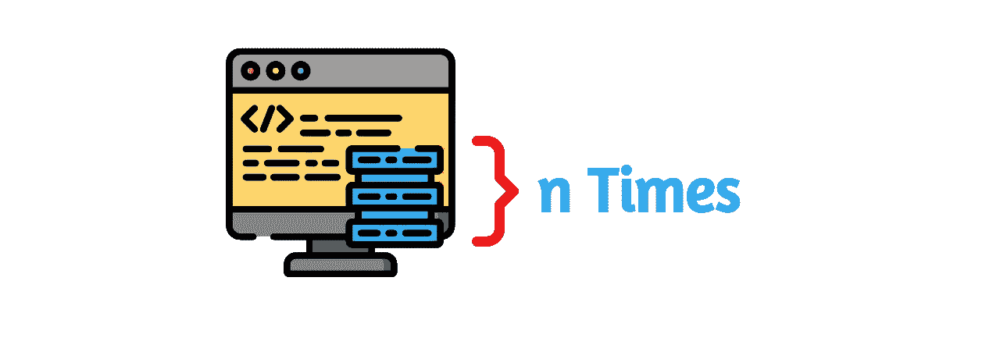
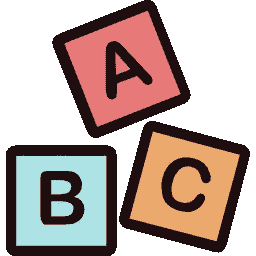
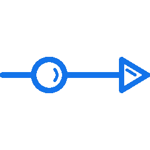

# 如何利用 Python 中的循环

> 原文：<https://towardsdatascience.com/loops-in-python-3ba17168de28?source=collection_archive---------18----------------------->

如今，ython 是一门如此强大的语言，使用它的工具只会给你带来好处。在马上要去[之前，Python 的高级工具](/how-to-save-money-with-python-8bfd7e627d13)。我们来看看 Python 中可以作为基础知识进行排序的循环。



[Tine ivani](https://unsplash.com/@tine999?utm_source=unsplash&utm_medium=referral&utm_content=creditCopyText)在 [Unsplash](https://unsplash.com/s/photos/loop?utm_source=unsplash&utm_medium=referral&utm_content=creditCopyText) 上的原始照片

在我们进入不同的循环之前，这里有一个关于循环本身的概述。

# 一般循环

循环用于对代码块进行规定次数的迭代。您可以有不同的循环方法，我们现在就来看看。


# 为

这个循环用于迭代某种序列。这可以是列表、元组、字典、字符串等。

在其他编程语言中，for loop 用作关键字，而在 Python 和其他编程语言中，它用作迭代器方法。

for 语句中的所有内容都将被执行多次。



让我们看几个例子来弄清楚它实际上是如何工作的。

## 例子

## 列表迭代

在第一个例子中，我将创建一个列表，用 for 循环遍历它，并打印出列表中的每个成员。

```
list = ["loops", "in", "python"]
for element in list:
  print(element)
```

输出:

```
loops
in
python
```

值得一提的是，print 语句会自动换行。

> * **列出**和**元素**，这两个都只是变量的名称，因此可以随意更改它们以用于您自己的实现


## 字符串迭代

在这个例子中，我们获取一个字符串并打印该字符串中的每个字符。

```
string = "loops"
for character in string:
  print(character)
```

输出:

```
l
o
o
p
s
```



## 破裂

break 语句对于拦截 for 循环非常有用。让我们来看看这个例子:

```
list = ["loops", "in", "python"]
for element in list:  
  if element == "python":
    break 
  print(element)
```

输出:

```
loops
in
```

输出看起来是这样的，因为一旦列表中的元素与“python”匹配，它就会跳出 for 循环并立即结束。


## 继续

使用这个语句，您可以中断当前的迭代而不完成它，并继续下一个迭代。

```
list = ["loops", "in", "python"]
for element in list:  
  if element == "in":
    continue 
  print(element)
```

输出:

```
loops
python
```

它将跳过“in”的打印部分，直接打印“python”。


## 范围

您可以将 range()函数与 for 循环结合起来，以指定它应该经历多少次迭代。

```
for element in range(3):
  print(element)
```

输出:

```
0
1
2
```

range 函数从 0 开始，以 n-1 结束，因为有了 0，我们就有了 n 个数字。

您也可以像这样定义范围的开始:

```
for element in range(1,3):
  print(element)
```

输出:

```
1
2
```

您可以操作的另一件事是定义迭代之间的“步骤”。默认值为 1。

```
for element in range(2, 10, 4):
  print(element)
```

输出:

```
2
6
```


## 其他

即使不使用 If，也可以将 else 与 for 循环结合使用。让我告诉你怎么做:

```
for element in range(1,3):
  print(element)
else:
  print("Python is super fun!")
```

输出:

```
1
2
Python is super fun!
```

一旦循环中断，您将在 else 语句中输出该字符串。


## 及格

你不能让 for 循环为空，但是当你传递时，你不会得到一个编译错误。

```
for x in range(3):
  pass
```

输出:

# 在…期间

只要条件有效，这个循环就会运行。我们通常使用一个变量作为一个**计数器**，以便知道什么时候停止它。

让我们来看几个不同的例子！

```
cnt = 1
while cnt <= 3:
  print(cnt)
  cnt += 1
```

输出:

```
1
2
3
```

我们将计数器设置为 1，每次它迭代时，我们都将它增加 1，直到它达到 3 并结束。

我们还可以将 while 循环与其他语句和命令结合使用。


## 破裂

与休息的概念非常相似。

```
cnt = 1
while cnt < 3:
  print(cnt)
  if (cnt == 2):
    break
  cnt += 1
```

输出:

```
1
2
```


## 继续

与 for continue 的概念非常相似。

```
cnt = 1
while cnt < 3:
  print(cnt)
  if (cnt == 2):
    continue
  cnt += 1
```

输出:

```
1
3
```



## 其他

与 for continue 的概念非常相似。

```
cnt = 1
while cnt < 3:
  print(cnt)
  cnt += 1
else:
  print("Very funny")
```

输出:

```
1
2
Very funny
```


# 嵌套循环

这些只不过是另一个循环中的一个循环。

## 对于嵌套循环

```
list1 = ["loops", "in", "python"]
list2 = ["nested", "loops", "are", "fun"]for element1 in list1:
  for element2 in list2:
    print(element1, element2)
```

输出:

```
loops nested
loops loops
loops are
loops fun
in nested
in loops
in are
in fun
python nested
python loops
python are
python fun
```

它从第一个列表中取出一个单词，从第二个列表中取出一个单词，然后进行所有的组合。


**感谢阅读！**

[](https://medium.com/@lazar.gugleta)

查看我的**其他文章**并关注我的[媒体](https://medium.com/@lazar.gugleta)

[](https://twitter.com/intent/user?screen_name=LazarGugleta)

当我发布一篇新文章时，请在 Twitter 上关注我