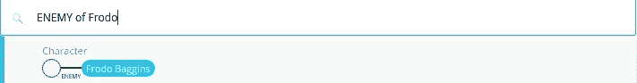
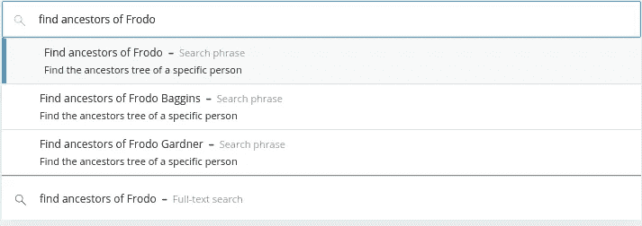

# 维基指环王:将维基数据导入 Neo4j 并分析家谱

> 原文：<https://towardsdatascience.com/lord-of-the-wiki-ring-importing-wikidata-into-neo4j-and-analyzing-family-trees-da27f64d675e?source=collection_archive---------36----------------------->

## 了解如何从维基数据中抓取 LOTR 世界，并使用 Neo4j for Graph Data Science 工具箱对其进行分析

在我之前关于结合 NLP 技术和图形的[的长篇文章取得如此大的成功之后，我准备了另一个详尽的教程。我们将讨论几个话题。我们将通过](/nlp-and-graphs-go-hand-in-hand-with-neo4j-and-apoc-e57f59f46845)[维基数据 API](https://www.wikidata.org/wiki/Wikidata:Main_Page) 将数据导入 [Neo4j](https://neo4j.com/) 开始。当我们完成的时候，我们将会收集维基数据上的大部分 LOTR 信息。在下一步中，我们将准备一个探索性的数据分析，并展示如何根据一些假设填充缺失值。最重要的是，我们将运行一些图形算法，并准备一些漂亮的可视化。

确保你身边有一些爆米花，并准备好一些深入的图表分析。

# 议程

*   将维基百科数据导入 Neo4j
*   基本图形探索
*   填充缺少的值
*   更多的图形探索
*   弱连通分量
*   中间中心性
*   用 Bloom 实现图形可视化(很酷的部分！)

# 图表模式

您可以通过`db.schema.visualization()`程序在 Neo4j 浏览器中可视化图形模式。这是一个方便的过程，可以自动捕获存储图的模式。

*附注:只有在我们导入图表后才运行它*

```
CALL db.schema.visualization()
```

结果


我们使用简单的图表模式已经有一段时间了。我很高兴地说，这一次有点复杂。我们有一个有家族关系的角色的社交网络，像**配偶**、**兄弟姐妹**、**有父亲**，甚至没有像**敌人**这样的家族关系。我们知道一些关于角色的附加信息，比如他们的国家、种族和他们所属的任何团体。

# 维基数据导入

如前所述，我们将在`apoc.load.json`过程的帮助下从 WikiData API 获取数据。如果您还不知道的话， [APOC](https://github.com/neo4j-contrib/neo4j-apoc-procedures) 为将数据导入 Neo4j 提供了出色的支持。除了从任何 REST API 获取数据的能力，它还具有通过 JDBC 驱动程序与其他数据库(如 MongoDB 或关系数据库)集成的功能。

如果你经常使用 RDF 数据，你应该去看看这个 [*新语义库*](https://neo4j.com/docs/labs/nsmntx/current/) *。*

我们将从引入 LOTR 世界的所有种族开始。我不得不承认我对 SPARQL 一无所知，所以我不会深入解释语法。如果你需要关于如何查询维基数据的基本介绍，我推荐 Youtube 上的这个[教程](https://www.youtube.com/watch?v=kJph4q0Im98)。基本上，LOTR 世界中的所有种族都是 id 为 Q989255 的中土种族实体的一个实例。为了获得特定条目的出现次数，我们使用下面的 SPARQL 子句:

```
?item wdt:P31 wd:Q989255
```

这可以翻译为“我们想要获取一个项目，它是一个 id 为 [Q989255](https://www.wikidata.org/wiki/Q989255) 的实体(wdt: [P31](https://www.wikidata.org/wiki/Property:P31) )的实例”。在我们用 APOC 下载了数据之后，我们将结果存储到 Neo4j 中。

```
// Prepare a SPARQL query
WITH 'SELECT ?item ?itemLabel
      WHERE{
      ?item wdt:P31 wd:Q989255 .
      SERVICE wikibase:label { bd:serviceParam wikibase:language
      "[AUTO_LANGUAGE],en" }
      }' AS sparql
// make a request to Wikidata
CALL apoc.load.jsonParams(
        "https://query.wikidata.org/sparql?query=" + 
            apoc.text.urlencode(sparql),
        { Accept: "application/sparql-results+json"}, null)
YIELD value
// Unwind results to row
UNWIND value['results']['bindings'] as row
// Prepare data
WITH row['itemLabel']['value'] as race, 
     row['item']['value'] as url, 
     split(row['item']['value'],'/')[-1] as id
// Store to Neo4j
CREATE (r:Race)
SET r.race = race,
    r.url = url,
    r.id = id
```

那很容易。下一步是获取给定中土世界种族的实例角色。SPARQL 语法与前面的查询几乎相同，只是这一次，我们对每个种族进行迭代，并找到属于它的字符。

```
// Iterate over each race in graph
MATCH (r:Race)
// Prepare a SparQL query
WITH 'SELECT ?item ?itemLabel
      WHERE {
        ?item wdt:P31 wd:' + r.id + ' .
        SERVICE wikibase:label { bd:serviceParam wikibase:language
        "[AUTO_LANGUAGE],en" }
      }' AS sparql, r
// make a request to Wikidata
CALL apoc.load.jsonParams(
    "https://query.wikidata.org/sparql?query=" + 
      apoc.text.urlencode(sparql),
    { Accept: "application/sparql-results+json"}, null)
YIELD value
UNWIND value['results']['bindings'] as row
WITH row['itemLabel']['value'] as name, 
     row['item']['value'] as url, 
     split(row['item']['value'],'/')[-1] as id, 
     r
// Store to Neo4j
CREATE (c:Character)
SET c.name = name,
    c.url = url,
    c.id = id
CREATE (c)-[:BELONG_TO]->(r)
```

你知道中土世界至少有 700 个角色吗？我从来没有想到会有这么多记录在维基数据上。我们的第一个探索性的密码查询将是按种族统计他们。

```
MATCH (r:Race)
RETURN r.race as race, 
       size((r)<-[:BELONG_TO]-()) as members
ORDER BY members DESC 
LIMIT 10
```

结果

指环组的[团队是中土世界种族的一个代表样本。大多数角色要么是人类，要么是霍比特人，有几个精灵和矮人漫步走过。不过，这是我第一次听说梵拉和梅尔的比赛。](https://lotr.fandom.com/wiki/Fellowship_of_the_Ring_(group))

现在是时候用关于人物性别、国家和死亡方式的信息来丰富图表了。SPARQL 查询将与以前略有不同。这一次，我们将直接通过惟一的 id 选择一个 WikiData 实体，并有选择地获取它的一些属性。我们可以使用下面的 SPARQL 子句按 id 过滤特定的项目:

```
filter (?item = wd:' + r.id + ')
```

与 cypher 查询语言类似，SPARQL 也区分了`MATCH`和`OPTIONAL MATCH`。当我们想要返回一个实体的多个属性时，最好将每个属性包装成一个`OPTIONAL MATCH`。这样，如果任何属性存在，我们将得到结果。如果没有`OPTIONAL MATCH`，我们将只能得到所有三个属性都存在的实体的结果。这是与 cypher 相同的行为。

```
OPTIONAL{ ?item wdt:P21 [rdfs:label ?gender] . 
           filter (lang(?gender)="en") }
```

`wdt:P21`表示我们对性别属性感兴趣。我们还指定我们想要获得一个实体的英文标签，而不是它的 WikiData id。搜索所需属性 id 的最简单方法是检查 WikiData 网页上的项目，并将鼠标悬停在属性名称上。


另一种方法是使用 [WikiData 查询编辑器](https://query.wikidata.org/)，它通过使用 CTRL+T 命令具有强大的自动完成功能。


为了将图形存储回 Neo4j，我们将使用`FOREACH`技巧。因为我们的一些结果将包含空值，所以我们必须将`MERGE`语句包装到支持条件执行的`FOREACH`语句中。查看[迈克尔·亨格](https://medium.com/neo4j/5-tips-tricks-for-fast-batched-updates-of-graph-structures-with-neo4j-and-cypher-73c7f693c8cc)[的博客文章](https://twitter.com/mesirii)了解更多信息。

```
// Iterate over characters
MATCH (r:Character)
// Prepare a SparQL query
WITH 'SELECT *
      WHERE{
        ?item rdfs:label ?name .
        filter (?item = wd:' + r.id + ')
        filter (lang(?name) = "en" ) .
      OPTIONAL{
        ?item wdt:P21 [rdfs:label ?gender] .
        filter (lang(?gender)="en")
      }
      OPTIONAL{
        ?item wdt:P27 [rdfs:label ?country] .
        filter (lang(?country)="en")
      }
      OPTIONAL{
        ?item wdt:P1196 [rdfs:label ?death] .
        filter (lang(?death)="en")
      }}' AS sparql, r
// make a request to Wikidata
CALL apoc.load.jsonParams(
    "https://query.wikidata.org/sparql?query=" + 
    apoc.text.urlencode(sparql),
     { Accept: "application/sparql-results+json"}, null)
YIELD value
UNWIND value['results']['bindings'] as row
SET r.gender = row['gender']['value'], 
    r.manner_of_death = row['death']['value']
// Execute FOREACH statement
FOREACH(ignoreme in case when row['country'] is not null then [1] else [] end | 
        MERGE (c:Country{name:row['country']['value']})
        MERGE (r)-[:IN_COUNTRY]->(c))
```

我们正在一点一点地将额外的信息连接到我们的图表，并慢慢地将它转化为知识图表。我们先来看死亡财产的方式。

```
MATCH (n:Character) 
WHERE exists (n.manner_of_death)
RETURN n.manner_of_death as manner_of_death, 
       count(*) as count
```

结果

没什么有趣的。这显然不是《权力的游戏》系列。我们也来考察一下国家财产的结果。

```
MATCH (c:Country)
RETURN c.name as country, 
       size((c)<-[:IN_COUNTRY]-()) as members
ORDER BY members 
DESC LIMIT 10
```

结果

我们有 236 个字符的国家信息。我们可以做一些假设，并尝试填充缺失的国家值。让我们假设如果两个人是兄弟姐妹，他们属于同一个国家。这很有道理。为了实现这一点，我们必须从维基数据中导入家族关系。具体来说，我们将获取父亲、母亲、亲戚、兄弟姐妹和配偶关系。

```
// Iterate over characters
MATCH (r:Character)
WITH 'SELECT *
      WHERE{
        ?item rdfs:label ?name .
        filter (?item = wd:' + r.id + ')
        filter (lang(?name) = "en" ) .
      OPTIONAL{
        ?item wdt:P22 ?father
      }
      OPTIONAL{
         ?item wdt:P25 ?mother
      }
      OPTIONAL{
         ?item wdt:P1038 ?relative
      }
      OPTIONAL{
         ?item wdt:P3373 ?sibling
      }
      OPTIONAL{
         ?item wdt:P26 ?spouse
      }}' AS sparql, r
// make a request to wikidata
CALL apoc.load.jsonParams(
    "https://query.wikidata.org/sparql?query=" + 
     apoc.text.urlencode(sparql),
     { Accept: "application/sparql-results+json"}, null)
YIELD value
UNWIND value['results']['bindings'] as row
FOREACH(ignoreme in case when row['mother'] is not null then [1] else [] end | 
        MERGE (c:Character{url:row['mother']['value']}) 
        MERGE (r)-[:HAS_MOTHER]->(c))
FOREACH(ignoreme in case when row['father'] is not null then [1] else [] end | 
        MERGE (c:Character{url:row['father']['value']}) 
        MERGE (r)-[:HAS_FATHER]->(c))
FOREACH(ignoreme in case when row['relative'] is not null then [1] else [] end | 
        MERGE (c:Character{url:row['relative']['value']}) 
        MERGE (r)-[:HAS_RELATIVE]-(c))
FOREACH(ignoreme in case when row['sibling'] is not null then [1] else [] end | 
        MERGE (c:Character{url:row['sibling']['value']}) 
        MERGE (r)-[:SIBLING]-(c))
FOREACH(ignoreme in case when row['spouse'] is not null then [1] else [] end | 
        MERGE (c:Character{url:row['spouse']['value']}) 
        MERGE (r)-[:SPOUSE]-(c))
```

在我们开始填充缺失值之前，让我们检查一下中土世界的滥交情况。第一个查询将搜索有多个配偶的角色。

```
MATCH p=()-[:SPOUSE]-()-[:SPOUSE]-()
RETURN p LIMIT 10
```

结果


我们实际上发现了一个有两个配偶的角色。是芬威，诺尔多的第一任国王。我们也可以看看某人是否有多个伴侣的孩子

```
MATCH (c:Character)<-[:HAS_FATHER|HAS_MOTHER]-()-[:HAS_FATHER|HAS_MOTHER]->(other)
WITH c, collect(distinct other) as others
WHERE size(others) > 1
MATCH p=(c)<-[:HAS_FATHER|HAS_MOTHER]-()-[:HAS_FATHER|HAS_MOTHER]->()
RETURN p
```

结果


所以看起来芬威和茵迪丝有四个孩子，和米里埃尔有一个孩子。另一方面，贝伦有两个父亲是很奇怪的。我想阿达内尔需要解释一下。我们可能会在 GoT 世界发现更多的死亡和滥交。

# 填充缺少的值

现在我们知道了中土世界的人物不滥交，让我们填充缺失的国家价值观。记住，我们的假设是:

> 如果两个角色是兄弟姐妹，他们属于同一个国家。

在我们填充国家/地区的缺失值之前，让我们填充兄弟国家/地区的缺失值。我们将假设如果两个角色有相同的母亲或父亲，他们是兄弟姐妹。让我们看看一些同胞候选人。

```
MATCH p=(a:Character)-[:HAS_FATHER|:HAS_MOTHER]->()<-[:HAS_FATHER|:HAS_MOTHER]-(b:Character)
WHERE NOT (a)-[:SIBLING]-(b)
RETURN p
LIMIT 5
```

结果


阿轧曼塔·丘博至少有六个孩子。其中只有两个被标记为兄弟姐妹。因为根据定义，它们都是兄弟姐妹，所以我们将填充缺失的连接。

```
MATCH p=(a:Character)-[:HAS_FATHER|:HAS_MOTHER]->()<-[:HAS_FATHER|:HAS_MOTHER]-(b:Character)
WHERE NOT (a)-[:SIBLING]-(b)
MERGE (a)-[:SIBLING]-(b)
```

该查询添加了 118 个缺失的关系。我需要学习如何更新维基数据知识图，并批量添加缺失的连接。现在，我们可以为兄弟姐妹填写缺失的国家值。我们会将所有字符与已填写的国家信息进行匹配，并搜索他们没有国家信息的兄弟姐妹。我喜欢用 cypher 查询语言表达这种模式是如此简单。

```
MATCH (country)<-[:IN_COUNTRY]-(s:Character)-[:SIBLING]-(t:Character) WHERE NOT (t)-[:IN_COUNTRY]->()
MERGE (t)-[:IN_COUNTRY]->(country)
```

新增了 49 个缺失的国家。我们可以很快提出更多的假设来填补缺失的值。您可以尝试自己添加一些其他缺失的属性。

我们仍然需要在图表中添加一些信息。在这个查询中，我们将添加关于角色的职业、语言、群体和事件的信息。SPARQL 查询与之前的相同，我们遍历每个字符并获取额外的属性。

```
MATCH (r:Character)
WHERE exists (r.id)
WITH 'SELECT *
      WHERE{
         ?item rdfs:label ?name .
         filter (?item = wd:' + r.id + ')
         filter (lang(?name) = "en" ) .
      OPTIONAL {
        ?item wdt:P106 [rdfs:label ?occupation ] .
         filter (lang(?occupation) = "en" ).
       }
      OPTIONAL {
        ?item wdt:P103 [rdfs:label ?language ] .
        filter (lang(?language) = "en" ) .
       }
      OPTIONAL {
        ?item wdt:P463 [rdfs:label ?member_of ] .
        filter (lang(?member_of) = "en" ).
      }
      OPTIONAL {
        ?item wdt:P1344[rdfs:label ?participant ] .
        filter (lang(?participant) = "en") .
      }
     OPTIONAL {
       ?item wdt:P39[rdfs:label ?position ] .
       filter (lang(?position) = "en") .
     }}' AS sparql, r
CALL apoc.load.jsonParams(
    "https://query.wikidata.org/sparql?query=" + 
     apoc.text.urlencode(sparql),
    { Accept: "application/sparql-results+json"}, null)
YIELD value
UNWIND value['results']['bindings'] as row
FOREACH(ignoreme in case when row['language'] is not null then [1] else [] end | 
    MERGE (c:Language{name:row['language']['value']}) 
    MERGE (r)-[:HAS_LANGUAGE]->(c))
FOREACH(ignoreme in case when row['occupation'] is not null then [1] else [] end | 
    MERGE (c:Occupation{name:row['occupation']['value']}) 
    MERGE (r)-[:HAS_OCCUPATION]->(c))
FOREACH(ignoreme in case when row['member_of'] is not null then [1] else [] end | 
    MERGE (c:Group{name:row['member_of']['value']}) 
    MERGE (r)-[:MEMBER_OF]->(c))
FOREACH(ignoreme in case when row['participant'] is not null then [1] else [] end | 
    MERGE (c:Event{name:row['participant']['value']}) 
    MERGE (r)-[:PARTICIPATED]->(c))
SET r.position = row['position']['value']
```

我们来调查一下各组的成绩和人物的职业。

```
MATCH (n:Group)<-[:MEMBER_OF]-(c)
OPTIONAL MATCH (c)-[:HAS_OCCUPATION]->(o)
RETURN n.name as group, 
       count(*) as size, 
       collect(c.name)[..3] as members, 
       collect(distinct o.name)[..3] as occupations
ORDER BY size DESC
```

结果

就在这时，我意识到整个霍比特人系列都包括在内。巴林是索林公司集团的日记作者。出于某种原因，我期待比尔博·巴金斯是日记作者。很明显，环组团契里只能有一个弓箭手，那就是勒苟拉斯。甘道夫似乎参与了几个组织。

我们将再执行一次 WikiData API 调用。这一次我们将取得敌人和角色拥有的物品。

```
MATCH (r:Character)
WHERE exists (r.id)
WITH 'SELECT *
      WHERE
      {
        ?item rdfs:label ?name .
        filter (?item = wd:' + r.id + ')
        filter (lang(?name) = "en" ) .
      OPTIONAL{
        ?item wdt:P1830 [rdfs:label ?owner ] .
        filter (lang(?owner) = "en" ).
      }
      OPTIONAL{
       ?item wdt:P7047 ?enemy 
      }}' AS sparql, r
CALL apoc.load.jsonParams(
    "https://query.wikidata.org/sparql?query=" + 
     apoc.text.urlencode(sparql),
{ Accept: "application/sparql-results+json"}, null)
YIELD value
WITH value,r
WHERE value['results']['bindings'] <> []
UNWIND value['results']['bindings'] as row
FOREACH(ignoreme in case when row['owner'] is not null then [1] else [] end | 
    MERGE (c:Item{name:row['owner']['value']}) 
    MERGE (r)-[:OWNS_ITEM]->(c))
FOREACH(ignoreme in case when row['enemy'] is not null then [1] else [] end | 
    MERGE (c:Character{url:row['enemy']['value']}) 
    MERGE (r)-[:ENEMY]->(c))
```

最后，我们已经完成了图表的导入。我们来看看直系亲属之间有多少仇人。

```
MATCH p=(a)-[:SPOUSE|SIBLING|HAS_FATHER|HAS_MOTHER]-(b)
WHERE (a)-[:ENEMY]-(b)
RETURN p
```

结果


看起来 Morgoth 和 Manw 是兄弟也是敌人。这是我第一次听说这两个人，但是 [LOTR 粉丝网站](https://lotr.fandom.com/wiki/Melkor)声称 Morgoth 是第一个黑魔王。我们来看看二级亲属内部有多少敌人。

```
MATCH p=(a)-[:SPOUSE|SIBLING|HAS_FATHER|HAS_MOTHER*..2]-(b) 
WHERE (a)-[:ENEMY]-(b) 
RETURN p
```

结果


第二代家庭内部的敌人并不多。我们可以观察到，瓦尔达已经采取了她丈夫的立场，也是与摩哥特为敌。这是一个稳定的三角形或三和弦的例子。三角形由一个积极的关系(配偶)和两个消极的关系(敌人)组成。在社会网络分析中，三角形用于衡量网络的凝聚力和结构稳定性。

# 图形数据科学

如果你读过我以前的博客文章，你会知道我必须包括一些来自[图形数据科学](https://github.com/neo4j/graph-data-science)图书馆的图形算法的用例。如果你需要快速复习一下 GDS 图书馆是如何运作的，幕后发生了什么，我建议你看看我之前的博客文章。

我们将从投影家庭网络开始。我们加载了所有的角色以及他们之间的家庭关系，比如配偶、兄弟姐妹、父母。

```
CALL gds.graph.create('family','Character',
    ['SPOUSE','SIBLING','HAS_FATHER','HAS_MOTHER'])
```

# 弱连通分量

[弱连通分量算法](https://neo4j.com/docs/graph-data-science/current/algorithms/wcc/)用于在我们的网络中寻找孤岛或不连通分量。以下可视化包含两个连接的组件。第一部分由迈克尔、马克和道格组成，而第二部分由爱丽丝、查尔斯和布里奇特组成。


在我们的例子中，我们将使用弱连接组件算法来寻找家庭网络中的孤岛。同一家庭成员中的所有成员都以某种方式相互关联。可能是嫂子的祖母的表亲，或者更直接一点的兄弟姐妹。为了大致了解结果，我们将运行算法的`stats`模式。

```
CALL gds.wcc.stats('family')
YIELD componentCount, componentDistribution
RETURN componentCount as components, 
       componentDistribution.p75 as p75,
       componentDistribution.p90 as p90,
       apoc.math.round(componentDistribution.mean,2) as mean,
       componentDistribution.max as max
```

结果

在我们的图表中有 145 个岛屿。75%以上的组件只包含一个字符。这意味着大约 110 (75% * 145)个角色没有图中描述的任何家族联系。如果它们只有一个连接，那么组件的大小至少是两个。最大的组成部分有 328 名成员。那一定是一个幸福的家庭。让我们写回结果，进一步分析家庭组成。

```
CALL gds.wcc.write('family', {writeProperty:'familyComponent'})
```

我们将从五个最大的家庭组成部分开始。我们感兴趣的第一件事是哪些种族出现在家谱中。我们还将在结果中添加一些随机成员，以便更好地感受数据。

```
MATCH (c:Character)
OPTIONAL MATCH (c)-[:BELONG_TO]->(race)
WITH c.familyComponent as familyComponent, 
     count(*) as size, 
     collect(c.name) as members,
     collect(distinct race.race) as family_race
     ORDER BY size DESC LIMIT 5 
RETURN familyComponent, 
       size, 
       members[..3] as random_members,
       family_race
```

结果

如前所述，最大的家族有 328 名成员，他们来自不同的种族，从精灵到人类，甚至是玛雅人。在中土世界，精灵和人类的生活似乎纠缠在一起。还有他们的腿。半精灵种族的存在是有原因的。其他种族，像霍比特人和矮人，更忠于自己的同类。

让我们来看看最大的社区中的跨种族婚姻。

```
MATCH (c:Character)
WHERE c.familyComponent = 169 // fix the family component 
MATCH p=(race)<-[:BELONG_TO]-(c)-[:SPOUSE]-(other)-[:BELONG_TO]->(other_race)
WHERE race <> other_race AND id(c) > id(other)
RETURN c.name as spouse_1, 
       race.race as race_1, 
       other.name as spouse_2, 
       other_race.race as race_2
```

结果

首先，我不知道埃尔隆德是半精灵。看起来人类和精灵的“联盟”历史悠久。我主要是期待看到阿尔温和阿拉贡，因为我记得从电影中。了解半精灵可以追溯到多远会很有趣。我们来看看谁是拥有最多后代的半精灵。

```
MATCH (c:Character)
WHERE (c)-[:BELONG_TO]->(:Race{race:'half-elven'}) 
MATCH p=(c)<-[:HAS_FATHER|HAS_MOTHER*..20]-(end)
WHERE NOT (end)<-[:HAS_FATHER|:HAS_MOTHER]-()
WITH c, max(length(p)) as descendants
ORDER BY descendants DESC
LIMIT 5
RETURN c.name as character, 
       descendants
```

结果

迪奥·艾鲁奇似乎是记录在案的最古老的半精灵。我在 [LOTR 粉丝网站](https://lotr.fandom.com/wiki/Dior)检查了结果，看来我们是对的。迪奥·艾鲁奇尔诞生于公元 470 年的第一个纪元。还有几个半精灵出生在迪奥之后的 50 年内。

# 中间中心性

我们还将看一下介数中心算法。它用于查找不同社区之间的桥节点。如果我们看一下下面的可视化，我们可以观察到美国队长具有最高的中间中心性分数。这是因为他是网络中的主要桥梁，连接着图的左边和右边。网络中的第二座桥是野兽。我们可以很容易地看到，图表的中央和右侧之间交换的所有信息都必须通过他才能到达右侧。


我们会在最大的家庭网络中寻找桥段人物。我的猜测是，跨种族婚姻中的配偶将会胜出。这是因为所有种族之间的交流都通过他们进行。我们已经看到只有六种不同种族间的婚姻，所以很可能其中一些会胜出。

```
CALL gds.alpha.betweenness.stream({
    nodeQuery:"MATCH (n:Character) WHERE n.familyComponent = 169
               RETURN id(n) as id",
    relationshipQuery:"MATCH (s:Character)-[:HAS_FATHER|HAS_MOTHER|SPOUSE|SIBLING]-(t:Character)
                       RETURN id(s) as source, id(t) as target",
    validateRelationships:false})
YIELD nodeId, centrality
RETURN gds.util.asNode(nodeId).name as character,
       centrality
ORDER BY centrality DESC LIMIT 10
```

结果

有趣的是阿尔温和阿拉贡获得了冠军。不知道为什么，但我一直认为他们是现代的罗密欧和朱丽叶，他们通过婚姻结成了人类和半精灵之间的联盟。我不知道 JRR 托尔金系统是如何生成名字的，但它似乎有点偏向于以 a 开头的名字。

# Neo4j Bloom

到目前为止，我们已经完成了数据分析，并获得了一些见解。现在是时候用图表的实际应用来给我们的同事留下深刻印象了。 [Neo4j Bloom](https://neo4j.com/bloom/) 是图形数据科学生态系统 [Neo4j 的一部分。它是一个工具，主要用于研究图形，并允许用户在很少或没有密码知识的情况下进行研究。查看由 Lju Lazarevic](https://neo4j.com/blog/announcing-neo4j-for-graph-data-science/) 发布的[绽放精彩](https://medium.com/neo4j/bloom-ing-marvellous-a2be0c3702bb)的帖子，了解最新功能。

Neo4j Bloom 预装了 [Neo4j 桌面](https://neo4j.com/download/)包。我已经写了一篇关于如何开始使用它的博客文章。一旦你打开了 Neo4j Bloom，创建你的第一视角。


点击**生成**按钮，自动生成图形透视图。一旦创建了视图，将鼠标悬停在它上面并单击 Use 透视图。


# 近自然语言搜索

欢迎来到 Neo4j Bloom。没有 cypher 查询知识的用户可以使用[近自然语言搜索](https://www.youtube.com/watch?v=9rL8O0lsuDc)来探索图表。我们先在搜索栏输入**敌人**开始。


Bloom 自动为我们提供了一个可能与我们的搜索查询相关的模式。如果我们点击它，我们将得到以下可视化。


是的，我知道。网络中的所有节点都是蓝色的。我们一会儿就会谈到这个问题。可视化清楚地显示了两个集群或社区。在图的左边，我们看到好人和索伦在战斗。这是 LOTR 系列的。在右边，我们有好人对抗魔哥特人。我猜这一定是霍比特人系列。

如果你想改变节点的颜色，按照这个图像。首先，点击字符标签，然后选择基于**规则的**选项卡，输入您的颜色规则。在我们的例子中，我们把所有的女性角色都涂成红色。


通过近自然语言搜索，我们还可以定义更精确的图形模式。例如，假设我们想调查佛罗多·巴金斯先生的敌人。



它会自动完成我们正在寻找的模式。如果我们点击它，我们会得到。


# 搜索短语:最短路径

搜索短语机制允许我们向 Neo4j Bloom 添加自定义搜索功能。我们首先定义搜索短语应该是什么样子。我们可以使用 **$** 符号向搜索查询添加参数。对搜索短语参数的自动完成支持是现成的，这真的很可爱。然后，我们输入所需的 cypher 查询，就万事俱备了。我们将使用下面的 cypher 查询来查找任意两个角色之间家族关系的最短路径。

```
MATCH (s:Character)
WHERE s.name = $source
MATCH (t:Character)
WHERE t.name = $target
MATCH p=shortestPath((s)-[:HAS_FATHER|HAS_MOTHER|SIBLING|SPOUSE*..25]-(t))
RETURN p
```

填写好的搜索短语将如下所示:


现在我们可以在搜索框中执行新的搜索短语。如前所述，该应用程序帮助我们自动完成。


对于佛罗多·巴金斯和山姆卫斯·詹吉之间的最短家族关系路径，我们得到以下结果。他们有血缘关系，但是只有 9 步之遥。佛罗多的堂兄有一个儿子，是山姆女儿的丈夫的祖父。希望我没有搞砸。


# 搜索短语:祖先树

最后，我们将创建一个搜索短语来分析给定角色的家族祖先树。我为 cypher 查询准备了两种变体。第一个变体只遍历 HAS_FATHER 和 HAS_MOTHER 关系。

```
MATCH (c:Character)
WHERE c.name = $name
MATCH p=(c)-[:HAS_FATHER|HAS_MOTHER*..20]->()
RETURN p
```

第二个变体将之前用弱连通分量算法计算的整个家族分量可视化。

```
MATCH (c:Character)
WHERE c.name = $name
WITH c.familyComponent as family
MATCH p=(c1)--(c2)
WHERE c1.familyComponent = family AND c2.familyComponent = family
RETURN p
```

我们将使用第一种变体，因为它为博客文章产生了更漂亮的可视化效果，但是我鼓励您亲自尝试第二种变体。


我们添加了另一个搜索短语。我们现在可以在搜索栏中使用它。



结果


# 结论

我真的很喜欢写这篇博客和搜集维基数据知识图表。它包含了丰富的信息，我们可以在 Neo4j 中进行分析。我可以把这篇博文分成两部分甚至三部分。尽管如此，我还是喜欢将所有内容放在一个地方，向您展示完成图形分析的整个循环是多么容易，从导入和丰富图形到基本的数据探索和分析，我们以一些漂亮的图形可视化为基础。立即试用并下载 [Neo4j 桌面](https://neo4j.com/download-center/)。如果您有任何反馈或问题，可以在 [Neo4j 社区网站](http://community.neo4j.com)上分享。

和往常一样，代码可以在 [GitHub](https://github.com/tomasonjo/blogs/blob/master/Lord_of_the_wikidata/Part1%20Importing%20Wikidata%20into%20Neo4j%20and%20analyzing%20family%20trees.ipynb) 上获得。