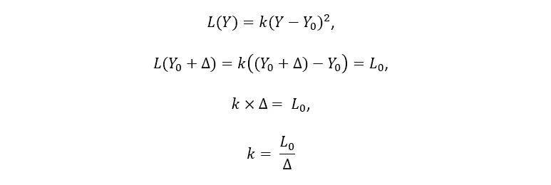
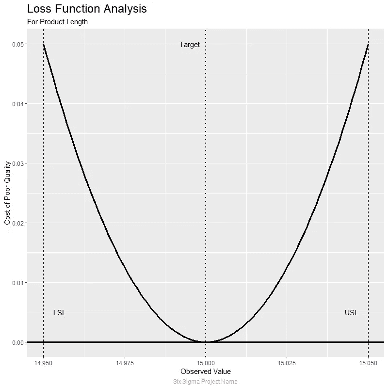

# 带 R 的损失函数分析

> 原文：<https://towardsdatascience.com/loss-function-analysis-with-r-6d14ee79f6c4?source=collection_archive---------45----------------------->

## r 代表工业工程师

## 质量差的代价

由 Markus Spiske 拍摄的图片可在 [Unsplash](https://unsplash.com/photos/2VMcpbUR6w8) 获得

# 劣质成本

制成品是由其特征的质量来定义的。但是，其中只有一部分与客户相关；这些被称为 CTQ(质量关键)特性。应该适当地设计和执行与开发最终结果相关的每个过程。根据六适马方法:高质量的流程会自动带来高质量的产品。

前面介绍了 COT(质量成本)的概念，即生产不符合顾客需求的低质量产品的成本(即劣质成本)。涉及组织的经济损失的成本可以通过基于过程可变性的函数来建模。

根据 ISO 9000 标准，质量被定义为一组固有特性满足需求的*程度。因此，这些需求必须是可测量的。它们通常是一个**目标值**和一个围绕目标值的**容差**，表示为规格下限(LSL)和规格上限(USL)之间的间隔。*

当 CTQ 特性超过规格上限或下限时，会得到质量差的结果，从而导致可以计算的成本。在六适马工具下，与传统方法不同，传统方法通过将缺陷项目总数乘以质量差的成本(即报废产品的成本)来计算质量差的成本，而质量差的成本是使用田口损失函数来计算的。

# 损失函数符号

CTQ 特性由 *Y* 表示。损失函数提供了一个以货币单位表示成本值的数字，它直接取决于 CTQ 的值。因此，损失函数是观测值的函数，由 *L* ( *Y* )表示。

这意味着对于 CTQ 特性的每个值，只有一个损失值(成本)。CTQ 特性的目标值用 *Y0、*表示，公差用δ表示。设质量差的成本在*Y*=*Y0*+δ为 *L0* 。那就是:

# 田口损失函数

根据六适马方法，将 CTQ 特性控制在规格范围内是不够的。相反，它的目标是**以尽可能小的变化接近目标**。基于这一前提，损失函数应该考虑与目标值的距离。

田口损失函数定义为:

其中:

*   *L* ( *Y* )代表以货币单位表示的成本值
*   *k* 代表功能容忍度与客户流失的比值
*   *Y* 代表观察值
*   *Y0* 代表目标值

常数 *k* 可以通过损失函数的公式很容易地计算出来:

田口损失函数具有以下特性:

*   当观察值等于目标值时，损失为零
*   当观察值远离目标时，损失增加
*   常数 *k* 表示具有更多变化的风险

# 平均损失函数

上面的公式获得了单个项目的损失函数。然而，他们的目标是计算一个过程在一段时间内质量差的成本。因此，考虑一个周期或一组项目中的 *n* 个元素，通过平均单个损失来获得每单位的平均损失( *L* )。因此:

# 总损失函数

损失函数本身用于获得一组项目的预期损失(平均)。这可以通过将每个项目的平均损失乘以组中的项目总数(N)来实现。因此:

对于下面的例子，让我们考虑一家每年生产 10，000 件特定产品的公司，其最相关的 CTQ 特征是其长度。考虑到目标值( *Y0* )为 15 毫米，公差(δ)为 0.05 毫米，且报废时每单位成本估计值( *L0* )为 1 美元，工程师有兴趣计算这种特殊产品每年的总质量成本。我们来看看 R 代码！

损失函数分析图

# 总结想法

质量保证对每个组织来说都是一个非常重要的话题。一个企业的持续性可能会受到其实现满足客户需求的高质量产品的承诺的影响。同样，由于低质量的成本会导致经济损失，组织必须寻找改进和优化流程的方法，以减少废品和返工。

损失函数及其分析可以用 R 建模，只需几行代码。工业工程师、质量工程师和运营经理必须精通这一主题，以减少与低质量结果相关的经济影响和损失。如上所述:高质量的流程会自动带来高质量的产品。

*— —*

*如果你觉得这篇文章有用，欢迎在* [*GitHub*](https://github.com/rsalaza4/R-for-Industrial-Engineering/blob/master/Six%20Sigma/Loss%20Function%20Analysis.R) *上下载我的个人代码。你也可以直接在 rsalaza4@binghamton.edu 给我发邮件，在*[*LinkedIn*](https://www.linkedin.com/in/roberto-salazar-reyna/)*上找到我。有兴趣了解工程领域的数据分析、数据科学和机器学习应用的更多信息吗？通过访问我的媒体* [*个人资料*](https://robertosalazarr.medium.com/) *来探索我以前的文章。感谢阅读。*

罗伯特