# 损失景观和维度的祝福

> 原文：<https://towardsdatascience.com/loss-landscapes-and-the-blessing-of-dimensionality-46685e28e6a4?source=collection_archive---------9----------------------->

## 探索深度学习损失景观的可视化，维度的祝福和其他视觉效果，包括 GANs 和几何 DL

损失景观可视化由哈维尔 Ideami | losslandscape.com

在本文中，您将:

*   **了解**如何**可视化神经网络的损失场景**。
*   **使用从各种网络(从卷积网络到 GANs)中捕获的真实数据**，探索损失场景**的高分辨率可视化**(静态**和动态**)。
*   探索**分析这些可视化的方法**并举例说明。
*   探索进入**几何深度学习**和**贝叶斯深度学习**的**其他可视化**。
*   探索**“维度祝福”**概念。

可视化损失景观。贾维尔·艾达米| losslandscape.com 制作的信息图

# 优化与生活。这都是关于运动

*“生命需要运动*——亚里士多德，公元前 4 世纪)

*“生命就是运动。生命越多，灵活性就越大。你越流畅，你就越有活力。”* —阿诺·德雅尔丹斯

*“生命是运动，运动是变化”* —尼尔·唐纳德·沃尔什语录的开头

如果生活可以归结为一件事，那就是运动。活着就是要继续前进” —杰瑞·宋飞

正如历史上许多知名人士告诉我们的那样，生活就是运动。生活是以积极的方式改变你的状态，从 A 到 B。生活也是一个昂贵的过程，这使得从 A 到 B 的过程变得微妙而迷人，需要优化。这就是我们开始这篇文章的地方。虽然我们将在接下来的章节中关注深度学习和人工智能，但我们将同时触及普遍的主题和原则，这些主题和原则涉及到活着的核心意义。搬家。从一个地方到另一个地方，以一种优化的方式去做。在一个依赖于大量参数的过程中，这使得它是多维的。这使得很难想象只有 3 维空间(4 维时间)的存在。这就是本文的全部内容。所以让我们从一切开始的地方开始这次旅程，从运动开始。

假设我们想从 A 到 B 去实现某个目标。

*   我们想学画人脸。
*   我们想成为一名成功的医生。
*   我们希望在金融欺诈发生时发现它。
*   我们明天想早起做运动。
*   我们想要过令人满意的生活。
*   这周我们想吃得更健康。
*   我们想自动检测家中的入侵者。

这些挑战有的需要几分钟，有的需要几小时，有的需要几天，有的需要几年。其中一些取决于中等数量的因素，另一些取决于大量的因素。

我们希望优化这些挑战和无限的其他挑战，目标总是从 A 到 b。你也可以结合许多挑战，将生活本身视为由不同规模的优化过程组成的巨大分形。

从 A 地到 B 地可以用不同的方式解决。我们可以非常系统地做这件事，尝试各种可能性。或者我们可以试着找到最有效的方法尽快到达那里。事实证明，生活就是优化，因为，如前所述，生活是昂贵的。时间是昂贵的，葡萄糖是昂贵的，维持我们的生命，总的来说，生命是昂贵的。所以**这一切都是为了优化从 A 到 b 的过程**，尽可能快地找到到达目标的最有效方式。

现在，如果我们想优化任何挑战，我们首先需要了解在解决挑战的过程中涉及到多少因素，多少参数。那么，**在每个特定的挑战中**涉及多少因素呢？

我们面临的一些挑战取决于一两个关键因素。其他人 10 分钟或 20 分钟后。其中一些在 100 或更多。还有一些，比如我们成为一名成功的医生的目标可能取决于成千上万的因素，这些因素的价值必须在多年内以正确的方式结合起来，才能带你达到那个目标。

**深度学习和神经网络**也能应对复杂的挑战。他们还需要一个优化过程来找到帮助网络从 A 到 B 的最佳因素组合:从一系列图像到预测这些图像代表什么。从英语的单词序列到西班牙语的相同序列，等等。

现在，为了应对复杂的挑战，神经网络使用由数百万，有时数十亿个参数组成的架构。它们的优化过程取决于数百万或数十亿个因素。他们的参数空间，或者说**权重空间，是非常高维度的**。

为了找出我们如何组合这些参数的不同值来达到我们的目标，我们不能系统地随机尝试不同的组合。我们会永远努力。相反，有不同的优化算法用于找到这些参数的最佳组合。其中一个，在深度学习中非常常用的，就是梯度下降。

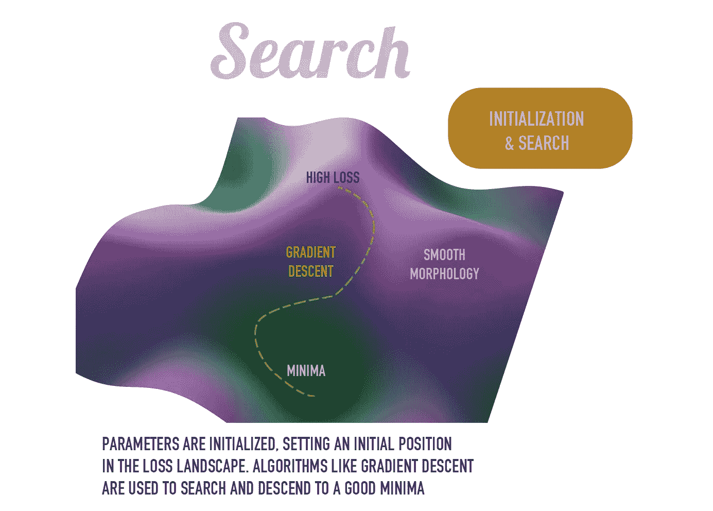

哈维尔·伊达米| losslandscape.com 制图

此外，我们不仅想找到一个参数值的组合，它能有效地将我们带到目标。但是如果**能找到一个也能概括**的，那就太好了。

这意味着找到一个值的组合，它不仅可以将网络从 A 带到 B，还可以从 A2、A3 和 A 的其他变体(**在同一统计分布空间**内)带到 B。

从 D，E，F 中取网络，也就是从 A 的分布 **空间**中**出来的数据，到 B 中，也是一个目标，一个我们作为人类可以做到，但目前深度学习很难做到的目标。**

一般来说，我们希望避免**过拟合**，也就是说，产生一个参数组合，该参数组合创建了一个从 A 到 B 的映射函数，该函数与训练数据(A)过于接近，但是当应用于其他看不见的输入数据点时，其性能会下降。

我们还想避免**欠拟合，**产生一个从 A 到 B 的映射函数，这个函数太简单了，不能捕捉我们的源数据中现有的变化。

所以我们要**优化**(避免欠拟合)，但是**也要泛化**(避免过拟合)。

但是在本文中，我们不关注如何找到 10、100、1000 或 10 亿个参数的值。相反，我们关注于**如何可视化优化过程**。从 A 到 b 的过程。

纵观历史，可视化一直是伟大的创造天才最喜欢的工具。可视化允许我们在低抽象层次同时学习和**访问**大量信息(而不是像我们使用语言那样在高抽象层次顺序访问信息)。可视化可以帮助我们获得洞察力，这可能需要我们花更长的时间通过其他方式获得(想想**阿尔伯特·爱因斯坦可视化他是一个穿越空间的光子**，因为他结合其他策略，可视化他的相对论)。

因此，假设**我们想要创建一个可视化，向我们展示我们如何从 A 到 B** ，从一个学生到成为一名医生，从一个不健康的饮食者到成为一个饮食均衡的人，从拥有一个财务数据系列到能够从该数据中提取欺诈信号。当这些挑战之一取决于太多参数时，我们可能会遇到麻烦:

*   可视化优化过程似乎是不可能的。我们最多只能看到 3 个维度，然而这些挑战取决于更多，有时是数百万个维度/因素/参数。
*   如果我们想向某人解释我们是如何从 A 到 B 的，这也会变得复杂，因为这个过程涉及大量的参数。

我们的大脑甚至没有被设计成能理解超过 3 个维度(4 个维度随着时间的推移)。如果我们能以某种方式进入大量的维度，我们可能什么也感觉不到，或者我们可能感觉到一片混乱。我们越往里走，就越觉得荒谬。

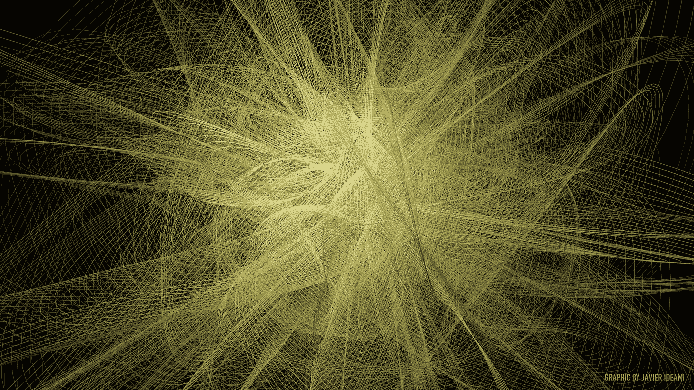

这个杂乱的“东西”代表了我们如何感知高维度。也许是我们看不见的东西，我们甚至注意不到，或者是一团乱麻，各方面都不可理解。哈维尔·伊达米| losslandscape.com 制图

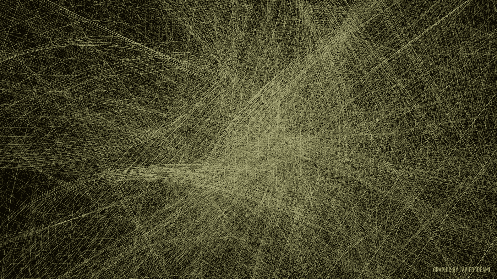

我们的大脑还没有准备好一次解释 3 个以上的维度。哈维尔·伊达米| losslandscape.com 制图

然而，我们放弃了吗？不，当然不是。在上述所有情况下，我们应该怎么做？

我们执行**一个降维过程。这是我们在生活中经常做的事情。**。****

# 简化复杂性

如果我问你:你是如何从一名学生变成一名成功的医学博士的？你不会停下来告诉我:“哦，对不起，这个过程依赖于太多的参数，我真的无法向你解释我是如何从 A 到 B 的”。

相反，**你把高复杂性/维度降低到更易管理的程度。**凭借你非凡的大脑，你可以识别出**影响从 A 到 b 的过程**的最重要的向量/方向/因素/参数。你可以将高维度从数千个因素减少到 2、3、4 或 7 个。然后你继续解释从 A 到 B 是可能的，因为这个，这个，那个。瞧。

同样的，如果你想做一个信息图，或者一个图表，或者一个图画，或者其他任何可以展示从 A 到 B 的旅程的东西，你也会做类似的事情。您将**减少维度/复杂性**，然后继续使用减少的维度创建可视化。

随着我们继续思考这些可视化，我们开始意识到，除了创建所涉及的不同因素的可视化表示之外，能够**绘制实现目标的实际进展将是非常棒的。**

也就是说，为了**可视化我们在优化过程的不同部分离目标有多远。**

我们意识到，在流程的每一步，我们都可以**组合所涉及的不同参数**，在给它们分配一个数值后，**产生一个结果，表示我们在那个时间点的位置**。

然后我们可以**将结果与目标**进行比较**估计我们离目标**有多远。

**达到目标**将意味着通过组合我们的不同参数产生的价值和目标的内在价值之间不存在**差异**。差值将为 0。我们将到达 b。

相反，在过程的开始，组合我们的参数的结果和我们的目标之间的差异会很大。

顺便说一下，这种差异就是我们在深度学习中所说的，**损失**值。我们应该获得的(我们的目标)和我们目前获得的(我们的当前状态)之间的差异。

如果我们绘制这个过程，我们会发现我们正从高区域(高损耗值)向低区域(低损耗值)移动。因此，**我们的目标是**，事实上，**从高位**(当我们组合不同因素的方式产生的结果与我们的最终目标相差甚远时)，到低位，**尽可能低的位置**(当我们组合不同因素的方式产生的结果与我们的最终目标非常接近时)。

**如果我们只绘制我们的状态**，我们将跟随一个从高位移动到低位的点。

但是，**如果我们不仅标绘我们的位置，而且标绘其他附近的组合**，参数空间中的一系列其他组合，**那么我们将创建一个表面，一个景观。**

# 损失景观

我们可以用许多不同的方式来描述这种损失情况。

一方面，它是我们参数或权重空间的不同区域的性能(损失值)的**可视化表示，表示我们参数的不同组合如何表现。**

当在优化过程中跟踪我们的代理/最小化器的状态时，它也可以用作寻找不同方法组合我们挑战中涉及的参数的过程的视觉表示，以产生尽可能接近我们最终目标的结果。

一种视觉表现，不仅显示了我们所处的位置，还显示了我们状态周围存在的其他可能性，在我们状态周围的参数空间内，允许我们研究表面的形态和动力学，这种表面表达了生命中基本和恒定的原则:运动。从一个地方到另一个地方，寻找最好的方法。

在最近与 Tom Bilyeu 的一次对话中，加州大学欧文分校认知科学教授 Donald Hoffman 告诉我们，如前所述，生命的**定义特征之一就是运动**，定向运动。因此，**将这些过程可视化远远超越了神经网络和深度学习**。我们正在触及定义生命的重要部分，从这里到那里的有意识的主动运动，寻找尽可能快地到达那些低谷的最佳方式，因为**我们的生存是在游戏中**，因为计算是昂贵的，葡萄糖是昂贵的，总的来说，生活是昂贵的。这就是为什么我们可以将我们的整个存在视为优化过程的巨大分形。

当我们使用**深度学习过程和神经网络**时，我们正在使用**依赖于数百万个参数的优化过程。**

在这种情况下，**绘制这些表面和景观成为一个更大的挑战**。这就是我们在接下来的章节中要解决的问题。因此，现在让我们来看看在深度学习训练过程中绘制这些有趣景观的具体案例。

# **损失景观的有用性**

大多数深度学习过程的目标是学习一个复杂的函数(我之前写过的从 A 到 B 的映射)。我们如何评估这些学习过程的表现？我们可以用所谓的**损失函数来做。**这样的函数将告诉我们我们的网络的当前输出相距多远，以及理想的输出应该是什么。这个差额就是损失。随着训练过程的推进，我们的目标是将这种损失降到最低，使其尽可能小。损耗值为 0 意味着网络运行良好。

**注:**本节描述的内容主要适用于监督学习，这是目前在这类系统中使用最多的学习类型。

通常，在训练过程的开始，网络不会表现得很好，我们的损失值会相当高。随着训练的进行，**损失值逐渐变小。**

如前所述，纵观历史，可视化一直是科学家、探险家和创造者最喜欢的工具。与语言的抽象和顺序性质相反，**可视化允许我们在更低和更详细的抽象层次上同时访问大量信息。**

如果我们能够在训练过程中可视化这些损失景观的动态和形态，并且如果我们能够尽可能详细地做到这一点，我们就增加了在深度学习及其优化过程中产生有价值见解的机会。

利用真实数据生成的损失景观:Convnet、imagenette 数据集、sgd-adam、bs=16、bn、lr sched、train mod、100 万点、0.5 w 范围、20p-interp、对数标度(原始损失数值)和 vis-适应| losslandscape.com

# 用数学代替视觉效果怎么样？

数学和可视化相辅相成。他们本身都很重要。可视化的价值在于在较低的抽象层次上同时访问非常丰富和详细的数据，这可能会加速发现我们可能需要更长时间才能从数字计算中提取的见解。

# 让我们更深入地了解这些景观。就网络本身而言，这些损失值与什么相关？

**让我们概括一下，网络的损耗**与**有关，即网络的当前输出与应该输出之间的差异。**通过对网络的权重进行运算来计算网络的输出。因此，**损失值取决于那些网络权重**。

好了，这就是损失值。但是整个损失情况又如何呢？损失景观表示不仅使用网络当前可能具有的特定权重值计算的损失值，而且在优化器的权重空间内的当前位置周围的特定范围内计算的损失值。

因此，损失景观帮助我们在网络的权重空间内可视化损失值(包括当前权重值，但也包括它们的许多其他组合)，并且**通常集中在我们的优化器**的当前状态。因此，在图的中心，我们可以看到当前权重集的损失值。围绕这个中心点，我们可以看到用网络权重的其他组合计算的损失值。

现在，请记住我们说过，为了比较网络的当前输出与其理想输出，我们使用一个函数来计算损耗值。这个函数就是损失函数(或成本函数)。因为神经网络有很多参数，这个函数是一个多维多变量的函数。这将很快变得重要，因为我们人类很容易想象一维函数，或者 2D 或三维函数。但是一百万维的函数呢？还是 10 亿维函数？袖手旁观，我们快到了。

利用真实数据生成的损失景观:Convnet、imagenette 数据集、sgd-adam、bs=16、bn、lr sched、train mod、100 万点、0.5 w 范围、20p-interp、对数标度(原始损失数值)和 vis-适应| losslandscape.com

# 损失情况，是随着培训的发展而变化，还是有一个固定的形状？

这是一个经常出现的典型问题。等等，我在一些视频里看到了景观变化。景观不是应该固定吗？这个我们来详细解释一下。

损失图的形状取决于神经网络的权重(参数)和该网络生成的损失值。在覆盖这些权重值的所有可能组合、**的**全高维权重空间中，相对于该特定网络架构、这些权重的不同变化(权重空间)以及从前面两个因素导出的计算损失值，景观是固定的**。**

然而，**当我们创造这些景观的实际表现时，事情发生了变化**:

*   首先，**我们无法想象整个亏损局面**。相反，我们所做的是**将景观集中在我们的最小化器**的当前位置上(因此景观的中心显示了用网络的当前权重值计算的损失值)。
*   然后，我们还显示了围绕该中心点的一系列景观(**有时会出现混淆，因为我们称“损失景观”为完全高维的整体景观，也称其为局部邻近区域的降维版本**)。
*   随着训练过程的发展，我们的极小值的位置(根据其在权重空间内的权重值计算)会发生变化。**如果中心点移动，这意味着我们在该中心点周围看到的范围也将移动**并在整个全景范围内移动。这也是我们看到地貌变化的原因之一。**在训练过程中，当最小化装置围绕重量空间**移动时，我们沿着它的当前位置行进。当我们沿着它行驶时，它的周围环境，即直接围绕最小化器当前状态的那部分景观的损失值，也会发生变化。这个**变得更加棘手**，因为**变化发生在高维空间中，而不是在对这些变化的降维**解释中，这对视觉表现中的景观动态也有影响(在后面的部分中会有更多的介绍)。
*   如前所述，另一个关键点是**我们无法可视化 100 万维度**。这就是为什么，我稍后会更详细地解释，**我们做了一个降维过程**来将大量的维度减少到只有 2(这增加了第三维度，即损失值，产生了 3D 可视化)。
*   因此，即使**整个完整的高维景观**，包括与我们的网络相关的整个权重空间**没有改变，** **改变的是位于我们移动和进化的极小点周围的邻近景观**的局部、相对、低维解释。
*   这个低维景观表达了位于我们的优化器的当前位置附近的损失值，代表了一个动态变化的系统，研究它，我们有机会获得关于不同网络架构、不同超参数值和其他因素对训练过程的影响的有趣见解。
*   因此，有必要澄清**我们不断变化的景观代表了完整景观的一部分**，**位于我们移动、进化的极小点周围，并通过降维技术**可视化。
*   随着训练过程的进行，我们的网络的权重改变(我们在权重空间中的位置改变)，因此我们的最小化点的位置进化，并且它周围的附近区域也在我们创建的较低维度可视化中进化。
*   你现在可能会问:如果我们应用这样的降维过程，**我们是否仍然保留了足够的有用信息？答案是肯定的，**我将在接下来的几节中详细解释原因。

**立柱下降**。通向最小值的区域的外部视图。该区域让人想起圆柱的顶部。利用卷积网络训练过程中的真实数据创建的损失图。losslandscape.com

# 那么高维空间呢？我们如何将它视觉化？

简单。我们不能。我们人类无法在一亿个维度中可视化数据。但是不要担心，因为数学给了我们做事情的技巧和方法，事实上，我们在生活中一直在做这些事情。

*   **当我们用相机**拍照时，我们的相机无法在其平面屏幕或方形传感器上捕捉和呈现三维空间。因此，该设备捕捉信息并将其转换成二维数据。
*   当我们在依赖于大量变量的复杂项目上工作时，我们简化这种复杂性，将它减少到更少的变量，这些变量仍然表达了复杂场景的本质。

每当我们做以上任何一件事的时候:**新的低维表示仍然有用吗？**2D 图片是否仍然传达了关于 3D 世界的有价值和有用的信息？**是的，当然是**。现在，让我们来关注一下我们如何针对我们的损失情况进行这项工作。

很明显，我们需要将高维数据降低到更低的维数。在机器学习中使用的**降维技术有很多，例如包括 **PCA** (主成分分析) **LDA** (线性判别分析) **MDS** (多维标度)、谱嵌入、 **t-SNE** 、等距特征映射、因子分析等。我们甚至可以使用自动编码器(AE 神经网络)。**

在我们的案例中，我们正在寻找一种技术，这种技术给我们一种方法来减少维度的数量，同时保留足够的关于我们的状态以及关于我们所处位置周围的一系列可能性和价值的信息。

有不同的策略可以做到这一点。其中一个策略是由郝莉、、Gavin Taylor、Christoph Studer、Tom Goldstein 撰写的优秀论文 [**可视化神经网络**](https://arxiv.org/abs/1712.09913) 的损失景观介绍的。有了这个策略，我们要做的，考虑一个类比，就是**创建一个平面，然后用这个平面把高维空间**切片**转换成一个 2D 表面**，在这个表面上我们可以建立我们的 3D 可视化。

为此，我们将首先在权重空间中找到并选择**几个随机方向。这些是随机向量，它们应该与我们网络中的权重向量具有相同的维数。有了这两个随机方向**，我们现在可以形成一个平面**(稍后将详细介绍这两个随机方向的正交性)。**

然后，我们可以**拿起那个平面，用它来切割高维空间**，揭示它在 2 维中投影的结构。在这一点上，我们可以添加第三维，这将是在该平面内的每个点计算的损失值。

让我们记住，我们将**将我们的极小值的当前状态定位在那个投影**的中心，然后在那个投影的 2D 平面内的某个范围内环顾四周。这样，瞧，我们可以在 3D 中表示优化器周围的邻近区域(以及它的当前状态)。

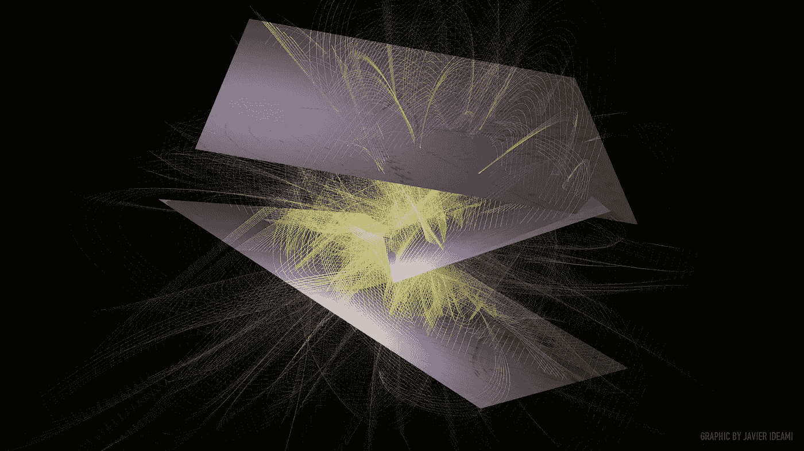

切片高维空间。哈维尔·伊达米| losslandscape.com 制图

切片高维空间。哈维尔·伊达米| losslandscape.com 制图

# 酷，但是用 PCA 呢？

**PCA(主成分分析)**是一种原则上可以应用于此的降维方法。然而，PCA 将帮助我们在**沿着最佳方向**可视化景观。这将帮助我们**看到那些更加优化的景观部分**。相反，**我们希望在重量空间内看到更多样化的范围**，以及更远的**未优化的**其他部分**。使用其他种类的方向(像前面描述的方法)允许我们这样做。**

# 好的，我们用两个随机的方向。但是如果它们是随机的，你怎么知道它们是互相正交的(垂直的)以便它们可能形成一个平面呢？

数学拯救世界！数学专家已经证明**在高维空间**内，如果你选择**随机向量，它们倾向于彼此正交**(这个 [**在线**](https://math.stackexchange.com/questions/995623/why-are-randomly-drawn-vectors-nearly-perpendicular-in-high-dimensions/995678) 在各个地方都有证明)。

让我们用**打个比方**来探究一下这个问题。随着更多的维度，我们得到更多的复杂性，也有更多可能的方向可以访问。

让我们考虑一维世界中的随机向量。没有任何与之正交的东西可以存在。

让我们转到一个二维世界。**与我们的随机向量**正交的向量**将形成一维线**。因此，正交向量**存在于 2–1 = n-1 = 1 维**中。

现在让我们去一个三维世界。**世界上的正交向量**将**组成一个二维平面**。因此，**正交向量存在于 3–1 = n-1 = 2 维空间**，产生 2 维平面。

**随着我们不断增加**维度的数量，我们可能发现**的**正交向量**出现在具有 n-1 个维度**的空间的子空间中。现在我们可以看到，**n 越大，**，**子空间**的大小也越大，子空间是可能的正交向量在整个空间中所占的份额。

总之，尽管不能保证高维空间中的两个随机向量完全精确地相互正交，但是我们可以预测它们很有可能并且非常接近正交。

# 好了，我们降低了维度，那么我们如何把它们结合起来绘制风景呢？

让我们回顾一下。我们已经从两个随机正交向量创建了**平面。现在，我们必须决定曲面的坐标，以及我们将围绕该平面的中心点探索的范围(让我们记住，这将是我们的极小值的当前状态)。**

所以**我们创建一个 2D 网格**，它将包含我们可视化的 x 和 y 坐标。那个网格的**中心将是 0，0 坐标**和**，在那里我们将定位与我们的最小化器**的当前状态相对应的损失值(用我们网络的当前权重值计算)。

我们**然后在一个范围**内围绕中心点探索。例如，我们可以选择从-1 到 1 的范围。选择这个范围意味着探索与我们的体重数量级相似的一部分地形。基本上，我们会在重量空间的变化范围内探索地形，类似于我们重量的大小，这是非常合理的。

然后，我们决定景观的分辨率。我们可以**将-1 比 1 的范围分解成我们喜欢的任意多的点**。例如，50x50 的可视化将在第一个轴上使用 50 个点，在另一个轴上使用另外 50 个点，总共 2500 个点。对于这 2500 个点中的每一个，我们必须计算损失值，这就给出了第三个轴，垂直 z 坐标。

# 网格中每个点的损失值是如何计算的？

到**计算损失值的时间**。我们所做的是**获取我们最小化器**的当前权重值，对应于我们网格的中心(0，0)并且**沿着我们先前选择的随机方向**改变它们。我们**根据网格上我们想要知道其损失值的点**来修改它们。让我们深入了解这个等式本身的细节:

希腊字母的第八字

**θ**:它代表**我们网络的当前权重**，我们最小化器的参数。用这些参数计算的损耗值将出现在网格的中心(0，0)

德尔塔和预计到达时间

**Delta 和 Eta** :这两个代表我们的两个随机向量，**我们在权重空间的随机方向**。

阿尔法和贝塔

**α和β**:它们是网格平面中每个点的 **x 和 y 坐标。**

为了计算网格平面的一个特定点处的损耗，我们将首先计算一组新的参数(权重),这些参数是将我们的最小化值的原始值与我们的每个随机方向上的该点的坐标值的乘积相加的结果。然后我们将使用新的参数集来计算损耗。

沿着平面投影我们的参数

最后，损失图中每个点的坐标将为:

我们损失范围内每个点的坐标

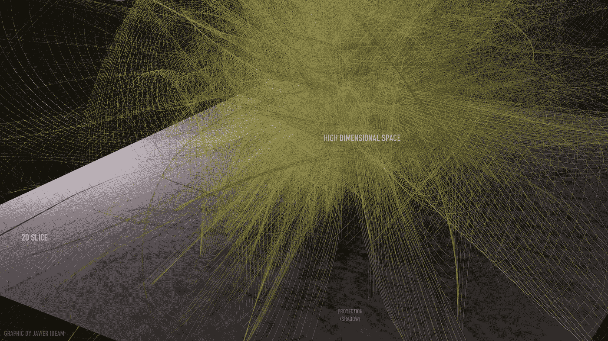

切片高维空间。哈维尔·伊达米| losslandscape.com 制图

可视化损失景观。哈维尔·伊达米| losslandscape.com 制图

# 放大缩小呢？

**我们正在关注极小点周围的某个范围**的全景。所以**修改这个范围，我们可以围绕当前位置放大或缩小**。如果我们使用-0.2，0.2 的范围，而不是通过-1.1 的范围来投影我们的权重，我们将把我们的细节(无论我们正在计算多少个点)集中在极小值周围更紧密的范围上。相反，使用-3，3 范围，我们将缩小到包含一个更大的区域，显示离我们的极小值更远的区域。

# 我们能在极小值附近走多远？

尽管我们喜欢。当然，你走得越远，你就应该增加 axis 计算的点数，以保持相似的细节量。

然而，问题是**通常，当我们越来越远离我们最小化器的重量空间中的当前位置时，我们发现损失值变得非常高**，并且风景向上移动，因此我们看不到有趣的特征。当面对可视化中的极端对比时，我们也倾向于**可视化损失值的日志**。这个**帮助我们可视化出现在可视化边缘的极端对比度**。

因此，通常情况下，我们探索的区域更接近-1，1 范围。

当我们离开一个局部最小值时，我们可能会想，我们是否可以找到将该最小值与我们位置周围的其他局部最小值连接起来的路径。近年来，研究人员已经发现了寻找局部最小值之间的捷径和联系的方法，即损失值保持很低的**路径**。这些路径通常不是直线，而是曲线路径、多边形路径、等。通过与**帕维尔·伊兹迈洛夫**([@帕维尔·伊兹迈洛夫](http://twitter.com/Pavel_Izmailov))和**蒂穆尔·加里波夫**([@蒂姆·加里波夫](http://twitter.com/tim_garipov))的合作，我们创建了**伊卡洛斯**，这是一个基于**蒂穆尔·加里波夫、帕维尔·伊兹迈洛夫、德米特里·波多普里欣、德米特里·维特罗夫、安德鲁·戈登·威尔逊** : [**的 NeurIPS 2018 论文的可视化通过这些路径(在这个特定的例子中是贝塞尔曲线)，训练和测试精度几乎保持不变。**](https://arxiv.org/abs/1802.10026)

伊卡洛斯模式连接。真实数据。Resnet-20 不跳过。火车模式。CIFAR10Batchnorm。SGD MOM，BS=128，WD=3e-4，M=0.9。NeurIPS 2018 ARXIV/1802.10026。由简单曲线连接的复杂损失函数的最佳值，在该曲线上训练和测试精度几乎是常数。Icarus 使用真实数据，展示了通过贝塞尔曲线生成的路径连接两个 optima 的训练过程。为了创建 ICARUS，使用了 15 个 GPU 超过 2 周，产生了超过 5000 万个损失值。整个过程从头到尾耗时 4 周以上| losslandscape.com

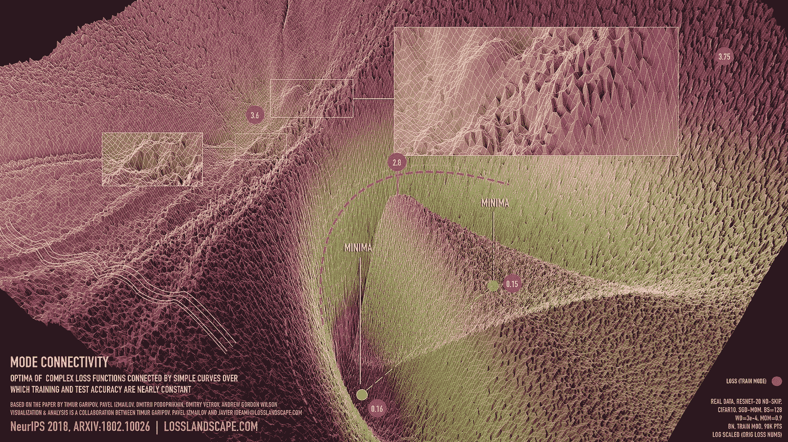

**模式连接**。通过帕维尔·伊兹迈洛夫(@帕维尔 _ 伊兹迈洛夫)、帖木儿·加里波夫(@蒂姆 _ 加里波夫)和哈维尔·伊达米(@伊达米)之间的合作生成的可视化数据。基于 Timur Garipov、Pavel 伊兹迈洛夫、Dmitrii Podoprikhin、Dmitry Vetrov、Andrew Gordon Wilson 的 NeurIPS 2018 论文:[https://arxiv.org/abs/1802.10026](https://arxiv.org/abs/1802.10026)| Javier Ideami | losslandscape.com 制作的创意可视化和艺术作品

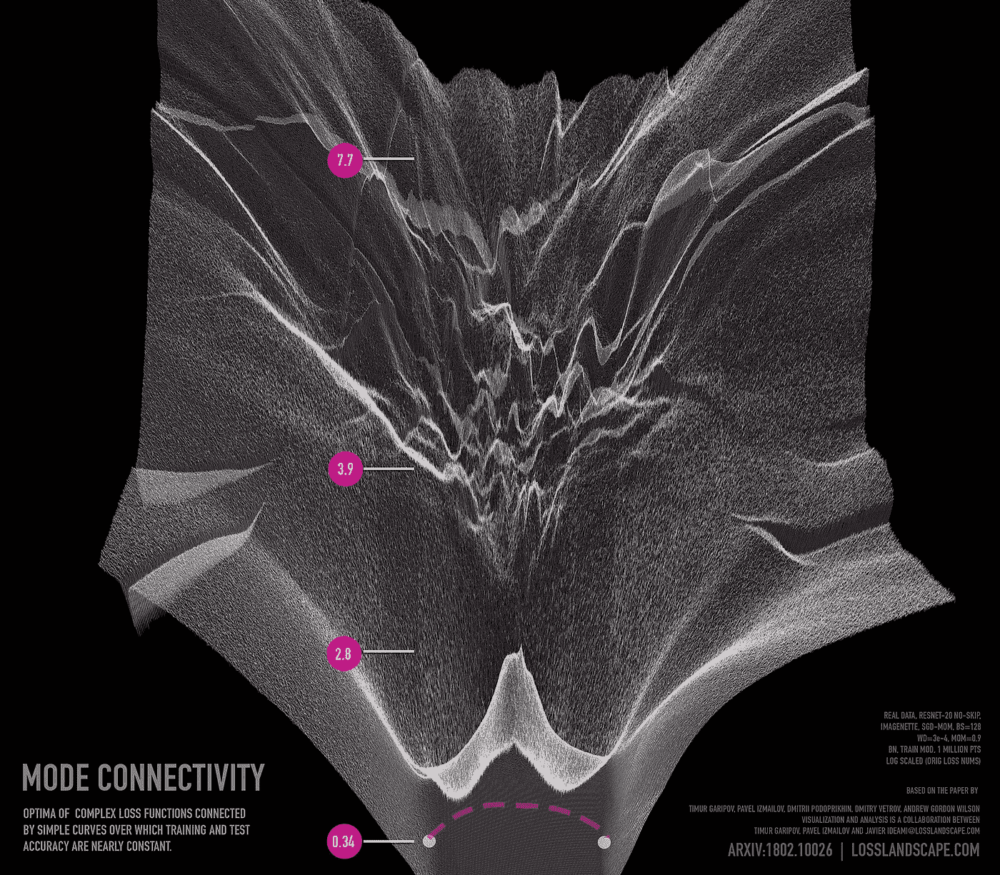

**梯度 X 射线**。模式连接。通过帕维尔·伊兹迈洛夫(@帕维尔 _ 伊兹迈洛夫)、帖木儿·加里波夫(@蒂姆 _ 加里波夫)和哈维尔·伊达米(@伊达米)之间的合作生成的可视化数据。基于 Timur Garipov、Pavel 伊兹迈洛夫、Dmitrii Podoprikhin、Dmitry Vetrov、Andrew Gordon Wilson 的 NeurIPS 2018 论文:[https://arxiv.org/abs/1802.10026](https://arxiv.org/abs/1802.10026)| Javier Ideami 制作的创意可视化和艺术作品。这幅作品展示了两个极小值的区域以及包含不规则形态的较高损耗区域| losslandscape.com

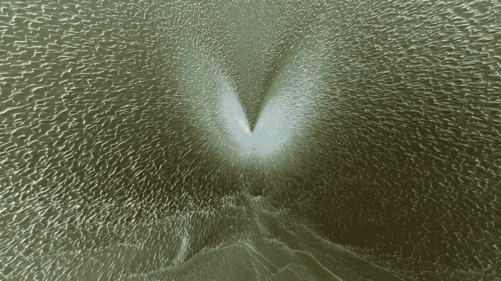

**伊卡洛斯**。模式连接。真实数据。Resnet-20 不跳过。火车模式。CIFAR10。Batchnorm。SGD MOM，BS=128，WD=3e-4，M=0.9。通过帕维尔·伊兹迈洛夫(@帕维尔 _ 伊兹迈洛夫)、帖木儿·加里波夫(@蒂姆 _ 加里波夫)和哈维尔·伊达米(@伊达米)之间的合作生成的可视化数据。根据帖木儿·加里波夫、帕维尔·伊兹迈洛夫、德米特里·波多普里欣、德米特里·维特罗夫、安德鲁·戈登·威尔逊撰写的 NeurIPS 2018 论文:[https://arxiv.org/abs/1802.10026](https://arxiv.org/abs/1802.10026)|创意视觉和艺术作品由哈维尔·伊达米| losslandscape.com 制作

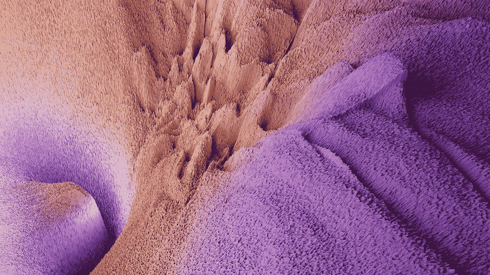

**渐变剧场**。模式连接。通过帕维尔·伊兹迈洛夫(@帕维尔 _ 伊兹迈洛夫)、帖木儿·加里波夫(@蒂姆 _ 加里波夫)和哈维尔·伊达米(@伊达米)之间的合作生成的可视化数据。基于 Timur Garipov、Pavel 伊兹迈洛夫、Dmitrii Podoprikhin、Dmitry Vetrov、Andrew Gordon Wilson 的 NeurIPS 2018 论文:[https://arxiv.org/abs/1802.10026](https://arxiv.org/abs/1802.10026)| Javier Ideami 制作的创意可视化和艺术作品。这幅作品展示了两个极小值的区域以及包含不规则形态的较高损耗区域| losslandscape.com

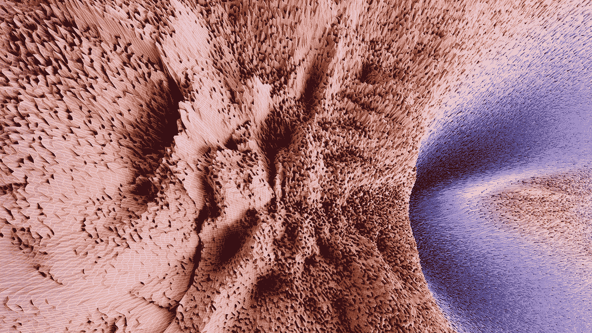

**从上方**。模式连接。通过帕维尔·伊兹迈洛夫(@帕维尔 _ 伊兹迈洛夫)、帖木儿·加里波夫(@蒂姆 _ 加里波夫)和哈维尔·伊达米(@伊达米)之间的合作生成的可视化数据。基于 Timur Garipov、Pavel 伊兹迈洛夫、Dmitrii Podoprikhin、Dmitry Vetrov、Andrew Gordon Wilson 的 NeurIPS 2018 论文:[https://arxiv.org/abs/1802.10026](https://arxiv.org/abs/1802.10026)| Javier Ideami 制作的创意可视化和艺术作品。这幅作品展示了两个极小值的区域以及包含不规则形态的较高损耗区域| losslandscape.com

在本文的后面，我将写关于**维度的祝福，**因为越来越多的研究人员正在考虑，我们使用深度学习获得的伟大结果可能与这些高维空间如何允许梯度下降在局部区域中容易地找到好的最小值有关，靠近我们的起始位置，不管我们在损失景观中的哪里初始化优化器。

维度祝福的模拟表示(很容易找到附近的收敛路径)。哈维尔·伊达米| losslandscape.com 制图

# 很好，但是我怎么能确定这些可视化提供了有用的数据呢？这些可视化有多精确？

很棒的问题！让我们去争取吧。

首先，**应用降维技术**，将非常多的维度转化为仅仅 2 个，**暗示现实**。就像 2D 照片不能表达 3D 世界的全部丰富一样，我们的 3D 损失景观也不能传达高维空间的全部复杂性。

同样，从不同角度拍摄照片将为我们提供 3D 世界的不同视角，使用不同的随机方向集也可能产生损失景观的不同视角。

所以，先说清楚一件事。如果您的目标是获得损失函数和地貌形状的完全精确的概念，您需要仔细分析这些 3D 表示。同样，如果我们要精确地解释 3D 世界的一些特征，观看 2D 的照片需要一些仔细的分析。

然而，**关键问题是**:

*   **我们能从这些低维表征中获得有用的信息吗**？**是的**，绝对。
*   我们能否获得**可能引发有用见解的信息**？这将取决于我们的具体目标，但总的来说，是的。

回到摄影的类比。当我们拍照时，我们不仅将三维世界转换成二维世界。但是我们经常使用滤镜和其他处理方法来进一步扭曲原始的 3D 数据源。如前所述，我们拍照时的位置和角度对最终结果也有很大影响。我们可以继续回顾我们的解释离原始数据来源越来越远的其他方式。

那么，**照片是那个 3D 世界的精确再现吗？不，当然不是。**

然而，照片是否给了我们关于那个 3D 世界的有用数据？甚至可能引发有趣见解的信息？**是的**，当然。绝对的。

这就是我们拍照的原因。结合不同角度的图片，我们获得了新的见解，加深了我们对 3D 世界的理解。
当天文学家拍摄星系、行星和恒星的照片时，也会发生类似的事情。当我们探索这些损失景观，从不同的角度和运动中研究它们时，类似的事情也会发生。

在某种意义上，一切都是相对的，如果我们开始触及我们在生活中应用的不同解释和维度转换的表面，我们可以持续很长时间。我们对“3D 世界”的感知当然还有另一种解释——由我们的大脑产生的扭曲。但是，这些转变中的每一个都提供了有用的信息，可以告知、启发甚至潜在地产生深刻见解的数据。

因此，回到这些风景。它们是高维度“现实”的精确表现吗？肯定不是。但是，他们是否给了我们关于潜在高维空间的有用数据，这些数据可能会引发新的有趣的见解？肯定是的。

我们真的能证明这一点吗？是的，我们可以。例如，深度学习专家已经证明**在这些种类的降维表示中出现的关键凸性和非凸性与使用主要相关特征值和特征向量执行的数值分析过程所指示的那些相匹配**。

这些表面的形状和形态仅仅是个开始。**我们也可以研究这些景观的动态**当我们的极小值穿过它们时。例如，当我们修改我们网络的各种超参数时，研究**这些表示随时间变化的方式**，可以帮助我们以新的方式理解我们训练过程的动态以及这些超参数对它们的影响。

因此，**即使我们无法将整个高维度的复杂性可视化，我们仍然可以在从不同视角** **可视化这些景观时收集到许多有用的见解**，就像我们拍照时一样。

**就像捕捉电影=运动中的图片一样，加深我们对 3D 世界的理解**(因为静态图片有时会在我们对那个世界的解释中产生混乱)，同样，**在运动中失去风景，随着训练过程的进行，我们与我们的最小化者**一起骑行的表现，给了我们新的方法**加深我们对这些过程的动态**以及它们在过程的每个步骤中的行为和状态的理解。

回到我们之前提到的特征值。Math 通过允许我们验证我们观察到的凸度分布是否与数值分析报告相匹配来帮助验证这些表示。为此，如前所述，我们可以使用**Hessian 及其相关特征值。**

**Hessian** 矩阵包含**二阶导数**。通过他们，我们可以了解损失景观的曲率。要得到那些数据，最简单的方法就是研究黑森的本质，可以通过它的**特征值和特征向量**来表达。

**全凸函数具有曲率值非负的正半定 Hessians** 。相反，在非凸函数中会发生相反的情况。

学术论文[**arXiv:1712.09913**](https://arxiv.org/abs/1712.09913)告诉我们，我们正在创建的这些低维表示的关键曲率实际上是平均值，是在高维原始空间和函数中存在的那些的加权平均值。这就是为什么**通过分析我们景观中每一点的黑森特征值，我们可以估计，平均而言，这些可视化是正确的。**

计算我们可视化中每个点的最大和最小 hessian 特征值，然后我们可以使用它们的绝对比率来研究和绘制它们的分布。这样就可以看出哪些区域有或多或少的凸性。有了这个数据，**我们可以验证那些在我们的表示中看起来非常凸的区域，与包含非常小的负特征值的区域相匹配。**以及我们可视化中的那些**非凸区域与具有大的负特征值的区域相匹配。**

# 我们为什么要用特征值？

Hessian 矩阵是复杂的实体，计算它们需要大量资源。许多复杂的实体和系统可以通过研究它们的一些属性来更好地理解，这些属性抓住了它们的本质。

这就是为什么我们用**特征值和特征向量**。他们帮助我们**抓住系统的本质和关键特征**，在这个具体的例子中，是黑森矩阵。

我们通过一系列向量和数字提取我们需要的关键数据，这比处理完整且通常非常大的正方形海森矩阵要简单和快速得多**。**

此外，**特征值和特征向量给了我们关于 hessian 矩阵属性的洞察力**,这些属性不太容易从完整的矩阵表示中理解。这就是为什么当我们需要捕捉和提取系统的本质时，特征向量和特征值在各种领域中被认为是非常有用的。例如，在图像压缩系统中，通过丢弃小的特征值并保留表达该实体最重要信息的特征值的过程，使用它们。

# 那么当我们看特定点的特征值时，它们给了我们什么信息呢？

让我们去争取吧。当在特定的点上看着黑森时:

*   如果该点的 **hessian** 为**正定**(所有特征值>为 0)，则该点为**函数的一个局部极小值**，为**凸性**的一个点。
*   如果黑森是**负定**(所有特征值<为 0)，那么这个点就是**一个局部极大值**，一个**负曲率**的点。
*   如果我们有一个正负特征值的混合**，那么这个点就是一个鞍点**。

通过绘制特征值的不同组合，数值分析帮助我们理解和验证我们景观的凸形模式

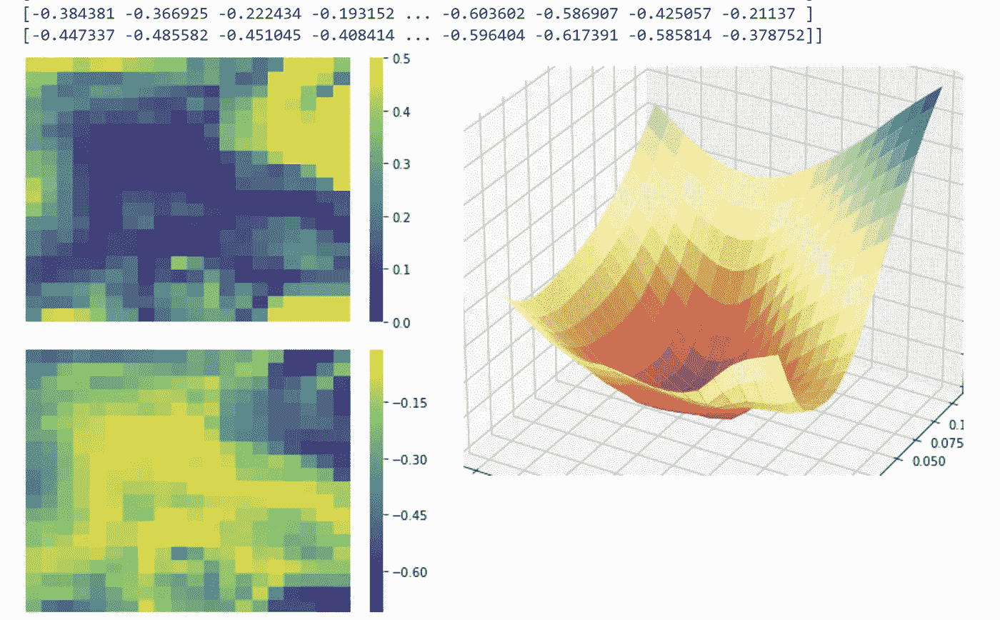

由贾维尔·艾达米| losslandscape.com 拍摄

# 我们必须提取黑森的所有特征值吗？

典型神经网络的 **hessian** 真的很大。它的**大小与网络的权值数量**的平方成正比。正如我们所知，典型的神经网络有大量的参数。

因此，**对于任何大规模的网络，使用完全 hessian 进行计算都是不可行的**。试图收集所有的特征值是完全不实际的。

**而不是**，例如，我们使用一些算法技巧和 Scipy 库来**提取最小和最大的特征向量和特征值**，这足以让我们获得我们需要的数据，以便研究地貌的凸性分布。

# 这些可视化可以帮助我们的领域有哪些？

有太多的可能性。这些可视化帮助我们在训练过程中加深对损失函数的形态和动态的理解。**这些优化过程的动力学研究**是一个有趣的领域。**研究不同超参数**值变化的影响是另一个例子。但是你可以选择**和许多其他的**、**比如:权重修剪和子网**。研究告诉我们，修剪权重和找到好的子网络可以给我们使用更少的时间和资源的结果，但与使用整个网络时获得的结果一样好。可视化可以帮助我们跟踪和了解这些修剪过程对损失景观和功能的影响。

# 有意思。复杂的函数可以用更简单的函数来近似吗？

确实是的。例如，泰勒级数(一种将函数表示为无穷多个项之和的方法)向我们展示了如何在保留其关键特性的同时减少函数的复杂性。

# 那么不同的网络超参数对这些景观形态的影响有多强呢？

在整个训练阶段，它会变得很强。例如，在训练模式中，使用 **batchnorm 或 dropout** 会对景观的形态产生重大影响。

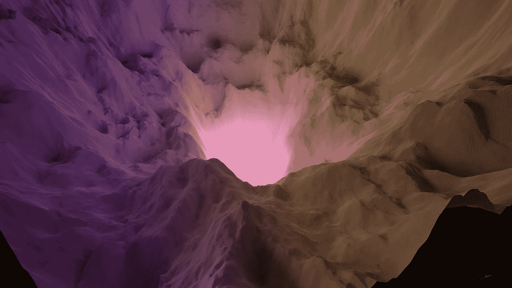

**边缘水平接近**。利用卷积网络训练过程中的数据创建的损耗图。Imagenette 数据集。Sgd-Adam，训练模式，一百万点，对数标度。由哈维尔·艾达米| losslandscape.com 捕捉并可视化

分析与使用 **batchnorm** 相关的形态变化，我们发现 **landscape** 处于活动状态时存在形态变化(我们保持其他参数如批次大小、漏失、模式等稳定，以便能够建立比较)。Batchnorm 可以起到正则化的作用，减少**泛化**错误。

当**平均值和标准偏差**在批次定额中**计算**(跨批次执行**的计算)时，这些值、这些估计值是**噪声**。计算数值过程中产生的噪音来自所选批次的其他部分。然后，在执行 batchnorm 操作时，该噪声将与权重相结合，并可能有助于网络的泛化能力，从而产生正则化效果。**

因此，在目前的研究中，与相关景观的形态有关的一个假设是，它可能与更高水平的弹性有关，这是之前描述的噪声水平，在某种意义上有助于网络更好地进行概括。这只是一个我们如何分析形态学变化来寻找新见解的例子。

当我们观察**辍学**时，对训练模式形态的影响是非常明显的，但是扰动具有不同的特征。

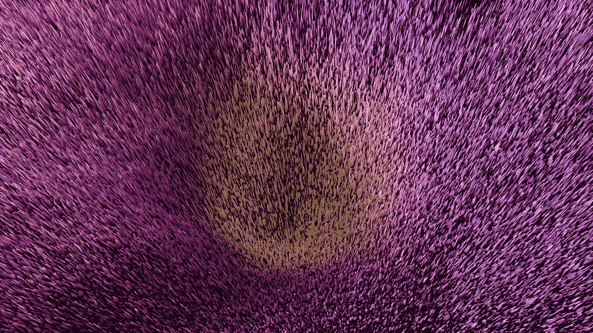

**噪声边缘**。使用来自使用丢失的卷积网络的训练过程的数据创建的损失图。在训练过程中，辍学的使用产生了这种独特的形态和鲜明的模式。由哈维尔·艾达米| losslandscape.com 捕捉并可视化

**下降**在地貌中引入**高频噪声。这些高频扰动可能与**信号丢失帮助网络更好地泛化的方式有关**。**

# 更多示例

让我们来看更多关于我们如何**分析这些可视化**的例子。由于这篇文章的篇幅有限，这些解释将非常笼统，但我们仍将涵盖不同的变化。

让我们选取流程的一个特定时刻，展示我们如何使用静态**高分辨率捕捉来反映网络的不同方面**(同样可以使用动态移动可视化来完成，这使我们能够研究流程的动态性)

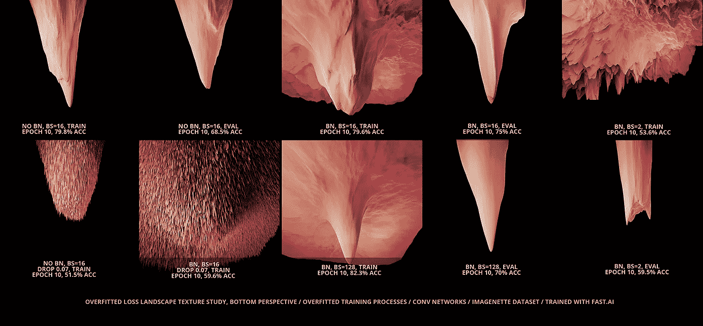

由哈维尔·艾达米| losslandscape.com 捕捉并可视化

由哈维尔·艾达米| losslandscape.com 捕捉并可视化

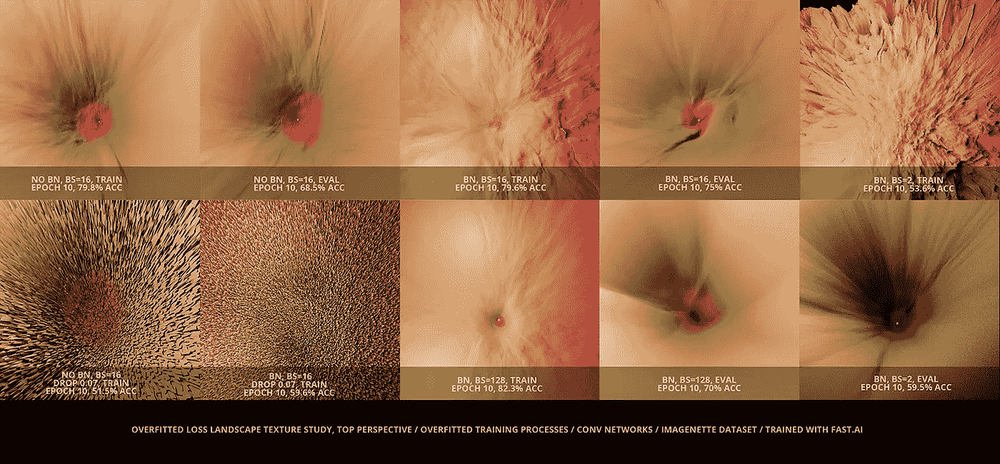

由哈维尔·艾达米| losslandscape.com 捕捉并可视化

*   看这些截图，让我们比较和分析一下**使用 16 和 128** 批量在**最小值**的表观宽度方面的差异。正如本文其他地方所解释的，关于平坦宽极小值和泛化之间的联系有不同的观点。在这个具体的例子中，我们发现较高的批量大小、较尖锐的最小值和较多的过拟合之间存在形态上的联系。较低的批量通常与更好的正则化能力和更好的泛化能力相关联，这可能是因为它们在过程中引入了扰动。
*   如前所述，**辍学和 batchnorm** 都引入了不同种类的扰动。**脱落**在形态学中引入**更高频率的扰动**。这些扰动在整个过程中以不同的方式发展(例如，它们发展的方式可能取决于特定的丢失程度和所使用的特定网络架构)。与由非常小的批量引起的潜在破坏性扰动(如果学习速率不够)相反，由脱落产生的扰动就像在底层形态学之上的额外的一层，可能以这种方式有助于防止训练过程过度拟合。
*   查看批量大小为 2 **、**的示例，我们可以看到在这种特定情况下(因为使用了一组参数)，不可避免的形态特征是如何产生的(在其他事情之间，通过过高的学习速率来强调)，产生了许多干扰，这些干扰掩盖了对良好最小值的访问。这种不稳定性可以通过使用较小的学习率来补偿，以更慢的速度通过地形。结合学习率分析这一方面可以让我们**找到一个最佳点，在保持使用小批量的好处的同时，获得好的最小值**。
*   让我们看另一个例子，在这种情况下，与被称为 **Resnet** 的架构有关。首先，我们检查有和没有跳过连接的相同 resnet 的形态学。我们验证了缺少跳跃连接会产生更崎岖的地形。我们继续研究比较的动态，验证随着时间的推移，具有跳过连接的版本稳定在较低的损耗值。

**WALTZ-RES** 将两个 resnet-25 网络(一个有跳跃连接，一个没有)之间的形态和动态差异可视化。在这个可视化片段中，我们可以看到训练过程的前两个半时期。我们乘坐迷你车，同时探索附近的环境| losslandscape.com

*   如前所述，高分辨率可视化可以提供关于**超参数变化对损失函数和景观的影响的详细视图。**在该可视化图中，我们可以看到与学习率值的不同变化相关的景观动态。这是通过**学习率压力测试**显示的，在该测试中，我们以中等稳定的速率开始，然后突然增加，并在不同的周期中再次降低。

**LR COASTER** 在 convnet 的训练过程中可视化学习率压力测试。我们沿着迷你车行驶，同时探索它附近的环境。我用学习率的极端变化来说明损失景观的形态和动态如何随着学习率的变化而变化。分辨率(每帧计算 300K 损失值)允许我们探索形态学的变化| losslandscape.com

*   3D 可视化的创建使我们**能够从任何角度和视角研究景观**，能够从各种角度并结合各种网络架构和超参数来分析最小值的结构。

**哥布林**带我们踏上了一段旅程，在它的训练过程中，从一个 convnet 的损失景观的边缘地平线以上，通过边缘地平线(横向)到它的动态凸面以下的视角。我们乘坐迷你车，同时探索附近的环境| losslandscape.com

随着我探索越来越多的景观，我开始识别这些景观的关键特征，并继续深入研究。这是其中的一些:

*   **边缘视界:**我称边缘视界为发生在极小值入口处的凸性的独特突变。这种倾斜度的变化在不同的情况下具有不同的程度，并且该区域的各种特征可能具有与网络性能相关的洞察力。
*   **凹凸指数:**极小点周围区域的凹凸度与平滑度。这一特征，如在批量生产和丢失的情况下发生的，有时表达了与网络的过度适应/泛化程度的联系。我们还能以其他什么方式在景观中创造出不同种类的凹凸不平和平滑感呢？关于这一主题和相关主题的研究仍在继续。
*   **崎岖适应指数:**地貌中崎岖地形的性质可能不同。它可以具有更稳定或不稳定的性质。高学习率加上非常低的批量会产生非常不稳定的模式。相反，在适当的条件下，脱落会产生适应表面总体形态的形态模式。
*   **陷落:**从边缘地平线到极小点底部的区域。正在进行研究以更深入地了解这一领域。
*   **噪音因素:**使用小批量和大批量时，剔除和其他策略会给过程带来或多或少的噪音/不稳定性/随机性。这可以从景观的动态和形态中直观地发现。

更多的这些功能和相关分析将在未来更深入地发布和分享。

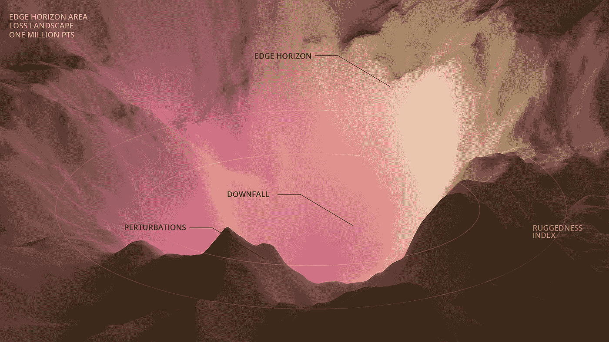

**边缘地平线**。利用卷积网络训练过程中的数据创建的损耗图。Imagenette 数据集。Sgd-Adam，训练模式，一百万点，对数标度。哈维尔·伊达米| losslandscape.com 制图

# 那么，更平的极小值是否概括得更好？

近年来，关于这个问题有很多积极的研究，这个问题有不同的答案，有时是相反的答案。

Laurent Dinh，Razvan Pascanu，Samy Bengio，Yoshua Bengio 的论文**[**锐极小可以推广到深网**](https://arxiv.org/abs/1703.04933)**告诉我们，锐极小可以推广到平坦极小。它还指出，平面的有时也不能很好地概括。(注:本文将平坦度定义为具有大致恒定误差的区域的大小)。****

****其他论文描述了对此事的不同观点。例如，论文 **"** [**通过可视化理解泛化**](https://arxiv.org/abs/1906.03291) **"** 验证了泛化误差与极小点的平坦性密切相关。这也证实了平坦和尖锐极小值之间的差异被这些损失景观的多维性质所强调。该论文还总结道**这些景观的高维数本质使极小值远离坏的极小值**(在本文的稍后部分会有更多的介绍)。****

****一般来说，趋势是平极小值比锐极小值概括得更好。直觉上这是有意义的，因为平坦的最小值应该允许从某一点有更多的偏差，同时保持类似的损失值。****

# ****我们能否将这些分析应用于其他深度学习架构，例如 GANs？****

****是的，可以用某些类型的 gan 来分析损失情况。传统上，GANs 的问题在于**损失价值和网络表现**之间没有明确的相关性。在监督学习中，我们知道如果损失值低，网络表现良好。但是在 GANs 中，我们可能会得到很好的结果，但是到处都有损失值。由于发生器和鉴别器相互竞争，**损失值可能具有相当不直观的行为模式。******

****一种被称为 **a Wasserstein GAN 的 GAN 出现了(在这种情况下有梯度惩罚**)。****

****在大多数 gan 中，**损耗值告诉我们发生器欺骗鉴别器的程度，而不是输出结果的质量或性能**。因此，我们的输出质量可能会提高，但发电机的损耗可能不会下降。
因此，通过分析大多数 GANs **的损失价值，很难确定我们做得有多好**。****

****另一方面，**与 Wasserstein GANs** ，**一起，损耗值传达了输出结果**的性能和质量，因此**使得构建可视化**成为可能，其中我们使用损耗值来分析网络的性能及其周围的其他指标。****

****下面我展示了一个可视化，它使用了一个数据集和一个 Wasserstein GP Gan。正如在视频中看到的，我们可以跟踪**我们的发电机损耗景观**的性能，它从一个平坦的表面开始，然后随着我们的极小值向不同的极小值收敛而开始演变。****

****我们还可以在视觉中感受到甘人训练过程不可避免的本质，他们的行为常常像野兽一样，需要通过非常仔细地选择训练过程的参数和时间来驯服。****

****用真实数据生成的损失景观:wasserstein GP Gan，celebA 数据集，sgd-adam，bs=64，train mod，300k pts，1 w 范围，潜在空间尺寸:200，出于视觉目的，生成器有时会反转，critic 是对数标度(原始损失数值)和 vis-适应| losslandscape.com****

# ****我们能把这些可视化应用到深度学习的其他领域吗？****

****是的，它们可以应用于深度学习的许多其他领域，也可以应用于其他领域。****

****例如，可视化可以提供很大帮助的深度学习领域是**几何深度学习。**几何深度学习旨在**使神经网络适应非欧几里得领域，这些领域可以是流形、图形等。******

****与 **Neural Concept SA** 合作，下面的视频显示了几何 CNN 内部卷积层的**激活，**从无人机表面提取**特征，同时网络被训练来预测飞机的空气动力特性**。我们将网络起点附近的要素和网络终点附近的其他要素可视化。****

****几何图形网络的真实数据可视化。L2 损失，亚当，BS=1，LR=0.0001 / 24588 个顶点。该视频显示了几何 CNN 内部卷积层的激活，从无人机表面提取特征，同时网络正在被训练以预测飞机的空气动力学特性。这个项目正在进行中，新的更新将于稍后| losslandscape.com****

****另一个领域是贝叶斯深度学习。例如，在与 **NYU 的研究人员帕维尔·伊兹迈洛夫和安德鲁·戈登·威尔逊**的合作中，我们重点关注了他们的 **SWAG 论文 neur IPS 2019:1902.02476:****[**深度学习中贝叶斯不确定性的简单基线**](https://arxiv.org/abs/1902.02476) **“由韦斯利·马多克斯、蒂穆尔·加里波夫、帕维尔·伊兹迈洛夫、德米特里·维特罗夫、安德鲁·戈登·威尔逊**撰写，这是一篇与贝叶斯深度学习相关的论文，在其中他们采取了预******

****然后，他们建立一个高斯分布，捕捉随机梯度下降训练过程遍历的不同解决方案。然后我们可以用这个分布作为后验概率的近似值。****

****这种可视化使用真实数据来绘制损失景观的优化部分(使用 PCA)以及解的位置和产生的相关高斯分布。****

****不确定的下降。NeurIPS 2019，ARXIV:1902.02476/swa-Gaussian(swag)。深度学习中贝叶斯不确定性的简单基线| losslandscape.com****

****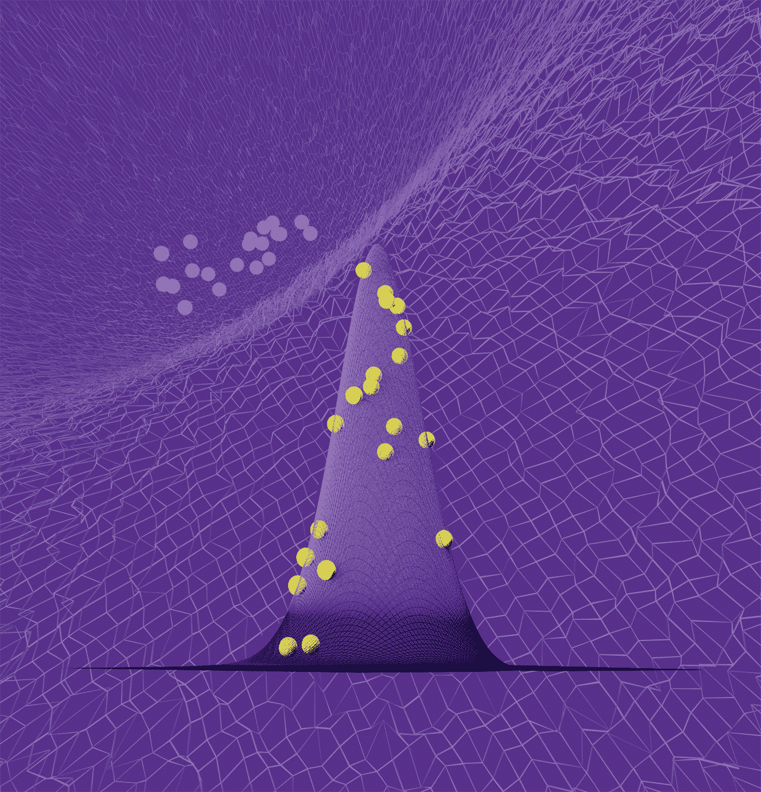****

******不确定下降**。swa-高斯(swag)。深度学习中贝叶斯不确定性的简单基线。基于 wesley maddox，timur garipov，pavel izmailov，dmitry vetrov，andrew gordon wilson 的论文。可视化是帕维尔·伊兹迈洛夫、帖木儿·加里波夫和哈维尔·ideami@losslandscape.com 的合作。NeurIPS 2019，ARXIV:1902.02476 | losslandscape.com****

****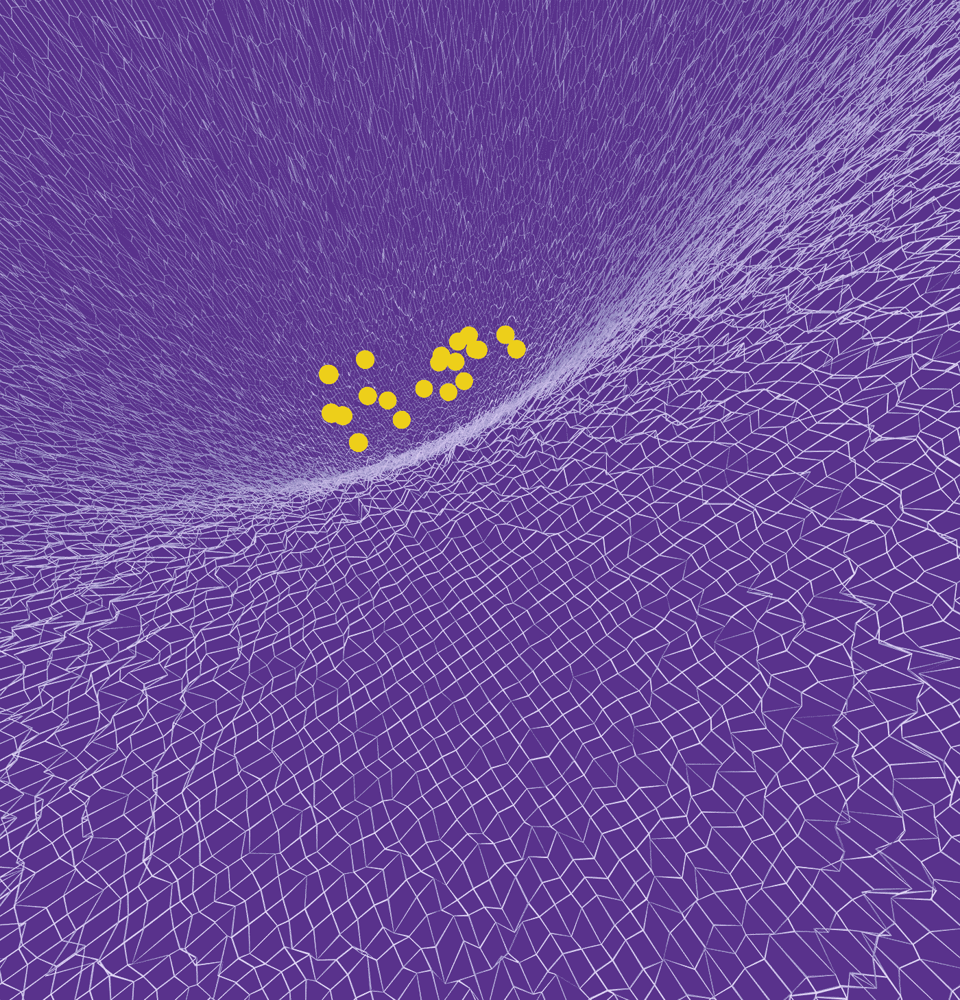****

******不确定下降**。swa-高斯(swag)。深度学习中贝叶斯不确定性的简单基线。基于 wesley maddox，timur garipov，pavel izmailov，dmitry vetrov，andrew gordon wilson 的论文。可视化是帕维尔·伊兹迈洛夫、帖木儿·加里波夫和哈维尔·ideami@losslandscape.com 的合作。NeurIPS 2019，ARXIV:1902.02476 | losslandscape.com****

****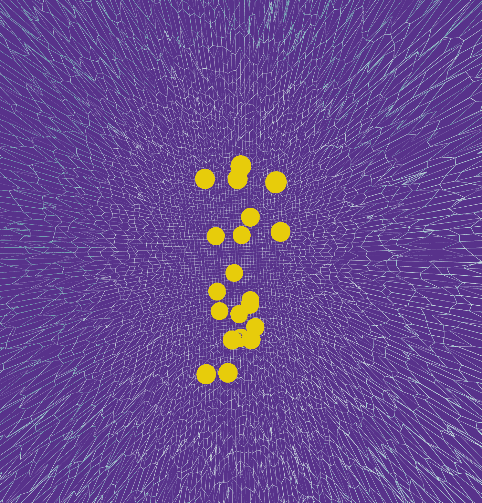****

******不确定下降**。swa-高斯(swag)。深度学习中贝叶斯不确定性的简单基线。基于 wesley maddox，timur garipov，pavel izmailov，dmitry vetrov，andrew gordon wilson 的论文。可视化是帕维尔·伊兹迈洛夫、帖木儿·加里波夫和哈维尔·ideami@losslandscape.com 的合作。NeurIPS 2019，ARXIV:1902.02476 | losslandscape.com****

****这些可视化使我们能够从不同的角度研究所有类型的表面，如下面的研究，从下面的看**凸度动力学，作为一个极小值向一个极小值前进。******

****从下视角度研究凸性动力学。真实数据。由哈维尔·艾达米| losslandscape.com 捕捉并可视化****

****如前所述，这些可视化的详细程度可以根据我们的喜好而定。当然，数据越多，我们需要的计算时间和资源就越多。更多的数据使我们能够更详细地研究这些表面的形态。****

****训练过程的边缘视野的详细研究。真实数据。由哈维尔·艾达米| losslandscape.com 捕捉并可视化****

# ****维度的祝福****

****许多研究人员发现**随着深度学习网络增加维度**，**找到好的极小值变得更容易，而不是更难**。这与一些人所说的**“维度的祝福”**有关。****

****最近， **Babak Hassibi** ，他是**就职于加州理工学院**的 Mose 和 Lillian S. Bohn 电气工程、计算和数学科学教授，做了一个题为**“深度学习和维度的祝福”**(与 Navid Azizan Ruhi 和 Sahin Ali Lale 的**联合工作)。******

****与维度的祝福相反的是所谓的**“维度的诅咒”**，这是指随着维度的增长，可能的组合和配置的数量也呈指数增长，而我们的数据所覆盖的那些组合的数量变得更少。这在理论上应该会引起不同的问题，然而，相反的事情似乎正在发生。****

****随着我们的网络在维度上变得更大，它们的**参数数量使系统中的数据点数量相形见绌(过度参数化的网络)**。因此，他们应该过度拟合数据，而不是一概而论。但是，我们发现的是**他们绝对是一概而论，网络越大越好！******

****常见的情况是，我们有**数百万个参数和数千个数据点，但网络不会超负荷**。****

****Babak 在他关于**在干草堆里找针**的谈话中把**做了一个很好的类比**。关于参数化系统下的**，我们可以想象我们正试图**在干草堆**中找到几根针**(将我们带到良好最小值的权重值组合)**。相反，相对于**过度参数化的网络**，大海捞针**无限多**，这就是为什么找到它们可能容易得多。******

**例如，当我们有 100 万个参数和 1000 个数据点时，**我们在损失范围内开始训练过程的任何一点，**都将**接近插值我们数据的组合**。**

**由于这种维度的祝福，**收敛成为一个更容易解决的挑战**，它变得**容易收敛到景观内的低最小值**。最重要的是，有了一个好的正则化器，我们也可以得到我们想要的泛化能力。此外，Babak 告诉我们，在我们的深度学习 SGD 算法中嵌入了**一种隐式正则化能力。****

**总之，**额外的维度促进了我们的优化挑战**。在高维网络中，插值解的集合非常大。正因为如此，无论你的起点在亏损区域的什么地方，很有可能在你的起点附近有一条本地路径会带你到达一个很好的最小值。**

**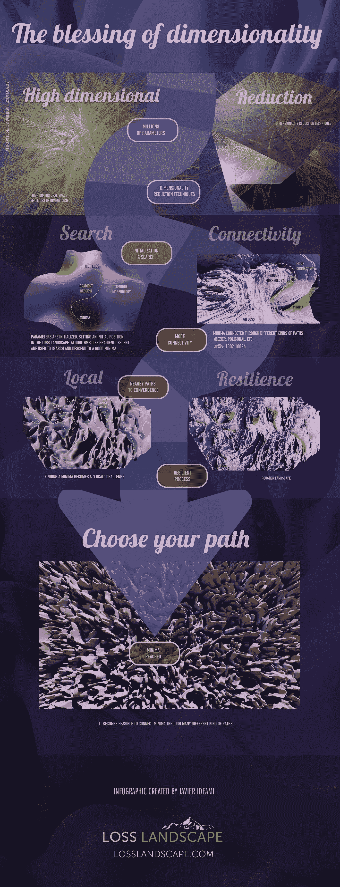**

**Javier Ideami 制作的信息图。下载下来，想怎么分享就怎么分享。关于模式连接的更多信息，请查看蒂穆尔·加里波夫的精彩论文[https://arxiv.org/abs/1802.10026](https://arxiv.org/abs/1802.10026)，[帕维尔·伊兹迈洛夫](https://arxiv.org/search/stat?searchtype=author&query=Garipov%2C+T)，[德米特里·波多普里欣](https://arxiv.org/search/stat?searchtype=author&query=Podoprikhin%2C+D)，[德米特里·维特罗夫](https://arxiv.org/search/stat?searchtype=author&query=Vetrov%2C+D)，[安德鲁·戈登·威尔逊](https://arxiv.org/search/stat?searchtype=author&query=Wilson%2C+A+G)| losslandscape.com**

# **是否有可能保持全局损失状况不变，并可视化运行中的移动优化器？**

**好问题，我们来探讨一下。**

**在这些可视化中，我们所做的可以被描述为**“跟随极小点，同时检查其附近的环境”**。这是可行的，因为我们一直知道我们网络的当前权重，所以我们可以将这些作为我们低维平面(我们从随机正交方向产生的平面)的中心/参考点，并且从该点我们可以探索它的周围环境。那些附近的环境是不断变化的，因为我们的最小化点的位置(根据我们网络的变化权重计算)随着训练的进行而变化(并且随着我们在权重空间中移动)，所有这些都发生在不变的、完全高维度的景观中，其中的一个区域通过我们的低维解释被可视化地表达。**

**现在让我们考虑另一种选择。如果我们想在训练进行的同时固定好地形，同时我们试图沿着地形周围的极小值路径前进，我们就面临一个挑战。**

**我们在表象中想象的风景是一个完整高维空间的一部分的低维解释。为了创建那个表示，那个较低维度的版本，我们需要利用一个参考点，自然地，这个参考点恰好是我们的极小点的当前位置，它在权重空间中的当前状态和位置。**

**因此，如果我们既想表示静态景观，又想表示极小点所遵循的路径，我们就遗漏了一些东西。我们应该在每一步展示高维度景观的哪一部分？我们很自然地会说，我们希望显示最小化点当前位置附近的区域。当然，我们去吧。但是当极小值移动时，我们该怎么办？轨迹与我们所代表的景观区域有什么关系？要考虑的关键是极小值在高维空间内移动，而不是在低维解释内。因此，极小点的“下一个”位置的低维解释，可能与前一个关系不大(因为变化发生在高维空间)。通过将景观固定在适当的位置，我们固定了一个投影到平面上的低维表示，该平面对应于极小值的权重空间中的特定状态和位置。**

**我们可以尝试用不同的方法来处理这个问题。前面提到的论文“可视化神经网络的损失景观”，利用 PCA 来分析极小值的轨迹，但正如前面所讨论的，PCA 方向提取景观的优化部分。通过这样做，我们将无法准确地将该数据与景观的其余部分进行匹配(相对于极小点周围更广泛、更多样化的区域)。**

**如果我们的极小点的运动具有非常低的维度性质，我们可以采用单一的固定景观状态，并试图通过使用投影来匹配极小点的轨迹(使用 PCA)。然而，正如汤姆·戈尔茨坦曾经告诉我的那样，极小点的轨迹不会是完美的平面，所以我们必须将其投影到一个平面上，这意味着投影的轮廓可能不是平面外的轮廓。除此之外，PCA 还在其他方面限制了我们与周围环境的关系。**

**总之，精确匹配轨迹和地形仍然是一个挑战。最重要的是，在整个过程中，将周围广阔的地形和极小点的轨迹结合起来，是前一个障碍之上的又一个障碍。**

**这里的一个核心问题是，我们一直在观察和处理高维结构的低维解释。让我们考虑一下我们的摄影类比的变体。**

**假设你从不同的角度拍摄了任何主题(存在于更高的三维空间中)的一系列照片(三维世界的二维解释)。然后说你试着把它们匹配起来。你可以使用摄影测量学(https://en . Wikipedia . org/wiki/photography measurement)。摄影测量可以从 2d 数据源的组合中提取基本的 3d 结构。对这些损失景观可以做类似的事情吗？面临的挑战是摄影测量要从 2d 来源的混合转换到 3d 空间。在我们的例子中，我们正在处理非常高维度的空间，具有数百万或数十亿维的空间。将来可能会有这样一种方法，但目前它仍是一个研究领域。**

**总之，在这些可视化中，我们通过将自己附在极小值本身上来加入高维度的旅程。当我们与极小者并排行驶时，我们利用一个低维的 2d 平面从某个角度分析和研究它的周围环境。**

**如果我们没有骑在最小化者的肩膀上，而是呆在原地，通过固定的低维解释的透镜来分析一部分景观，那么最小化者将在下面的步骤中移动到更高维度结构的不同部分，其低维表示将是不同的。**

**对我们来说不幸的是，我们不能可视化那些更高维度的结构，因为我们总是需要用更低维度的表示来分割它们，如果极小值的移动发生在非常有限的维度上，那么修复这些低维度的表示就变得可能了。由于这种事情无法保证，找到一种准确的方法将这两种表示(极小点的轨迹和固定的景观)放在一起就成了一个挑战。**

**另一种选择是我们在这里看到的，安全地骑在最小化者的肩膀上，同时随着训练过程的进行和我们在重量空间的移动，分析和研究变化的环境。这足以潜在地给我们关于这些过程的形态学和动力学的有用信息和见解。**

# **当计算损失值时，我们必须遍历整个训练集吗？**

**理想情况下是的。但和往常一样，帕累托经常击败完美。这真的取决于你的目标。对于一些目标，你可以迭代整个集合的一个子集，只要你一直使用同一个子集。例如，论文 [**“深度神经网络中 hessian 的负特征值”**](https://arxiv.org/abs/1902.02366) 指出，在研究 Hessian 的特征值时，使用 5%的训练集(并且总是重复使用相同的 5%)产生的结果足够接近于使用完整集产生的结果。**

# **下一步是什么？**

**在研究和艺术的交叉领域出现了更多相关的作品和更多的可视化和视听创作，以及与世界各地的研究人员的合作。这些类型的合作有助于我们推进深度学习领域。**

**哈佛大学布罗德研究所的帕维尔·伊兹迈洛夫**

**让我们继续深入迷失景观的迷人世界。**

**你可以在这里找到更多深度学习可视化:【https://www.youtube.com/playlist?】T5
list = plx RMG-srxahg 4x soalz 3 zbsyvwyhyxycj**

**通过**ideami@ideami.com**联系我**