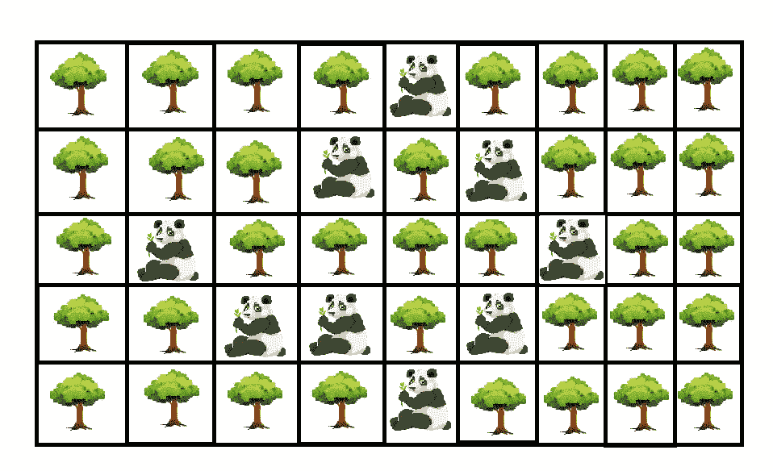
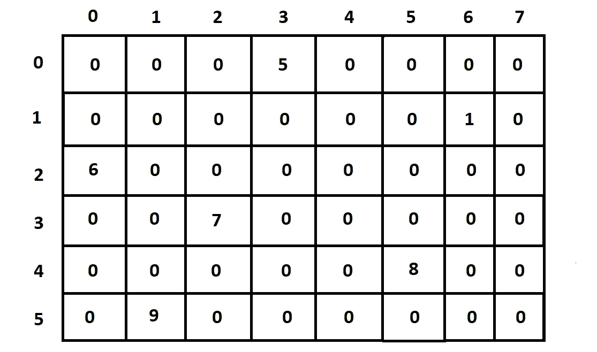
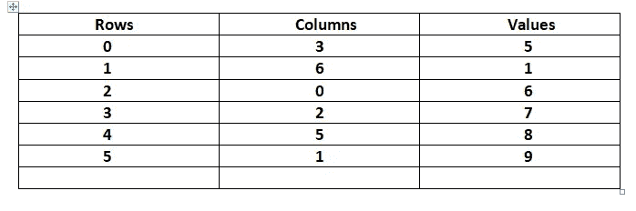
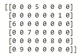
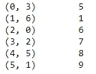
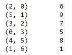

# 迷失在密林中:用简单的代码对机器学习中稀疏性的直觉！

> 原文：<https://towardsdatascience.com/lost-in-a-dense-forest-intuition-on-sparsity-in-machine-learning-with-simple-code-2b44ea7b07b0?source=collection_archive---------34----------------------->

## 为什么 ML 需要稀疏性？理解稀疏性的核心概念。

Sebastian Unrau 在 [Unsplash](https://unsplash.com?utm_source=medium&utm_medium=referral) 上的照片

看看这片美丽的森林吧！现在，想象你有机会对这片美丽的森林进行数据分析。

当前的任务是找出在森林中的每一个区域的熊猫数量与树木的数量之比。成功执行分析后，您意识到树木的密度比熊猫的种类要大得多。

将其转换为矩阵形式后，您会得到一个类似下图的图像:

作者备用矩阵。来自 freepik.com[的](https://www.freepik.com/free-photos-vectors/trees-cartoon)[图片](https://www.freepik.com/search?dates=any&format=search&page=1&query=cartoon%20animals&selection=1&sort=popular)

在这里，我们可以注意到有一些可爱的熊猫分散在各处，但矩阵的密度主要由树木组成。让我们假设 trees 的值= '0 '，panda 的值=任何非零值比如说' 1 '。这个图像将形成一个由 0 和 1 组成的矩阵。这意味着整个矩阵密度将包括大多数为 0 的**和极少数为 1 的 T10**

这种类型的矩阵主要由 0 和较少的非零数字组成，称为**稀疏矩阵**。

无论是机器学习还是深度学习，我们都会遇到很多稀疏性。它们经常出现在数据计数、单词编码中，并且主要出现在自然语言处理领域中，在对单词进行矢量化的过程中，会用到单词包、tf-idf、word2vec 等概念。

这是否意味着稀疏是一件好事？

可惜没有！稀疏并没有多大帮助。反而导致一定的问题。让我们在下一节讨论这些问题是什么。

## 稀疏矩阵的问题:

*   稀疏矩阵在计算上是昂贵的，因为矩阵结构中存在大量的冗余零。具有大尺寸的问题极大地增加了空间复杂性，并且解决这些问题变得具有挑战性。机器学习算法将不会像预期的那样有效地工作，这是由于不断增长的规模以及可能由于缺乏穷尽的资源。
*   引起的其他重要问题是有效计算矩阵的速度时间减少，以及机器学习算法的计算处理速度降低，这最终导致总体时间复杂度不好或者有时甚至糟糕的关键问题。出现这个问题的原因是因为计算过程花费的时间较长。

下一节将讨论解决这些问题和应对这些挑战的解决方案。

## 处理稀疏矩阵的方法:

假设我们有一个矩阵 X，它很大并且很稀疏，这意味着与非零值相比，它填充了许多零值，如下图所示:

作者图片

解决这些问题背后的主要思想必须是使用一种替代方法来解决它们，因为添加零会增加空间和时间的复杂性。处理它们的主要方法必须是使用一个用非零数字表示值的键字典，或者使用一个可以表示这些值的列表。该过程可以从下表中完成:

作者图片

上表向我们展示了解决这个问题的一个很好的方法。使用这种方法，我们可以形成一个简化的方程，其中只包含有用的非零数字。下面两种方法可以用来有效地表示稀疏矩阵。

1.  **压缩稀疏行矩阵:**这种转换方法利用了上表所示的方法，即行和列分别为一个元组，后跟一个非零值来表示稀疏矩阵。
2.  **压缩稀疏列矩阵:**这种转换方法利用了上表所示的方法，即分别用一个列和行的元组，后跟一个非零值来表示稀疏矩阵。

压缩稀疏矩阵和压缩稀疏列矩阵是有效表示稀疏矩阵的两种最佳方法。我会推荐 CSR 矩阵而不是 CSC 矩阵，因为这是我个人的偏好，而且它通常是用于表示的标准符号。然而，我将使用 python 中的 **scipy** 模块展示 CSR 和 CSC 转换的代码。你们可以自由选择最适合自己的方案。

大部分理论部分已经完成，让我们从编码开始吧！

## 用稀疏矩阵编码；

好吧，那我们开始吧！计算上图所示矩阵所需的两个机器学习库是 numpy 和 scipy。这些可以通过使用一个简单的 pip install 命令来安装。安装过程完成后，我们将根据需要构建矩阵，并将其赋给一个变量。

下面是代表库导入和创建稀疏矩阵过程的代码块。还提供了相应输出的图像。

下一步是将这个稀疏矩阵转换成压缩行矩阵(CSR)形式。这个输出类似于前面显示的表格。这个转换的代码块如下所示。另外，请参考下图，注意一个(行，列)元组，后跟一个非零数字。

如果您想将其转换回稀疏矩阵，那么只需使用 todense()函数，如下一个代码块所示。

如果您想知道如何对压缩的稀疏列矩阵进行相同的处理，那么可以通过下面的代码块来完成。

这个过程完成了理解稀疏性核心概念的所有要求。😃

我希望这能够给稀疏性和稀疏矩阵的概念一个更好的直觉。前进到结论部分！

德文郡在 [Unsplash](https://unsplash.com?utm_source=medium&utm_medium=referral) 拍摄的照片

# 结论:

至此，我们结束了关于稀疏性的讨论。稀疏矩阵在机器学习中非常常见，了解它们可能导致的问题以及如何准确地解决这些问题是非常重要的。

关于稀疏性的直觉是必须知道的，特别是如果你正在处理自然语言处理、计算机视觉项目、推荐系统和任何有很少非零和很多零的数据结构中的复杂任务。顺便说一下，这些情况不仅在机器学习中常见，在深度神经网络中也常见。

你可以通过下面的链接查看我最近的文章:

 [## Python 从头编码:没有任何机器学习库的矩阵乘法！

### 从零开始了解如何在没有任何机器学习库的情况下实现矩阵乘法！

towardsdatascience.com](/python-coding-from-scratch-matrix-multiplication-without-any-machine-learning-libraries-463624fe8726)  [## 10+牛逼 Python 编辑器的简明指南，以及如何选择最适合你的编辑器…

### 帮助您在各种 python 开发环境中进行选择的简明指南

towardsdatascience.com](/a-concise-guide-of-10-awesome-python-editors-and-how-to-choose-which-editor-suits-you-the-best-465c9b232afd)  [## 5 个常见的 Python 错误以及如何避免它们！

### 从初学者到专家，每个人在 python 和机器学习中都容易出现这些错误。

towardsdatascience.com](/5-common-python-errors-and-how-to-avoid-them-63d9afc1a58f) 

谢谢大家看完这篇文章，祝大家有美好的一天！