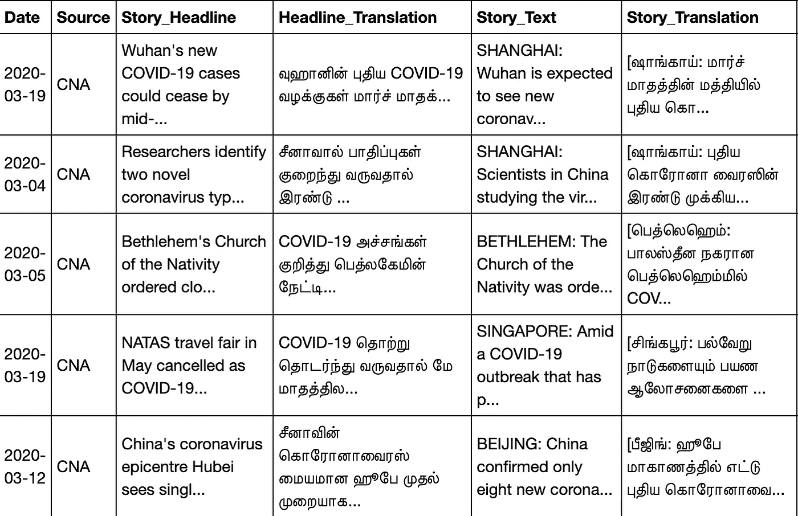
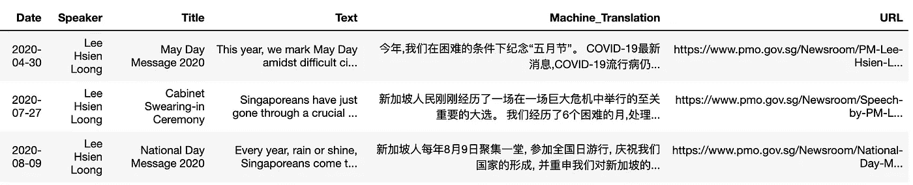
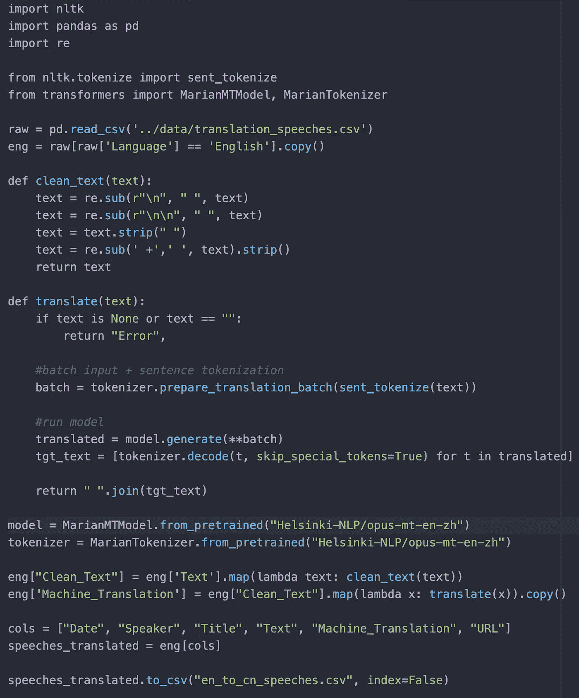
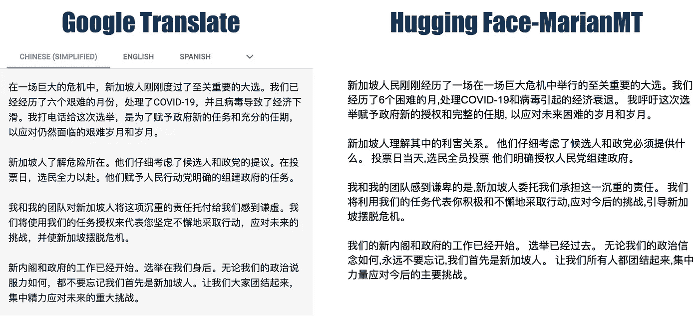
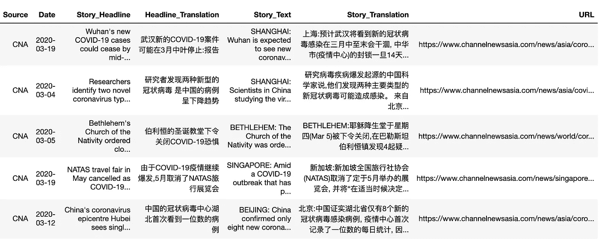
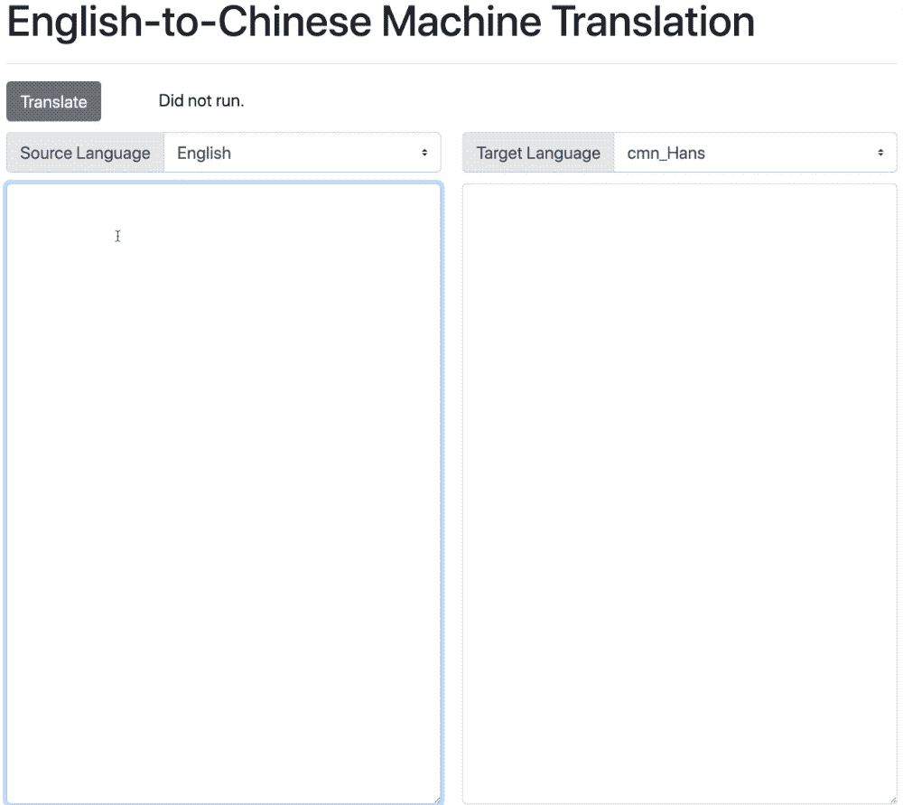
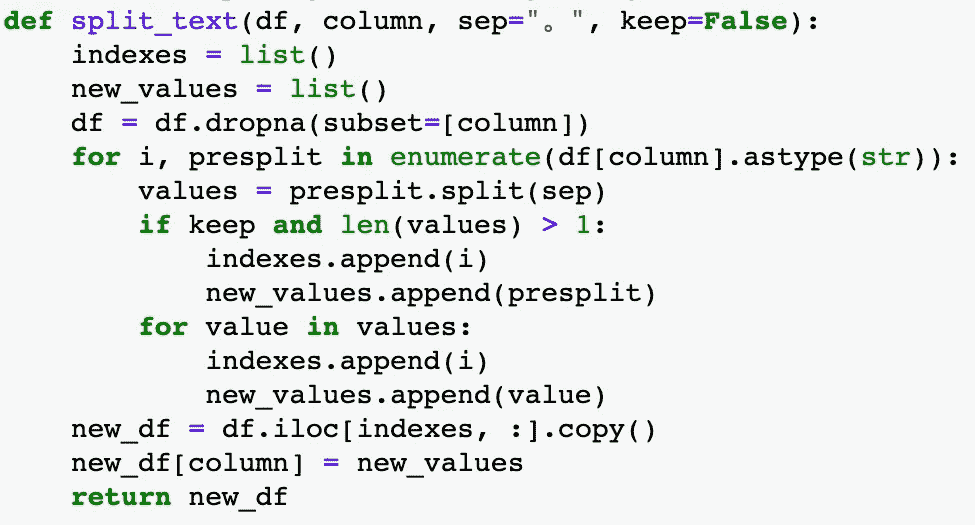
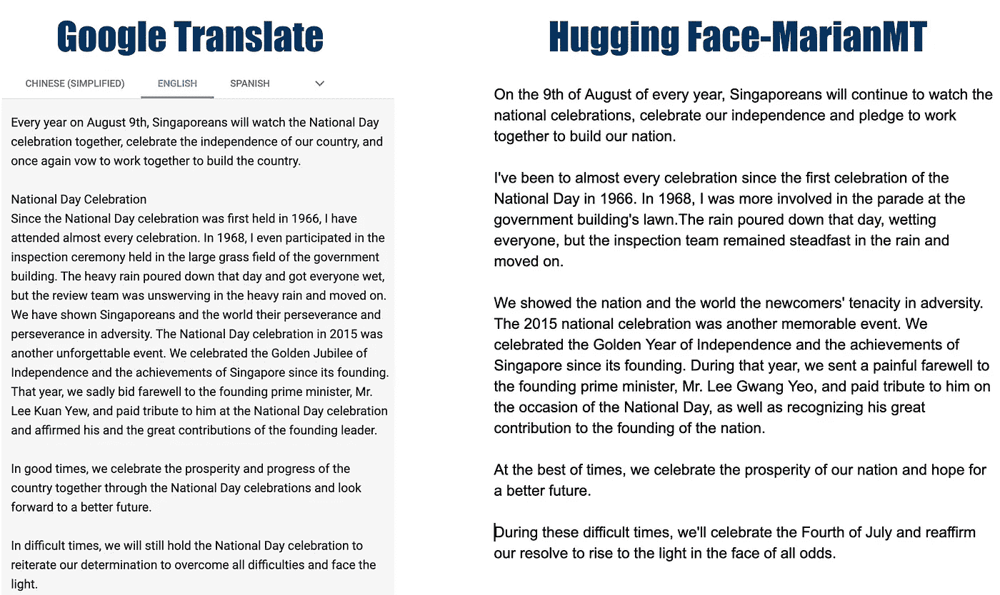

# 迷失在(机器)翻译中

> 原文：<https://towardsdatascience.com/lost-in-machine-translation-3b05615d68e7?source=collection_archive---------44----------------------->

## 使用拥抱脸的 MarianMT 版本和脸书的 Fairseq，小批量机器翻译 30 行以下代码的演讲和新闻文章(英文到中文/泰米尔语，反之亦然)。

插图:蔡展汉

*** 2020 年 12 月 30 日更新*** :

脸书最近发布了[最近发布了](https://github.com/pytorch/fairseq/tree/master/examples/wmt20)其英语到泰米尔语的机器翻译模型(反之亦然)，我渴望尝试一下，因为泰米尔语是机器学习中服务最差的语言之一，相关的语言对很难找到。

新的笔记本和玩具数据集在[回购](https://github.com/chuachinhon/practical_nlp)中。或者，点击[此处](https://github.com/chuachinhon/practical_nlp/blob/master/notebooks/4.3_english_to_tamil_fairseq.ipynb)观看演讲和新闻文章的英语-泰米尔语翻译演示，点击[此处](https://github.com/chuachinhon/practical_nlp/blob/master/notebooks/4.4_tamil_to_english_fairseq.ipynb)观看同类材料的泰米尔语-英语翻译。

翻译的*质量*在某些部分有明显的问题。但在我看来，机器翻译完成了大约 70-80%的工作，让人工翻译的工作效率更高。

新闻文章的英语到泰米尔语翻译的输出示例。

如今，机器翻译并没有像自然语言处理中的其他新兴领域那样令人兴奋，部分原因是像谷歌翻译这样面向消费者的服务自 2006 年 4 月以来就已经存在了。

但是最近的进展，特别是[拥抱脸](https://huggingface.co/)在使变形金刚模型更容易理解和使用方面的工作，为那些希望翻译不仅仅是零碎句子或文章的人开辟了有趣的新可能性。

例如，多种语言的小批量翻译现在可以在台式机或笔记本电脑上非常有效地运行，而不必订阅昂贵的服务。毫无疑问，[神经机器翻译](https://www.microsoft.com/en-us/translator/business/machine-translation/#nnt)模型翻译的作品没有(目前)熟练的人类翻译的作品那么巧妙或精确，但在我看来，它们完成了 60%或更多的工作。

这可以为时间紧迫的工作场所节省大量时间，例如新闻编辑室，更不用说缺乏熟练的人工翻译了。

在[的三个短笔记本](https://github.com/chuachinhon/practical_nlp)中，我将概述一个使用[抱抱脸版 MarianMT](https://huggingface.co/transformers/model_doc/marian.html) 批量翻译的简单工作流程:

*   [长短不一的英文演讲到中文](https://github.com/chuachinhon/practical_nlp/blob/master/notebooks/4.0_english_to_chinese_translate.ipynb)
*   [关于新冠肺炎的英文新闻报道(500 字以下)翻译成中文](https://github.com/chuachinhon/practical_nlp/blob/master/notebooks/4.1_english_to_chinese_news.ipynb)
*   [长短不一的中文演讲到英文](https://github.com/chuachinhon/practical_nlp/blob/master/notebooks/4.2_chinese_to_english_translate.ipynb)。

在这里下载输出文件

# 1.数据集和翻译输出

这篇文章有两个数据集。第一个由四种语言(英语、马来语、汉语和泰米尔语)的 11 篇演讲组成，摘自[新加坡总理办公室](https://www.pmo.gov.sg/)的网站。第二个数据集由 2020 年 3 月发表在新加坡新闻媒体 [CNA 网站](https://www.channelnewsasia.com/)上的五篇关于新冠肺炎的随机英语新闻组成。

带有机器翻译文本和原始副本的输出 CSV 文件的结果可在此处下载[。](https://www.dropbox.com/sh/q4vy8recuib4rs9/AACagocH9mkrdj0yKKqrO0vaa)

在撰写本文时，你可以在[拥抱脸的模型中枢](https://huggingface.co/Helsinki-NLP?utm_campaign=Hugging%2BFace&utm_medium=email&utm_source=Hugging_Face_1)上点击超过 1300 个开源模型进行机器翻译。由于到目前为止还没有发布用于英语-马来语和英语-泰米尔语(反之亦然)的 MarianMT 型号，所以这个系列的笔记本暂时不会处理这两种语言。当模型可用时，我会再次访问它们。

我不会深究机器翻译背后的技术细节。拥抱脸的 MarianMT 版本的广泛细节可以在[这里](https://huggingface.co/transformers/model_doc/marian.html)找到，而那些对机器翻译历史感兴趣的人可以从这篇最近的[文章](https://medium.com/huggingface/a-brief-history-of-machine-translation-paradigms-d5c09d8a5b7e)开始。

# 2A。3 篇演讲稿的英汉机器翻译

我选择了三篇英语演讲进行机器翻译，字数从 1352 到 1750 不等。它们技术含量不高，但涵盖了足够广泛的话题——从新冠肺炎到新加坡政治和国内问题——从而扩展了模型的功能。

这篇文章被轻描淡写地清除了。为了获得最佳效果，一次翻译一个句子(如果您通过模型运行整个语音，而不在句子级别进行标记，您会发现翻译质量显著下降)。[笔记本](https://github.com/chuachinhon/practical_nlp/blob/master/notebooks/4.0_english_to_chinese_translate.ipynb)在我的 2015 年末 iMac (32Gb 内存)上运行只需几分钟——但可能会因硬件而异。

多亏了 Hugging Face 的 MarianMT 实现，批量机器翻译变得容易了

机器翻译的一些常见问题很明显，尤其是某些术语、短语和习语的直译。

May Day, for instance, was translated as “五月节” (literally May Festival) instead of 劳动节. A reference to “rugged people” was translated as “崎岖不平的人”, which would literally mean “uneven people”. Clearly the machine translation mixed up the usage of “rugged” in the context of terrain versus that of a society.

这里有一个与谷歌翻译的对比，用的是第二次演讲的片段。在我看来,“拥抱脸”的结果——Marian mt 模型与谷歌翻译的结果相当吻合:

To be sure, neither version can be used without correcting for some obvious errors. Google’s results, for instance, translated the phrase “called the election” to “打电话给这次选举”, or to literally *make a telephone call to the election*. The phrasing of the translated Chinese sentences is also awkward in many instances.

在这一点上，一个熟练的人类翻译肯定会做得更好。但是我认为公平地说，即使是一个经验丰富的翻译也不可能在几分钟内翻译完三篇演讲。

目前，机器翻译吸引力似乎在于规模和相对速度，而不是精确度。让我们在不同体裁的写作中尝试同样的模式，看看它的表现如何。

# 2B。5 篇新闻文章的英汉机器翻译

演讲更倾向于对话，所以我随机挑选了五篇关于新冠肺炎的新闻文章(发表于 2020 年 3 月)，看看这个模型在更正式的写作风格下表现如何。为了简单起见，我选择了 500 字以下的文章。

此[二审](https://github.com/chuachinhon/practical_nlp/blob/master/notebooks/4.1_english_to_chinese_news.ipynb)中的工作流程与一审完全相同，除了额外的文本清理规则和文章标题以及正文的翻译。下面是输出 CSV 文件的样子:

在此下载上述[CSV 的副本。](https://www.dropbox.com/sh/q4vy8recuib4rs9/AACpGaQdQnjp1Ey2lcKDMJgFa/cna_translated.csv?dl=0)

让我们将其中一个例子与谷歌翻译的结果进行比较:

谷歌和 MarianMT 都在开头的一段上犯了错误，这一段又长又复杂。这两个模型在较短的句子/段落上表现稍好，但是简单短语笨拙的直译仍然是一个问题。

For instance, the phrase “as tourists stay away” was translated by the MarianMT model as “游客离家出走” or “tourists ran away from home”, while Google translated it as “游客远离了当地” or “tourists kept away from the area”.

这些问题可能导致对事实的误解，并造成混乱。我还没有进行全面的测试，但根据我迄今为止所做的测试，MarianMT 和 Google Translate 似乎在处理更具对话性质的文本方面做得更好，而不是更正式的写作形式。

# 2C。DASH 应用

Plotly 已经发布了许多基于 transformer 的 NLP 任务的[示例交互应用](https://github.com/plotly/dash-sample-apps)，其中包括一个与 Hugging Face 版本的 MarianMT 一起工作的应用。在 [Colab](https://github.com/plotly/dash-sample-apps/blob/master/apps/dash-translate/ColabDemo.ipynb) 上试用，或者通过 [Github](https://github.com/plotly/dash-sample-apps) 试用(我在下面的演示 gif 中编辑了应用的标题)。

# 3.3 篇演讲的汉英机器翻译

中文文本到英文的机器翻译通常是一个更加棘手的任务，因为大多数 NLP 库/工具都是基于英文的。例如，在 NLTK 中没有直接的句子标记器。

我用[解霸](https://github.com/fxsjy/jieba)和[汉普顿](https://github.com/hankcs/HanLP)做了实验，但是没有走多远。作为一个临时的解决办法，我[采用了一个函数](https://github.com/cognoma/genes/blob/721204091a96e55de6dcad165d6d8265e67e2a48/2.process.py#L61-L95)来将 dataframe 列中的中文文本分割成单独的句子，然后通过[中英互译模型](https://huggingface.co/Helsinki-NLP/opus-mt-zh-en)运行它们。

但即使采用了有些笨拙的变通方法，这三篇中文演讲的批量翻译也只花了大约 5 分钟。请注意，这三篇演讲是前三篇英语演讲的官方中文版本。两套演讲稿涵盖了相同的领域，但在中文演讲稿的内容上有一些细微的差异，这不是英文版本的直接逐字翻译。

你可以在这里下载输出 CSV 文件[。让我们来看看第三次演讲](https://www.dropbox.com/sh/q4vy8recuib4rs9/AACHKvbULez2oiNDI4oKJH1fa/speeches_cn_to_en.csv?dl=0)[和谷歌翻译](https://www.pmo.gov.sg/Newsroom/National-Day-Message-2020-Chinese)的结果如何比较:

谷歌翻译版本读起来更好，没有把“国庆节”翻译成“7 月 4 日”的明显错误。总的来说，汉译英机器翻译的结果似乎(至少对我来说)比英汉翻译的结果好得多。但一个可能的原因是，我样本中的中文演讲写得更简单，没有那么努力地推动神经机器翻译模型。

# 4.引人深思的事

虽然拥抱脸使机器翻译变得更容易理解和实现，但一些挑战仍然存在。一个明显的技术问题是针对特定市场的神经翻译模型的微调。

例如，中国、新加坡和台湾在使用中文书写形式上有很大的不同。同样地，马来语和印度尼西亚语即使听起来/看起来和不说话的人一样，也有明显的不同。为这种微调组装正确的数据集将不是一项简单的任务。

就公开可用的模型所能达到的结果而言，我认为机器翻译的英汉和汉英文本还不能公开发表，除非有一名熟练的翻译在场进行检查和修改。但这只是一个用例。在翻译的文本是不需要出版的更大的内部工作流程的一部分的情况下，机器翻译会非常方便。

例如，如果我的任务是追踪中国或俄罗斯国家行为者在社交媒体上的虚假信息活动，那么试图手动翻译大量推文和 FB 帖子就没有意义。对这些短句或段落进行批量机器翻译，在试图获得自动账户所兜售信息的广泛含义方面，效率会高得多。

同样，如果你在多语言市场跟踪新产品或政治活动的社交媒体反馈，批量机器翻译可能是监控从 Instagram、Twitter 或脸书收集的非英语评论的更有效方式。

最终，机器翻译越来越多的使用将受到语言技能广泛下降的推动，即使是在新加坡这样名义上的多语言社会。你可能会对上面的一些机器翻译文本嗤之以鼻，但大多数经历过新加坡双语教育系统的在职成年人，如果被要求自己翻译文本，不太可能做得更好。

这个帖子的 [Github repo 可以在这里找到。这是 NLP 新工具实际应用系列的第四篇。早期的帖子/笔记侧重于:](https://github.com/chuachinhon/practical_nlp)

*   [政治演讲的情感分析](https://www.analytix-labs.com/insights/cb-speeches)
*   [文字总结](/practical-nlp-summarising-short-and-long-speeches-with-hugging-faces-pipeline-bc7df76bd366)
*   微调你自己的聊天机器人。

如果你在这篇文章或我之前的文章中发现了错误，请联系我:

*   推特:[蔡钦汉](https://medium.com/u/b3d8090c0aee?source=post_page-----aad7f2e1d0a0----------------------)
*   领英:[www.linkedin.com/in/chuachinhon](http://www.linkedin.com/in/chuachinhon)