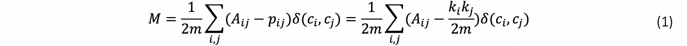
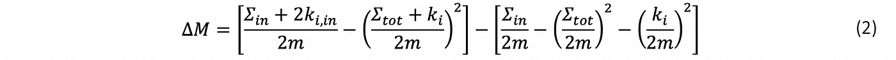
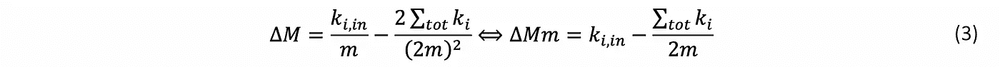
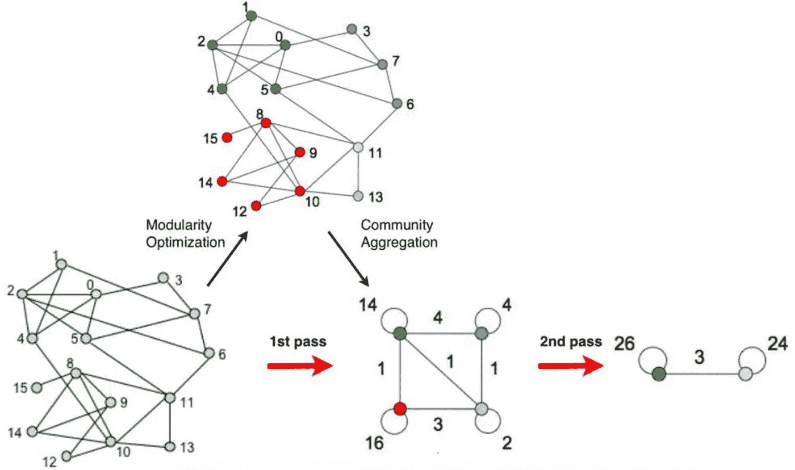
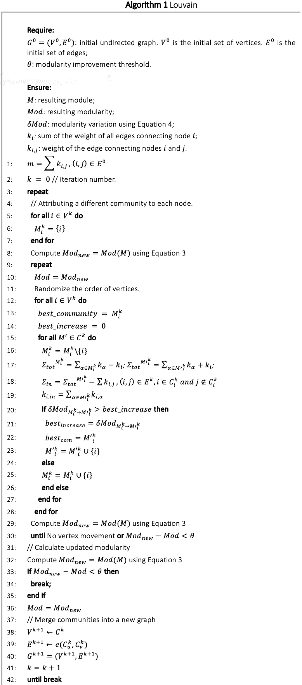

# 卢万算法

> 原文：<https://towardsdatascience.com/louvain-algorithm-93fde589f58c?source=collection_archive---------11----------------------->

## **一种用于**社区发现的**算法**

Louvain 是一种无监督算法(在执行前不需要输入社区的数量和大小)，分为两个阶段:模块优化和社区聚集[1]。第一步完成后，接着是第二步。两者都将被执行，直到网络中不再有变化并且实现最大模块化。

𝐴𝑖𝑗是表示连接节点𝑖和𝑗的边的权重的邻接矩阵条目，𝑘𝑖 = ∑𝑗 𝐴𝑖𝑗是节点𝑖的度，𝑐𝑖是它所属的社区，𝛿-function 𝛿(𝑢，如果=则为 1，否则为 0。𝑚 = 1 ∑𝑖𝑗 𝐴𝑖𝑗 2 是图中所有边的权重之和。

# 模块化优化

在模块优化中，Louvain 将随机排列网络中的所有节点。然后，它将一个接一个地移除和插入不同社区𝐶中的每个节点，直到模块性(输入参数)没有显著增加被验证:

设𝛴𝑖𝑛是𝛴𝑡𝑜𝑡𝐶内的链接的权重之和，到𝑘𝑖𝐶的节点的所有链接的权重之和，到𝑘𝑖,𝑖𝑛𝑖的节点的所有链接的权重之和，从𝑖节点到社区中的节点的链接的权重之和是图中所有边的权重之和。

进一步提高算法性能的一种方法是通过简化(2)并计算 *∆𝑀𝑚* 而不是完整的表达式:

虽然需要为每个试验社区计算𝑘𝑖,𝑖𝑛和σ𝑡𝑜𝑡，但是*【k𝑖/(2m】特定于正在分析的节点。这样，只有在模块化优化中考虑不同的节点时，才重新计算后一个表达式。*

# *社区聚集*

*完成第一步后，属于同一个社区的所有节点合并成一个巨型节点。连接巨型节点的链接是先前连接来自相同不同社区的节点的链接的总和。这一步还会生成自循环，它是一个给定社区中所有链接的总和，然后被折叠到一个节点中(图 1)。*

**

*图 1 卢万算法的步骤顺序。改编自[1]。*

*因此，通过在第一遍之后对社区的社区进行聚类，它固有地考虑了网络中分层组织的存在。算法 1 中的伪代码。*

**

# *参考*

*[1] V. D. Blondel，J.-L. Guillaume，R. Lambiotte 和 E. Lefebvre，“大型网络中社区的快速展开”， *J. Stat .机甲战士。(2008) P10008，*2008 年第 12 页。*