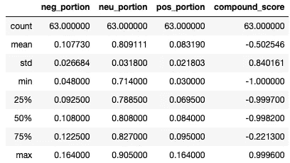

# 自然语言处理的 Lovecraft 第 1 部分:基于规则的情感分析

> 原文：<https://towardsdatascience.com/lovecraft-with-natural-language-processing-part-1-rule-based-sentiment-analysis-5727e774e524?source=collection_archive---------42----------------------->

## 使用 Python 中基于规则的情感分析库 VADER，将 H. P. Lovecraft 的故事从最黑暗到最不黑暗排序。


图片由 [F-P](https://pixabay.com/photos/?utm_source=link-attribution&utm_medium=referral&utm_campaign=image&utm_content=931706) 来自 [Pixabay](https://pixabay.com/?utm_source=link-attribution&utm_medium=referral&utm_campaign=image&utm_content=931706)

我已经考虑做一个自然语言处理项目有一段时间了，我最终决定对一个取自文献的语料库进行综合分析。我认为古典文学是 NLP 的一个非常有趣的应用，你可以展示从字数统计和情感分析到神经网络文本生成的广泛主题。

我选择了 [H. P .洛夫克拉夫特](https://en.wikipedia.org/wiki/H._P._Lovecraft)的故事作为我分析的主题。他是 20 世纪初的美国作家，以怪异和宇宙恐怖小说闻名，对现代流行文化有着巨大的影响。如果你想了解更多为什么我认为他是这样一个项目的最佳选择，看看我之前的文章，我也描述了我是如何准备我们现在要分析的文章的。

在 NLP 系列的第一篇文章中，我们将仔细研究基于规则的情感分析。在 NLP 的世界里，更广泛的情感分析肯定不是最好的第一步，然而，基于规则的情感分析的好处是它需要最少的前期工作。我想用一些可以立即玩的东西来开始这个项目，而不会被符号化和词条等技术细节所困扰。

我们将运用 VADER 情感分析法对洛夫克拉夫特的作品进行排序，从最消极的到最积极的。根据 GitHub 的页面，VADER“特别适应社交媒体上表达的情绪”。换句话说，这个图书馆是在一个现代的、俚语很多的语料库上训练出来的。这应该很有趣，因为洛夫克拉夫特从心底里憎恶三样东西:

*   来自其他维度的邪术生物；
*   没有受过良好教育的盎格鲁撒克逊男性；
*   俚语。

## 情感分析

先来一个快速总结。[情感分析](https://en.wikipedia.org/wiki/Sentiment_analysis)是 NLP 的一种，处理基于文本数据的情感分类。你输入一个文本，算法告诉你它有多积极或消极。有两种主要的方法可以采用:

*   **机器学习**:算法从一个数据中学习。例如，您有 10，000 条电影评论，以及用户给出的星级数和文本评论。可以以文本为特征，以星数为目标变量，训练一个分类模型。(当然，将非结构化文本数据转换成可测量的特征将是一个挑战，但幸运的是这不在本文的范围之内。)
*   **基于规则的**:算法根据一组手动创建的规则计算情感得分。例如，您可以计算某人在评论中使用“棒极了”的次数，并增加每个人的估计情绪。这听起来非常简单，但这就是正在发生的事情，只是规模更大。

在我们当前的项目中，我们将采用基于规则的方法，接下来让我们更仔细地看看我们的库！

## VADER

VADER 代表价感知词典和情感推理机。从本质上来说，这是一个情感词典，他们从 9000 多个特征(单词、表情、表情符号)开始，并要求人们在-4 到+4 的范围内对它们进行评分，从最消极到最积极。然后，他们取这些评分的平均值，排除那些被认为是中性的，并将它们收集在一个有 7520 个元素的[字典](https://github.com/cjhutto/vaderSentiment/blob/master/vaderSentiment/vader_lexicon.txt)中。(GitHub repo 还有一个搞笑、全面的[表情集合](https://github.com/cjhutto/vaderSentiment/blob/master/vaderSentiment/emoji_utf8_lexicon.txt)。)

除了这个词汇，还有一些有趣的调整。例如，“极度”这个词没有内在的消极或积极情绪，它只是增加了这个词的强度。也有降低强度的词，标点符号有意义，像“不太好”中的“不”这样的否定会抵消或逆转原来的情绪，等等。

## 它是如何工作的

让我们先来看几个例子。

安装库，并导入我们将要使用的方法:

```
pip install vaderSentimentfrom vaderSentiment.vaderSentiment import SentimentIntensityAnalyzer
```

接下来，我们创建一个 SentimentIntensityAnalyzer 对象:

```
sentiment_analyzer = SentimentIntensityAnalyzer()
```

还记得那个包含 7520 个令牌的文本文件吗？你可以在 Python 中查看它们，让我们看看“装饰”这个词是如何评分的:

```
token_scores = sentiment_analyzer.lexicon
token_scores['adorned']
```

结果是 0.8。不管上下文如何，这就是这个词的积极意义。我们不打算使用单独的分数，那会很乏味，`polarity_scores`方法为我们聚合了文本信息。

比如这句话:

```
sentiment_analyzer.polarity_scores('I feel good')
```

被评为:

```
{'neg': 0.0, 'neu': 0.408, 'pos': 0.592, 'compound': 0.4404}
```

前三个值是文本中阴性、自然或阳性的部分。在我们的例子中，0.592 被认为是正的，0.408 是中性的。复合得分是总体消极或积极得分，标准化，范围从-1 到+1。

现在，有一个机会，你，和我一样，会假设两件事:1)部分以某种方式连接到单词的数量或字符的数量，2)复合分数可以从部分和单独的分数计算出来。这两个理由你都错了。

## 窗帘后的一瞥

我花了相当多的时间试图弄清楚份额和复合分数是如何精确计算的。例如，如果您对词典中得分为 0.8 的“decorated”运行`polarity_score`方法，您将得到以下结果:

```
{'neg': 0.0, 'neu': 0.0, 'pos': 1.0, 'compound': 0.2023}
```

前三个数字看起来还行，毕竟正文只有一个字，而且是正的。但是复分从何而来？它接近于 0.8 / 4，这是通过将原始的 0.8 分归一化到-1 和+1 之间的范围而得到的，但它并不精确。与前面“我感觉很好”的例子类似的问题，你会假设“我”和“感觉”是中性词，“好”是一个积极的词，但是 0.408–0.592 的分裂来自哪里呢？

如果你感兴趣的话，在 [StackOverflow](https://stackoverflow.com/questions/40325980/how-is-the-vader-compound-polarity-score-calculated-in-python-nltk) 上有一个关于分数如何计算的详细描述。就我个人而言，我在这里画了一条线，关于我想花多少时间来研究一些最终只是一个有趣的思想实验背后的代码。

然而，当我在那里的时候，我仔细查看了 GitHub 上的[代码，有一些有趣的小细节:](https://github.com/cjhutto/vaderSentiment/blob/master/vaderSentiment/vaderSentiment.py)

*   像“非常”和“几乎”这样的积极和消极调整被分配给两组，并且它们以相同的因子±0.293 增加/减少强度，这意味着例如“相当”和“非常”是可互换的；
*   有很多硬编码的解决方案，看看 _negation_check 方法的例子；
*   最奇怪的是 normalize 函数中看似随机的 alpha = 15 平滑参数，据我所知，这是我无法复制复合分数的原因之一。

为了证明用如此简单的规则来衡量人类交流的细微差别是多么荒谬，猜猜哪个句子被评价得更负面:“*”和“*汤难吃了*”。*

是的，有汤的那个被评为更消极。其实第一句的评分是完全中立的。

不要误会我的意思，VADER 是一个非常令人印象深刻的图书馆，而且工作相当普遍，正如我们很快就会看到的。但就像许多机器学习算法一样，你越仔细看，它似乎就越不神奇。

好了，现在开始洛夫克拉夫特！

## 用 Lovecraft 测试词典

我们将进行一些测试，以确保该库能够处理 20 世纪早期的文本。

从《白色的船》( 1919)中选取这样的描述:

> 然后我们来到了一个愉快的海岸快乐的各种颜色的花朵，在内陆我们可以看到太阳下晒可爱的小树林和辐射凉亭。

运行`polarity_scores`返回以下结果:

```
{'neg': 0.0, 'neu': 0.733, 'pos': 0.267, 'compound': 0.8807}
```

听起来还行，是很正面的文字。然而，我很好奇这个分数在词典中的依据是什么。通过拆分文本，我们可以收集句子中词典中的单词:

```
result = []for word in text_to_analyze.split():
    if word in token_scores:
        result.append((word, token_scores[word]))
```

打印完`result`后我们得到:

```
[('pleasant', 2.3), 
('lovely', 2.8), 
('radiant', 2.1)]
```

很有趣，对吧？所有的文字，这三个词决定了情绪，就像那里没有别的东西，没有“*开着各种颜色的花*”。

让我们来看一个更典型的洛夫克拉夫特序列，来自 Dagon (1917):

> 我说过，连绵起伏的平原的连续不断的单调令我隐隐感到恐惧；但是，当我登上土堆的顶峰，从另一边向下望去，看到一个无法估量的深坑或峡谷时，我觉得我的恐惧更大了，因为月亮还没有升到足够高的高度来照亮这些深坑或峡谷。我觉得自己在世界的边缘；从边缘窥视永恒之夜的无尽混乱。在我的恐惧中，充满了对失乐园的好奇回忆，以及对撒旦可怕地爬过过时的黑暗王国的回忆。

这一部分的估计情绪:

```
{'neg': 0.186, 'neu': 0.692, 'pos': 0.121, 'compound': -0.8074}
```

文本的 0.186 被认为是否定的，0.121 是肯定的。然而，总复合分数-0.8074 接近负极限，这意味着负片段的强度更强。

同样，我们可以收集具有指定非中性分数的单个单词:

```
[('vague', -0.4),
 ('horror', -2.7),
 ('horror', -2.7),
 ('greater', 1.5),
 ('gained', 1.6),
 ('chaos', -2.7),
 ('terror', -2.4),
 ('curious', 1.3)]
```

和第一个例子一样，我们可以看到大部分信息没有被处理。列表中没有“*连续单调*”或“*永夜*”。我们也可以看到有一些分类错误。例如，表达式“*我的恐惧更大*”中的单词“*更大*”得到+1.6 分，但它意味着消极性的增加。但最重要的是，它在某种程度上把握住了整体情绪。

总的来说，我对目前的表现相当满意:总的分数似乎反映了人们对文本的看法。剩下唯一要做的事情就是将它应用到完整的语料库中！

## 洛夫克拉夫特全集排名

在我们进入排名之前，我想再次强调，我们正处于思想实验领域。我认为，基于规则的情感分析充其量是一种高级近似，而 VADER 是为了分析现代的、简短的、非正式的文本而创建的，这些文本对洛夫克拉夫特的作品来说都不是真实的。

随着警告的出现，没有进一步的麻烦，我使用下面的代码来处理写作，并将结果保存在列表中。列表`filenames`包含各个故事的名称。

```
neg_portion = []
neu_portion = []
pos_portion = []
compound_score = []for filename in filenames:
    print("Processing " + filename)
    my_file = open(txt_adjusted_folder + filename + '.txt')
    raw_text = my_file.read()
    sent_score = sentiment_analyzer.polarity_scores(raw_text)
    neg_portion.append(sent_score['neg'])
    neu_portion.append(sent_score['neu'])
    pos_portion.append(sent_score['pos'])
    compound_score.append(sent_score['compound'])
```

然后，我从这些列表中创建了一个熊猫数据框架对象。4 个分数的统计:



Lovecraft 情感分析统计

我们可以得出的一个明确结论是，这些作品大多是负面的。复合得分的第 75 百分位仍然为负，平均情绪为-0.5025。在 63 篇作文中，只有 16 篇获得了总体正面分数。

好吧，让我们看看名单。根据综合得分，最积极的五篇文章是:

```
The White Ship (1919)
The Quest of Iranon (1921)
The Whisperer in Darkness (1930)
The Dream-Quest of Unknown Kadath (1927)
Celephaïs (1920)
```

这里有一个非常有趣的共同因素:所有这些故事都涉及到主角“梦想”自己进入神奇的幻想世界，它们大多是对风景和城市的描述，没有多少行动发生在其中。毫无疑问，他们使用了相当积极的语言，我们之前在《白船》中看到了一个例子，但这些故事的整体基调相当忧郁，没有人类读者会将它们归类为“快乐”。然而，非常有趣的是，情感分析算法成功地将这组故事与“非常黑暗”的故事区分开来。

(顺便说一句，如果你有兴趣，你可以在这个[参考书目](https://en.wikipedia.org/wiki/H._P._Lovecraft_bibliography)中了解更多的故事。)

**5 种最消极的**写法是:

```
The Dreams in the Witch House (1932)
The Shadow over Innsmouth (1931)
The Dunwich Horror (1928)
The Colour out of Space (1927)
The Lurking Fear (1922)
```

这里的共同主题是，这些故事更重情节(相对而言)，更长，更复杂的作品。它们也很有名，这五部作品中有三部是洛夫克拉夫特最有影响力的作品。如果你想知道，他的大多数其他著名故事，如《疯狂之山》(1931)、《赫伯特·威斯特——复活者》(1922)、《查尔斯·德克斯特·沃德的案子》(1927)也在十大最黑暗故事之列。克苏鲁的召唤(1926)是第 16 首。

有趣的是，在统计表中可以看到，所有文章中的大部分文本都是中性的，中性部分占文本的 71.4%到 90.5%。这将支持这样一个概念，即尽管整体基调压抑，洛夫克拉夫特作品中的叙述通常是平静而遥远的，除了偶尔的“恐怖，恐怖，难以形容的恐怖！”章节。但这也可能是因为该词典的大部分内容不在 VADER 词典中。

如果您想查看所有的结果，您可以在这里通过一个 [CSV 文件](https://github.com/MatePocs/lovecraft/blob/master/results/sentiment_analysis.csv)访问它们。还有大图表显示[的综合得分](https://github.com/MatePocs/lovecraft/blob/master/results/sentiment_analysis_chart_compound_score.png)和[的文本部分](https://github.com/MatePocs/lovecraft/blob/master/results/sentiment_analysis_chart_text_portions.png)。

## 未来可能的分析

关于这个语料库，我们还可以对 VADER 做一些额外的分析。例如，你可以把故事分成几个句子，然后看看它们在故事过程中有多消极。有没有相对中性的起点，然后中间有一个峰值，或者反过来？看到这些肯定会很有趣。

我希望这篇文章对你有所帮助，在下一篇文章中，我们将更深入地了解符号化和单词分析。

## 参考

休顿，C.J .和吉尔伯特，E.E. (2014 年)。VADER:基于规则的社交媒体文本情感分析的简约模型。第八届网络日志和社交媒体国际会议。密歇根州安阿伯，2014 年 6 月。

霍布森、科尔和汉尼斯(2019 年)。自然语言处理实践:理解、分析和用 Python 生成文本。曼宁出版，2019。

洛夫克拉夫特全集:

[](https://arkhamarchivist.com/free-complete-lovecraft-ebook-nook-kindle/) [## 面向 Nook 和 Kindle 的免费 H.P. Lovecraft 全集

### 在 2010 年 12 月初，我用一个来自澳大利亚古腾堡项目的文件创建了一个大多数 Lovecraft 的 EPUB

arkhamarchivist.com](https://arkhamarchivist.com/free-complete-lovecraft-ebook-nook-kindle/)