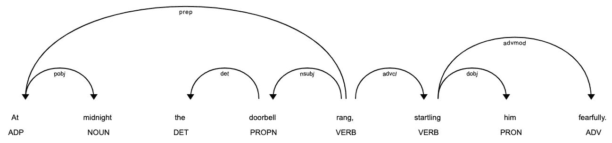
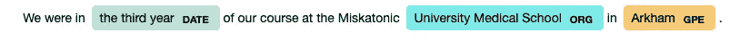

# 自然语言处理的 Lovecraft 第 2 部分:标记化和字数统计

> 原文：<https://towardsdatascience.com/lovecraft-with-natural-language-processing-part-2-tokenisation-and-word-counts-f970f6ff5690?source=collection_archive---------32----------------------->

## 使用 Python NLP 库 spaCy 分析 H. P. Lovecraft 小说中的词汇用法。


图片由 [LUM3N](https://pixabay.com/users/LUM3N-1066559/?utm_source=link-attribution&utm_medium=referral&utm_campaign=image&utm_content=1535201) 来自 [Pixabay](https://pixabay.com/?utm_source=link-attribution&utm_medium=referral&utm_campaign=image&utm_content=1535201)

这是我从自然语言处理的角度分析 H. P. Lovecraft 作品系列的第二篇博文。在[的第一个帖子](/lovecraft-with-natural-language-processing-part-1-rule-based-sentiment-analysis-5727e774e524)中，我们通过分析故事的整体情绪来开始。我们不能再推迟了，我们必须讨论所有 NLP 分析的基础:标记化。我觉得把这个问题和一个特定的问题联系起来会很有趣，所以在这篇文章中，我们将找出洛夫克拉夫特在每个故事中使用最多的词，以及在他的文学作品中使用最多的词。

阅读《Lovecraft》时，你记忆最深的一件事是奇怪的语言。他倾向于使用很多负面的词，恐怖，疯狂，沮丧，尤其是用形容词:不可名状，不可描述，不可描述的恐怖无处不在，对吗？《局外人》(1921)中有这样一段话:

> 上帝知道它不属于这个世界——或者不再属于这个世界——然而令我恐惧的是，我在它被侵蚀和露出骨头的轮廓中看到了对人类形体的恶意的、令人憎恶的嘲弄；在它发霉腐烂的衣服里，有一种说不出的特质，让我更加不寒而栗。

这让洛夫克拉夫特尖叫。在阿卡姆档案馆(我下载文章的网站)，有一个单独的页面[专门用于字数统计，人们提交建议，收集故事的人统计它们。我很好奇，想知道这个概念是否可以被“科学地”观察到。这些故事有我们想象的那么消极吗？用的最多的形容词是什么，是“恐怖”“未知”“古老”吗？动词是关于知识和/或发疯的吗？他有没有用过“女人”这个词？好吧，让我们来看看！](https://arkhamarchivist.com/wordcount-lovecraft-favorite-words/)

我们将从一个快速的理论背景开始，在文本上应用一些实际的准备工作，看一看[空间](https://spacy.io/)中的几个例子，然后最后继续字数统计。

## 理论

首先，让我们看一下我们将在这个项目中使用的几个概念。

*   [**标记化**](https://en.wikipedia.org/wiki/Lexical_analysis#Tokenization) **:** 一种文档分割技术，将非结构化(文本)数据分割成小块数据，这些数据可被视为离散元素。在我们的分析中，单个的记号将会是单词，但是不一定是这样，记号可以是一个段落，一个句子，单词的一部分，甚至是字符。
*   [](https://en.wikipedia.org/wiki/Bag-of-words_model)**:大量文本的无序聚合表示，可以是文档、章节、段落、句子等。原始文本中的语法、标点和词序都被忽略，唯一保留的是唯一的单词和与之相关的数字。这个数字可以是单词在文本中出现的频率，也可以是二进制的 0 或 1，简单地衡量单词是否在文本中。**
*   **[这种形式可以是单词的词根，例如，当我们在一篇文章中计算单词“house”时，我们可能还想包括“houses”和“House”，如果它是大写的，因为它位于句子的开头。有许多不同的方法，我们将使用的一种是引理化，例如词干化，甚至采用文本的小写版本也是规范化。](https://en.wikipedia.org/wiki/Stemming)**
*   **[**引理满足**](https://en.wikipedia.org/wiki/Lemmatisation) :寻找单词的 [**引理**](https://en.wikipedia.org/wiki/Lemma_(morphology)) 的过程。词条基本上是单词的字典形式。比如“houses”的引理是“house”，“better”变成“good”，“thought”变成“think”等等。**
*   **[比如“一”、“为什么”、“做”等。对于某些 NLP 任务(比如我们的)，忽略这些单词是有意义的。](https://en.wikipedia.org/wiki/Stop_words)**

## **文本准备**

**当我第一次为这个项目做[文本准备工作](/pdf-text-extraction-in-python-5b6ab9e92dd)时，我怀疑我将不得不返回并做一些额外的调整，这被证明是正确的——当我开始使用标记化时，我遇到了问题。比如，你会不会猜到这两句话:**

*   **”*为什么不呢？***
*   **"*为什么不呢？*”**

**会有不同的结果吗？原因是[撇号](https://en.wikipedia.org/wiki/Apostrophe)。一般来说，你希望单词的“ *n't* ”部分与碱基分开。于是“*不是*”就变成了“*是*”和“*不是*”。但是它并不适用于所有的撇号。连字符、破折号、引号也有类似的问题——你无法想象有多少不同的字符用于相同的目的！**

***(注:洛夫克拉夫特* [*几乎从不使用缩写*](https://howtowritelike.com/2019/02/06/how-to-write-like-h-p-lovecraft/) *)因为他认为它们是缺乏适当教育的明显标志。然而，他有时会在对话中使用它们，以显示——也告诉——那个人有多没文化。不过，他确实用了很多破折号。)***

**所以在我们进行调查之前，我们需要追捕这些奇怪的人物。我认为谈论一下这些步骤是很重要的，即使这可能看起来有点无聊，因为(以我的个人经验)许多 NLP 指南完全跳过它，只从一个干净的文本开始。在大型 NLP 库中可能有这样的方法，比如 NLTK，这可能是一个 Unicode 解码问题，但是对我来说，手动调整文本似乎是最合理的解决方案。**

**我开始分析一个故事中的人物，邓威奇恐怖(1928)，假设保存在`text`变量中。排除空白，并使其小写:**

```
text = text.lower()
text = text.replace('\n','')
text = text.replace('\x0c','')
text = text.replace(' ','')
```

**然后，您可以创建一串独特的字符，如下所示:**

```
unique_characters = set(text)
```

**如果你想把它们打印成一串，你可以简单地加入集合**

```
unique_characters_in_string = ''.join(set(text))
```

**在 Dunwich 的案例中，这些是独特的角色:**

```
'-2wdj0i”m8uüosczävèr‖l)q,4b76e’n—a1(:é.ftpk?x‘hg!;93―y5'
```

**然后，我创建了一个名为`regular_characters`的字符串，它包括英文字母表中的字母、数字、标点符号、括号、普通引号和撇号。我们遍历它们，从唯一的字符中去掉规则的字符，所以我们剩下的是不规则的字符。**

```
for character in regular_characters:
    try:
        unique_characters.remove(character)
    except:
        pass
```

**这些是留下来的字符:**

```
'ä', 'è', 'é', 'ü', '—', '―', '‖', '‘', '’', '”'
```

**是的，**

```
'—' == '―'
```

**由于某种原因是假的，在这一点上，我们已经排除了我认为是常规的连字符和破折号！引号也有类似的问题，“”就是其中之一。(那不是大写的 I，那是两条竖线，在文中是引号。)非英语拉丁字母是可以的，它们在文本中的用法是合法的，以防你想知道:**

*   **“我！舒布-尼格拉特！”**
*   **“巴黎 Bibliothèque 国家公园”**
*   **埃:“vigenère's·特拉伊特·德·希夫雷斯”**
*   **ü:“klüber's 氪空间”**

**我为所有的故事重复了这个过程，收集了所有我想修改的奇怪角色。我最终得到了这本替换词典:**

```
replace_dict = {}
replace_dict['*'] = ''
replace_dict['—'] = '–'
replace_dict['―'] = ''
replace_dict['‖'] = '\"'
replace_dict['‗'] = ''
replace_dict['”'] = '"'
replace_dict['‘'] = '\''
replace_dict['’'] = '\''
```

**遍历所有文本文件，应用替换:**

```
for replace_char in replace_dict: 
    text = raw_text.replace(\
        replace_char,  replace_dict[replace_char])
```

**并将它们保存为新的 TXT 文件。它们应该正常工作。好了，现在说正经事。**

## **使用 SpaCy**

**我们首先安装将要使用的 NLP 库: [spaCy](https://spacy.io/) 。**

```
pip install spacy
```

**我们还需要单独安装一个我们将要使用的语言模型。有多种语言的[模型可用](https://spacy.io/usage/models)，英语有三种不同的模型。我发现的大多数指南都推荐从`en_core_web_sm`开始，我认为这对于一个简单的项目来说是可行的，但是经过一些尝试和错误之后，我决定使用`en_core_web_lg`。(稍后我们将看到一个例子。)**

**要安装模型，请执行以下操作:**

```
python -m spacy download en_core_web_lg
```

**请注意，下载和构建大模型可能需要一些时间。**

**现在，我们可以设置一个`nlp`对象作为我们的 NLP 模型，并创建一个`doc`对象作为字符串输入的处理版本:**

```
nlp = spacy.load(“en_core_web_lg”)doc = nlp(“At midnight the doorbell rang, startling him fearfully.”)
```

**`doc`是一个 [Doc](https://spacy.io/api/doc#_title) 对象，它基本上是一个令牌容器。因此，在这一点上，我们已经有我们的文本标记！Doc 保留了原始文本中的所有信息，比如空白，所以您可以从中重建文本。**

**Doc 对象中的令牌是[令牌](https://spacy.io/api/token#_title)对象，有一长串您可以请求的属性，请参见这里的完整列表。现在，我们将使用三个属性:**

*   **`text`:文本中出现的令牌的简单文本**
*   **`lemma_`:令牌的引理**
*   **`pos_`:标记的[词性](https://universaldependencies.org/docs/u/pos/)(例如名词、形容词、动词等……)**

**为了分析我们的句子，我们可以列出标记属性:**

```
for token in doc: 
    print(token.text, token.lemma_, token.pos_)
```

**它会打印出这个:**

```
At at ADP
midnight midnight NOUN
the the DET
doorbell doorbell PROPN
rang ring VERB
, , PUNCT
startling startle VERB
him -PRON- PRON
fearfully fearfully ADV
. . PUNCT
```

**这似乎是正确的，错误地将“门铃”归类为专有名词，而不是名词。这是大模型。小模型表现更差，将“让”归类为专有名词，没有找到动词的现在时态。出于某种原因，这变成了一个棘手的句子。**

**你也可以用显示法来形象化一个句子，尽管我认为这主要是在教育环境中有用。如果您正在 Jupyter 笔记本中工作，您已经打开了一个浏览器窗口，您可以使用`render`方法:**

```
spacy.displacy.render(doc, style=”dep”)
```

****

**你也可以将这些可视化保存为 SVG 文件，你可以在[文档](https://spacy.io/usage/visualizers)中读到更多关于如何做的内容。**

**我们看到了 spaCy 如何通过一个随机的句子很好地工作。像《老臭虫》(1919)中这样故意拼错的奇怪句子呢？**

> **也是一个了不起的人——他的父亲是一个大公司的律师，他的母亲是一个文学天才。**

**嗯，不出所料，图书馆在挣扎。它或多或少地获得了标记的词性索引，但是没有识别出“‘n’”应该是“and”，“s”应该是“his”，等等…**

**关于 spaCy 库，我想谈的另一件事是它如何识别文本中的命名实体。令我惊讶的是，它甚至对虚构的作品也有效。**

**引用赫伯特·韦斯特《复活者》( 1922)的第一句话。**

> **赫伯特·韦斯特是我大学和晚年的朋友，说起他，我只能感到极度恐惧。**

**我们可以遍历 Doc 对象中的[条目](https://spacy.io/api/doc#ents)来查找命名实体:**

```
doc = nlp(text)
for ent in doc.ents:
    print(ent.text, ent.label_)
```

**将返回:**

```
Herbert West PERSON
```

**我发现这是一个令人印象深刻的特点。让我们看看同一个故事中的另一句话:**

```
We were in the third year of our course at the Miskatonic University Medical School in Arkham.
```

**在我们以同样的方式列出实体后，我们得到:**

```
the third year DATE
University Medical School ORG
Arkham GPE
```

**几乎完美，虽然出于某种原因，它错过了“米斯卡托尼克”部分。**

**这也可以形象化，这一次我们应该将样式设置为“ent”:**

```
spacy.displacy.render(doc, style=”ent”)
```

**退货:**

****

**这就是我们现在需要的。**

## **赫伯特·韦斯特《复活者》( 1922)的词汇分析**

**作为第一步，我们专注于一个故事。库中有许多内置的方法可以自动为你做单词包，我没有找到一个完全符合我需要的方法，幸运的是，我们自己编写代码真的很简单！让我们首先为这个项目创建一些助手函数。**

**首先，我们构建一个`create_word_counts_by_pos`函数，它接受一个原始文本文件、一个词性标签列表和一个可选的单词计数字典，以防我们想要以这种方式聚合多个故事。它将返回一个字典，其中的键是词性标签，值是更小的字典，对应标签的单词作为值，它们在文本中的计数作为值…所以 word_count_dict 的结果字典内部将有一个 word_count_dict['名词']字典，它将由类似' man': 4，' house': 28，…，word_count_dict['ADJ']，word_count_dict['动词']等的键值对组成。**

**这个过程的一个重要部分是我们想要排除停用词，这对于 spaCy 来说非常简单，令牌有一个返回布尔值的`is_stop`方法，我们只需要考虑这个属性为 False 的令牌。**

**假设我们有一个这种格式的`word_count_dict`,我们可能想要过滤掉超过某个阈值的单词。这就是`filter_word_count_dict_to_frequent`要做的，保持输入字典的结构，但是删除所有计数低于阈值的元素。**

**最后，我们需要一些方法来排序单词，这样我们就可以知道哪些是最常用的。这就是`collect_most_frequent_words`将要负责的，你输入一个带数字的单词计数词典，你会从每个词类类别中得到那么多出现频率最高的单词。**

**这是完成我们刚刚讨论的内容所需的所有代码:**

**现在我们有了这些函数，获取不同结构中的字数就非常容易了。目前，我们只对名词、专有名词、形容词和动词感兴趣:**

```
list_of_pos = ['NOUN', 'PROPN', 'ADJ', 'VERB']
```

**假设我们有了`text`变量中的所有文本，要得到`word_count_dict`:**

```
word_count_dict = \
    word_count_func.create_word_counts_by_pos(text, list_of_pos)
```

**`word_count_dict`将是一个很长的单词集合，任何在文本中出现过一次的名词、形容词或动词都将在那里出现。我们可以筛选出出现次数超过 10 次的单词:**

```
frequent_word_count_dict = \
    word_count_func.filter_word_count_dict_to_frequent(
        word_count_dict, 10)
```

**`frequent_word_count_dict`足够简洁，在此简单复制并不过分:**

```
{'NOUN': {'friend': 13,
  'college': 21,
  'life': 39,
  'work': 18,
  'year': 19,
  'experiment': 24,
  'fear': 13,
  'death': 16,
  'solution': 22,
  'time': 20,
  'case': 11,
  'reanimation': 13,
  'corpse': 14,
  'specimen': 34,
  'body': 49,
  'eye': 17,
  'field': 15,
  'thing': 53,
  'room': 12,
  'laboratory': 18,
  'house': 16,
  'horror': 15,
  'man': 28,
  'result': 15,
  'night': 17,
  'sound': 14,
  'police': 13},
 'PROPN': {'Herbert': 20,
  'West': 132,
  'Arkham': 18,
  'Dr.': 15,
  'Bolton': 12},
 'ADJ': {'great': 20,
  'hideous': 17,
  'dead': 23,
  'human': 21,
  'fresh': 28,
  'small': 12,
  'new': 14,
  'large': 12},
 'VERB': {'see': 17,
  'come': 24,
  'hold': 11,
  'know': 18,
  'find': 14,
  'restore': 11,
  'inject': 15,
  'think': 18,
  'look': 14,
  'tell': 11}}
```

**如果你读了这个故事/看了这部电影，你可能会发现很多这些令人满意。对于没有看过的人来说:这个故事基本上是关于一个疯狂的科学家创造僵尸，并永无止境地寻找新鲜尸体。**

**让我们看看形容词，前三个形容词是:“新死去的人”可能是故事的工作标题。“标本”比“人”用得更多，显然与赫伯特·韦斯特是朋友的叙述者大多称他为“韦斯特”，而不是“赫伯特”，动词“注射”用得可疑。**

**现在让我们对所有的故事都这样做！**

## **所有故事的单词分析**

**我决定在分析中省略专有名词，专注于每个故事每个词类的前 5 个词。首先，我们需要设置一些变量:**

```
number_of_words_to_collect = 5
list_of_pos = ['NOUN', 'ADJ', 'VERB']words = {}
word_counts = {}for part_of_speech in list_of_pos:
    words[part_of_speech] = {}
    word_counts[part_of_speech] = {}
    for number in range(number_of_words_to_collect):
        words[part_of_speech][number] = []
        word_counts[part_of_speech][number] = []
```

**然后，我们可以做一个类似的过程，就像我们在上一章中对单个故事所做的那样。我们不使用常用词典，而是请求一个最常用单词的列表。假设`filenames`包含我们要导入的文件的名称，并且它们保存在`txt_folder`中:**

```
for filename in filenames: 
    my_file = open(txt_adjusted_folder + filename + '.txt')
    print("Currently processing: " + filename)
    raw_text = my_file.read()
    word_count_dict = \ 
        word_count_func.create_word_counts_by_pos(
            raw_text, list_of_pos)
    most_frequent_list_dict = \
        word_count_func.collect_most_frequent_words(
            word_count_dict, number_of_words_to_collect)
    for part_of_speech in list_of_pos:
        for number in range(number_of_words_to_collect):
            words[part_of_speech][number].append(
                most_frequent_list_dict[part_of_speech][number][0])
            word_counts[part_of_speech][number].append(
                most_frequent_list_dict[part_of_speech][number][1])
```

**完成后，我们应该在两个字典中有我们需要的一切，`words`和`word_counts`。我把它们和熊猫结合起来，对于‘名词’组，我们可以这样做:**

```
noun_counts = pd.DataFrame()
noun_counts['filename'] = filenames
for i in range(number_of_words_to_collect):
    noun_counts['word_' + str(i+1)] = \
        words['NOUN'][i]
    noun_counts['word_' + str(i+1) + '_count'] = \ 
        word_counts['NOUN'][i]
```

**对形容词和动词重复同样的操作，现在我们有了语料库中 63 个故事的前 5 个单词及其在 3 个词性组中的数量。把它们都复制到这里可能有点多，你可以在 CSV 文件中找到关于[名词](https://github.com/MatePocs/lovecraft/blob/master/results/word_counts/most_frequent_words/most_frequent_nouns.csv)、[形容词](https://github.com/MatePocs/lovecraft/blob/master/results/word_counts/most_frequent_words/most_frequent_adjs.csv)和[动词](https://github.com/MatePocs/lovecraft/blob/master/results/word_counts/most_frequent_words/most_frequent_verbs.csv)的数据。**

**让我举几个我觉得很有趣的例子。**

**名词:**

*   **我个人最喜欢的一首，埃里希·赞恩(Erich Zann，1921)的音乐是用这些名词来代表的:街道、音乐、夜晚、窗户、房间。**
*   **潜伏的恐惧(1922):大厦，恐惧，夜晚，事物，眼睛。**
*   **《黑暗中的低语》(1930):事物、人、信、时间、声音**

**形容词:**

*   **Cele phas(1920):奇怪，白色，伟大，金色，古老**
*   **克苏鲁的召唤(1925):伟大，古老，陌生，年轻，死亡**

**动词通常与故事不太匹配，毕竟有很多通用动词。再加上 Lovecraft 的风格很有描写性和距离感，几乎没有什么动作。**

**好的，到目前为止我很满意，我认为这样一个基本的分析是如何抓住这么多故事的本质的，这令人印象深刻。**

## **所有洛夫克拉夫特的故事加起来**

**最后，回到大问题，他用得最多的词是什么？按照与上面类似的过程，但是在每一轮，我们保留`word_count_dict`，所以它计算一个组合分数。(组合所有文本不起作用，这大约是 spaCy 中内存限制的 2.5 倍。)**

**所以，鼓点，这是洛夫克拉夫特最常用的 20 个名词、形容词和动词:**

```
{'NOUN': [('thing', 1152),
  ('man', 1075),
  ('time', 830),
  ('night', 666),
  ('place', 569),
  ('house', 490),
  ('day', 476),
  ('city', 453),
  ('year', 432),
  ('stone', 407),
  ('dream', 392),
  ('room', 383),
  ('world', 379),
  ('door', 370),
  ('way', 367),
  ('horror', 352),
  ('light', 350),
  ('life', 340),
  ('wall', 335),
  ('eye', 333)],
 'ADJ': [('old', 917),
  ('great', 797),
  ('strange', 488),
  ('certain', 446),
  ('black', 379),
  ('little', 336),
  ('ancient', 308),
  ('high', 297),
  ('small', 282),
  ('dark', 277),
  ('new', 268),
  ('human', 267),
  ('unknown', 259),
  ('terrible', 256),
  ('long', 244),
  ('curious', 227),
  ('low', 216),
  ('hideous', 213),
  ('young', 210),
  ('good', 204)],
 'VERB': [('come', 1100),
  ('know', 1095),
  ('see', 1079),
  ('find', 784),
  ('tell', 649),
  ('think', 571),
  ('hear', 528),
  ('look', 474),
  ('go', 439),
  ('say', 425),
  ('leave', 401),
  ('begin', 400),
  ('feel', 397),
  ('take', 368),
  ('grow', 310),
  ('give', 306),
  ('shew', 275),
  ('bring', 267),
  ('speak', 266),
  ('try', 262)]}
```

**我再次认为动词是最不令人兴奋的，尽管你可以看到大多数动词都是关于知识收集或分享的。如果你想知道，“shew”是 show 的老式拼法。**

**名词更好，“时间”，“夜晚”，“石头”，“梦”，“恐怖”——我会根据这五个词猜测作者是 Lovecraft。我的意思是，恐怖出现在有史以来最常用的 20 个名词中，这确实令人放心！**

**最后，形容词，至少有三分之二在列表中有这么高的位置通常会很奇怪。最常用的形容词是“老”，我的意思是，那有多牛逼？这个清单还包括“伟大”、“奇怪”、“古老”、“未知”、“可怕”等等。**

**(你可能会注意到，我们有 213 次“可怕的”，但在我在介绍中提到的[阿卡姆档案管理员](https://arkhamarchivist.com/wordcount-lovecraft-favorite-words/)页面上，这个词有 260 次。这种差异是由于我们根据词类来区分单词的用法。他把这个词作为形容词用了 213 次，但这不包括名词“可怕”或副词“可怕地”。)**

## **未来可能的分析**

**我认为用这些简单的 NLP 工具可以做更多有趣的分析。我们把范围限制在名词、形容词和动词上，看看副词或专有名词也会很有趣。分析不同年份动词的相对比例也很有趣。这样，我们可以看到随着时间的推移，故事是否变得更加精彩，还是相反？还有一个非常重要的概念我们没有考虑到: [n-grams](https://en.wikipedia.org/wiki/N-gram#:~:text=In%20the%20fields%20of%20computational,a%20text%20or%20speech%20corpus.) 。可以进行非常相似的分析来找出他的作品中最常用的表达。**

**我们从一个非常简单的问题开始:我想知道 Lovecraft 使用频率最高的词是什么？对于这样一个简单的问题，这比我想象的要复杂得多。看到这样一个简单的 NLP 表示工作得如此之好真是太酷了。**

**在下一篇文章中，我将讲述如何进一步计算字数，并使用 TF-IDF 向量计算文档之间的差异。**

## **参考**

**霍布森、科尔和汉尼斯(2019 年)。自然语言处理实践:理解、分析和用 Python 生成文本。曼宁出版，2019。**

**[](https://spacy.io/usage/linguistic-features) [## 语言特征空间使用文档

### 智能地处理原始文本是困难的:大多数单词是罕见的，对于看起来完全…

空间. io](https://spacy.io/usage/linguistic-features) 

洛夫克拉夫特全集:

[https://arkhamarchivist . com/free-complete-love craft-ebook-nook-kindle/](https://arkhamarchivist.com/free-complete-lovecraft-ebook-nook-kindle/)**