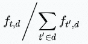
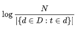
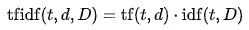
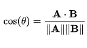
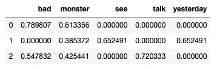
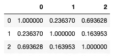

# 自然语言处理的 Lovecraft 第 3 部分:TF-IDF 向量

> 原文：<https://towardsdatascience.com/lovecraft-with-natural-language-processing-part-3-tf-idf-vectors-8c2d4df98621?source=collection_archive---------13----------------------->

## 使用 Python、scikit-learn 和 spaCy 构建 H. P. Lovecraft 的故事的 TF-IDF 表示，以确定哪些故事彼此接近。


图片由 [F-P](https://pixabay.com/photos/?utm_source=link-attribution&utm_medium=referral&utm_campaign=image&utm_content=1208296) 来自 [Pixabay](https://pixabay.com/?utm_source=link-attribution&utm_medium=referral&utm_campaign=image&utm_content=1208296)

这是我的 Lovecraft NLP 系列的第三部分。在之前的帖子中，我讨论了[基于规则的情感分析](/lovecraft-with-natural-language-processing-part-1-rule-based-sentiment-analysis-5727e774e524)和[单词计数和标记化](/lovecraft-with-natural-language-processing-part-2-tokenisation-and-word-counts-f970f6ff5690)。

到目前为止，我们的方法非常简单，我们基本上是将文本分解成单词，并以某种方式计数。NLP 领域的下一步将是研究 TF-IDF 向量，它代表词频——逆文档频率。这是一种不太二进制的方法，用于搜索引擎和垃圾邮件过滤器，通过这种方法，我们将把单词解码成连续的数字，而不是整数。

首先，我们将通过定义相关术语来看一下这个理论。然后我们将看到如何使用 spaCy 和 scikit-learn 库来计算我们语料库中的 63 个 Lovecraft 故事的 TF-IDF 向量。最后，我们将尝试通过对向量表示应用 k-means 聚类来创建有意义的组。

在我们开始之前，我想管理对结果的期望:我们最终将得到的组不会那么有意义。在前两篇帖子中，我对简单的 NLP 分析结果非常满意，并且很容易得出关于 Lovecraft 工作的有意义的结论。这不是这里的情况，有一些模式，但故事并没有真正分配到好的同质组。至少我找不到一个好的整体模式，但是也许你会找到，最终结果可以在一个 CSV 文件中找到。

## 理论

让我们先快速总结一下重要的术语。

*   [**【TF】**](https://en.wikipedia.org/wiki/Tf%E2%80%93idf#Term_frequency):TF-IDF 公式的第一部分，旨在捕捉某个术语在某个文档中的重要性。参见维基百科文章中的替代计算，计算 TF 的默认方法是取一个独特的单词在文档中出现的次数，然后除以该文档中的总单词数。如果将文档 *d* 中的项 *t* 的原始计数记为 *f(t，d)* ，则 TF( *t，d* )为:



词频公式

*   [**齐夫定律**](https://en.wikipedia.org/wiki/Zipf's_law) :描述一种现象的经验法则，适用于多种类型的数据，包括来自自然语言的数据。当涉及到自然语言时，该定律指出，任何单词的频率都与其在频率表中的排名成反比。这意味着出现频率最高的单词是第二高的单词的两倍，第三高的单词的三倍，等等。Zipf 定律解释了为什么在 IDF 公式中采用比率的对数会导致更具线性间隔的度量。
*   [**【IDF】**](https://en.wikipedia.org/wiki/Tf%E2%80%93idf#Inverse_document_frequency_2):捕捉该术语在整个语料库中的常见程度。如果 *N* 是文件的数量， *D* 是文件的集合，那么 IDF( *t* ， *D* )就是:



逆文档频率公式

*   **sk learn 中的 IDF**:sci kit-learn 还对 IDF 公式应用平滑效果，详见[文档](https://scikit-learn.org/stable/modules/feature_extraction.html#text-feature-extraction)。
*   [**TF-IDF 值**](https://en.wikipedia.org/wiki/Tf%E2%80%93idf#Term_frequency%E2%80%93Inverse_document_frequency) :结合 TF 和 IDF 公式，创建单词在文档和语料库中相对重要性的表示。TF 部分衡量术语在文档中的重要性，而 IDF 衡量术语在文档之间的区分程度。如果一个术语出现在语料库中的许多文档中，这意味着它太常见了，人们无法很好地了解基于该特定术语的文档有多接近。TF-IDF 越高，特定术语在特定语料库的特定文档中就越重要。要计算该值，只需将 TF 和 IDF 公式相乘即可:



TF-IDF 公式

*   **TF-IDF 向量**:上面公式中的 TF-IDF 数是为特定的术语-文档-语料库三元组计算的。然后，我们可以收集语料库中所有独特的词，这些将是维度。然后，对于每个文档，我们创建一个向量，其中每个数字是特定单词的 TF-IDF 分数。这意味着如果一个单词在文档中不存在，该维度中的数字将为 0。这将是一个类似于我们在上一篇文章中讨论的单词袋的概念，但是我们将有连续的数字来代替整数。通常的做法是取向量的 l2 范数，这意味着它们的长度是 1。我们很快就会看到一个例子。
*   [**余弦相似度**](https://en.wikipedia.org/wiki/Cosine_similarity) :两个向量之间相似度的度量，取值在 1(表示完全对齐)和-1(表示完全对立)之间。是的，这和三角学中一个度数的余弦基本上是一回事。这就是我们如何计算两个 TF-IDF 向量之间的相似性。重要的是，如果我们取两个归一化向量，余弦相似度将等于点积，因为公式中的分母等于 1。这是矢量 A 和 B 之间余弦距离的一般公式:



A 和 B 向量的余弦相似性

*   [**点积**](https://en.wikipedia.org/wiki/Dot_product) :取两个维数相同的向量，返回一个数作为输出的运算。为了计算它，你取相应条目的乘积，然后计算乘积的和。正如前面提到的，我们将使用它来计算两个 TF-IDF 向量之间的距离。考虑到文档中不能有否定词，我们理论上能达到的最低相似度是 0。在它们的 TF-IDF 表示之间余弦相似度为 0 的两个文档甚至没有一个公共单词。
*   **余弦距离**:为了完整起见，余弦距离被定义为 1-余弦相似度。关于余弦距离有趣的是，它可以是一个度量，但它不是一个距离度量(详见[维基百科文章](https://en.wikipedia.org/wiki/Cosine_similarity))。

## TF-IDF 与 spaCy 和 scikit-learn

在这一节中，我们将看看如何创建一个文档的 TF-IDF 向量表示。我们将构建来自 sklearn 的 [TfidfVectorizer](https://scikit-learn.org/stable/modules/generated/sklearn.feature_extraction.text.TfidfVectorizer.html) 类，并使用我们使用 spaCy 定义的标记器。(如果你是这个话题的新手，我建议你看看我的[上一篇文章](/lovecraft-with-natural-language-processing-part-2-tokenisation-and-word-counts-f970f6ff5690)，我假设你知道文本标记化一般是如何工作的。)

先来看看`tokenizer`吧。我们基本上需要一个函数，它接受一个字符串作为输入，并返回一个令牌列表作为输出。你可以随意地设计这个函数，我采用了一种非常简单的方法，这就是我的`spacy_tokenizer`函数要做的:

*   将文档拆分成单词标记；
*   忽略停用词、标点符号和空格。
*   获取每个剩余单词的词条，并将它们收集到一个列表中。

我们设置了`nlp`对象，它将完成繁重的工作(你需要为此安装一个 spaCy 语言模型，如果你不确定如何做，请参考我之前的帖子):

```
import spacy
nlp = spacy.load("en_core_web_lg")
```

然后您可以定义记号赋予器函数:

```
def spacy_tokenizer(document):
    tokens = nlp(document)
    tokens = [token.lemma_ for token in tokens if (
        token.is_stop == False and \
        token.is_punct == False and \
        token.lemma_.strip()!= '')]
    return tokens
```

这是我要用来举例的语料库:

```
example_corpus = [
    "Monsters are bad.", \
    "I saw a monster yesterday.", \
    "Why are we talking about bad monsters?"]
```

既然我们已经有了标记器和语料库，我们可以设置一个 TfidfVectorizer。您可以使用许多参数，查看[文档](https://scikit-learn.org/stable/modules/generated/sklearn.feature_extraction.text.TfidfVectorizer.html)了解更多信息，我们只使用这两个参数:

*   `input`:定义我们将如何输入要分析的文本，默认值“content”意味着我们将它们作为字符串变量传递，这就是我们在本例中所做的。对于大型文档，这当然不是一个可行的方法，所以稍后我们将传递一个文件路径列表来打开和处理。
*   `tokenizer`:决定使用哪个记号赋予器。TfidfVectorizer 类有一个内置的，我们将为我们用 spaCy 创建的类覆盖它。

我们正在定义矢量器:

```
tfidf_vectorizer = \
    TfidfVectorizer(input = 'content', tokenizer = spacy_tokenizer)
```

`tfidf_vectorizer`对象的工作方式类似于标准的 sklearn 机器学习模型。如果调用`fit`方法，它将学习词汇表和公式的 IDF 部分，`transform`方法将把语料库转换成包含 TF-IDF 值的稀疏矩阵格式。这两个步骤在`fit_transform`方法中结合在一起:

```
result = tfidf_vector.fit_transform(example_corpus)
```

如果我们现在给`result`打电话，我们得到的是:

```
<3x5 sparse matrix of type '<class 'numpy.float64'>'
	with 8 stored elements in Compressed Sparse Row format>
```

这是一个包含 3 个文档和 5 个术语的稀疏矩阵，在这 3*5 = 15 个可能的数字中，有 8 个非零 TF-IDF 值。我们可以用`get_feature_names`方法从句子中检查哪些术语是实际考虑的:

```
tfidf_vector.get_feature_names()
```

功能名称是:

```
['bad', 'monster', 'see', 'talk', 'yesterday']
```

稀疏矩阵格式是存储这些信息的有效方式，但是您可能希望使用`todense`方法将其转换为可读性更强的密集矩阵格式。要从结果中创建 pandas 数据帧，您可以使用以下代码:

```
dense = result.todense()
denselist = dense.tolist()
df = pd.DataFrame(
    denselist,columns=tfidf_vector.get_feature_names())
```

最后我们可以看看三个句子的 TF-IDF 向量:



示例语料库的 TF-IDF 向量

单词“monster”出现在所有三个句子中，因此“monster”列中的值是所有行中最低的，这意味着它不是区分句子的重要术语。

让我们检查一下第一句话中的数字是如何计算的。“bad”和“monster”的 TF 都是 0.5，考虑到句子中只有两个词没有被忽略。为了计算 IDF 值，我们需要计算有多少文档包含特定的单词。“坏”出现在 3 个中的 2 个，“怪物”出现在所有 3 个中。“差”的 IDF 分数(使用 sklearn 的[平滑效果](https://scikit-learn.org/stable/modules/feature_extraction.html#text-feature-extraction))将为:

```
math.log((3+1) / (2+1)) + 1 = 1.2876820724517808
```

而对于“怪物”:

```
math.log((3+1) / (3+1)) + 1 = 1
```

因此，未经调整的 TF-IDF 分数为:

*   `1.2876820724517808 * 0.5`为“坏”
*   而`1 * 0.5`为“怪物”

然而，这个向量的长度还不是 1:

```
(0.6438410362258904  ** 2 + 0.5 ** 2) ** 0.5
```

等于`0.8151878801407859`，因此我们需要将两个分数除以长度，这就是我们如何获得上面数据帧中的值:

```
0.6438410362258904 / 0.8151878801407859 = 0.7898069290660905
```

和

```
0.5 / 0.8151878801407859 = 0.6133555370249717
```

好了，我们有了 TF-IDF 向量，剩下的就是计算差了！正如我们上面提到的，因为我们有归一化的向量，余弦相似度等于点积，也称为线性核。我们从 sklearn 导入方法，然后应用于第一句话(索引 0):

```
from sklearn.metrics.pairwise import linear_kernelcosine_similarities = linear_kernel(result[0:1], result).flatten()
```

结果将是以下数组，其中包含余弦相似性:

```
array([1\.        , 0.23636982, 0.69362794])
```

第一个数字，1，是意料之中的，毕竟我们希望一个句子和自己完全相似。我们来看看最后一个数字是怎么算出来的。你只需把两个句子中出现的单词，即“bad”和“monster ”,两两相乘，然后总结一下:

```
0.789807 * 0.547832 + 0.613356 * 0.425441 = 0.693628
```

我们可以看到最后一句比第二句更接近第一句。

我们可以计算所有的余弦相似性，并将它们收集在熊猫数据帧中:

```
cos_df = pd.DataFrame(columns=[0,1,2])
for i in range(2 + 1):
    curr_cos_sim = linear_kernel(result[i:i+1], result).flatten()
    cos_df[i] = curr_cos_sim
```

会导致这个`cos_df`:



示例语料库的余弦相似度

再一次，我们可以看到，句子 0 和 2 彼此接近。

我们将在小示例语料库上检验的最后一个应用是 k-means 聚类。我们将使用 sklearn 的 KMeans 类，它的伟大之处在于它使您能够将稀疏矩阵作为输入，因此我们不必将其转换为传统的密集矩阵格式。

现在，k-means 算法没有余弦距离选项，我们将使用向量之间常见的欧几里德距离。然而，同样，因为我们对向量进行了归一化，这应该会导致相同的相似性顺序。更多背景信息见[讨论](https://stats.stackexchange.com/questions/299013/cosine-distance-as-similarity-measure-in-kmeans)。

在我们的原始结果 TF-IDF 矩阵上拟合 k 均值模型:

```
from sklearn.cluster import KMeans
kmeans = KMeans(n_clusters=2).fit(result)
```

如果我们调用`labels_`属性:

```
kmeans.labels_
```

我们可以看到它创造的群体:

```
array([0, 1, 0], dtype=int32)
```

所以再一次，句子 0 和 2 放在一组。

这就结束了我们在下一节分析洛夫克拉夫特的故事所需要的实际背景。

## TF-IDF-ing Lovecraft

在这一节中，我们将使用 Lovecraft stories 语料库重复上一节中的步骤。正如介绍中提到的，很遗憾，结果并不像人们希望的那样好，但是我们开始了！

设置`tfidf_vectorizer`和我们之前做的非常相似，但是现在我们使用的是‘文件名’选项。假设您有一个指向包含各个故事的 TXT 文件的文件路径列表:

```
tfidf_vector = 
    TfidfVectorizer(input = 'filename', tokenizer = spacy_tokenizer)result = tfidf_vector.fit_transform(filepaths)
```

就像上一节一样，`result`将是一个稀疏矩阵，维数为 63 x 17，813。这意味着我们有 63 个故事，和 17813 个独特的引理。

接下来，我们要创建集群。我在 k = 2 到 10 之间运行了来自 sklearn 的 k 均值聚类，然后将结果收集到一个熊猫数据框架中。在数据框架中，每个故事将被分配给一行，列将包含在每个聚类结构中分配给该故事的标签。例如，在 4means_label 中，如果我们想将故事分成 4 个不同的组，我们将能够看到它们将被分配到哪个组，标签将在 0 和 3 之间运行。

要运行不同的 k 均值聚类:

```
kmeans_models = {}
for i in range(2,10+1):
    current_kmean = KMeans(n_clusters=i).fit(result)
    kmeans_models[i] = current_kmean
```

然后我们将标签组织成一个`cluster_df`数据框架:

```
cluster_df = pd.DataFrame()
cluster_df['title'] = filenames
for i in range(2, 10+1):
    col_name = str(i) +'means_label'
    cluster_df[col_name] = kmeans_models[i].labels_
```

您可以在我的 GitHub 资源库中下载一个 [CSV 文件](https://github.com/MatePocs/lovecraft/blob/master/results/word_counts/tfidf_clustering.csv)中的结果。

如果你熟悉洛夫克拉夫特的作品，看看你是否能在任何分组中找到任何好的模式。我能得出的最好的结果是部分结果，例如，在 k = 5 的情况下，梦序列故事在标记为 2 的组中被很好地分开，但是我不能给出一个整体聚类的综合原因。

我认为缺乏好的结果很可能是由于故事之间缺乏潜在的结构造成的。当然，有一些明显不同的故事，像前面提到的梦序列系列，但你不能真的通过这样清晰的线条来划分整个语料库。

即使我们没有设法人为地创建故事组，我们可以事后证明，结构和代码是存在的，我希望你发现它有用。TF-IDF 的一个常见用法是搜索引擎，因此如果您包含一个查询作为第 64 个文本输入，您可以计算出哪些文档与它最接近，哪些文档将以最高的概率包含您的查询的答案。

## 未来可能的分析

人们可以用 TF-IDF 和这个语料库做一些进一步分析。在构建向量时，我没有考虑 n 元语法，而是使用了默认选项，即单独考虑每个单词。使用 n 元语法，您可以尝试在文档之间找到常用的表达式。

另一个潜在的改进是列出与每个文档最接近的文档，而不是将它们按簇排列。这样我们也许能看到更好的联系。

在本系列的下一篇文章中，我们将看看如何降低 TF-IDF 向量的维数，并将其转换为潜在因子向量。

## 参考

霍布森、科尔和汉尼斯(2019 年)。自然语言处理实践:理解、分析和用 Python 生成文本。曼宁出版，2019。

[](https://scikit-learn.org/stable/modules/feature_extraction.html) [## 6.2.特征提取-sci kit-学习 0.23.1 文档

### 这个类是一个高速、低内存的矢量器，它使用了一种称为特性散列或“散列……

scikit-learn.org](https://scikit-learn.org/stable/modules/feature_extraction.html) [](https://spacy.io/usage/linguistic-features) [## 语言特征空间使用文档

### 智能地处理原始文本是困难的:大多数单词是罕见的，对于看起来完全…

空间. io](https://spacy.io/usage/linguistic-features) 

洛夫克拉夫特全集:

[https://arkhamarchivist . com/free-complete-love craft-ebook-nook-kindle/](https://arkhamarchivist.com/free-complete-lovecraft-ebook-nook-kindle/)