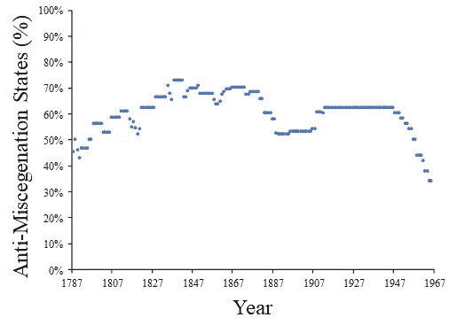
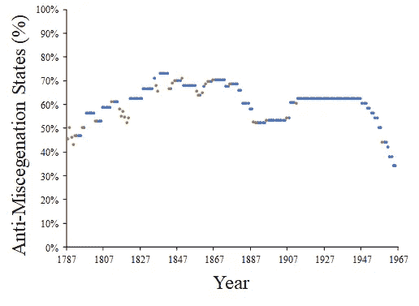
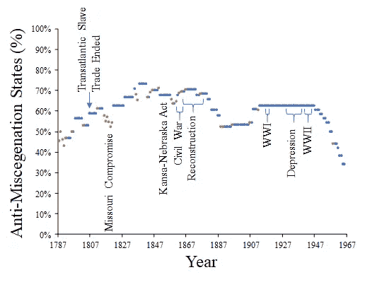

# 爱的一天:回顾过去

> 原文：<https://towardsdatascience.com/loving-day-looking-back-3187515d85c4?source=collection_archive---------53----------------------->

两天后就是爱情日了。这对我很重要，尽管对你来说可能毫无意义。爱情日是美国最高法院一致否决所有禁止异族通婚的法律的日子。这是一个你可能不知道的术语。简而言之，异族通婚就是在自己种族之外的婚姻(或浪漫或性关系)。直到 1967 年 6 月 12 日，美国[一直有一些州禁止异族通婚](https://en.wikipedia.org/wiki/Anti-miscegenation_laws_in_the_United_States)。这些不是民法。它们是刑法，在许多情况下规定通婚是重罪。

我们可以谈论动机、手段等。在这些法律上。我想看一些简单的数据。许多讨论美国反异族通婚法律的资料提供了某种表格或地图，表明各个州在 1967 年有或没有这样的法律。我说，很公平。但是我还没有找到一个来源(到目前为止),按照时间和拥有这些法律的州的百分比来展示这些法律的“弧线”。数据不难找到，我想没人会费心去收集。当你这样做的时候，它的信息量非常大，所以我们开始吧:

我们可以看到，反通婚法律的频率从 1787 年的法律基础上升到大约 1850 年，一直保持相当稳定，直到大约 1876 年，下降了大约一代人，保持稳定大约一代人，然后有一个大的峰值，保持稳定，然后从大约 1945 年到 1967 年稳步下降，当时最高法院废除了这一做法。简而言之，它呈现了一幅不太简单的画面。

我在这里做的一点也不前沿或“先进”的数据科学。相反，我从基础开始。我只是通过维基百科查阅了美国反异族通婚法律的历史，到目前为止的链接是两个段落。然后，我绘制了某一年有反异族通婚法的州的数量与美国州总数的对比图(XY 图),得出一个分数，绘制成百分比。我没有用 r，我没有用 Python。我使用了最简单的工具，仍然产生了可分析的输出。

如果我们再增加一个维度，我们可以得到更多的信息:新国家是在哪一年被接纳的？我们在下一张图中用橙色表示。还是那句话，没什么特别的。我刚刚在 Excel 中创建了一个新的系列数年，看到一个国家承认并删除了原始系列中的数据点。为了形成对比，我将新系列涂成橙色。

那么，这告诉我们什么呢？首先，在 1870 年左右以前，新州更为普遍。第二，你会注意到，大约在 1830 年以前，新的州的加入会减少有反种族通婚法律的州的百分比，然后这个百分比会增加。这意味着没有这些法律的州被承认，但是新成立的州很快开始通过这些法律。大约在 1850 年后，趋势是接纳一个新的州会增加有反异族通婚法律的州的百分比。建国前的领土已经有这样的法律。为什么会这样？我们可以在图表中添加另一个维度，具体的历史事件。

我几乎是手动生成这张图表的。因为每个点对应一个特定的年份，所以我在 PowerPoint 上手工添加了标签。我可能已经生成了奇特的代码或者找到了一个库，但是有了手头的数据，简单地放下标签并*用我自己的眼睛*看，这是一个更有效的分析。

那么，从 1787 年到 1967 年，增加(仅仅几个)事件让我们说了什么？首先，美国各州似乎没有任何重大事件引发了对异族通婚定罪增加的趋势。就在密苏里妥协案之前，新的州的加入稍微降低了这一趋势，但是就在那次事件之后，各州通过了更多的法律。密苏里妥协是什么？这是一项每当接纳一个非蓄奴州时就接纳一个蓄奴州的政策，以保持“平衡”(或者像我们今天喜欢说的“两党合作”)。虽然它可能没有改变美国参议院的构成，但它肯定没有减少我们国家对种族主义法律的热情。

然而，在 1840 年左右达到高峰后，反异族通婚的法律下降，直到堪萨斯-内布拉斯加法案，这是导致内战的一个重大事件。在这个国家的一些地方，公众舆论正在逐渐远离奴隶制。

让我感兴趣的是，重建并没有减少反异族通婚的法律。相反，它们一直保持稳定，直到 1877 年之后——重建工作结束之后。然而，这并不发生在加入邦联的州。相反，是在联盟国家。1887 年至 1907 年间，反异族通婚的法律处于 19 世纪初以来的最低水平。有趣的是，第二个三 k 党成立于 1915 年(最初的在 1871 年解散)，从 1907 年到 1913 年，反异族通婚的法律激增。新三 k 党反映了美国更广泛的文化转变。

从 1913 年到 1947 年，美国一直保持在 62.5%。不管其他的社会动荡，同样的国家保持他们的反异族通婚的法律。美国已经打破了种族主义的平衡，当权者对维持现状相当满意。

1947 年后，一个新的趋势出现了，一个在许多关于 Loving v. Virginia 判决的讨论中没有被充分强调的趋势。到 1967 年，反异族通婚已经成为美国的法律。从 1948 年开始，异族通婚的法律不断被废除，直到 1966 年，美国只有三分之一的州还保留着这些法律。《爱 v .弗吉尼亚》虽然受人欢迎，也很光荣，但却是棺材上的一颗钉子，没有突破性，也没有新意。这个国家的大部分地区已经开始复苏了。通常情况下，最高法院并没有引领潮流，相反，它使陈旧过时的法律与当前的信仰和实践相一致。

那么，带回家的？爱 v. Virginia 是不必要的或者错误的？一点也不。即使“只是”少数人坚持强加不公正，也有必要进行干预。这是一个必要而公正的决定。这和数据科学有什么关系？数据科学不仅仅是处理数字或庞大的项目，它是关于从数字中提取可能不会自己跳出来的意义。

哦，我为什么要写这个？我和我妻子:

为什么爱日是我最喜欢的节日