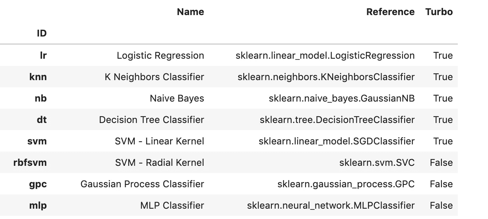
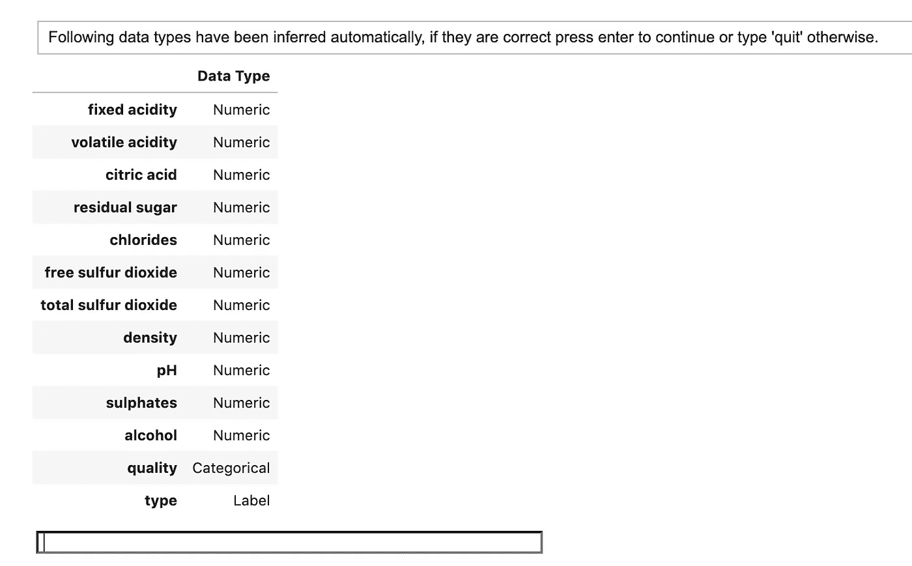
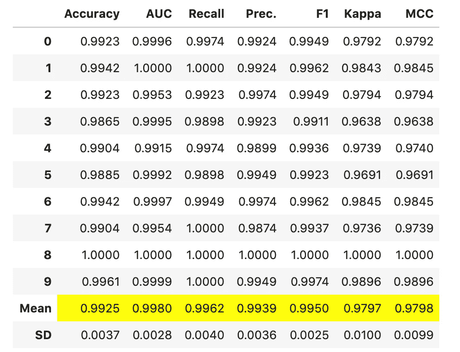
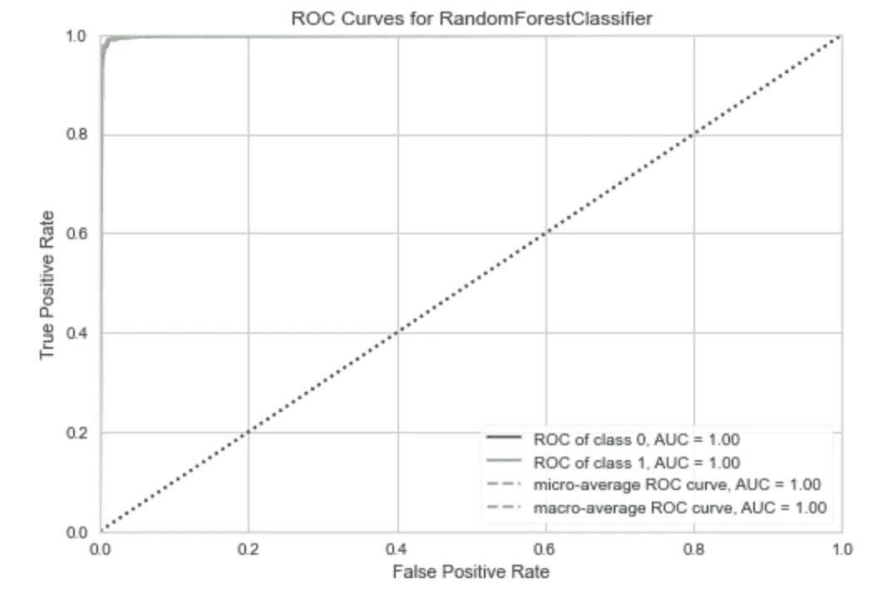
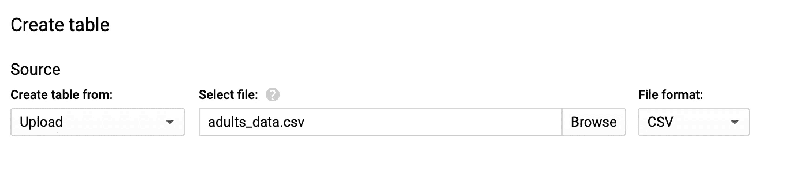
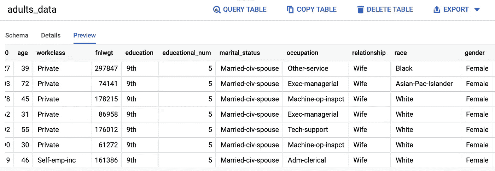
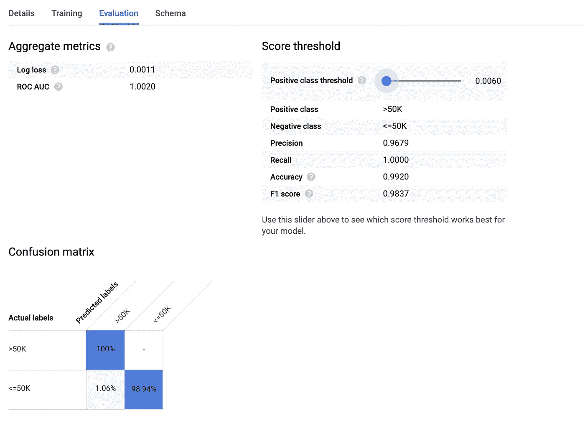
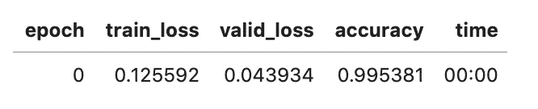

# 轻松的机器学习工具

> 原文：<https://towardsdatascience.com/low-effort-machine-learning-tools-9622d7d57135?source=collection_archive---------29----------------------->

## 具有 PyCaret、BigQueryML 和 fastai 的低代码 AI


由 [Kasya Shahovskaya](https://unsplash.com/@kasya?utm_source=unsplash&utm_medium=referral&utm_content=creditCopyText) 在 [Unsplash](https://unsplash.com/s/photos/easy?utm_source=unsplash&utm_medium=referral&utm_content=creditCopyText) 拍摄的照片

机器学习有可能帮助解决商业和世界上的广泛问题。通常，开发一个机器学习模型，并将该模型部署到可以操作使用的状态，需要深厚的编程知识和对其背后的算法的良好理解。

这将机器学习的使用限制在一小群人，因此也限制了可以解决的问题的数量。

幸运的是，在过去几年中，大量的库和工具涌现出来，它们减少了模型开发所需的代码量，或者在某些情况下完全消除了代码量。这为分析师等非数据科学家利用机器学习的力量开辟了潜力，此外还允许数据科学家更快地建立模型原型。

这里有一些我最喜欢的用于机器学习的低代码工具。

# PyCaret

PyCaret 是流行的机器学习库(如 Scikit-learn 和 XGBoost)的 Python 包装器。它使得一个模型只需要几行代码就可以被开发到一个可部署的状态。

Pycaret 可以通过 pip 安装。有关更详细的安装说明，请参见 [PyCaret 文档](https://pycaret.org/install/)。

```
pip install pycaret
```

PyCaret 有一个公共数据集的存储库，可以使用`pycaret.datasets`模块直接安装。完整的列表可以在[这里找到](https://pycaret.org/get-data/)但是为了本教程的目的，我们将使用一个非常简单的数据集来解决一个叫做“葡萄酒”数据集的分类任务。

PyCaret 库包含一套解决所有常见机器学习问题的模块，包括:

*   分类。
*   回归。
*   聚类。
*   自然语言处理。
*   关联规则挖掘。
*   异常检测。

为了创建分类模型，我们需要使用`pycaret.classification`模块。创建模型非常简单。我们简单地调用`create_model()`函数，它将模型 ID 作为参数。支持型号及其相应 ID 的完整列表可在[这里](https://pycaret.org/create-model/)找到。或者，您可以在导入适当的模块后运行以下代码来查看可用模型的列表。



可用于分类的模型快照。图片作者。

在调用`create_model()`之前，你首先需要调用`setup()`函数来为你的机器学习实验指定合适的参数。在这里，您可以指定测试序列分割的大小，以及是否在实验中实现交叉验证。

`create_model()`函数将自动推断数据类型，并使用默认方法处理这些类型。当您运行`create_model()`时，您将收到下面的输出，它显示了推断的数据类型。



图片作者。

PyCaret 将使用一组默认的预处理技术来处理分类变量和估算缺失值之类的事情。但是，如果您需要一个更加定制的数据解决方案，您可以在模型设置中将这些指定为一个参数。在下面的例子中，我将数值插补参数改为使用中值。

一旦您对模型使用的参数感到满意，您就可以按 enter 键，模型将最终确定并显示性能结果的表格。



图片作者。

PyCaret 还有一个`plot_model()`函数，显示模型性能的图形表示。



图片作者。

本教程刚刚展示了使用 PyCaret 库进行模型训练的基础。还有更多功能和模块可以提供完整的低代码机器学习解决方案，包括功能工程、模型调整、持久性和部署。

# 大查询 ML

2018 年，谷歌发布了一款名为 [BigQuery ML](https://ai.googleblog.com/2018/07/machine-learning-in-google-bigquery.html) 的新工具。BigQuery 是谷歌的云数据仓库解决方案，旨在让数据分析师和科学家快速访问大量数据。BigQuery ML 是一个工具，它使机器学习模型能够仅使用 SQL 直接从 BigQuery 数据仓库开发出来。

自从 BigQueryML 发布以来，它已经发展到支持最常见的机器学习任务，包括分类、回归和聚类。您甚至可以导入自己的 Tensforflow 模型，以便在工具中使用。

从我自己的经验来看，BigQueryML 是一个非常有用的加速模型原型的工具，并且作为一个基于生产的系统来解决简单的问题也是可行的。

为了简单介绍该工具，我将使用一个名为成人收入数据集的数据集来说明如何在 BigQueryML 中构建和评估逻辑回归分类模型。

数据集可以在 UCI 机器学习知识库中找到，我使用下面的 Python 代码下载了一个 CSV 文件。

下面是下载数据并导出为 CSV 文件的脚本。

如果你还没有谷歌云平台(GCP)账户，你可以在这里创建一个[。当你最初注册时，你会得到 300 美元的免费积分，这足够你尝试下面的例子了。](https://cloud.google.com/)

在 GCP 上，从下拉菜单中导航到 BigQuery web UI。如果这是您第一次使用 GCP，您将需要创建一个项目并使用 BigQuery 进行设置。谷歌快速入门指南在这里给出了一个很好的概述[。](https://cloud.google.com/bigquery/docs/quickstarts)

我之前下载的 CSV 文件可以直接上传到 GCP 来创建表格。



图片作者。

您可以通过单击侧栏中的表名并选择 preview 来检查表中的数据。这是成年人的数据在 BigQuery 中的样子。



图片作者。

为了根据这些数据训练一个模型，我们只需编写一个 SQL 查询，从表中选择 everything (*)，将目标变量(income)重命名为 label，并添加逻辑以创建一个名为“adults_log_reg”的逻辑回归模型。

有关所有型号选项，请参见此处的文档[。](https://cloud.google.com/bigquery-ml/docs/reference/standard-sql/bigqueryml-syntax-create)

如果我们单击现在将出现在您的数据表旁边的侧栏中的模型，您可以看到对培训表现的评估。



图片作者。

现在，我们可以使用模型通过 [ML 进行预测。预测功能](https://cloud.google.com/bigquery-ml/docs/reference/standard-sql/bigqueryml-syntax-predict)。

# 法斯泰

众所周知，Tensorflow 等流行的深度学习框架具有陡峭的学习曲线，对于初学者或非数据科学家来说，很难上手并运行它。fastai 库提供了一个高级 API，允许您只需几行简单的代码就可以训练一个神经网络。

Fastai 与 Pytorch 一起工作，所以在使用它之前，您需要安装这两个库。

```
pip install pytorch
pip install fastai
```

fastai 库具有处理结构化数据和非结构化数据(如文本或图像)的模块。在本教程中，我们将使用`fastai.tabular.all`模块来解决我们之前使用的葡萄酒数据集的分类任务。

与 PyCaret 类似，fastai 将通过嵌入层对非数字数据类型进行预处理。为了准备数据，我们使用了`TabularDataLoaders`助手函数。在这里，我们指定了数据帧的名称、列的数据类型以及我们希望模型执行的预处理步骤。

为了训练神经网络，我们简单地使用如下所示的`tabular_learner()`函数。

运行此代码后，将显示性能指标。



图片作者。

要使用模型进行预测，只需使用`learn.predict(df**.**iloc[0])`。

探索 fastai 库进一步查看文档[这里](https://docs.fast.ai/)。

感谢阅读！

我每月都会发一份简讯，如果你想加入，请点击此链接注册。期待成为您学习旅程的一部分！