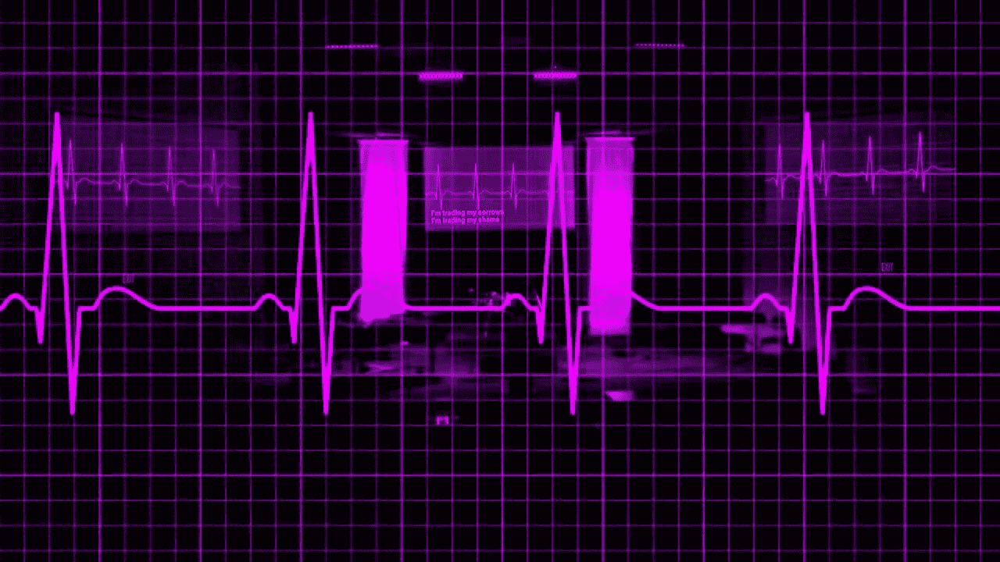
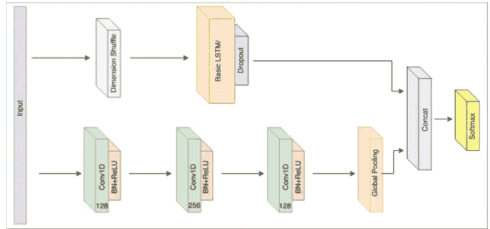
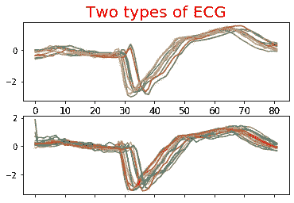
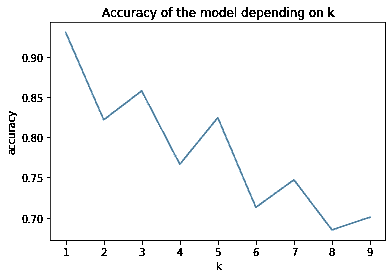
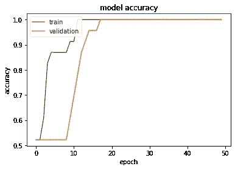
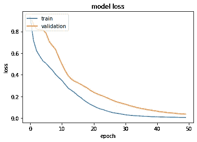

# LSTM-FCN 心脏病学

> 原文：<https://towardsdatascience.com/lstm-fcn-for-cardiology-22af6bbfc27b?source=collection_archive---------29----------------------->

## 具有完全卷积网络(LSTM-FCN)的长短期记忆是 FCN 的增强，其已经被证明在对时间序列序列进行分类的任务上实现了最先进的性能

心电图(来源:[https://i.ytimg.com/vi/HWzACHkCi3U/maxresdefault.jpg](https://i.ytimg.com/vi/HWzACHkCi3U/maxresdefault.jpg)

我们将致力于在包含两种不同类型心电图(ECG)的数据库上应用该算法，并看看这种新模型是否可以帮助检测猝死风险高的患者。

# LSTM-FCN 建筑

https://ieeexplore.ieee.org/stamp/stamp.jsp?tp= LSTM-FCN 建筑(来源:[&ar number = 8141873](https://ieeexplore.ieee.org/stamp/stamp.jsp?tp=&arnumber=8141873)

该算法由两部分组成:LSTM 块和具有 3 个卷积层的 FCN 部分。

## LSTM 部分

长短期记忆递归神经网络是对普通递归神经网络的一种改进，它具有消失梯度问题。LSTM 神经网络通过将选通函数结合到其状态动态中，解决了普通递归神经网络中常见的消失梯度问题。想了解更多关于 LSTM 网络的信息，你可以阅读克里斯托弗·奥拉写的这篇[的好文章](https://colah.github.io/posts/2015-08-Understanding-LSTMs/)。

除了 LSTM 模块，这部分还包括一个维度混洗。同时，完全卷积模块将时间序列视为具有多个时间步长的单变量时间序列，所提出的架构中的 LSTM 模块将输入时间序列视为具有单个时间步长的多变量时间序列。这是通过维度混排层来实现的，维度混排层调换了时间序列的时间维度。长度为 N 的单变量时间序列在转换后将被视为具有单一时间步长的多变量时间序列(具有 N 个变量)。维度混洗通过减少一个数量级的训练时间来提高该模型的效率。

## FCN 部分

我们使用时间卷积网络作为全卷积网络(FCN)分支中的特征提取模块，这意味着我们在这些层中的每一层上应用一组 1D 滤波器(滤波器大小分别为 128、256 和 128)，以捕捉输入信号在动作过程中如何演变。一个基本的卷积模块包括一个卷积层，接着是批量归一化(用于提高网络的速度、性能和稳定性)，接着是一个激活函数，这里是一个整流线性单元(ReLU)。如果你想了解更多关于卷积层和 CNN 模型的信息，可以看看我关于 [CNN 架构](/understand-the-architecture-of-cnn-90a25e244c7)的文章。

最后，在最后的卷积块之后应用全局平均池。它用于在分类之前减少模型中的参数数量。

全局池层和 LSTM 块的输出被连接并传递到 softmax 分类层。

# 数据集

猝死高风险患者和健康对照受试者的心电图记录

我们的数据集分为两部分:一部分用于模型训练，另一部分用于测试。训练将在 23 个序列上进行，测试将在 1189 个序列上进行，这些序列是心电图(ECG)。心电图是一种通过测量心脏的电活动来检查心脏功能的测试。我们有两种不同类别的心电图:一种对应于猝死风险高的患者，另一种对应于健康受试者。

这个数据集被命名为 TwoLeadECG，是 UCR 数据集的一部分，你可以从[这里](https://www.cs.ucr.edu/%7Eeamonn/time_series_data_2018/)下载。

# 基线

作为判断 LSTM-FCN 模型结果的参考的算法是 k-最近邻(k-NN)。选择这种算法是因为它是一种既简单又有效的时间序列分类算法。
应用于时态数据的 k-NN 背后的一般思想非常简单，我们将查看 k 个最近邻(多么令人惊讶！)并查看哪个类构成了这些序列的大多数，以便推导出新序列的类。为了知道最近的邻居，我们使用动态时间弯曲算法，该算法允许测量两个时间序列之间的相似性(或距离)。

我们用范围从 1 到 10 的 k(最近邻的数量)的不同值进行测试，我们发现我们自己在测试数据集上的准确度在 0.70 和 0.93 之间变化，当 k = 1 时达到最后一个值

# LSTM-FCN 模型

## 密码

LSTM-FCN 函数

## 结果

正如我们在模型损失图上看到的，损失函数曲线(训练和验证)逐渐减少并向同一点收敛，表明学习进行得很好，既没有过拟合也没有欠拟合。
关于模型精度图，它证实了模型的良好学习，特别是表明模型给出了非常好的结果。因此，当我们对测试数据集应用该模型时，我们具有 100%的准确性，我们的模型成功地对不同的心电图进行了分类。

这一性能超过了我们已经看到的 k-NN 的结果，甚至可以被认为比心脏病专家的更好，因为我们获得了 100%的准确性！

## 代码可从以下网址获得:

 [## koukou10/lstm-fcn

### LSTM-FCN 长短期记忆全卷积网络是 FCN 的一个改进，被认为是…

github.com](https://github.com/koukou10/lstm-fcn) 

# 参考

 [## IEEE Xplore 全文 PDF:

### 编辑描述

ieeexplore.ieee.org](https://ieeexplore.ieee.org/stamp/stamp.jsp?tp=&arnumber=8141873)  [## 麻省理工学院-BIH 长期数据库

### 当引用这些材料时，请包括生理网的标准引文:Goldberger AL，Amaral LAN，Glass L…

archive.physionet.org](https://archive.physionet.org/physiobank/database/ltdb/)