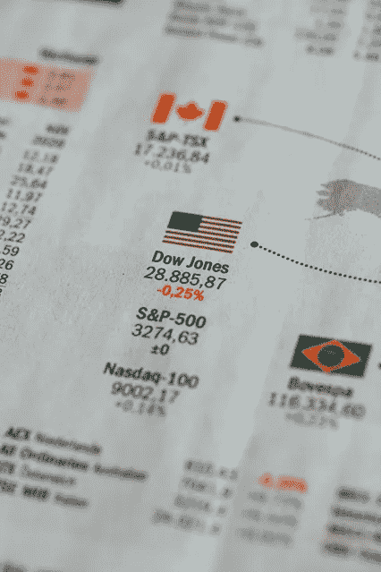
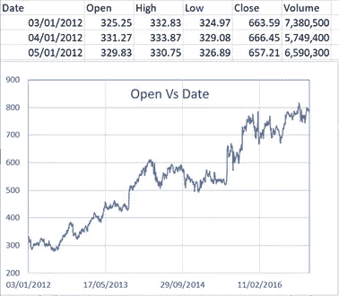
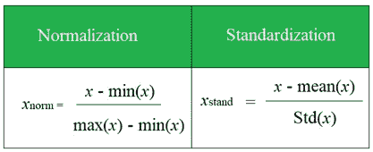
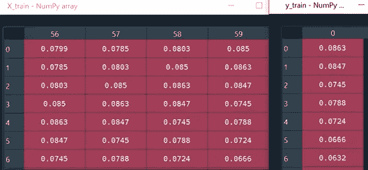
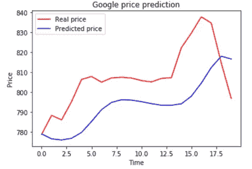
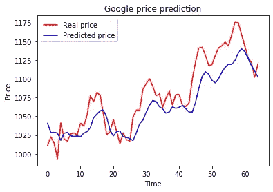

# 用于股票价格预测的 LSTM

> 原文：<https://towardsdatascience.com/lstm-for-google-stock-price-prediction-e35f5cc84165?source=collection_archive---------5----------------------->

## 为谷歌股价预测创建基于 LSTM 的递归神经网络的技术演练



来自 unsplash 的 Img 通过[链接](https://unsplash.com/photos/69ppqHiG9Xo)

在本文中，我将一步一步地介绍如何建立一个基于 LSTM 的递归神经网络(RNN)来预测谷歌股票价格。它分为如下 7 个部分。

1.  问题陈述
2.  数据处理
3.  模型结构
4.  模型编译
5.  模型拟合
6.  模型预测法
7.  结果可视化

让我们开始旅程吧🏃‍♀️🏃‍♂️.

1.  **问题陈述**

我们得到了 2012 年 1 月至 2016 年 12 月的谷歌股价。任务是预测 2017 年 1 月的股价趋势。*注意，* ***基于布朗运动，股票价格的未来变化独立于过去*。因此，预测准确的股票价格是不可能的，但预测和捕捉上涨和下跌趋势是可能的。**

2.**数据处理**

2.1 导入数据

训练/测试数据保存在中。分别为 *csv* 文件。我们将用 ***开盘*** 价格进行预测。图 1 显示了训练集的一个片段及其散点图。



图 1 训练集及其散点图

```
train = pd.read_csv(‘Google_Stock_Price_Train.csv’)#keras only takes numpy array
training_set = dataset_train.iloc[:, 1: 2].values
```

注意 *dataset_train.iloc[:，****1:2****]中的索引范围。值*，因为我们需要使它成为 **NumPy 数组，**不是单个向量，也不是用于训练的**数据帧**。

2.2 特征缩放

下一步是在(0，1)之间缩放股票价格，以避免密集的计算。常见的方法有**标准化**和**正常化**如图 2 所示。建议进行归一化，尤其是在输出层使用 *Sigmoid* 函数处理 RNN 时。



图 2 特征缩放方法(作者创建的 Img)

```
from sklearn.preprocessing import MinMaxScaler
sc = MinMaxScaler(feature_range = (0, 1))training_set_scaled = sc.fit_transform(training_set)
```

2.3 数据结构创建

> 创建**滑动窗口很重要**！

需要一个特殊的数据结构来覆盖 60 个时间戳，基于此，RNN 将预测第 61 个价格。这里，基于实验，过去时间戳的数量被设置为 60。因此， *X_train* 是一个嵌套列表，它包含 60 个时间戳价格的列表。 *y_train* 是第二天的股票价格列表，对应 *X_train* 中的各个列表。具体来说，

```
X_train = []
y_train = []
for i in range(60, len(training_set_scaled)):
    X_train.append(training_set_scaled[i-60: i, 0])
    y_train.append(training_set_scaled[i, 0])
    X_train, y_train = np.array(X_train), np.array(y_train)
```

图 3 显示了 *X_train* 和 *y_train* 的片段。 *X_train* 中每一行 60 个价格用于预测 *y_train* 中对应的第二天股票价格。



图 3 *X_train* 和 *y_train* 数据

2.4 数据重塑

如上所述，我们用 ***开盘*** 价格进行预测。也就是说，我们只有一个指标或特征。但是我们可以按照同样的数据处理方法添加更多的指标。为此，我们需要为指标的**数量添加一个新的维度。具体来说，**

```
X_train = np.reshape(X_train, newshape = (X_train.shape[0], X_train.shape[1], 1))
```

*new shape*in(批量大小、时间戳数量、指示器数量)。*(批量大小，时间戳个数)是 X_train* 的形状。这里我们只有一个指标。

太好了。✌✌.，我们把训练器材准备好了

3.**模型构建**

**基本上，我们正在使用 LSTM** 构建一个用于连续值预测的神经网络回归器。首先，初始化模型。

```
regressor = Sequential()
```

然后，添加第一个 LSTM 图层，接着添加**删除**图层。

```
regressor.add(LSTM(units = 50, return_sequences = True, input_shape = (X_train.shape[1], 1)))regressor.add(Dropout(rate = 0.2))
```

注意对于 LSTM 层，*单位*是该层中 LSTM 神经元的数量。50 个神经元将赋予模型高维度，足以捕捉向上和向下的趋势。 *return_sequences* 为真，因为我们需要在当前图层之后添加另一个 LSTM 图层。 *input_shape* 对应的是时间戳的个数和指示器的个数。对于退出，50 个神经元中的 20%将在训练的每次迭代中被随机忽略。

按照上述相同的方法，添加第二，第三和第四 LSTM 层。

```
##add 2nd lstm layer
regressor.add(LSTM(units = 50, return_sequences = True))
regressor.add(Dropout(rate = 0.2))##add 3rd lstm layer
regressor.add(LSTM(units = 50, return_sequences = True))
regressor.add(Dropout(rate = 0.2))##add 4th lstm layer
regressor.add(LSTM(units = 50, return_sequences = False))
regressor.add(Dropout(rate = 0.2))
```

注意最后一个 LSTM 层， *return_sequences* 是 ***False*** 由于我们不会添加更多的 LSTM 层。

最后，添加输出层。输出维度是 1，因为我们每次预测 1 个价格。

```
regressor.add(Dense(units = 1))
```

太好了！我们已经创建了一个基于 LSTM 的 RNN 模型🧨🧨.

4.**模型编译**

现在，让我们通过选择一个 *SGD* 算法和一个损失函数来编译 RNN。对于优化器，我们使用 *Adam* ，这是一个安全的选择。损失函数是实际值和预测值之间的均方误差。

```
regressor.compile(optimizer = ‘adam’, loss = ‘mean_squared_error’)
```

5.**模型拟合**

现在，让我们适合我们的 RNN。

```
regressor.fit(x = X_train, y = y_train, batch_size = 32, epochs = 100)
```

RNN 权重每 32 个股票价格更新一次，批量为 32 个。如果模型的损失没有收敛，请随意尝试更多的批次和时期。

太好了，现在让我们开始训练。最后，我们发现从损失 ***0.062*** 开始，我们在时期 50 得到损失***0.0026****，到时期 100 损失***0.0015****🎉🎉。**

**6.**模型预测****

**6.1 导入测试数据**

**使用第 2.1 节中的相同方法，读取测试数据。**

```
**dataset_test = pd.read_csv(‘Google_Stock_Price_Test.csv’)real_stock_price = dataset_test.iloc[:, 1: 2].values**
```

**6.2 数据处理**

**首先，我们需要连接用于预测的训练和测试数据集，因为我们使用前 60 天的股票价格来预测第二天的价格。换句话说，我们需要测试数据集中第一个日期之前 60 天的价格。**

```
**dataset_total = pd.concat((dataset_train[‘Open’],dataset_test[‘Open’]), axis = 0)**
```

**然后，为预测创建输入，从测试数据集中第一个日期之前 60 天的日期开始索引。**

```
**inputs = 
dataset_total[len(dataset_total)-len(dataset_test)- 60: ].values**
```

**第三，改变输入的形状，使其只有一列。**

```
**inputs = inputs.reshape(-1, 1)**
```

**第四，使用由训练集设置的标度，对测试输入进行标度。**

```
**inputs = sc.transform(inputs)**
```

**最后，创建测试数据结构，如第 2.3 节所述。**

```
**X_test = []
for i in range(60, len(inputs)): 
    X_test.append(inputs[i-60: i, 0])
    X_test = np.array(X_test)
    #make numpy array as 3D , adding num of indicator
    X_test = np.reshape(X_test, newshape = (X_test.shape[0],  
                        X_test.shape[1], 1))**
```

**6.3 模型预测**

**现在， *X_test* 准备好预测了。**

```
**predicted_stock_price = regressor.predict(X_test)**
```

**别忘了，我们预测的是缩放后的值，所以我们需要反转预测。**

```
**predicted_stock_price = sc.inverse_transform(predicted_stock_price)**
```

**7.**结果可视化****

**在最后一步中，让我们创建一个可视化图来轻松地检查预测。**

```
**plt.plot(real_stock_price, color = ‘red’, label = ‘Real price’)
plt.plot(predicted_stock_price, color = ‘blue’, label = ‘Predicted price’)
plt.title(‘Google price prediction’)
plt.xlabel(‘Time’)
plt.ylabel(‘Price’)
plt.legend()
plt.show()**
```

**如图 4 和图 5 所示，预测滞后于真实值，因为模型不能对非线性变化做出快速反应。但另一方面，模型对平滑变化反应良好。**因此，我们得出结论，在包含峰值的预测部分，模型滞后于实际价格，但在包含平稳变化的部分，模型设法遵循向上和向下的趋势** ✨✨.**

****

**图 4 实际价格与预测价格**

****

**图 5 大时间尺度上的预测**

****太好了！这就是所有的旅程！如果需要源代码，请访问我的**[**Github**](https://github.com/luke4u/Time_Series_Forecasting)**页面🤞🤞。****