# LSTM 梯度

> 原文：<https://towardsdatascience.com/lstm-gradients-b3996e6a0296?source=collection_archive---------9----------------------->

## LSTM 单元梯度的详细数学推导。

LSTM 或长短期记忆是复杂和最先进的神经网络结构的非常重要的构建块。这篇文章背后的主要思想是解释背后的数学。为了对 LSTM 有一个初步的了解，我推荐下面的博客。

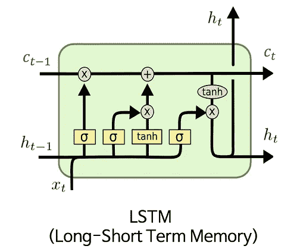

[学分](https://commons.wikimedia.org/wiki/File:LSTM.png)

 [## 了解 LSTM 网络

### 2015 年 8 月 27 日发布人类不是每秒钟都从零开始思考。当你读这篇文章时，你…

colah.github.io](https://colah.github.io/posts/2015-08-Understanding-LSTMs/) 

# 内容:

# 概念

*   介绍
*   说明
*   推导先决条件

# **B —推导**

*   LSTM 的产量
*   隐藏状态
*   输出门
*   细胞状态
*   输入门
*   忘记大门
*   对 LSTM 的投入
*   权重和偏差

# C —随时间反向传播

# D —结论

# 概念

## 介绍

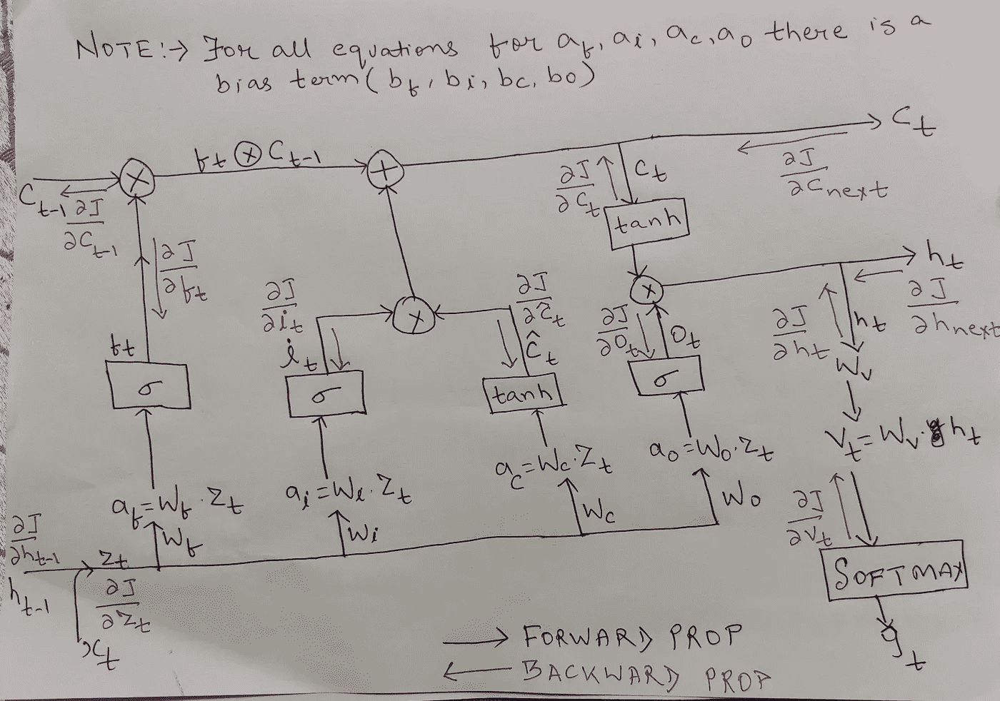

图 1 : LSTM 细胞

上图是单个 LSTM 细胞的示意图。我知道这看起来很吓人😰，但是我们将一个接一个地浏览它，希望在文章结束时，它会变得非常清楚。

## 说明

基本上，一个 LSTM 细胞有 4 个不同的组成部分。忘记门、输入门、输出门和单元状态。我们将首先简要讨论这些部分的用法(详细解释请参考上面的博客)，然后深入研究其中的数学部分。

***忘门***

顾名思义，这个部分负责决定最后一步要丢弃或保留哪些信息。这是由第一个乙状结肠层完成的。

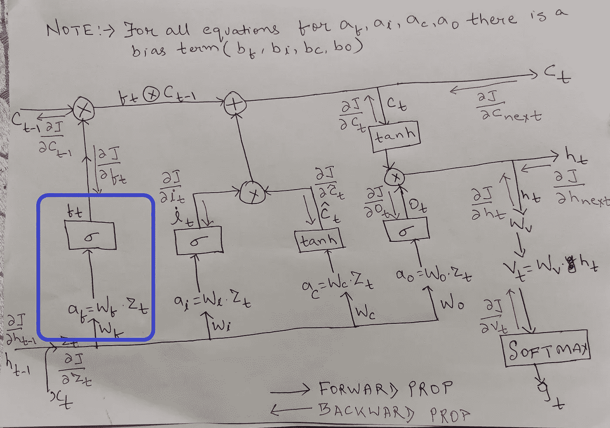

图 2:蓝色标记的忘记门

基于 h_t-1(先前的隐藏状态)和 x_t(在时间步长 t 的当前输入)，这为单元状态 C_t-1 中的每个值决定 0 和 1 之间的值。

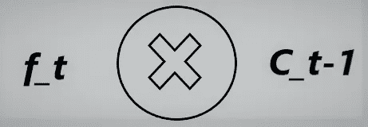

图 3:忘记门和以前的细胞状态

对于所有的 1，所有的信息都保持原样，对于所有的 0，所有的信息都被丢弃，而对于其他值，它决定了有多少来自前一状态的信息将被携带到下一状态。

***输入门***

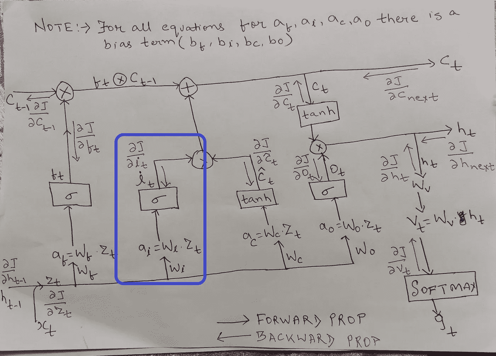

图 4:用蓝色标记的输入门

Christopher Olah 对输入门发生的事情有一个漂亮的解释。引用他的博客:

> [下一步是决定我们要在单元格状态中存储什么新信息。这有两个部分。首先，一个称为“输入门层”的 sigmoid 层决定我们要更新哪些值。接下来，tanh 层创建一个新的候选值向量，C~t，可以添加到状态中。在下一步中，我们将结合这两者来创建状态更新。](https://colah.github.io/posts/2015-08-Understanding-LSTMs/)

现在，这两个值，即 i_t 和 c~t 结合起来决定将什么新的输入馈送到单元状态。

***单元格状态***

图 5:蓝色标记的电池状态

细胞状态作为 LSTM 的记忆。这是他们在处理更长的输入序列时比香草 RNN 表现更好的地方。在每个时间步长，先前的单元状态(C_t-1)与遗忘门结合，以决定哪些信息将被结转，该信息又与输入门(i_t 和 c~t)结合，以形成新的单元状态或单元的新存储器。

图 6:新的细胞状态方程

***输出门***

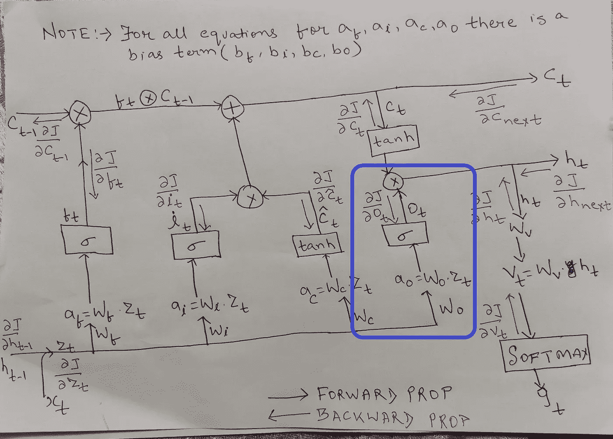

图 7:标有蓝色的输出门

最后，LSTM 细胞必须给出一些输出。从上面获得的单元状态通过一个称为 tanh 的双曲线函数传递，以便在-1 和 1 之间过滤单元状态值。详情进入不同的激活功能，[这个](/activation-functions-neural-networks-1cbd9f8d91d6)是个不错的博客。

现在，我希望 LSTM 单元的基本单元结构是清楚的，我们可以继续推导我们将在实现中使用的方程。

## 推导先决条件

1.  **要求**:推导方程的核心概念是基于反向传播、成本函数和损失。如果你不熟悉这些，这几个链接将有助于更好地理解。本文还假设对高中微积分有基本的了解(计算导数和规则)。

 [## 理解反向传播算法

### 了解神经网络最重要组成部分的具体细节

towardsdatascience.com](/understanding-backpropagation-algorithm-7bb3aa2f95fd)  [## 寻找神经网络的成本函数

### 一步一步:神经网络背后的数学

towardsdatascience.com](/step-by-step-the-math-behind-neural-networks-490dc1f3cfd9) 

2.**变量**:对于每个门，我们有一组权重和偏差，表示为:

*   W_f，b_f->忘记门重和偏差
*   W_i，b_i->输入门权重和偏置
*   候选小区状态权重和偏差
*   W_o，b_o->输出门权重和偏置

W_v，b_v ->与 Softmax 层关联的权重和偏差。

f_t，i_t，c_tilede_t，o_t ->激活函数的输出

a_f，a_i，a_c，a_o ->激活函数的输入

j 是成本函数，我们将根据它来计算导数。注意(下划线(_)后的字符是下标)

3.**正向推进方程式**:

图 8:门方程

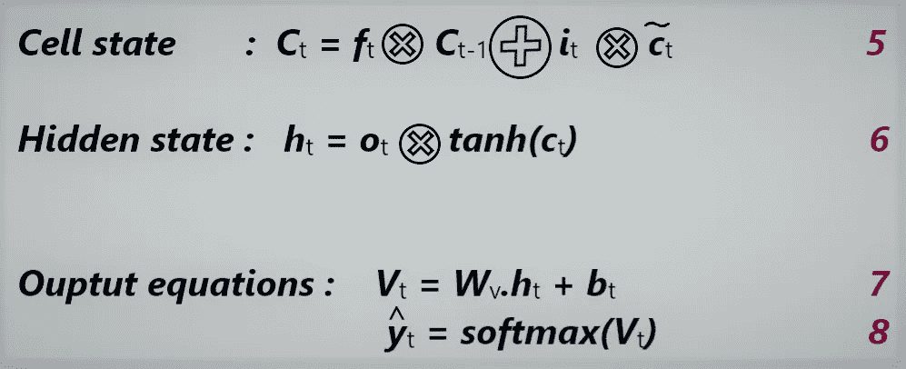

图 9:电池状态和输出方程

4.**计算过程**:让我们以忘记门为例来说明导数的计算。我们需要遵循下图中红色箭头的路径。

所以我们画出一条从 f_t 到成本函数 J 的路径，即

f_t →C_t →h_t →J。

反向传播恰好发生在同一步骤中，但方向相反

f_t ←C_t ←h_t ←J。

j 相对于 h_t 微分，h_t 相对于 _C_t 微分，C_t 相对于 f_t 微分。

因此，如果我们在这里观察，J 和 h_t 是单元格的最后一步，如果我们计算 dJ/dh_t，那么它可以用于类似 dJ/dC_t 的计算，因为:

dJ/dC_t = dJ/dh_t * dh_t/dC_t ( [链式法则](https://www.khanacademy.org/math/ap-calculus-ab/ab-differentiation-2-new/ab-3-1a/a/chain-rule-review))

类似地，将计算第 1 点中提到的所有变量的导数。

既然我们已经准备好了变量，也清楚了正向推进方程，是时候通过反向传播来推导导数了。我们将从输出方程开始，因为我们看到在其他方程中使用了相同的导数。这就是链式法则的用武之地。所以现在就开始吧。

# 衍生物

## ***lstm*的输出**

输出有两个我们需要计算的值。

1.  Softmax:对于使用 Softmax 的交叉熵损失的导数，我们将直接使用最终方程。

详细的推导过程如下:

 [## 交叉熵损失函数的温和介绍

### 神经网络在多类分类问题中产生多个输出。但是，他们没有能力…

sefiks.com](https://sefiks.com/2017/12/17/a-gentle-introduction-to-cross-entropy-loss-function/#:~:text=Cross%20Entropy%20Error%20Function&text=If%20loss%20function%20were%20MSE,error%20function%20is%20cross%20entropy.&text=c%20refers%20to%20one%20hot,refers%20to%20softmax%20applied%20probabilities.) 

## 隐藏状态

我们有 h_t 这样的隐藏态，h_t 对 w . r . t . j 求导，根据链式法则，推导可以在下图中看到。我们使用图 9 等式 7 中提到的 V_t 值，即:

v t = W v . h t+b v

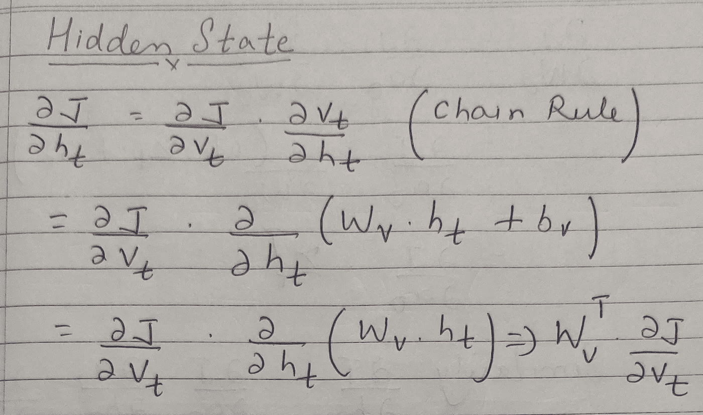

## 输出门

相关变量:a_o 和 o_t。

**o_t** :下图显示了 o_t 和 J 之间的路径。根据箭头，微分的完整方程如下:

dJ/dV_t * dV_t/dh_t * dh_t/dO_t

dJ/dV_t * dV_t/dh_t 可以写成 dJ/dh_t(我们从隐藏状态得到这个值)。

h_t 的值= o_t * tanh(c_t) ->图 9 等式 6。 ***所以我们只需要对 h_t w.r.t o_t.*** 进行区分，区分如下:-

**a_o** :同样，显示 a_o 和 J 之间的路径。根据箭头，微分的完整方程如下:

dJ/dV _ t * dV _ t/DH _ t * DH _ t/dO _ t * dO _ t/da _ o

dJ/dV_t * dV_t/dh_t * dh_t/dO_t 可以写成 dJ/dO_t(上面 O_t 我们有这个值)。

o_t = sigmoid (a_o) ->图 8 等式 4。 ***所以我们只需要区分 o _ T w . r . T a _ o .****T*他的区分将为:-

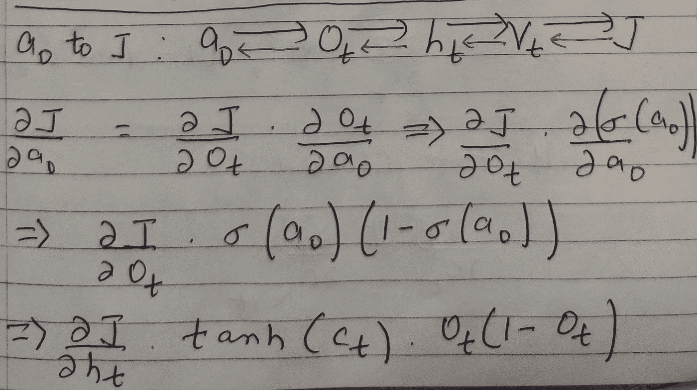

## 细胞状态

C_t 是单元的单元状态。除此之外，我们还在这里处理候选单元状态 a_c 和 c~_t。

**C_t:**C _ t 的推导非常简单，因为从 C _ t 到 J 的路径非常简单。C_t → h_t → V_t → J .由于我们已经有了 dJ/dh_t，所以直接微分 h_t w.r.t C_t。

h_t = o_t * tanh(c_t) ->图 9 等式 6。 ***所以我们只需要区分 h_t w.r.t C_t.***

注意:单元状态 clubbed 会在文末解释。

**c~_t** :下图显示了 c~_t 和 J 之间的路径。根据箭头，微分的完整方程如下:

dJ/dh_t * dh_t/dC_t * dC_t/dc~_t

dJ/dh_t * dh_t/dC_t 可以写成 dJ/dC_t(上面我们有这个值)。

C_t 的值如图 9 等式 5 所示(下图第 3 行最后一个 c_t 中缺少波浪号(~)符号->书写错误)。 ***所以我们只需要区分 C_t w.r.t c~_t.***

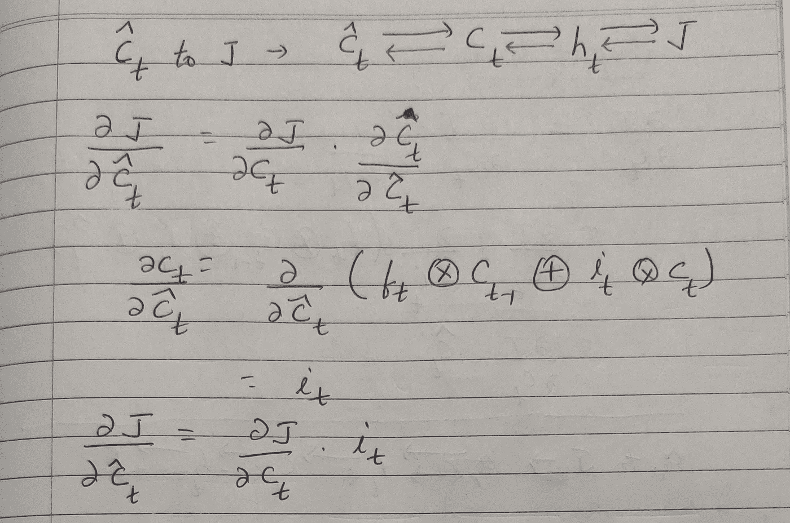

**a_c :** 下图显示了 a_c 和 J 之间的路径。根据箭头，微分的完整方程如下:

dJ/DH _ t * DH _ t/dC _ t * dC _ t/dC ~ _ t * dC ~ _ t/da _ c

dJ/dh_t * dh_t/dC_t * dC_t/dc~_t 可以写成 dJ/dc~_t(我们从上面有这个值)。

c \u t 的值如图 8 等式 3 所示。 ***所以我们只需要区分 c~_t w.r.t a_c*** 。

## 输入门

相关变量:i_t 和 a_i

**i_t** :下图显示了 i_t 和 J 之间的路径。根据箭头，微分的完整方程如下:

dJ/dh_t * dh_t/dC_t * dC_t/di_t

dJ/dh_t * dh_t/dC_t 可以写成 dJ/dC_t(我们从 cell state 得到这个值)。**所以我们只需要区分 C_t w.r.t i_t.**

C_t 的值如图 9 等式 5 所示。因此，区别如下:-

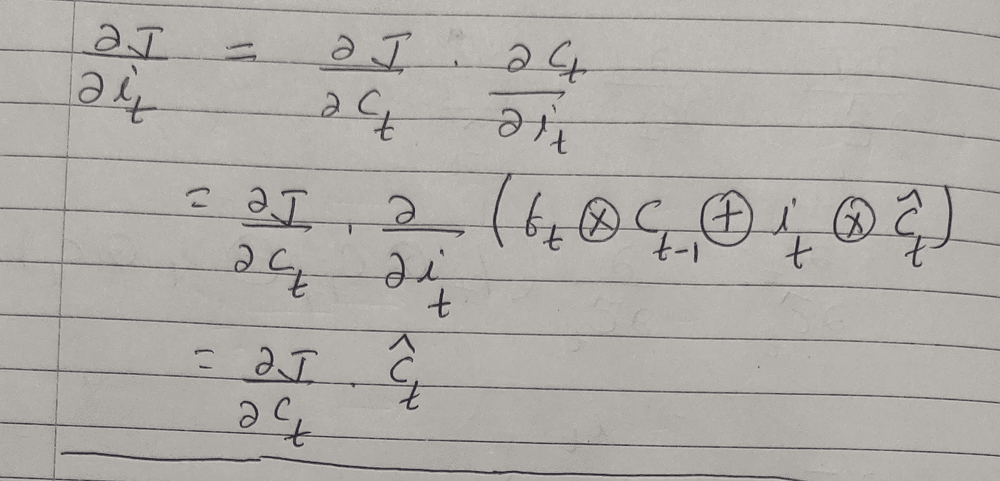

**a_i :** 下图显示了 a_i 和 J 之间的路径。根据箭头，微分的完整方程如下:

dJ/DH _ t * DH _ t/dC _ t * dC _ t/di _ t * di _ t/da _ I

dJ/dh_t * dh_t/dC_t * dC_t/di_t 可以写成 dJ/di_t(我们从上面有这个值)。**所以我们只需要区分 i_t w.r.t a_i.**

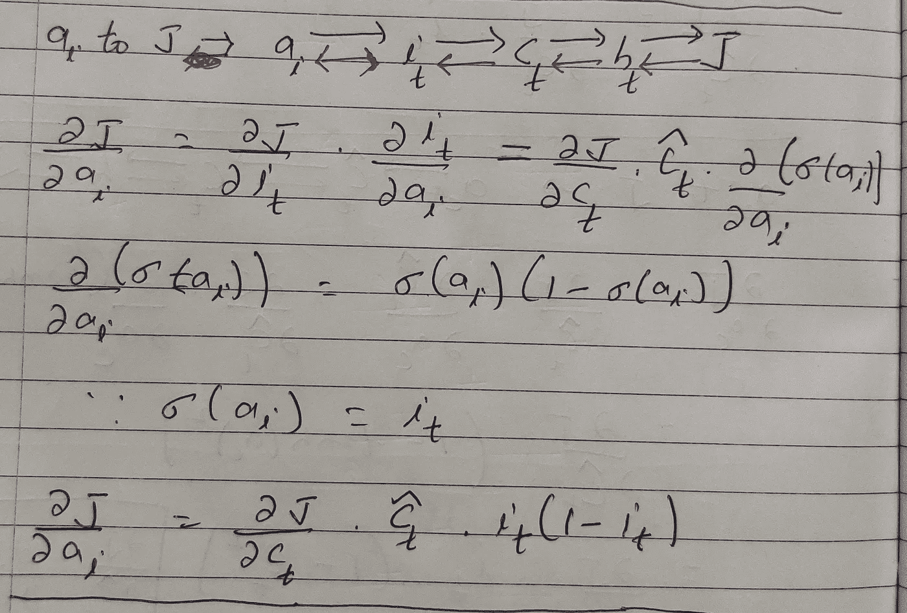

## 忘记大门

相关变量:f_t 和 a_f

**f_t** :下图显示了 f_t 和 J 之间的路径。根据箭头，微分的完整方程如下:

dJ/dh_t * dh_t/dC_t * dC_t/df_t

dJ/dh_t * dh_t/dC_t 可以写成 dJ/dC_t(我们从 cell state 得到这个值)。所以我们只需要区分 C_t w.r.t f_t.

C_t 的值如图 9 等式 5 所示。因此，区别如下:-

**a_f** :下图显示了 f_t 和 J 之间的路径。根据箭头，微分的完整方程如下:

dJ/DH _ t * DH _ t/dC _ t * dC _ t/df _ t * df _ t/da _ t

dJ/dh_t * dh_t/dC_t * dC_t/df_t 可以写成 dJ/df_t(我们从上面有这个值)。所以我们只需要区分 f_t w.r.t a_f

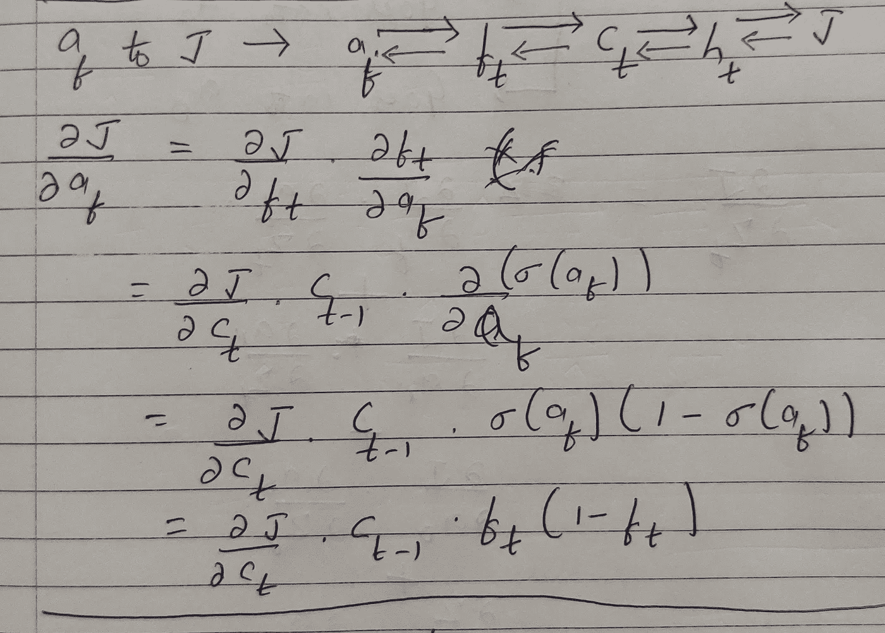

## Lstm 的输入

有 2 个变量与每个单元的输入相关联，即先前的单元状态 C_t-1 和与当前输入连接的先前的隐藏状态，即

[h_t-1，x_t] -> Z_t

**C_t-1 :** 这是 Lstm 细胞的记忆。图 5 显示了单元状态。C_t-1 的推导相当简单，因为只涉及 C_t-1 和 C_t。

**Z_t** :如下图所示，Z_t 进入 4 条不同的路径，a_f，a_i，a_o，a_c

Z_t → a_f → f_t → C_t → h_t → J . ->忘记门

Z_t → a_i→ i_t → C_t → h_t → J . ->输入门

Z_t → a_c → c~_t → C_t → h_t → J . ->候选细胞态

Z_t → a_o → o_t → C_t → h_t → J . ->输出门

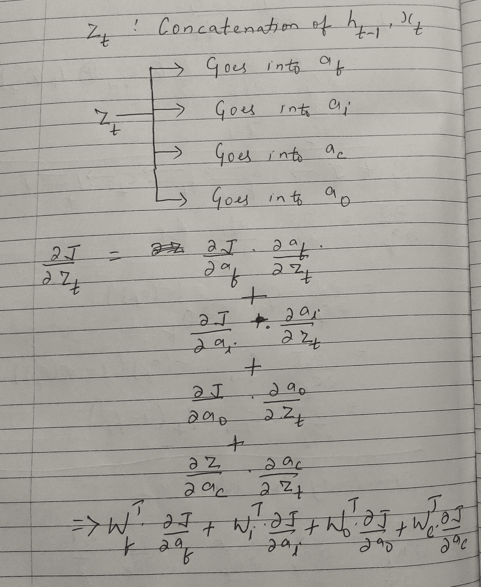

## 权重和偏差

W 和 b 的推导非常简单。下面的推导是针对 Lstm 的输出门。对于其余的门，对权重和偏差进行类似的处理。

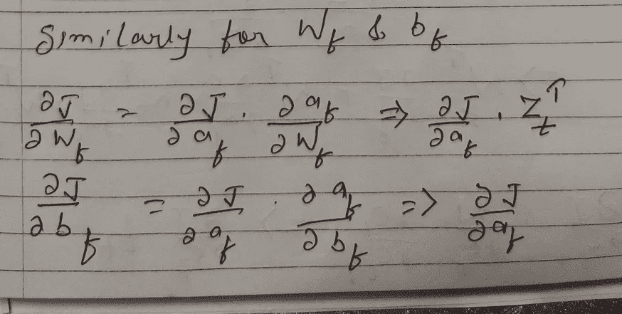

输入和遗忘门的权重和偏差

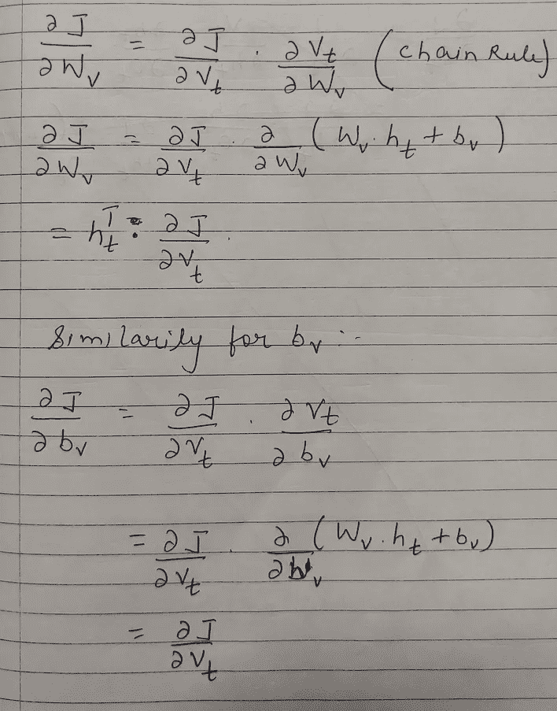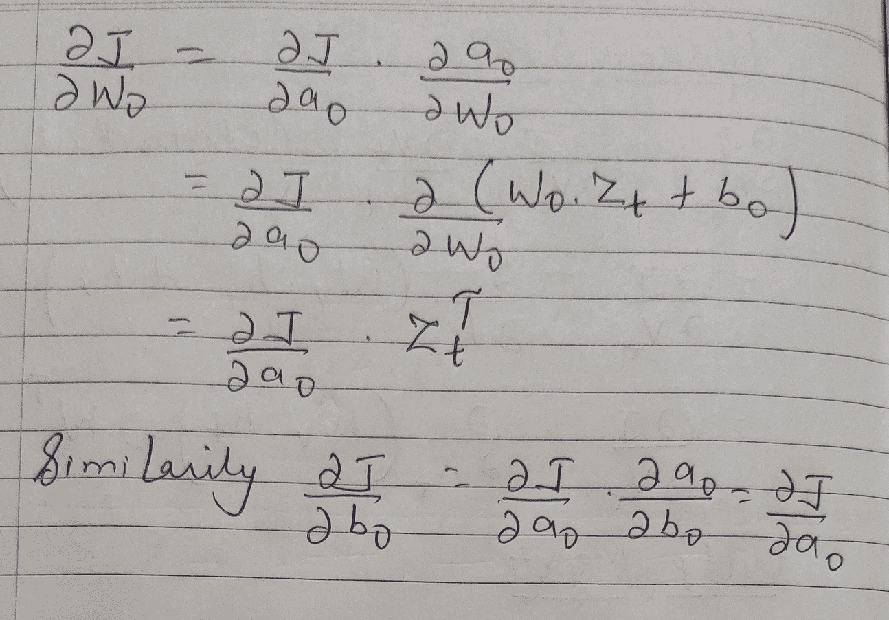

输出和输出门的权重和偏置

dJ/d_W_f = dJ/da_f . da_f / d_W_f ->忘记门

dJ/d_W_i = dJ/da_i . da_i / d_W_i ->输入门

dJ/d_W_v = dJ/dV_t . dV_t/ d_W_v ->输出

dJ/d_W_o = dJ/da_o . da_o / d_W_o ->输出门

最后我们完成了所有的推导。现在我们只需要澄清几点。

# 时间反向传播

到目前为止，我们所做的是一个单一的时间步骤。现在我们必须进行一次迭代。

因此，如果我们有总共 T 个时间步长，那么每个时间步长的梯度将在 T 个时间步长结束时相加，因此每次迭代结束时的累积梯度将为:

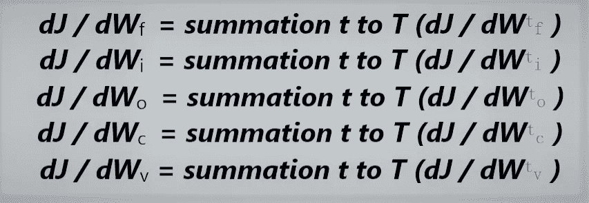

图 10:每次迭代结束时的累积梯度

现在这些将用于更新权重。

图 11:重量更新

# 结论

LSTMs 是非常复杂的结构，但是它们也工作得很好。主要有两种类型的 RNN 具有这种特征:LSTM 和格鲁

LSTMs 的训练也是一项棘手的任务，因为有许多超参数，正确组合通常是一项困难的任务。

所以，到现在为止，我希望 LSTM 的数学部分已经很清楚了，我建议你把手弄脏，以便更清楚、更好地理解它。以下是一些可能有帮助的链接:

 [## 理解 LSTM 及其在情感分析 keras 中的快速实现。

towardsdatascience.com](/understanding-lstm-and-its-quick-implementation-in-keras-for-sentiment-analysis-af410fd85b47)  [## Keras LSTM 教程-如何轻松建立一个强大的深度学习语言模型

### 在以前的帖子中，我介绍了用于构建卷积神经网络和执行单词嵌入的 Keras。的…

adventuresinmachinelearning.com](https://adventuresinmachinelearning.com/keras-lstm-tutorial/) 

感谢你阅读这篇文章，希望你喜欢。

快乐学习😃！！！