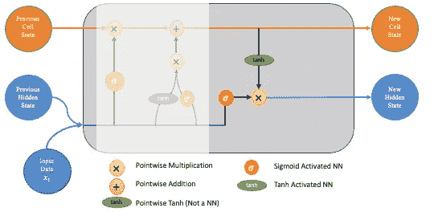

# LSTM 网络|详细解释

> 原文：<https://towardsdatascience.com/lstm-networks-a-detailed-explanation-8fae6aefc7f9?source=collection_archive---------0----------------------->

## [入门](https://towardsdatascience.com/tagged/getting-started)

## LSTMs 的全面介绍

这篇文章解释了长短期记忆(LSTM)网络。我发现学习一个主题的最好方法是阅读许多不同的解释，所以我会在本文的最后链接一些我认为特别有用的资源。我强烈建议你去看看他们对 LSTMs 的不同观点和解释！

LSTM 图——这张图和下面所有的图片都是作者创作的

## 什么是 LSTMs，为什么有用？

LSTM 网络是专门设计来克服递归神经网络 RNNs 所面临的长期依赖性问题(由于[消失梯度问题](https://en.wikipedia.org/wiki/Vanishing_gradient_problem))。LSTMs 具有反馈*连接*，这使得它们不同于更传统的前馈*神经网络。这一特性使得 LSTMs 能够处理整个数据序列(例如时间序列),而不用独立地处理序列中的每个点，而是保留关于序列中先前数据的有用信息，以帮助处理新数据点。因此，LSTMs 特别擅长处理数据序列，如文本、语音和一般时间序列。*

例如，假设我们试图预测每月的冰淇淋销售额。正如人们所预料的，这种差异随着月份的不同而变化很大，12 月最低，6 月最高。

LSTM 网络可以学习这种每 12 个时间周期存在的模式。它不仅仅使用以前的预测，而是保留一个更长期的上下文，这有助于它克服其他模型面临的长期依赖问题。值得注意的是，这是一个非常简单的例子，但是当模式被更长的时间间隔分开时(例如，在很长的文本段落中)，LSTMs 变得越来越有用。

## LSTM 网络是如何工作的？

首先，在基本层面上，LSTM 在特定时间点的输出取决于三件事:
▹网络的当前长期记忆——被称为*单元状态*
▹前一时间点的输出——被称为前一*隐藏状态*
▹当前时间步的输入数据

LSTMs 使用一系列“门”来控制数据序列中的信息如何进入、存储和离开网络。典型的 LSTM 有三道门；忘记门，输入门和输出门。这些门可以被认为是过滤器，每一个都是它们自己的神经网络。我们将在这篇文章中详细探讨它们。

在下面的解释中，我们考虑下图所示的 LSTM 池。当查看本文中的图表时，想象从左向右移动。

LSTM 图

## 第一步

该过程的第一步是**遗忘门**。这里，我们将决定单元状态(网络的长期记忆)的哪些位是有用的，给定先前的隐藏状态和新的输入数据。

忘记大门

为此，先前的隐藏状态和新的输入数据被输入到神经网络中。该网络生成一个向量，其中每个元素都在区间[0，1]中(通过使用 sigmoid 激活来确保)。这个网络(在遗忘门内)被训练成当输入的一个分量被认为不相关时输出接近 0，而当相关时输出接近 1。将这个向量的每个元素看作一种过滤器/筛子是有用的，当值接近 1 时，它允许更多的信息通过。

这些输出值然后被发送并逐点乘以先前的单元状态。这种逐点乘法意味着被遗忘门网络视为不相关的单元状态的分量将被乘以一个接近 0 的数，因此对后续步骤的影响较小。

总之，遗忘门决定了给定序列中先前的隐藏状态和新的数据点，哪些长期记忆片段现在应该被遗忘(具有较小的权重)。

## 第二步

下一步涉及**新存储网络**和**输入门**。这一步的目标是在给定先前的隐藏状态和新的输入数据的情况下，确定什么新的信息应该被添加到网络的长期记忆(细胞状态)中。

输入门

新的记忆网络和输入门本身都是神经网络，并且都接受相同的输入，即先前的隐藏状态和新的输入数据。值得注意的是*这里的输入实际上与遗忘门*的输入相同！

1.  **新记忆网络**是一个 tanh 激活的神经网络，它已经学会了如何将先前的隐藏状态和新的输入数据结合起来，以生成一个“新的记忆更新向量”。给定来自先前隐藏状态的上下文，该向量实质上包含来自新输入数据的信息。这个向量告诉我们，在给定新数据的情况下，网络的长期存储器(单元状态)的每个组件需要更新多少。

    注意，我们在这里使用一个双曲正切值，因为它的值位于[-1，1]中，所以可以是负数。如果我们希望减少单元状态中组件的影响，这里负值的可能性是必要的。
2.  然而，在上面的第 1 部分中，我们生成了新的内存向量，这里有一个大问题，它实际上并没有检查新的输入数据是否值得记忆。这就是**输入门**出现的地方。输入门是一个 sigmoid 激活的网络，它作为一个过滤器，识别“新记忆向量”的哪些成分值得保留。该网络将输出[0，1]中的值的向量(由于 sigmoid 激活)，允许其通过逐点乘法充当过滤器。类似于我们在遗忘门中看到的，接近零的输出告诉我们，我们不想更新单元状态的该元素。
3.  部分 1 和部分 2 的输出逐点相乘。这导致我们在第 2 部分中决定的新信息的大小被调整，并且如果需要的话被设置为 0。得到的组合向量然后被*加*到单元状态，导致网络的长期记忆被更新。

## 第三步

既然我们对网络长期记忆的更新已经完成，我们可以进入最后一步，**输出门**，决定新的隐藏状态。为了决定这一点，我们将使用三样东西；新更新的单元状态、先前的隐藏状态和新的输入数据。

有人可能认为我们可以只输出更新的单元状态；然而，这相当于有人在只被问及他们认为明天股市会涨还是会跌时，就把他们所知道的关于股市的一切都卸下来了！

为了防止这种情况发生，我们创建了一个滤波器，*输出门*，就像我们在遗忘门网络中所做的一样。输入是相同的(先前的隐藏状态和新数据)，激活也是 sigmoid(因为我们希望从[0，1]中的输出获得滤波器属性)。

输出门

如前所述，我们希望将这个过滤器应用于新更新的单元格状态。这确保了只输出必要的信息(保存到新的隐藏状态)。但是，在应用过滤器之前，我们通过一个 tanh 传递单元格状态，以强制值进入区间[-1，1]。

这最后一步的逐步过程如下:
▹将双曲正切函数逐点应用于当前单元状态，以获得压扁的单元状态，其现在位于[-1，1]。
▹通过 sigmoid 激活的神经网络传递先前的隐藏状态和当前的输入数据以获得滤波器向量。
▹通过逐点乘法将该滤波器向量应用于压扁的单元状态。
▹输出新的隐藏状态！

## 一些澄清

虽然第 3 步是 LSTM 单元格中的最后一步，但是在我们的 LSTM 实际输出我们正在寻找的类型的预测之前，我们还需要考虑一些事情。

首先，上述步骤重复多次。例如，如果您试图根据前 30 天的定价数据预测未来几天的股票价格，那么这些步骤将重复 30 次。换句话说，你的模型将迭代产生 30 个隐藏状态来预测明天的价格。

但是输出还是隐藏状态。在上面的例子中，我们想要明天的价格，我们不能从明天的隐藏状态中赚钱！因此，要将隐藏状态转换为输出，我们实际上需要应用一个线性层，作为 LSTM 过程的最后一步。这种线性层步骤只在最末端发生一次，这就是为什么它通常不包括在 LSTM 单元图中的原因。

在许多其他参考资料中，根本没有提到这个线性层步骤，这最初让我感到困惑，所以希望这能为你们中的一些读者提供澄清！

## 如何用 Python 实现 LSTM？

如果您想查看如何在 Pytorch 中实现所有这些的示例，请查看我的另一篇文章！👇

 [## 预测沃尔玛季度收入——py torch LSTM 示例

### 应用 LSTM 网络预测季节性时间序列数据

levelup.gitconnected.com](https://levelup.gitconnected.com/forecasting-walmart-quarterly-revenue-pytorch-lstm-example-b4e4b20862a7) 

## 结论

感谢那些坚持到现在的人，我希望这篇文章对你理解 LSTM 网络有所帮助！如有任何反馈或问题，请随时发表评论。

 [## 加入我的推荐链接-海豚

### 作为一个媒体会员，你的会员费的一部分会给你阅读的作家，你可以完全接触到每一个故事…

medium.com](https://medium.com/@riandolphin/membership) 

## 其他资源

其他一些观点可以在 [Colah 的 Github 帖子](http://colah.github.io/posts/2015-08-Understanding-LSTMs/)、 [Michael Phi](https://medium.com/u/1bdc81ea939d?source=post_page-----8fae6aefc7f9--------------------------------) 的[帖子](/illustrated-guide-to-lstms-and-gru-s-a-step-by-step-explanation-44e9eb85bf21)中找到，其中包含精彩的动画，以及 [Stanford 的笔记](https://cs224d.stanford.edu/lecture_notes/LectureNotes4.pdf)。