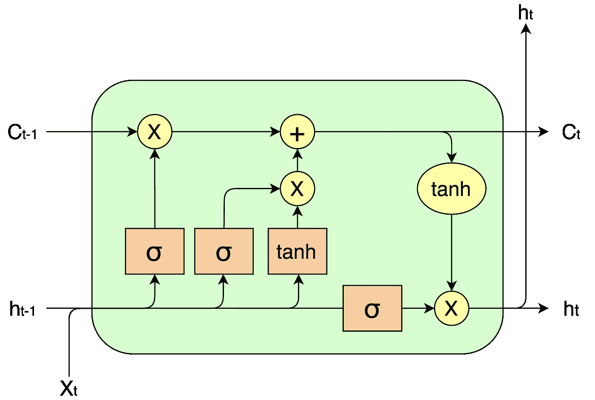
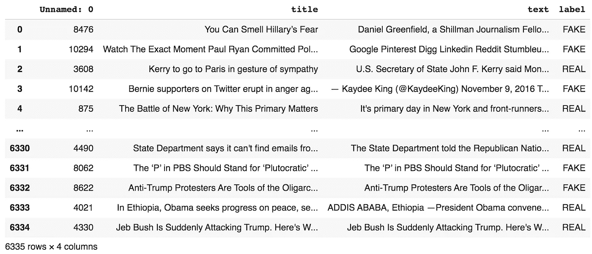
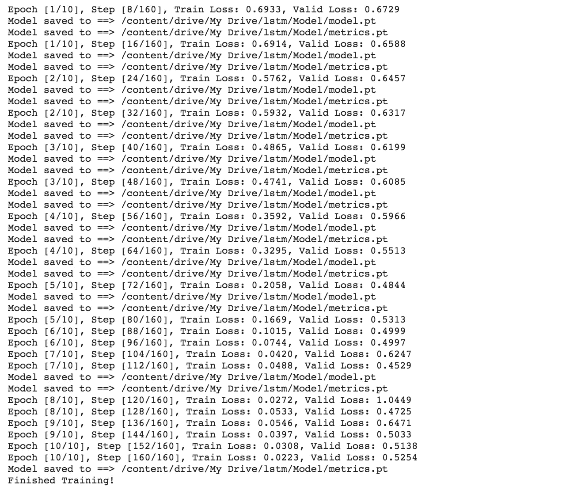
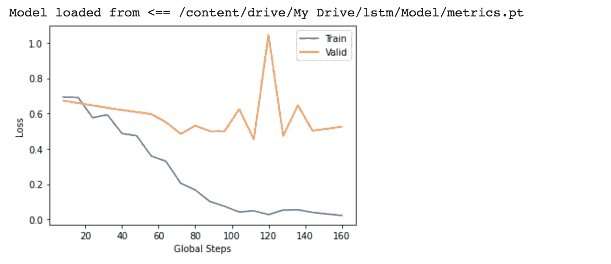
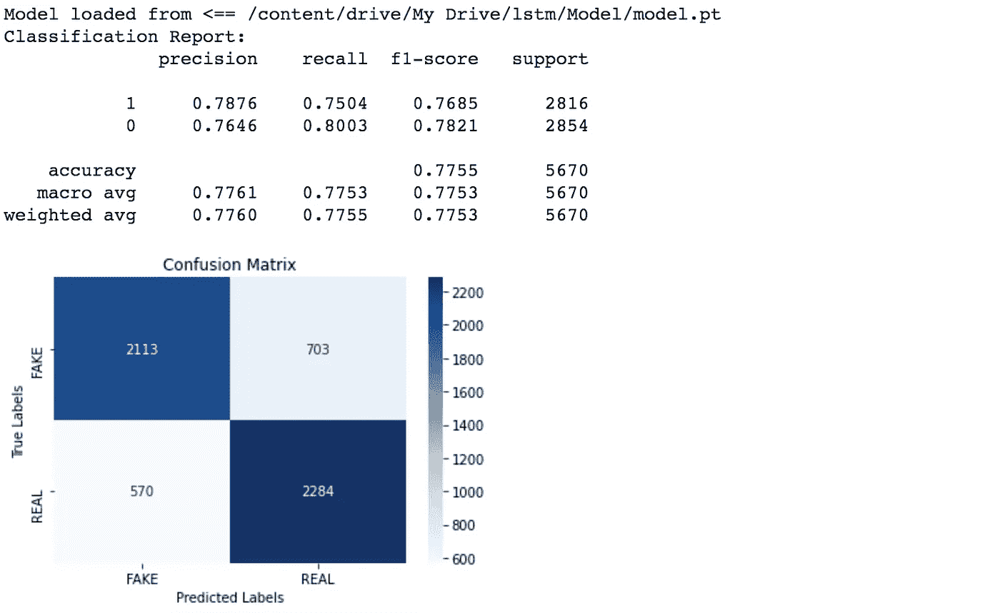

# 基于 Pytorch 的 LSTM 文本分类

> 原文：<https://towardsdatascience.com/lstm-text-classification-using-pytorch-2c6c657f8fc0?source=collection_archive---------0----------------------->

## 一步一步的指导你如何在 Pytorch 中建立一个双向 LSTM！

克里斯托夫·高尔在 [Unsplash](https://unsplash.com?utm_source=medium&utm_medium=referral) 上拍摄的照片

# 介绍

欢迎来到本教程！本教程将在几分钟内教你如何为文本分类构建一个双向[**【LSTM】**](https://www.researchgate.net/publication/13853244_Long_Short-term_Memory)。如果你还没有看过我之前关于 [**BERT 文本分类**](/bert-text-classification-using-pytorch-723dfb8b6b5b) 的文章，这篇教程包含了和那篇类似的代码，但是包含了一些支持 LSTM 的修改。本文还解释了我是如何对两篇文章中使用的数据集进行预处理的，这是来自 Kaggle 的 [**真假新闻数据集**](https://www.kaggle.com/nopdev/real-and-fake-news-dataset) 。

首先，什么是 LSTM，我们为什么要使用它？LSTM 代表**长短期记忆网络**，属于一个更大的神经网络类别，称为**递归神经网络(RNN)** 。与传统的 RNN 相比，它的主要优势在于，它能够通过复杂的架构更好地处理长期依赖性，该架构包括三个不同的门:输入门、输出门和遗忘门。这三个门共同决定在任意时间内 LSTM 细胞中哪些信息该记住，哪些该忘记。

LSTM 细胞

现在，我们对 LSTM 有了更多的了解，让我们集中在如何实现它的文本分类。本教程分为以下步骤:

1.  预处理数据集
2.  导入库
3.  加载数据集
4.  建立模型
5.  培养
6.  估价

在我们开始学习本教程之前，您可以在这里访问本文中的代码:

*   [**假新闻数据集的预处理**](https://colab.research.google.com/drive/1gX8ERqDMQGTO1fKJwELFO11f66xuKVyP?usp=sharing)
*   [**LSTM 文本分类 Google Colab**](https://colab.research.google.com/drive/1cpn6pk2J4liha9jgDLNWhEWeWJb2cdch?usp=sharing)

# 步骤 1:预处理数据集

原始数据集如下所示:

数据集概述

数据集包含任意的索引、标题、文本和相应的标签。

对于预处理，我们导入 Pandas 和 Sklearn，并为路径、训练验证和测试比率定义一些变量，以及用于将每个句子切割到第一个`first_n_words`单词的`trim_string`函数。修剪数据集中的样本不是必需的，但是它能够更快地训练较重的模型，并且通常足以预测结果。

接下来，我们将*真实的*转换为 0，将*虚假的*转换为 1，连接*标题*和*文本*以形成新列*标题文本*(我们使用标题和文本来决定结果)，删除带有空文本的行，将每个样本修剪为`first_n_words`，并根据`train_test_ratio`和`train_valid_ratio`分割数据集。我们将生成的数据帧保存到*中。csv* 文件，获取 *train.csv* 、 *valid.csv* 和 *test.csv* 。

# 步骤 2:导入库

我们导入 Pytorch 用于模型构建，torchText 用于加载数据，matplotlib 用于绘图，sklearn 用于评估。

# 步骤 3:加载数据集

首先，我们使用 torchText 为数据集中的*标签*创建一个标签字段，并为*标题*、*文本*和*标题文本*创建一个文本字段。然后，我们通过将 TabularDataset 指向包含 *train.csv* 、 *valid.csv* 和 *test.csv* 数据集文件的路径来构建 tabular dataset。我们创建加载数据的 train、valid 和 test 迭代器，最后，使用 train 迭代器构建词汇表(只计算最小频率为 3 的标记)。

# 步骤 4:构建模型

我们构造了继承自 *nn 的 LSTM 类。模块*。在 LSTM 内部，我们构建了一个嵌入层，然后是一个双 LSTM 层，最后是一个完全连接的线性层。在 *forward* 函数中，我们通过嵌入层传递文本 id 以获得嵌入，通过容纳变长序列的 LSTM 传递，从两个方向学习，通过完全连接的线性层传递，最后 *sigmoid* 以获得序列属于假的概率(为 1)。

# 第五步:培训

在训练之前，我们为检查点和指标构建保存和加载函数。对于检查点，保存模型参数和优化器；对于度量标准，将保存列车损失、有效损失和全局步骤，以便稍后可以轻松地重新构建图表。

我们用 10 个历元训练 LSTM，每当超参数设置实现最佳(最低)验证损失时，保存检查点和指标。以下是培训期间的输出:

整个训练过程在 Google Colab 上很快。训练了不到两分钟！

一旦我们完成了训练，我们可以加载之前保存的指标，并输出一个图表，显示整个时间内的训练损失和验证损失。

# 第六步:评估

最后，为了进行评估，我们选择之前保存的最佳模型，并根据我们的测试数据集对其进行评估。我们使用默认阈值 0.5 来决定何时将样本归类为假样本。如果模型输出大于 0.5，我们把那个新闻归类为假的；否则，真实的。我们输出分类报告，指出每个类别的精确度、召回率和 F1 值，以及总体精确度。我们还输出混淆矩阵。

我们可以看到，使用一层双 LSTM，我们可以在假新闻检测任务上实现 77.53%的准确率。

# 结论

本教程一步一步地解释了如何使用 Pytorch 实现你自己的文本分类 LSTM 模型。我们发现，双 LSTM 在假新闻检测方面达到了可接受的准确率，但仍有改进的空间。如果你想要更有竞争力的表现，可以看看我之前关于 [**BERT 文本分类**](/bert-text-classification-using-pytorch-723dfb8b6b5b) 的文章！

 [## 使用 Pytorch 的 BERT 文本分类

### 文本分类是自然语言处理中的一项常见任务。我们应用 BERT，一个流行的变压器模型，对假新闻检测使用…

towardsdatascience.com](/bert-text-classification-using-pytorch-723dfb8b6b5b) 

如果你想了解更多关于现代自然语言处理和深度学习的知识，请关注我的最新文章:)

# 参考

[1] S. Hochreiter，J. Schmidhuber，[长短期记忆](https://www.researchgate.net/publication/13853244_Long_Short-term_Memory) (1997)，神经计算