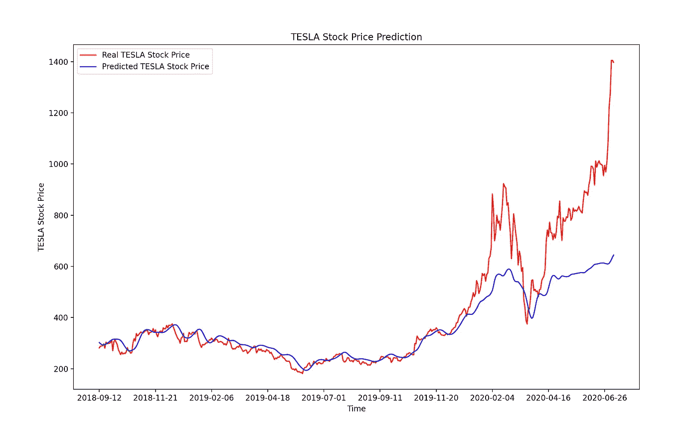
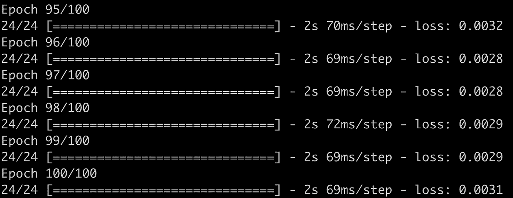
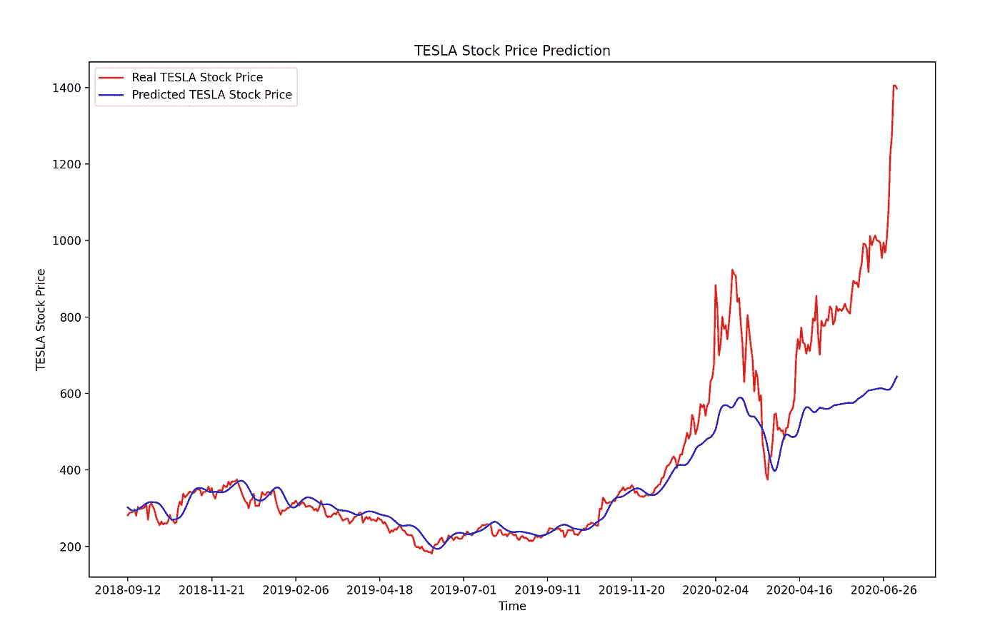
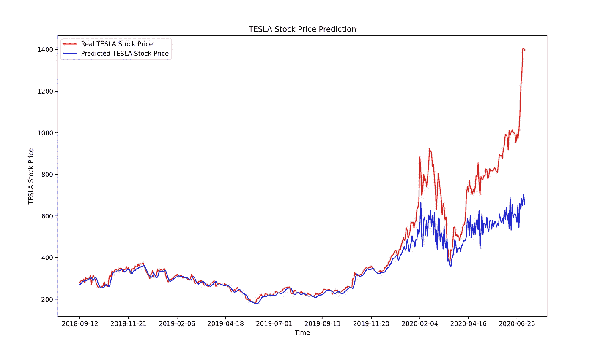

# 时间序列预测:使用 LSTM 模型预测股票价格

> 原文：<https://towardsdatascience.com/lstm-time-series-forecasting-predicting-stock-prices-using-an-lstm-model-6223e9644a2f?source=collection_archive---------0----------------------->

## 在这篇文章中，我将向你展示如何使用预测 LSTM 模型来预测股票价格



作者创作的人物。

# 1.介绍

## 1.1.时间序列和预测模型

传统上，大多数机器学习(ML)模型使用一些观察值(样本/实例)作为输入特征，但数据中没有**时间** **维度**。

**时间序列预测**模型是能够根据**先前** **观测** **值**预测 **未来值**的模型。时间序列预测广泛用于**非平稳数据**。**非平稳数据**被称为统计属性(如平均值和标准偏差)不随时间保持不变，而是随时间变化的数据。

这些非平稳输入数据(用作这些模型的输入)通常被称为**时间序列。**时间序列的一些例子包括随时间变化的温度值、随时间变化的股票价格、随时间变化的房屋价格等。因此，输入是一个**信号**(时间序列),它是由在时间中连续获得的观察值**定义的。**

> 时间序列是按时间顺序进行的一系列观察。


时间序列的一个例子。作者用 Python 创作的情节。

**观察:时序**数据记录在**离散**时间**刻度**时间**刻度**上。

**免责声明**(在我们继续之前):已经有人尝试使用时间序列分析算法来预测股票价格，尽管它们仍然不能用于在真实市场中下注。这只是一篇教程文章，并不打算以任何方式“指导”人们购买股票。

## ——我的邮件列表只需 5 秒:[https://seralouk.medium.com/subscribe](https://seralouk.medium.com/subscribe)

## -成为会员支持我:[https://seralouk.medium.com/membership](https://seralouk.medium.com/membership)

# 2.LSTM 模式

**长短期记忆** ( **LSTM** )是一种用于深度学习领域的人工递归神经网络(RNN)架构。与标准的前馈神经网络不同，LSTM 有反馈连接。它不仅可以处理单个数据点(例如图像)，还可以处理整个数据序列(例如语音或视频输入)。

LSTM 模型能够储存一段时间的信息。

> 换句话说，它们有记忆能力。记住，LSTM 代表**长短期记忆模型。**

当我们处理时间序列或顺序数据时，这个特性是非常有用的。当使用 LSTM 模型时，我们可以自由决定存储什么信息，丢弃什么信息。我们使用“门”来实现。对 LSTM 的深入理解超出了这篇文章的范围，但是如果你有兴趣了解更多，看看这篇文章末尾的参考资料。

如果你想在交互式路线图和活跃的学习社区的支持下自学数据科学，看看这个资源:【https://aigents.co/learn

# 3.获取股票价格历史数据

感谢**雅虎财经**我们可以免费**获得**的数据。使用以下链接获取**特斯拉**:[https://finance.yahoo.com/quote/TSLA/history?的股价历史周期 1=1436486400 &周期 2=1594339200 &间隔=1d &过滤器=历史&频率=1d](https://finance.yahoo.com/quote/TSLA/history?period1=1436486400&period2=1594339200&interval=1d&filter=history&frequency=1d)

您应该看到以下内容:


点击**下载**并保存**。csv** 文件本地保存在您的计算机上。

数据是从 **2015** 到现在( **2020** )！

# 4.Python 工作示例

所需模块:Keras，Tensorflow，Pandas，Scikit-Learn & Numpy

我们将构建一个**多层 LSTM 递归神经网络**来**预测**一系列值中的**最后一个值，即本例中的特斯拉股票价格。**

让**加载**数据**数据**和**检查**它们:

```
import math
import matplotlib.pyplot as plt
import keras
import pandas as pd
import numpy as np
from keras.models import Sequential
from keras.layers import Dense
from keras.layers import LSTM
from keras.layers import Dropout
from keras.layers import *
from sklearn.preprocessing import MinMaxScaler
from sklearn.metrics import mean_squared_error
from sklearn.metrics import mean_absolute_error
from sklearn.model_selection import train_test_split
from keras.callbacks import EarlyStoppingdf=pd.read_csv("TSLA.csv")
print(‘Number of rows and columns:’, df.shape)
df.head(5)
```


上述代码的输出

下一步是**将**数据分割成**训练**和**测试**集合，以避免**过拟合**，并能够调查我们模型的泛化能力。要了解更多关于过度拟合的信息，请阅读本文:

[](/is-your-model-overfitting-or-maybe-underfitting-an-example-using-a-neural-network-in-python-4faf155398d2) [## 你的模型是否过拟合？或者不合身？python 中使用神经网络的示例

### 过拟合，欠拟合，泛化能力，交叉验证。一切都简单解释了。我还提供了一个…

towardsdatascience.com](/is-your-model-overfitting-or-maybe-underfitting-an-example-using-a-neural-network-in-python-4faf155398d2) 

要预测的目标值将是“**收盘**股价值。

```
training_set = df.iloc[:800, 1:2].values
test_set = df.iloc[800:, 1:2].values
```

在**模型** **拟合**之前，**归一化**数据不失为一个好主意。这将提高性能。你可以在这里阅读更多关于**最小-最大缩放器**:

[](/everything-you-need-to-know-about-min-max-normalization-in-python-b79592732b79) [## 关于 Python 中的最小-最大规范化，您需要知道的一切

### 在这篇文章中，我将解释什么是最小-最大缩放，什么时候使用它，以及如何使用 scikit 在 Python 中实现它

towardsdatascience.com](/everything-you-need-to-know-about-min-max-normalization-in-python-b79592732b79) 

让我们构建具有 1 天滞后时间**(滞后 1)的输入要素:**

```
# Feature Scaling
sc = MinMaxScaler(feature_range = (0, 1))
training_set_scaled = sc.fit_transform(training_set)# Creating a data structure with 60 time-steps and 1 output
X_train = []
y_train = []
for i in range(60, 800):
    X_train.append(training_set_scaled[i-60:i, 0])
    y_train.append(training_set_scaled[i, 0])
X_train, y_train = np.array(X_train), np.array(y_train)X_train = np.reshape(X_train, (X_train.shape[0], X_train.shape[1], 1))
#(740, 60, 1)
```

现在**我们已经将**数据整形为以下格式(#值、#时间步长、#1 维输出)。

**现在，该建立模型了。**我们将建立有 50 个神经元的 **LSTM** 和 **4 个隐含层**。最后，我们将在输出层分配 1 个神经元用于预测标准化的股票价格。我们将使用 MSE 损失函数和 Adam 随机梯度下降优化器。

**注意**:以下需要一些时间(~5min)。

```
model = Sequential()#Adding the first LSTM layer and some Dropout regularisation
model.add(LSTM(units = 50, return_sequences = True, input_shape = (X_train.shape[1], 1)))
model.add(Dropout(0.2))# Adding a second LSTM layer and some Dropout regularisation
model.add(LSTM(units = 50, return_sequences = True))
model.add(Dropout(0.2))# Adding a third LSTM layer and some Dropout regularisation
model.add(LSTM(units = 50, return_sequences = True))
model.add(Dropout(0.2))# Adding a fourth LSTM layer and some Dropout regularisation
model.add(LSTM(units = 50))
model.add(Dropout(0.2))# Adding the output layer
model.add(Dense(units = 1))

# Compiling the RNN
model.compile(optimizer = 'adam', loss = 'mean_squared_error')

# Fitting the RNN to the Training set
model.fit(X_train, y_train, epochs = 100, batch_size = 32)
```

装配完成后，您应该会看到类似这样的内容:



准备测试数据(重塑它们):

```
# Getting the predicted stock price of 2017
dataset_train = df.iloc[:800, 1:2]
dataset_test = df.iloc[800:, 1:2]dataset_total = pd.concat((dataset_train, dataset_test), axis = 0)inputs = dataset_total[len(dataset_total) - len(dataset_test) - 60:].valuesinputs = inputs.reshape(-1,1)
inputs = sc.transform(inputs)
X_test = []
for i in range(60, 519):
    X_test.append(inputs[i-60:i, 0])
X_test = np.array(X_test)
X_test = np.reshape(X_test, (X_test.shape[0], X_test.shape[1], 1))print(X_test.shape)
# (459, 60, 1)
```

使用测试集进行预测

```
predicted_stock_price = model.predict(X_test)
predicted_stock_price = sc.inverse_transform(predicted_stock_price)
```

现在让我们来看看结果:

```
# Visualising the results
plt.plot(df.loc[800:, ‘Date’],dataset_test.values, color = ‘red’, label = ‘Real TESLA Stock Price’)
plt.plot(df.loc[800:, ‘Date’],predicted_stock_price, color = ‘blue’, label = ‘Predicted TESLA Stock Price’)
plt.xticks(np.arange(0,459,50))
plt.title('TESLA Stock Price Prediction')
plt.xlabel('Time')
plt.ylabel('TESLA Stock Price')
plt.legend()
plt.show()
```

# 5.结果

**使用滞后 1(即一天的步长):**



**观察**:2020 年 3 月因新冠肺炎封锁而大幅下跌！

我们可以清楚地看到，我们的模型表现得非常好。它能够准确地跟踪大多数不可接受的上涨/下跌，但是，对于最近的日期戳，我们可以看到，与股票价格的实际值相比，模型预期(预测)的值较低。

# 关于滞后的一个注记

**本文中最初选择的延迟为 1，即使用 1 天的步长**。这可以通过修改构建 3D 输入的代码来轻松改变。

**示例**:可以更改以下两个代码块:

```
X_train = []
y_train = []
for i in range(60, 800):
    X_train.append(training_set_scaled[i-60:i, 0])
    y_train.append(training_set_scaled[i, 0])
```

和

```
X_test = []
y_test = []
for i in range(60, 519):
    X_test.append(inputs[i-60:i, 0])
X_test = np.array(X_test)
X_test = np.reshape(X_test, (X_test.shape[0], X_test.shape[1], 1))
```

**采用以下新代码:**

```
X_train = []
y_train = []
for i in range(60, 800):
    X_train.append(training_set_scaled[i-50:i, 0])
    y_train.append(training_set_scaled[i, 0])
```

**和**

```
X_test = []
y_test = []
for i in range(60, 519):
    X_test.append(inputs[i-50:i, 0])
X_test = np.array(X_test)
X_test = np.reshape(X_test, (X_test.shape[0], X_test.shape[1], 1))
```

在这种情况下，结果如下所示:



那都是乡亲们！希望你喜欢这篇文章！

## 看看我在另一篇文章中用来预测谷歌股价的脸书预言家模型。

[](/time-series-forecasting-predicting-stock-prices-using-facebooks-prophet-model-9ee1657132b5) [## 时间序列预测:用脸书的先知模型预测股票价格

### 使用可从《先知脸书》公开获得的预测模型预测股票价格

towardsdatascience.com](/time-series-forecasting-predicting-stock-prices-using-facebooks-prophet-model-9ee1657132b5) 

## 也可以看看我最近用 ARIMA 模型写的文章:

[](/time-series-forecasting-predicting-stock-prices-using-an-arima-model-2e3b3080bd70) [## 时间序列预测:使用 ARIMA 模型预测股票价格

### 在这篇文章中，我将向你展示如何使用预测 ARIMA 模型来预测特斯拉的股票价格

towardsdatascience.com](/time-series-forecasting-predicting-stock-prices-using-an-arima-model-2e3b3080bd70) 

# 参考

[1][https://colah.github.io/posts/2015-08-Understanding-LSTMs/](https://colah.github.io/posts/2015-08-Understanding-LSTMs/)

[2]https://en.wikipedia.org/wiki/Long_short-term_memory

# 敬请关注并支持这一努力

如果你喜欢这篇文章并且觉得它有用，**关注**我就可以看到我所有的新帖子。

有问题吗？把它们作为评论贴出来，我会尽快回复。

# 最新帖子

[](/time-series-forecasting-predicting-stock-prices-using-facebooks-prophet-model-9ee1657132b5) [## 时间序列预测:用脸书的先知模型预测股票价格

### 使用可从《先知脸书》公开获得的预测模型预测股票价格

towardsdatascience.com](/time-series-forecasting-predicting-stock-prices-using-facebooks-prophet-model-9ee1657132b5) [](https://medium.com/@seralouk/the-best-free-data-science-resources-free-books-online-courses-9c4a2df194e5) [## 最佳免费数据科学资源:免费书籍和在线课程

### 最有用的免费书籍和在线课程，适合想了解更多数据科学知识的人。

medium.com](https://medium.com/@seralouk/the-best-free-data-science-resources-free-books-online-courses-9c4a2df194e5) [](/roc-curve-explained-using-a-covid-19-hypothetical-example-binary-multi-class-classification-bab188ea869c) [## 用新冠肺炎假设的例子解释 ROC 曲线:二分类和多分类…

### 在这篇文章中，我清楚地解释了什么是 ROC 曲线以及如何阅读它。我用一个新冠肺炎的例子来说明我的观点，我…

towardsdatascience.com](/roc-curve-explained-using-a-covid-19-hypothetical-example-binary-multi-class-classification-bab188ea869c) [](/support-vector-machines-svm-clearly-explained-a-python-tutorial-for-classification-problems-29c539f3ad8) [## 支持向量机(SVM)解释清楚:分类问题的 python 教程…

### 在这篇文章中，我解释了支持向量机的核心，为什么以及如何使用它们。此外，我还展示了如何绘制支持…

towardsdatascience.com](/support-vector-machines-svm-clearly-explained-a-python-tutorial-for-classification-problems-29c539f3ad8) [](/pca-clearly-explained-how-when-why-to-use-it-and-feature-importance-a-guide-in-python-7c274582c37e) [## PCA 清楚地解释了——如何、何时、为什么使用它以及特性的重要性:Python 指南

### 在这篇文章中，我解释了什么是 PCA，何时以及为什么使用它，以及如何使用 scikit-learn 在 Python 中实现它。还有…

towardsdatascience.com](/pca-clearly-explained-how-when-why-to-use-it-and-feature-importance-a-guide-in-python-7c274582c37e) [](/everything-you-need-to-know-about-min-max-normalization-in-python-b79592732b79) [## 关于 Python 中的最小-最大规范化，您需要知道的一切

### 在这篇文章中，我将解释什么是最小-最大缩放，什么时候使用它，以及如何使用 scikit 在 Python 中实现它

towardsdatascience.com](/everything-you-need-to-know-about-min-max-normalization-in-python-b79592732b79) [](/how-and-why-to-standardize-your-data-996926c2c832) [## Scikit-Learn 的标准定标器如何工作

### 在这篇文章中，我将解释为什么以及如何使用 scikit-learn 应用标准化

towardsdatascience.com](/how-and-why-to-standardize-your-data-996926c2c832) 

# 和我联系

*   **LinkedIn**:[https://www.linkedin.com/in/serafeim-loukas/](https://www.linkedin.com/in/serafeim-loukas/)
*   **研究之门**:[https://www.researchgate.net/profile/Serafeim_Loukas](https://www.researchgate.net/profile/Serafeim_Loukas)
*   **https://people.epfl.ch/serafeim.loukas**EPFL**简介** : [美国](https://people.epfl.ch/serafeim.loukas)
*   **堆栈**溢出**溢出**:[https://stackoverflow.com/users/5025009/seralouk](https://stackoverflow.com/users/5025009/seralouk)