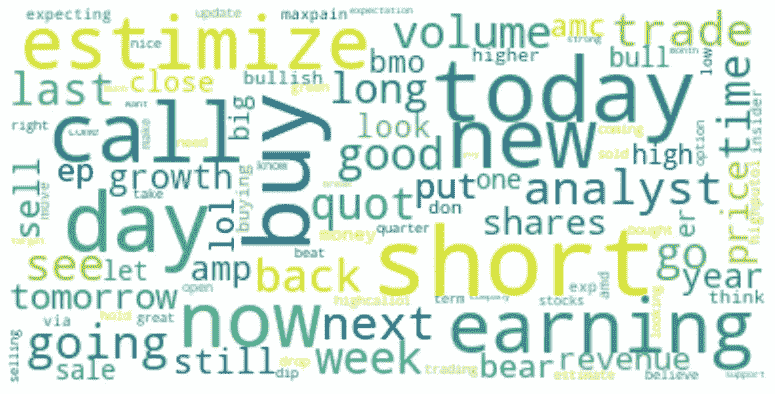
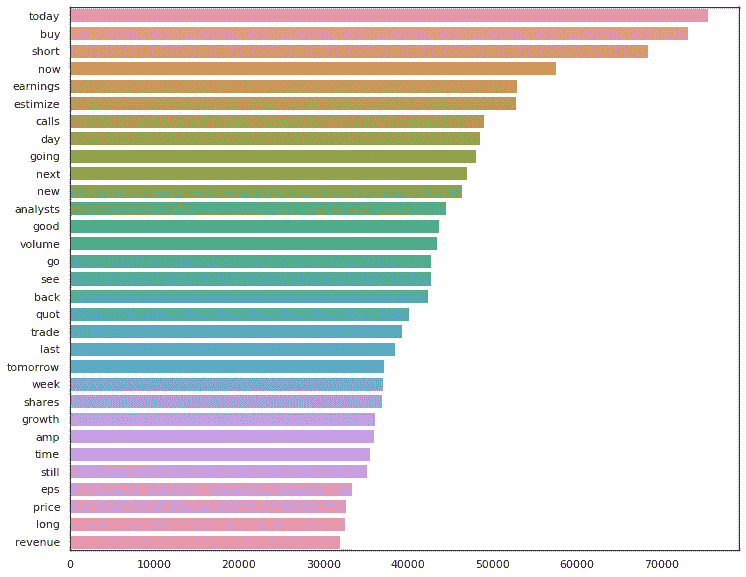
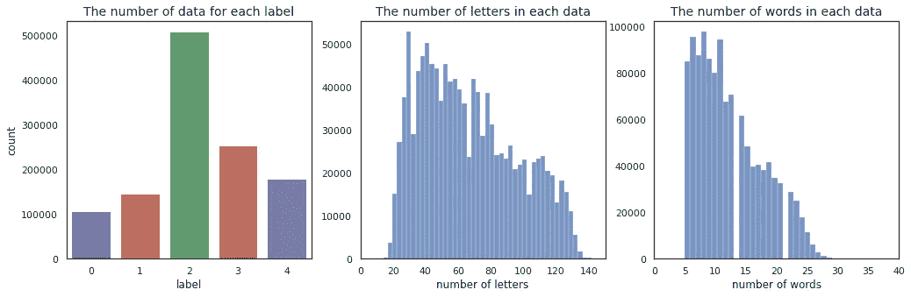
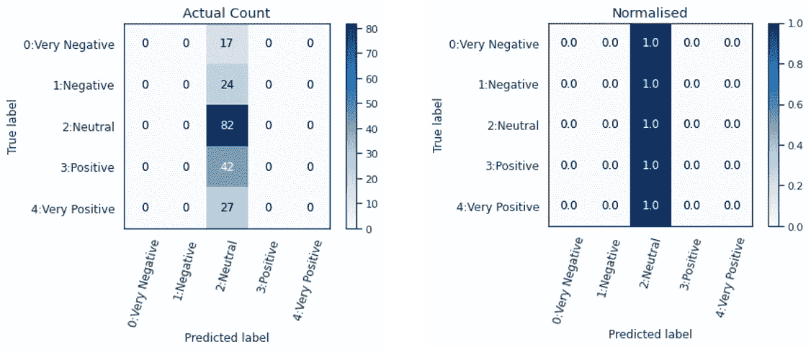
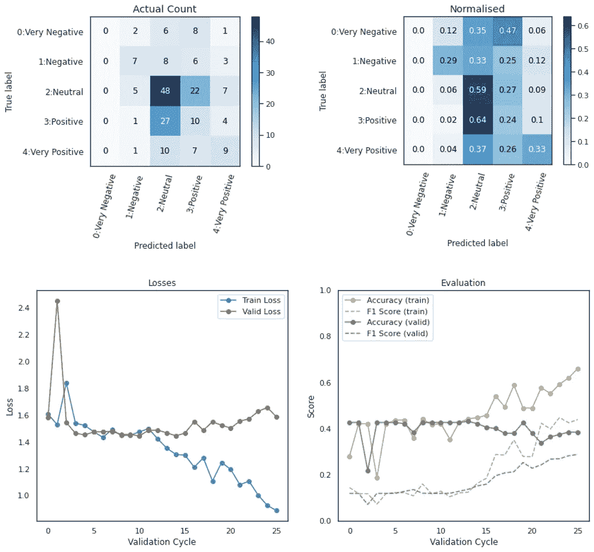
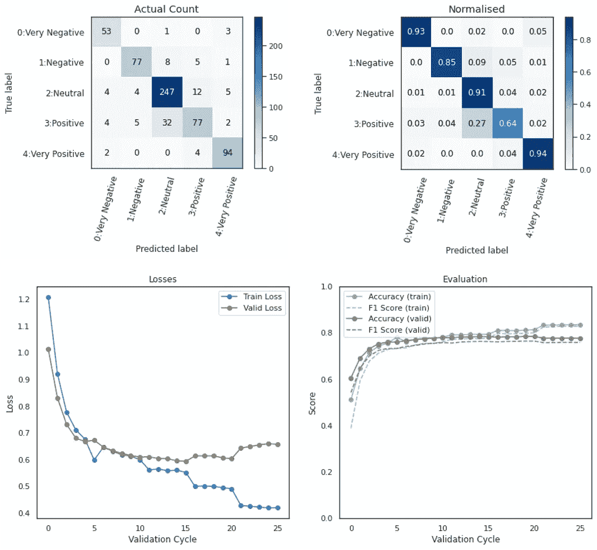
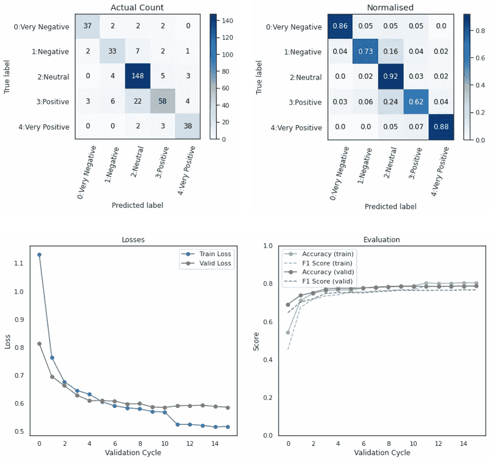
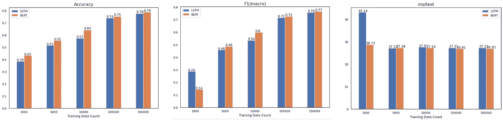

# LSTM vs 伯特——推特情感分析的分步指南

> 原文：<https://towardsdatascience.com/lstm-vs-bert-a-step-by-step-guide-for-tweet-sentiment-analysis-ced697948c47?source=collection_archive---------5----------------------->

## 最先进的 NLP 模型能比 RNN 更好地预测股票交易者情绪吗？


作者图片

***注来自《走向数据科学》的编辑:*** *虽然我们允许独立作者根据我们的* [*规则和指导方针*](/questions-96667b06af5) *发表文章，但我们不认可每个作者的贡献。你不应该在没有寻求专业建议的情况下依赖一个作者的作品。详见我们的* [*读者术语*](/readers-terms-b5d780a700a4) *。*

在[金融文本的情绪分析](/nlp-in-the-financial-market-sentiment-analysis-9de0dda95dc?source=friends_link&sk=9bb03bc7e108c125499bc9cf1996bd49)中看到 BERT 的竞争结果后，我对更非正式的文本进行了另一项初步研究，因为最终目标是除了新闻情绪之外，还分析交易员在电话和聊天中的声音。在这篇文章中，我让 LSTM 和伯特分析了 Stocktwit 的一些推文。

# 背景

与正式的金融文本不同，交易者的声音和聊天包含了迄今为止的非正式语言。在我过去的研究中，传统的基于规则的模型或简单的矢量化技术(如 BoW、Tfidf、word2vec)表现不佳，因为

*   一个词在不同的上下文中通常有不同的意思
*   拼写和句子远不是语法正确的语言
*   通过词干化、词汇化、停用词移除等来平衡单词分组。保持原来的形式是很困难的
*   对于基于规则的方法，字典必须专门建立在这种语言上，在这方面我没有足够的概括

LSTM 是自然语言处理中最著名的 RNN 模型之一，表现很好。这在很大程度上归功于这样一个事实

*   句子结构相当简单——简单地从左到右处理就足够了
*   每一个输入文本都很短，有利于记忆
*   这项任务相当简单的分类

另一方面，我在这里使用的 BERT 是在维基百科上训练的，那里的语言非常不同。由于资源的限制，从零开始训练 BERT 并不是一个好的选择。在这种情况下，让伯特获得比 LSTM 更好的表现还值得吗？

# 作为输入文本的推文

这里输入的文字取自 Stocktwits，作为这里交易者声音的类似语言。大约有一百万条推文被手工标记为 0(负面)到 4(正面)，分别被加载为`messages`和`sentiments`列表。请注意，实际环境通常需要做更多的工作来准备输入，如声音识别、数据清理、流式传输。这篇文章跳过这些步骤，从数据加载的地方开始。

```
> ##### Sample input messages ######> print(messages)
["$AMZN sick! they’re running a prime flash sale on shares too!", "$AAPL has a good Piotroski-F score of 7.00\. This indicates a good health and profitability. https://www.chartmill.com/analyze.php?utm_source=stocktwits&amp;utm_medium=FA&amp;utm_content=PROFITABILITY&amp;utm_campaign=social_tracking#/AAPL?r=fa&amp;key=bb853040-a4ac-41c6-b549-d218d2f21b32", "$FB got rid of this trash today, i admit that bears were right", ...]> print(sentiments)
[4, 2, 0, ...]
```

## 1.预处理

在训练之前，输入文本需要进行预处理，如删除 URL、标记符号、@提及、符号等。在这里，我简单地删除了它们，因为它们在语音中不可用，但也有一些有趣的研究，关于如何利用表情符号和标签等信息，而不是删除它们，如果最终目标是分析推文文本的话。

预处理输入消息

现在输入已经被清理如下。

```
> ###### Input messages after preprocessing ######> print(preprocessed)
["sick they re running a prime flash sale on shares too", "has a good piotroski f score of this indicates a good health and profitability", "got rid of this trash today i admit that bears were right", ...]
```

## 2.标记化

下一步是标记文本。在这里，我使用 python NLTK 库，但也给出了使用不同方法的选项，以查看什么最适合输入。经过几次实验后，我决定使用 nltk.word_tokenize()，而不进行词汇化和停用词移除。

## 3.语料库和词汇库

一旦输入文本被标记化，我们就可以用下面的方式创建一个语料库和词汇库。词云或条形图是快速查看输入中的常用词的好方法。分布显示该标签不平衡，比其他情绪更中性。通过重采样(欠采样或过采样)来平衡数据是可能的，但这里按原样进行，因为这个比率将代表推文流中情感的实际发生。



文字云图像(由作者创建)



语料库中最常用的单词(由作者创建)



标签、字母和单词的分发(由作者创建)

# 分类模型

既然输入数据已经准备好了，就创建基于神经网络的模型，并为该模型标记化。

## 4.LSTM

使用 pytorch 创建一个基于 LSTM 的模型。该类扩展了 torch.nn.Module 并将层定义为嵌入→ lstm →丢弃→密集(全连接)→输出(softmax)。LSTM 的记号赋予器是将输入填充到右边或左边，直到指定的最大长度，如果输入超过最大长度，则截断，设计用于在每批的训练期间使用，而不是预处理所有输入。

## 5.伯特

这里我使用 BERT 的拥抱脸实现。只需使用他们的变压器和预先训练的模型和记号化器。

# 培训过程

## 6.资料组

为批处理创建数据集类和数据加载器。有许多不同的方法来定义它们，这只是一个非常简单的解决方案，与返回 torch.tensor 的已定义记号化器一起使用。

## 7.取样周期

根据不同输入大小的准确度、f1 和训练时间来测量性能。使用 scikit-learn 的分层混洗 Split，它可以根据给定的训练和测试大小，通过保留标签分布来执行欠采样。在每个循环中，通过 perf_counter()测量完成训练的持续时间。

此外，定义一个简单的函数来返回准确性和 F1 分数。

注意，模型参数是在实例化模型类时定义的，可以根据输入数据进行更新。

## 8.训练神经网络模型

如下定义培训流程:

1.  循环训练批次
2.  在整个数据的 1/5 处运行评估
3.  一个时期完成后，显示结果
4.  如果分数没有提高到超出忍耐限度，则结束，或者开始下一个纪元

AdamW 优化器和线性时间表与学习率预热一起使用，但这些可以根据需要与其他选项交换。

在每个训练批次循环中，将输入消息标记化并移动到 torch.tensor，执行前馈预测，计算损失并反向传播以更新权重。裁剪以避免在下一个批处理步骤之前爆发梯度问题。

在每个时期结束时，显示训练和验证数据的混淆矩阵和分数/损失。

# 火车！

最后:)

## 9.运行 LSTM 模型

在最小样本(n=1，000)的第一个时期之后，模型简单地将所有数据分类为“中性”，这是合理的，因为“中性”是多数类。



混淆矩阵(n=1，000，epoch=1)(由作者创建)

完成五个时代后，它看起来几乎是随机地对数据进行了分类。它从第三个时期(=验证周期= 10)开始过度拟合训练数据。



评估结果(n=1，000，epoch=5)(由作者创建)

最大的数据集(n=500，000)包含比第一个周期多 500 倍的数据。它表现得更好，现在可以正确分类大多数标签。从第四个周期开始超配，所以三个纪元会是最好的。



评估结果(n=500，000，epoch=5)(由作者创建)

## 10.运行伯特模型

三个时期的训练预训练的 BERT 花费的时间几乎与上述 LSTM 模型的五个时期相同。

BERT 显示了类似的结果，但是它在最大数据集(n = 500，000)的第三个时期开始过拟合。



评估结果(n=500，000，epoch=5)(由作者创建)

## 11.比较结果

如下所示，随着输入数据数量的增加，它的性能自然会更好，在大约 100k 的数据时达到 75%以上的分数。伯特的表现略好于 LSTM，但当模型接受相同时间的训练时，没有显著差异。



LSTM 与伯特的演奏比较(作者创作)

# 结论

在这篇文章中，来自 stockswits 的推文被清理、标记和分析，以通过 LSTM 模型和预训练的伯特模型预测情绪。

给定相同的资源和时间，预训练的 BERT 比 LSTM 稍好，但没有显著差异。

潜在地，对类似的推文从头训练 BERT 模型可以产生更好的结果，而所需的资源和成本超出了本研究的范围。

# (可选)推文流上的推理

下面是一段代码，它使用上面训练好的模型，将 tweet 流作为输入进行处理，并输出带有置信度的情绪。

示例输出如下所示。