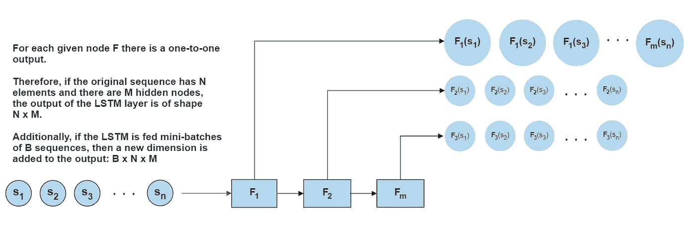
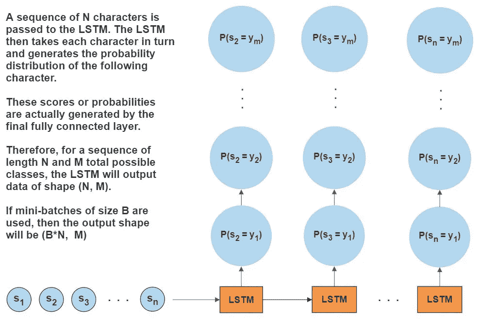

# PyTorch 的 LSTMs

> 原文：<https://towardsdatascience.com/lstms-in-pytorch-528b0440244?source=collection_archive---------4----------------------->

## 简单的解释

## 了解 LSTM 架构和数据流

大象永远不会忘记。LSTMs 呢？

***让我猜猜…*** *你已经和 MLPs 和 CNN 完成了几个小项目，对吗？MLPs 让你开始理解梯度下降和激活函数。CNN 让你看到了计算机视觉的世界。它们的所有层次都有点难，但你最终会找到窍门的。*

现在，你碰壁了。你在用头撞它。那座血淋淋、泪痕斑斑的建筑叫做伊斯特姆斯。

我感受到了你的痛苦，朋友。我是来帮忙的。

*让我们从概念上熟悉 LSTMs，然后深入研究您的问题的具体难点:即定义网络架构，以及在数据流经网络的每一层时控制数据的形状。*

# RNNs 背后的理念

递归神经网络通常保持关于先前通过网络传递的数据的状态信息。普通 rnn 和 LSTMs 都是如此。这种所谓的“隐藏状态”随着数据点序列的每个新元素被传回网络。因此，网络的每个输出不仅是输入变量的函数，也是隐藏状态的函数，隐藏状态是网络过去所见的“记忆”。

# 普通 rnn 失败的地方

这有助于理解 LSTMs 填补传统 rnn 能力的空白。香草 RNN 遭受快速**渐变消失**或**渐变爆炸**。粗略地说，当链式法则应用于支配网络内“记忆”的方程时，会产生一个指数项。如果满足某些条件，该指数项可能会变得很大或很快消失。

LSTMs 不会(严重地)遭受消失梯度的问题，因此能够保持更长的“记忆”，使它们成为学习时态数据的理想选择。

# PyTorch 中 LSTMs 的难点

现在，你可能已经知道了 LSTMs 背后的故事。你在这里是因为你很难将你的概念性知识转化为工作代码。

快速搜索 [PyTorch 用户论坛](https://discuss.pytorch.org/)会产生几十个问题，关于如何定义 LSTM 的架构，如何在数据从一层移动到另一层时塑造数据，以及当数据从另一端出来时如何处理。这些问题中有许多没有答案，而更多的问题的答案对于提问的初学者来说是难以理解的。

可以说，理解通过 LSTM 的数据流是我在实践中遇到的头号难题。似乎我并不孤单。

# 理解数据流:LSTM 层

在学习其他类型的网络之后，学习 LSTMs 时最难理解的一个概念可能是数据如何在模型的各层中流动。

这不是魔法，但看起来可能是。图片可能有所帮助:

作者配图。

1.  一个 LSTM 层由一组 ***M*** 隐藏节点组成。该值 ***M*** 由用户在模型对象实例化时分配。很像传统的神经网络，虽然有指导方针，但这是一个有点武断的选择。
2.  当长度为*的单个序列 ***S*** 被传递到网络中时，序列 **𝑆** 的每个单独元素 ***s_i*** 通过每个隐藏节点。*
3.  *每个隐藏节点为它看到的每个输入提供一个输出。这导致了形状 **( *N* ， *M* )** 的隐藏层的整体输出*
4.  *如果将小批量的 **𝐵** 序列输入到网络中，则会增加一个额外的维度，从而产生形状为 **(𝐵、 *N* 、 *M* )** 的输出*

# *了解数据流:全连接层*

*在 LSTM 层(或一组 LSTM 层)之后，我们通常会通过`nn.Linear()`类向网络添加一个完全连接的层，用于最终输出。*

1.  *最后一个`nn.Linear()`层的输入大小将总是等于它之前的 LSTM 层中隐藏节点的数量。*
2.  *这个最终完全连接层的输出将取决于目标的形式和/或您使用的损失函数。*

# *了解数据流:示例*

*我们将讨论两个定义网络架构和通过网络传递输入的示例:*

1.  *回归*
2.  *分类*

# *示例 1a:回归网络架构*

*考虑一些时间序列数据，也许是股票价格。给定特定产品过去 7 天的股票价格，我们希望预测第 8 天的价格。在这种情况下，我们希望我们的输出是单个值。我们将使用 MSE 来评估这个单值的准确性，因此对于预测和性能评估，我们需要来自七天输入的单值输出。因此，我们将我们的网络架构定义为:*

# *示例 1b:对层间数据进行整形*

*我告诉你一个小秘密，我的一个朋友曾经告诉过我:*

> *这些天来，我对它有了一种理解*【LSTM 数据流】*如果我在做的时候看向别处，它就会起作用。*
> 
> **—亚历克**

*虽然他说的在某种意义上是对的，但我认为我们可以确定这台机器如何工作的一些细节。*

1.  ***LSTM 层的输入**必须是`(batch_size, sequence_length, number_features)`的形状，其中`batch_size`是指每批序列的数量，`number_features`是时间序列中变量的数量。*
2.  ***你的 LSTM 层的输出**将会是`(batch_size, sequence_length, hidden_size)`的形状。再看一下我在上面创建的流程图。*
3.  ***我们的全连接`nn.Linear()`层的输入**需要对应于前一 LSTM 层中隐藏节点数量的输入大小。因此，我们必须将我们的数据重塑为`(batches, n_hidden)`形式。*

***重要提示:** `batches`与`batch_size`不同，因为它们不是同一个数字。然而，想法是相同的，因为我们将 LSTM 层的输出分成`batches`个片段，其中每个片段的大小为`n_hidden`，即隐藏的 LSTM 节点的数量。*

*下面是一些模拟通过整个网络传递输入数据`x`的代码，遵循上面的协议:*

*回想一下`out_size = 1`,因为我们只希望知道一个值，这个值将使用 MSE 作为度量进行评估。*

# *示例 2a:分类网络架构*

*在这个例子中，我们想要生成一些文本。一个模型在一大堆文本上被训练，也许是一本书，然后输入一系列字符。该模型将查看每个字符，并预测下一个字符应该出现。这一次我们的问题是分类而不是回归，我们必须相应地改变我们的架构。我制作了这张图表来勾画总体思路:*

**

*作者配图。*

*也许我们的模型训练的是由 50 个独特字符组成的数百万字的文本。这意味着当我们的网络得到一个字符时，我们希望知道接下来是 50 个字符中的哪一个。因此，对于单个字符，我们的网络输出将是 50 个概率，对应于 50 个可能的下一个字符中的每一个。*

*此外，我们将对文本字符串中的每个字符进行一次性编码，这意味着变量(`input_size = 50`)的数量不再像以前那样是一个，而是一次性编码的字符向量的大小。*

# *示例 2b:对层间数据进行整形*

*至于在各层之间形成数据，没有太大的区别。逻辑是相同的:*

# *示例 2c:培训挑战*

*然而，这种情况提出了一个独特的挑战。因为我们正在处理分类预测，所以我们可能想要使用**交叉熵损失**来训练我们的模型。在这种情况下， ***知道你的损失函数的要求是非常重要的。例如，看看 PyTorch 的`nn.CrossEntropyLoss()`输入要求(强调我的，因为老实说有些文档需要帮助):****

> ***输入** *应该包含每个类的原始的、未标准化的分数。* **输入** *必须是一个大小为(minibatch，C)…* 的张量*
> 
> **这个准则* ***【交叉熵损失】*** *期望一个类索引在[0，C-1]范围内作为* **的目标** *为一个* ***的 1D 张量*** *的大小 minibatch 的每一个值。**

*好吧，无意冒犯 PyTorch，但那是狗屎。我不确定这是不是英语。我来翻译一下:*

1.  *预测(上面称为**输入**，尽管有两个输入)应该是**(迷你批处理，C)** 的形式，其中 **C** 是可能的类的数量。在我们的例子`**C = 50**`中。*
2.  *作为第二个输入的目标的大小应该是 **(minibatch，1)** 。换句话说，目标**不应该**被一键编码。但是，它**应该是**标签编码的。*

*这对你来说意味着你必须以两种不同的方式来塑造你的训练数据。输入`x`将被一键编码，但是你的目标`y`必须被标签编码。此外，`x`的独热列应按照`y`的标签编码进行索引。*

# *离别的思绪*

*LSTMs 的实现可能很复杂。通过了解您试图解决的问题的个人需求，然后相应地调整您的数据，可以消除这种复杂性。*

*上面所有的代码都是未经测试的伪代码。如果你想看看上面两个例子的完整的 Jupyter 笔记本，请访问我的 GitHub:*

1.  *[回归示例](https://github.com/wcneill/jn-ml-textbook/blob/master/Deep%20Learning/04%20Recurrent%20Networks/pytorch13b_LSTM.ipynb)*
2.  *[分类示例](https://github.com/wcneill/jn-ml-textbook/blob/master/Deep%20Learning/04%20Recurrent%20Networks/pytorch13_char_RNN.ipynb)*

*我希望这篇文章有助于您理解通过 LSTM 的数据流！*

***其他资源:***

1.  *拉兹万·帕斯卡努等*论训练递归神经网络的难度，2013*[https://arxiv.org/pdf/1211.5063.pdf](https://arxiv.org/pdf/1211.5063.pdf)*
2.  *PyTorch 用户论坛:https://discuss.pytorch.org*

***照片致谢:***

1.  *大象照片由[陈虎](https://unsplash.com/@huchenme?utm_source=medium&utm_medium=referral)在 [Unsplash](https://unsplash.com?utm_source=medium&utm_medium=referral) 上拍摄*
2.  *所有图表均由作者提供*