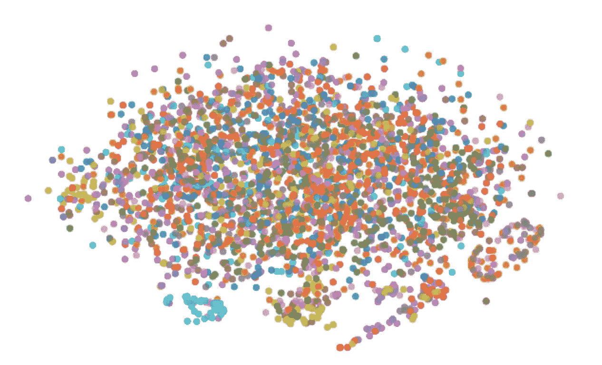
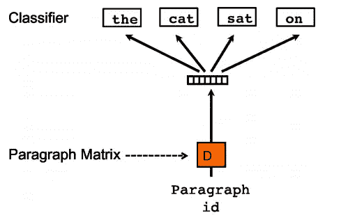
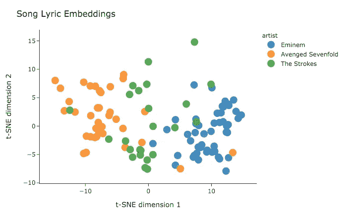
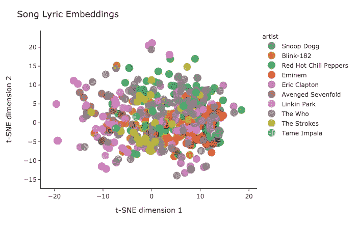
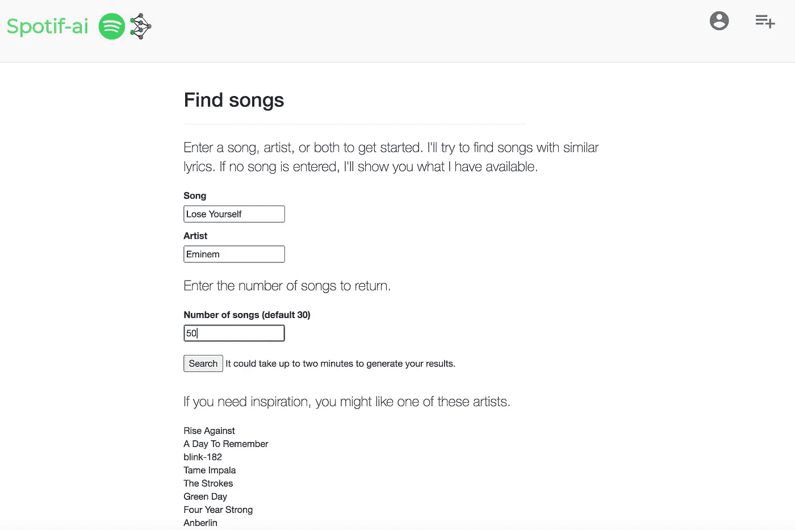
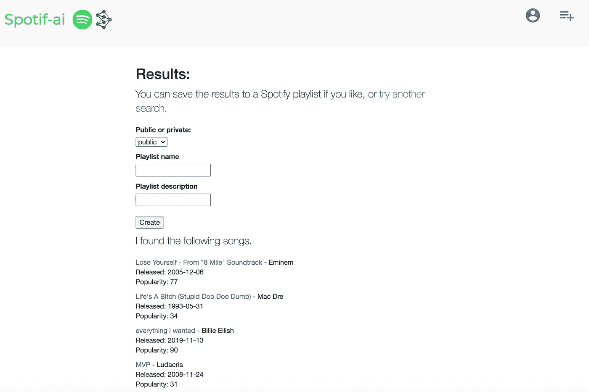

# 基于歌词的歌曲推荐，带有 Doc2Vec 嵌入和 Spotify 的 API

> 原文：<https://towardsdatascience.com/lyric-based-song-recommendation-with-doc2vec-embeddings-and-spotifys-api-5a61c39f1ce2?source=collection_archive---------29----------------------->

## 使用深度学习和自然语言处理理解歌词。

近 3000 首歌曲嵌入的二维表示，由艺术家着色。

# 单词嵌入和歌曲嵌入

单词嵌入对于自然语言处理来说是一个非常有用的工具。它们通常作为神经网络的参数被学习，并允许我们将单词映射到数字。更具体地说，它们允许我们将单词映射到高维向量。既然词向量用数字来表示信息，我们就可以利用它们之间的关系来理解它们所表示的词之间的关系。

如果我们可以嵌入单个单词，那么我们就可以嵌入句子、段落，甚至整个文档。事实证明，如果你能找到一种方法使它适合一个模型的架构，你可以为任何东西创建嵌入。

通过基于歌词训练歌曲嵌入，我们可以测量空间中点之间的关系，以理解歌曲之间的关系。

# 用例:歌曲推荐

如果我们已经训练了歌曲嵌入，那么我们将有一个对应于每首歌曲的 N 维向量。我们可以计算出从一首歌到其他每首歌的距离。那么，“最接近”的歌曲就是会被推荐的歌曲。

我们需要做的只是获取一些歌词，训练嵌入，然后构建一个可以测量距离并提供推荐的应用程序。

# 数据

我用的是 musiXmatch 数据集，这是百万首歌曲数据集的官方歌词集。我选择这个数据集是因为它包含 237，662 首歌曲，是可供研究的最大的干净歌词集。

由于版权问题阻止了完整的原创歌词的分发，数据以单词包的形式出现。这意味着我们不能按照单词出现的顺序来获取它们。取而代之的是，我们得到一个单词列表以及它们在每首歌中出现的次数。

单词袋格式可能会导致一些信息丢失，但这是一个很好的起点。Kaggle 上也有一些数据集包含了完整的歌词，也可以使用。

# 建模

我们建模的目标是学习数据集中歌曲的高维嵌入。这可以通过*分布式单词包段落向量(PV-DBOW)* 模型来完成，该模型以如下方式工作。

在我们的例子中，*段*实际上是一首歌。在训练的每次迭代中，对文本窗口进行采样以创建段落矩阵。然后，从该文本窗口中随机抽取一个单词。我们尝试使用段落矩阵作为输入来预测单词，并对模型权重进行更新。这些权重包括构成段落向量的权重。

如果我们有原始歌词，我们可以使用分布式内存段落向量(PV-DM)。这个模型可能会通过考虑单词出现的顺序来改善我们的结果。关于段落向量的更多信息可以在[本文](https://arxiv.org/pdf/1405.4053v2.pdf)中找到。

[Gensim](https://radimrehurek.com/gensim/models/doc2vec.html) 是我们将使用的工具。它是一个 python 库，使得实现上述 PV-DBOW 模型变得很容易。该笔记本包含用于训练和可视化 musiXmatch 数据集歌词嵌入的代码。

# t-SNE 和可视化

[t-分布式随机邻居嵌入(t-SNE)](/an-introduction-to-t-sne-with-python-example-5a3a293108d1) 是一种降维技术，对于可视化高维数据特别有用。它基于高维空间中的点的邻域来估计概率分布，并试图在低维空间中重建该分布。

t-SNE 的一个好处是它倾向于保持当地的关系。因此，我们可以在低维中绘制点，以了解高维空间中的关系。

当应用于 musiXmatch 数据集时，它看起来像这样。每个点代表一首歌，由艺术家上色。轴上的值本身没有意义，但它们有助于创建歌曲之间距离的概念。

艺术家之间的关系可以保证模型按预期工作。总的来说，我们应该期待看到相似艺术家的歌曲比不同流派艺术家的歌曲更接近。

三位艺术家的歌词嵌入

十位艺术家的歌词嵌入

# 构建应用程序

[Flask](https://palletsprojects.com/p/flask/) 是一个用于构建 web 应用的 python 库。使用 Flask，我构建了一个应用程序，允许用户在 musiXmatch 数据集中搜索音乐，并与 Spotify 的 API 进行交互。幸运的是，我找到了一个很好的资源，而且不用重新发明轮子: [Spotify-Flask](https://github.com/mari-linhares/spotify-flask) 作者 [mari-linhares](https://github.com/mari-linhares) 。

*   您可以通过此链接访问该应用:[http://52.10.28.182:8081/](http://52.10.28.182:8081/)

登录 Spotify 的认证流程并授予权限后，用户可以导航到一个页面，提示他们输入歌曲标题、艺术家和要返回的歌曲数量。如果可能的话，用户的顶级艺术家会被推荐给他们以获得灵感。

一旦选择了初始歌曲，通过测量嵌入之间的[余弦相似度](https://en.wikipedia.org/wiki/Cosine_similarity)来找到相似的歌曲。相似的歌曲与 Spotify 的目录交叉引用，可用的歌曲将返回给用户。

如果用户喜欢返回的歌曲，他们可以将它们保存到 Spotify 播放列表中。如果没有，他们可以再试一次。

# 未来的工作

歌曲推荐只是歌词嵌入的众多应用之一。歌词向量可以用来揭示艺术家和他们的音乐之间的新关系。

另一方面，基于歌词的歌曲嵌入可能只是更大的推荐引擎的一小部分。当前的应用程序在搜索类似的歌曲时只使用歌词，但是当除了歌曲的内容之外还考虑歌曲的发音时，肯定会获得更好的推荐。

我将很高兴收到以上任何反馈。欢迎发表评论，或通过 areevesman@gmail.com 的[Linkedin](https://www.linkedin.com/in/adamreevesman/)/电子邮件联系。

# 资源

该项目的相关资源包括如下。

**链接到应用程序**

*   [http://52.10.28.182:8081/](http://52.10.28.182:8081/)

**代码**

*   [我用于培训和可视化嵌入的笔记本](https://github.com/areevesman/lyric-embeddings/blob/master/train_example.ipynb)

**数据**

*   [musiXmatch 数据集](http://millionsongdataset.com/musixmatch/)

**Gensim 和段落向量**

*   [Quoc Le 和 Tomas Mikolov:“句子和文档的分布式表示”](https://arxiv.org/pdf/1405.4053v2.pdf)
*   [Gensim doc2vec 文档](https://radimrehurek.com/gensim/models/doc2vec.html)

**关于 t-SNE 的更多信息**

*   [论文解析:“使用 t-SNE 可视化数据”解释](https://mlexplained.com/2018/09/14/paper-dissected-visualizing-data-using-t-sne-explained/#:~:text=It%20uses%20the%20local%20relationships,points%20in%20high%2Ddimensional%20space)
*   [用 Python 例子介绍 t-SNE](/an-introduction-to-t-sne-with-python-example-5a3a293108d1)

**网络应用**

*   [Flask 的网站](https://palletsprojects.com/p/flask/)
*   [Spotify API 文档](https://developer.spotify.com/documentation/web-api/)
*   [Spotify-Flask](https://github.com/mari-linhares/spotify-flask)