# M5 预测-准确性

> 原文：<https://towardsdatascience.com/m5-forecasting-accuracy-24d7f42130de?source=collection_archive---------15----------------------->

## 使用 Xgboost、Catboost、Lightgbm 进行预测比较


照片由[杰米街](https://unsplash.com/@jamie452?utm_source=medium&utm_medium=referral)在 [Unsplash](https://unsplash.com?utm_source=medium&utm_medium=referral)

# 介绍

*在本博客中，使用 R 对 M5 竞争数据进行探索性数据分析，使用* Xgboost、Catboost、Lightgbm、*和*脸书预言家*预测 28 天的销量。通过比较* SMAPE 误差率*和*一个标准误差规则**来选择最佳模型。**

## 竞争背景:

**Makridakis 竞赛**(也称为 *M 竞赛*)是由预测研究员 Spyros Makridakis 领导的团队组织的一系列公开竞赛，旨在评估和比较不同预测方法的准确性。名为 M-Competition 的第一次比赛是在 1982 年举行的，当时只有 1001 个数据点，模型的复杂性和数据规模随着每次连续迭代而增加。

比赛链接:[https://www.kaggle.com/c/m5-forecasting-accuracy](https://www.kaggle.com/c/m5-forecasting-accuracy)

## 目标:

今年 3 月(2020 年)，第五届迭代命名为 M5 竞赛举行。本次 m5 竞赛旨在预测未来 28 天(即截至 2016 年 5 月 22 日)的日销售额，并对这些预测进行不确定性估计。在这篇博客中，我只是要做预测，不确定性将在我的下一篇博客中用最佳选择的模型进行。

## 数据集:

所提供的数据集包含来自沃尔玛的 42，840 个分层销售数据。该数据集涵盖了美国三个州(加利福尼亚州、德克萨斯州和威斯康星州)的商店，包括从 2011 年 1 月 29 日到 2016 年 4 月 24 日这五年的商品级别、部门、产品类别和商店详细信息。此外，它还有解释变量，如价格、快照事件、星期几以及特殊事件和节日。

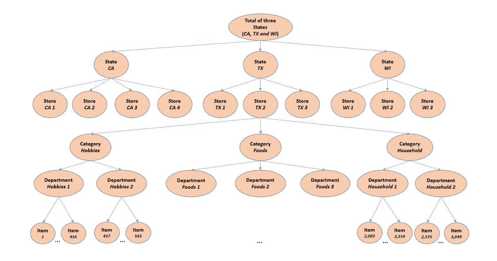

**图 1:M5 系列数据组织方式概述**

该数据包括在 3 个州的 10 家商店销售的 3 大类 7 个部门的 3049 件产品。分层聚合捕获了这些因素的组合，这使得执行自下而上的方法或自上而下的方法变得可行。例如，我们可以为所有销售创建一个时间序列，或者分别为每个州执行，等等。

# 假设

根据给出的数据，可能影响销售的一些因素如下:

1.  **日-** 顾客购物的时间和支出大多取决于周末。许多顾客可能只喜欢在周末购物。
2.  **特殊活动/节假日:**根据活动和节假日的不同，客户的购买行为可能会发生变化。对于像复活节这样的节日，食品销售可能会上升，对于像超级碗决赛这样的体育赛事，家庭用品销售可能会上升。
3.  **产品价格:**销售受产品价格影响最大。大多数顾客在最终购买之前都会检查价格标签。
4.  **产品类别:**产品的类型很大程度上影响销售。例如，与食品销售相比，电视等家用产品的销售将会减少。
5.  地点:地点在销售中也起着重要的作用。在像加利福尼亚这样的州，顾客可能会购买他们想要的产品而不考虑价格，而另一个地区的顾客可能对价格敏感。

在深入研究数据之前，先快速概述一下每个州的人口和收入中位数:

## 加利福尼亚

人口:3951 万

家庭年收入中位数:75277 美元

## 得克萨斯州

人口:2900 万

家庭年收入中位数:59570 美元

## 威斯康星州

人口 582.2 万

收入中位数:60733 美元

探索性数据分析是为了检验这些假设。

# 探索性数据分析

让我们开始数据分析，首先了解哪一个州的销售额最高，以及这三个州的各个部门的销售额。

## 探索商店的位置

本节旨在回答:

1.  哪个州的销售额最高？
2.  哪个部门的销售额最高？
3.  表现最好的商店？

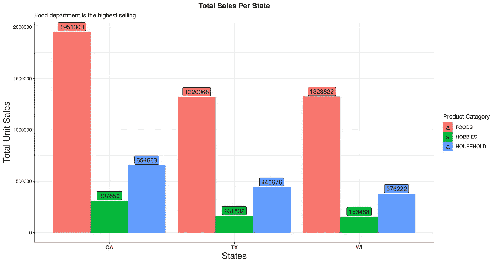

图二。每个州的总销售额

不出所料，食品部在这三个州都创下了最高的销售额。此外，从图 2 中可以看出，加州的总销售额最高。拥有 4 家商店和更多的人口可能是原因。令人惊讶的是，与德克萨斯州相比，人口密度较低的威斯康星州也创下了相同的销售额。为了更好地理解，绘制了每个商店的销售额。

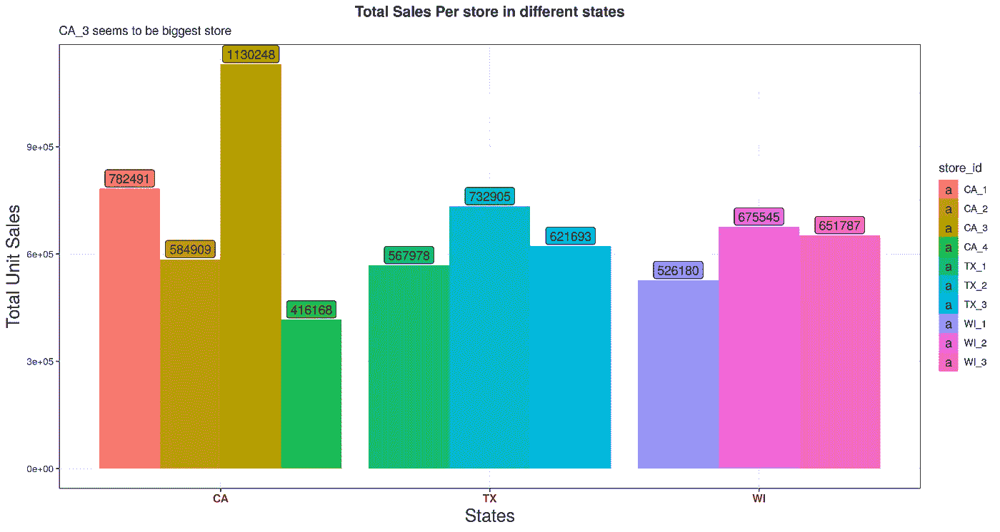

图三。店内总销售额

因为与其他商店相比，ca3 的销售额几乎是两倍。CA_3 可能是一个更大的商店。人口密度和收入中位数也影响这些销售。

现在，我们已经了解了不同地点对销售的影响，现在让我们深入了解各个部门

## 探索价格和产品类别

本节旨在回答:

1.  每个部门有多少不同的产品？
2.  不同州所有可用产品的平均价格是多少？
3.  哪个部门销售额最高最少？


图 4 可用产品总数

Food_3 部门的可用产品数量更多。因此，食品 3 部门可能包括日常消费的食品，如牛奶等。现在，让我们看看价格是否对销售有任何影响

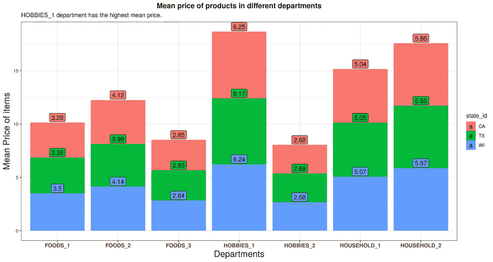

图五。所有产品的平均价格

可以看出，爱好 _1 部门均价最高，美食 3 最低。尽管与德克萨斯州和威斯康星州相比，加利福尼亚州人口的平均家庭年收入更高，但三个州的平均价格几乎相似，这使得加利福尼亚州人口更能负担得起这些产品。现在让我们来看看每个产品在各州的销售情况。

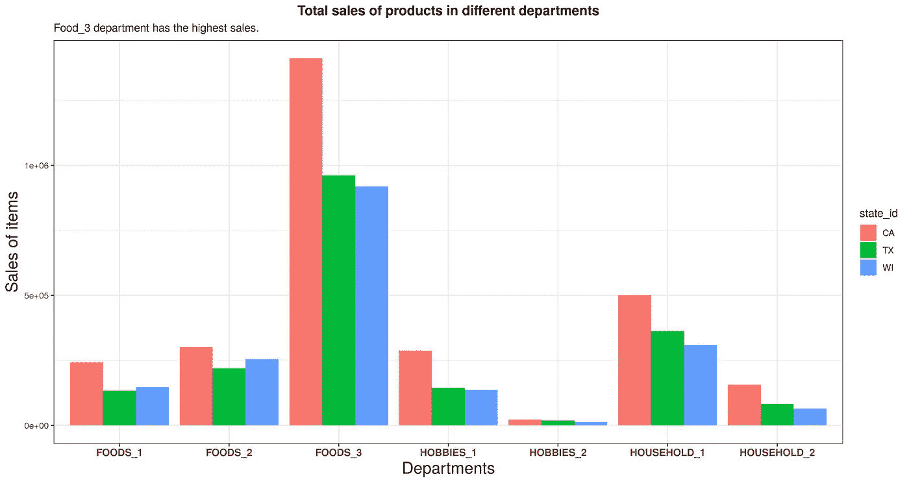

图六。所有产品的总销售额

这里，平均价格最低的食品 3 部门销售额最高。更有趣的是，尽管爱好 1 的平均价格最高，几乎是爱好 2 的两倍，但爱好 1 的销售额也很高。家庭 1 销售额很高。这可能表明该产品部门拥有肥皂和洗涤剂等日常必需品。

如前所述，加利福尼亚州的销售量较高，其次是德克萨斯州和威斯康星州。与德克萨斯州相比，威斯康辛州的食品 1 和食品 2 类的销售额更高。因此，可以假设威斯康辛州的人口喜欢食物 1 和食物 2 部门。

我们能够证明一些与产品价格、位置和产品类别相关的论文陈述。现在，让我们进入时间序列分析，看看不同的工作日、月份和事件是如何影响销售的。

# 时间序列分析

本节旨在回答:

1.  总销售额的每日季节性趋势
2.  哪个月的销售额最高和最低？
3.  在不同的州，人们更喜欢哪个工作日去杂货店购物？

绘制所有年份的时间序列，以观察不同部门所有 3 个州的季节性趋势。

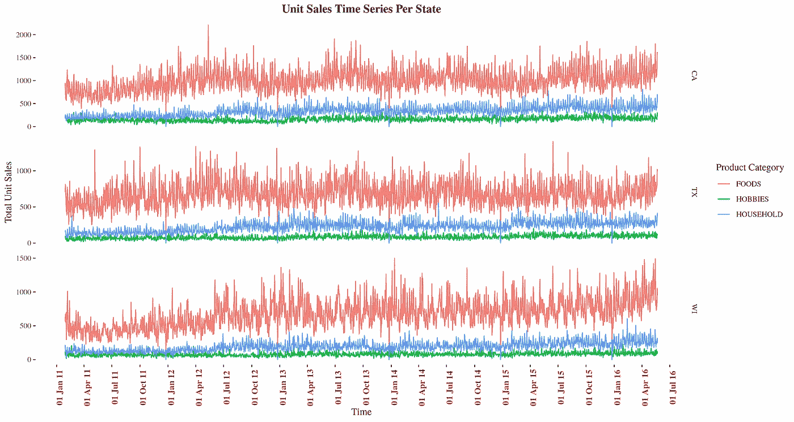

图 7。部门的每日销售趋势

季节性趋势遵循相同的模式，并且在所有 3 个州都是平行的。最高的食品是销售额最高的部门，其次是爱好和家庭。为了更好地理解每日趋势，绘制了 2015 年的热图。

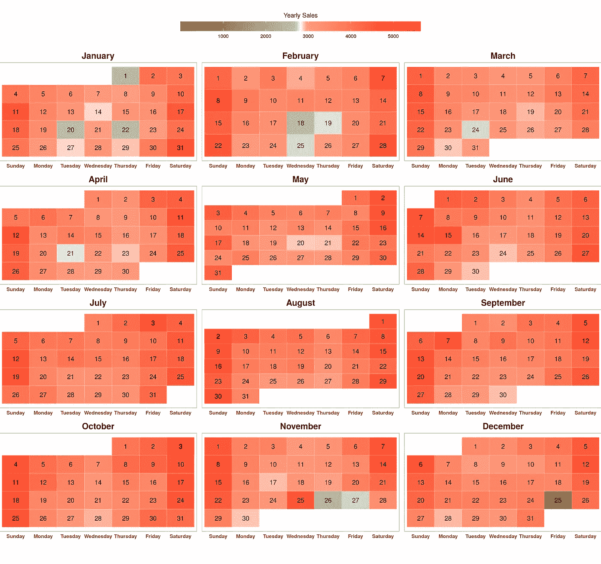

**图 8。2015 年日历热图**

沃尔玛似乎在圣诞节不营业。可以看出，在新年和感恩节这样的日子里，销售额很少。这是由于节日期间工作时间减少。此外，与平时相比，周末的销售额相对较高。

## 月度销售趋势

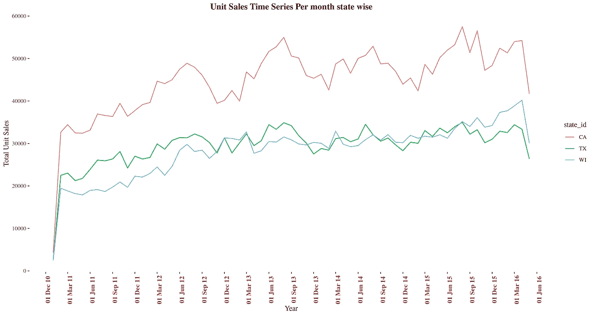

图九。全州每月销售趋势

令人惊讶的是，这三个州 5 年来的趋势都是一样的。可以看出，总销售额每年都在增加。这种趋势是因为沃尔玛每年都会推出新产品。此外，每年增加或减少的趋势模式几乎相似。为了更好地理解月度趋势，我们将一年中的所有月度销售额进行了分组，并绘制了图表。

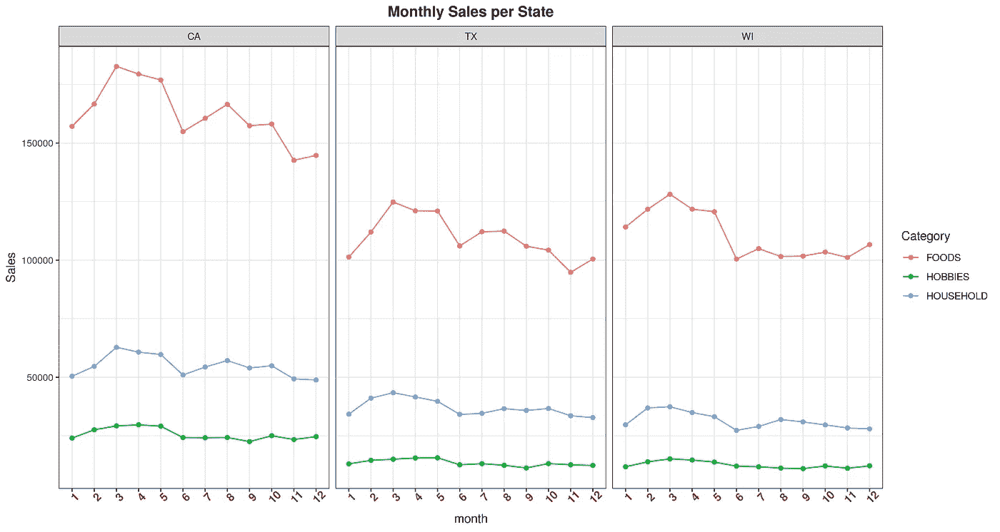

图 10。类别月度销售趋势

可以看出，销售额每年都在增长，并在三月份达到顶峰。三月之后，销售额开始下降，直到五月，六月销售额骤降至全年最低。6 月份之后，销售额在两个月内逐渐增加，直到 11 月份才进一步下降。

## 每周趋势

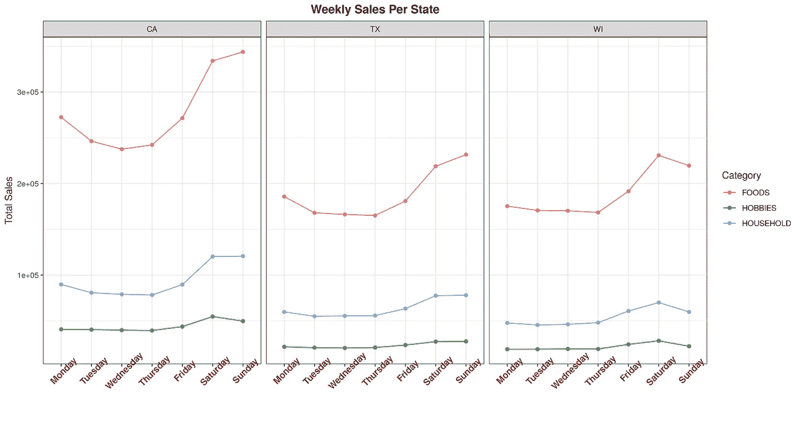

图 11。全州每周销售趋势

不出所料，与正常工作日相比，周六和周日的总销售额更高。即使在这里，威斯康辛州也是一个例外，周六是销售高峰，而加州和德克萨斯州是周日。所以，也许威斯康辛州的居民更喜欢在周六去杂货店购物。

为了更好地观察工作日和月份的趋势，绘制了工作日和月份的总状态热图。

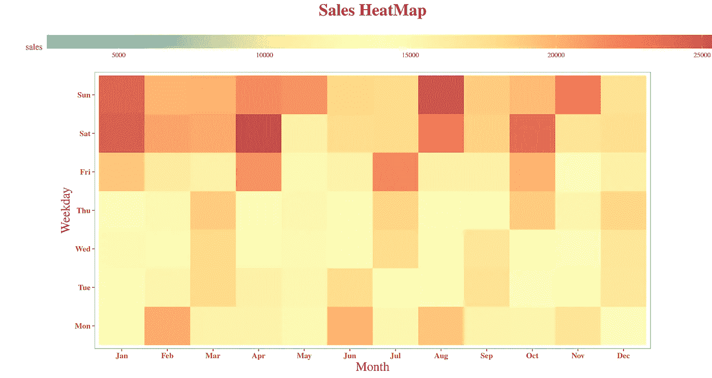

图 12。工作日与月份销售热图

这张销售热图有一个有趣的模式。可以观察到，每个月记录的销售数量都在增加。也就是说，如果在二月份的星期一记录了最高的销售额，我们可以看到在三月份星期二有更多的销售额。

## 假日和特殊活动的销售趋势:

本节旨在回答:

1.  节日活动和节假日如何影响销售趋势？
2.  哪个节日的销售额最高？

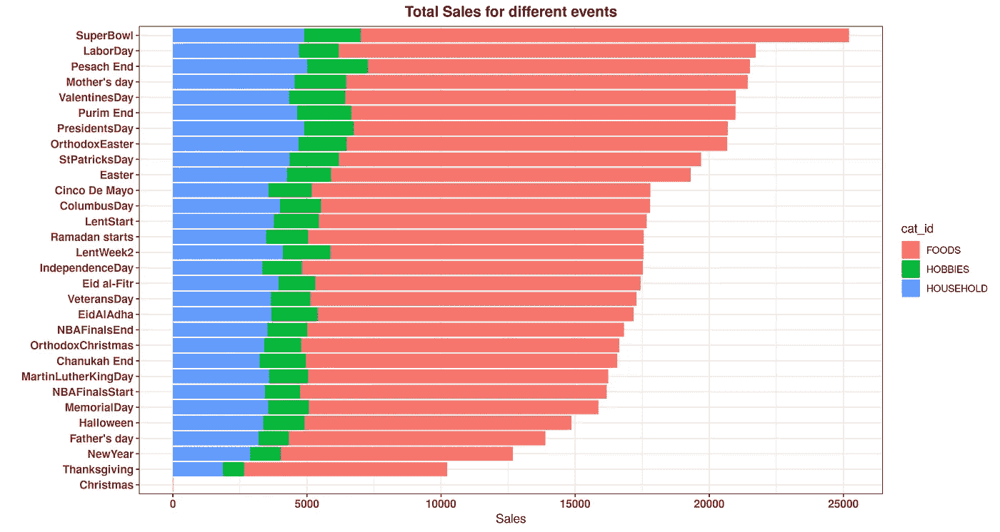

图 13。特殊活动的总销售额

超级碗体育赛事的销售额最高。国庆节那天，销售额很低。宗教节日当天的销售情况也是如此。为了观察销售趋势，绘制了 2015 年的季节性趋势图。

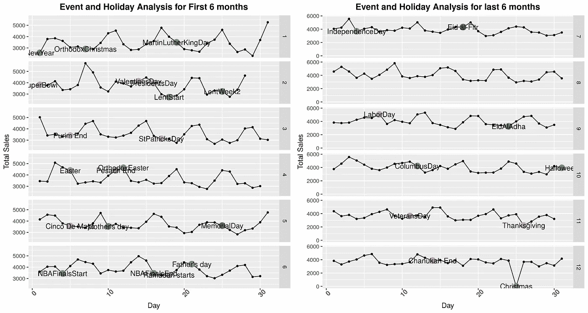

图 14。特殊活动的总销售趋势

观察结果:

1.  在像新年和复活节这样的节日，由于营业时间减少，销售额很低。
2.  圣诞节销售额为零，可能是因为沃尔玛关门了。
3.  像 NBA 决赛这样的体育赛事显示了一个有趣的洞察力，赛事前一天的销售额很高，而赛事当天的销售额下降。
4.  在父亲节、母亲节等特殊日子，销售额会下降。
5.  国定假日和宗教节日对体育赛事也有类似的影响。

# 建模:

该竞赛旨在预测 28 天的销售情况。

涉及的步骤:

1.  **引入滞后和滚动平均值**
2.  **训练/测试分流**
3.  **数字编码**
4.  **将数据转换成所需格式(** data.matrix，LGB)。数据集，Cat.loadpool **)**
5.  **参数选择**
6.  **模型训练/交叉验证**
7.  **预测**
8.  **型号对比的 SMAPE 误差**
9.  **单标准误差规则**

## 引入滞后和滚动平均值

由于缺乏计算能力，10%的数据是使用分层抽样选择的。分层随机抽样准确地反映了被研究的人群，因为它在应用随机抽样方法之前对整个人群进行了分层。简而言之，它确保人口中的每个亚群体在样本中得到适当的代表。

由于机器学习模型，我们使用的是具有滞后天数的时间序列，滚动平均值有助于改进模型，因此引入了新的滞后变量，分别用于 1 周、2 周、1 个月、2 个月的时变效应变量。有了更好的计算能力，也可以引入 1 年的滞后，因为每年的销售模式是相似的。引入了 1 周和 1 个月滞后变量的滚动平均值和滚动标准偏差。

对于不了解滞后的人来说，一个**滞后**是一段固定的流逝时间；时间序列中的一组观察值被绘制(滞后)在第二组数据之后。第 k 个滞后是发生在时间之前“k”个时间点的时间段

**训练/测试分流**

因为我们需要用 5 年的数据来预测 28 天。所有日期小于或等于 2016 年 3 月 27 日的数据都被视为训练数据。并将日期大于 2016 年 3 月 27 日且小于 2016 年 4 月 24 日的 28 天数据作为测试数据。最后 28 天用于验证。

**数字编码:**

由于许多机器学习模型无法读取字符类型数据，因此所有列都应转换为数字格式。我在 R 中使用了一个简单的命令

```
data%>%mutate_if(is.factor, as.integer)
```

**为什么要组装模型？**

集成方法通过组合多个模型来帮助改善机器学习结果。与单一模型相比，使用集合方法可以让我们做出更好的预测。因此，集成方法在许多著名的机器学习竞赛中排名第一，因此使用 sMAPE 错误率来比较不同的集成。

## 为什么是 sMape？

使用 sMAPE 误差率是因为它是 M3 预报中规定的评估指标。sMape 误差率或对称平均绝对百分比误差被列为重要的但不常见的预测误差测量方法之一。然而，它在计算上的复杂性和解释上的困难使它远远落后于最常见的 MAD 和 MAPE 预测误差计算。

sMape 误差计算如下

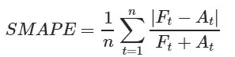

对于任何想了解所用模型以及一个模型相对于其他模型的优势的人，这里有一个[链接](/catboost-vs-light-gbm-vs-xgboost-5f93620723db)指向一篇比较 Xgboost vs catboost vs Lightgbm 的文章。

## Xgboost:

Xgboost 需要 xgb 格式的数据。用于预测的 DMatrix 格式，因此训练集和测试集都转换为 xgb。使用下面的命令。

```
train_set_xgb = xgb.DMatrix(data = data.matrix(train_data[,features]), label = data.matrix(train_labels))
test_set_xgb = xgb.DMatrix(data = data.matrix(test_data[,features]), label = data.matrix(test_labels))
```

为 Xgboost 选择的参数如下

```
params <- list(booster = "gbtree",
               tree_method='gpu_hist', gpu_id=0,task_type = "GPU",
          objective = "reg:tweedie", eta=0.4, gamma=0 nrounds = 20,    
           nthreads = 10,early_stopping_round = 10)
```

由于我们的数据包含大量零值，使用目标 as **回归**没有给出预期的结果。在浏览了一些研究[的文章](https://arxiv.org/pdf/1811.10192.pdf)之后，我们发现 Tweedie 是含有大量零的非负数据的最佳模型。因此 **Tweedie** 目标用于训练模型。

由于最新的 Xgboost 版本支持使用 GPU，因此使用 GPU 对模型进行训练。选择 RMSE 评估度量来训练模型。给出了 10 次的早期停止循环，因此如果模型 RMSE 在 10 次迭代中没有改进，模型将停止。并且将返回最佳 RMSE 值。

最佳 RMSE 值为 **2.48**

进行 **3 重交叉验证**是为了检查模型的一致性。为交叉验证返回的最佳 RMSE 值是 **2.637。**

定义一个函数来计算 sMAPE 值，如下所示:

```
smape_cal <- function(outsample, forecasts){
  outsample <- as.numeric(outsample)
  forecasts<-as.numeric(forecasts)
  smape <- (abs(outsample-forecasts))/((abs(outsample)+abs(forecasts))/2)
  return(smape)
}
```

Xgboost 的 SMAPE 值为 **1.897968**

## Catboost:

catboost 需要 load_pool 格式的数据来进行预测，因此使用以下命令将训练集和测试集都转换为 load_pool 格式。

```
train_cat <- catboost.load_pool(data = data.matrix(train_data_cat[,features]), label = data.matrix(train_labels))
test_cat <- catboost.load_pool(data = data.matrix(test_data_cat[,features]), label = data.matrix(test_labels))
```

为 Catboost 选择的参数如下

```
params_cat <- list(iterations = 1500,
                metric_period = 100,
               tree_method='gpu_hist',task_type = "GPU",
               loss_function = "RMSE",
               eval_metric = "RMSE",
               random_strength = 0.5,
               depth = 7,
               early_stopping_rounds = 100,
               learning_rate = 0.18,
               l2_leaf_reg = 0.1,
               random_seed = 93)
```

RMSE 被用作损失函数和训练模型的评估度量。使用 Kaggle GPU 进行 1500 次迭代的计算时间约为 5 分钟。第一轮是 100 轮。

最佳 RMSE 值为 **2.36541**

执行 **3 重交叉验证**以检查模型一致性。为交叉验证返回的最佳 RMSE 值是 **2.39741。**

Catboost 的 sMAPE 值为 **1.34523，**，似乎比 xgboost 更好。

## Lightgbm

lighgbm 需要 lgb_dataset 格式的数据进行预测，因此训练集和测试集都转换为 lgb。使用以下命令格式化数据集。

```
train_set_lgb <- lgb.Dataset(data=as.matrix(train_data[,features]), label = as.matrix(train_labels))
test_set_lgb <- lgb.Dataset(data=as.matrix(test_data[,features]), label =as.matrix(test_labels))
valids=list(train=train_set_lgb,test = test_set_lgb)
```

使用的参数如下

```
parameters =list(objective = "tweedie",
           tweedie_variance_power=1.1,
           metric ="rmse",
          force_row_wise = TRUE,
                  num_leaves=90,
            learning_rate = 0.03,
            feature_fraction= 0.5,
            bagging_fraction= 0.5,
            max_bin=100,
            bagging_freq = 1,
            boost_from_average=FALSE,
          lambda_l1 = 0,
          lambda_l2 = 0,
          nthread = 4)freeram()
```

Tweedie 用作目标函数，RMSE 用作训练模型的评估度量。

最佳 RMSE 值为 **2.1967701**

执行 **3 重交叉验证**以检查模型的一致性。为交叉验证返回的最佳 RMSE 值是 **2.21。**

Lgboost 模型的 sMAPE 值为 **1.14，**是所有 3 个模型中最好的。

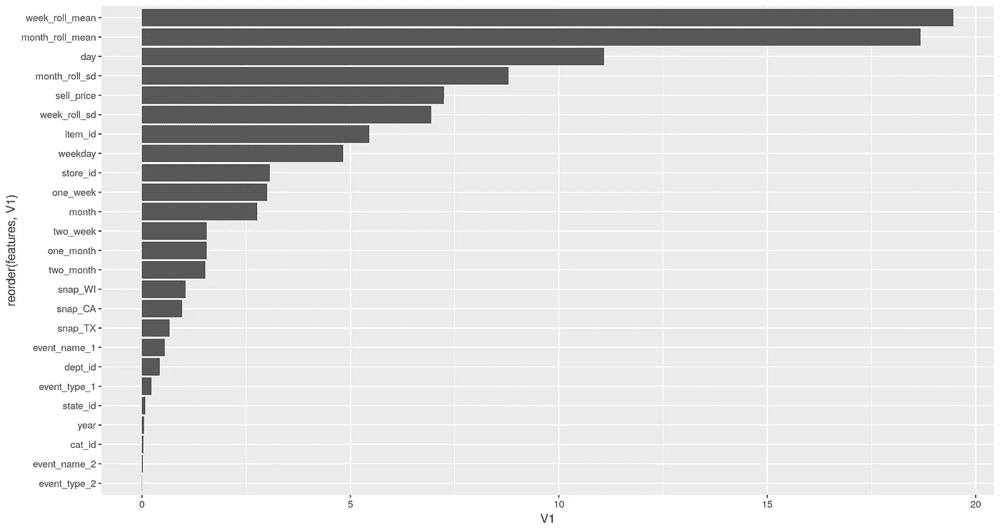

图 15。LGB 模型的特征重要性

基于 sMape 误差，Lgb 是最好的模型。只是为了确认，一个标准误差适用于所有 3 个模型的交叉验证 RMSE 值。

**一个标准误差规则:**

对于那些不知道一个标准误差规则的人，在交叉验证中使用一个标准误差规则，其中我们采用最简单的模型，其误差在最佳模型(误差最小的模型)的一个标准误差内。

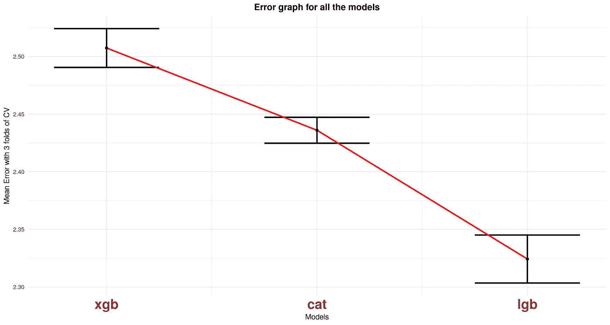

图 16。一个标准误差图

## 结论:

即使在这里，LGB 也是 RMSE 值最低的表现最好的车型。因为其他模型平均误差点不在 Lihtgbm 模型的标准差范围内。根据一个标准误差规则，Lightgbm 被选为最佳模型。

表现最好的模型的提交分数在 0.46 左右。

# 附录

所有绘图都是使用 r .中的 **ggplot2** 包制作的，因为代码非常大。我把我的 Kaggle 笔记本分享给任何想在比赛中使用代码的人。

ka ggle:[https://www . ka ggle . com/jaswanthhbadvellu/cat-xgb-lgboost-prophet](https://www.kaggle.com/jaswanthhbadvelu/cat-xgb-lgboost-prophet)

数据集:【https://www.kaggle.com/c/m5-forecasting-accuracy/data 

分层采样后的样本数据集如下所示

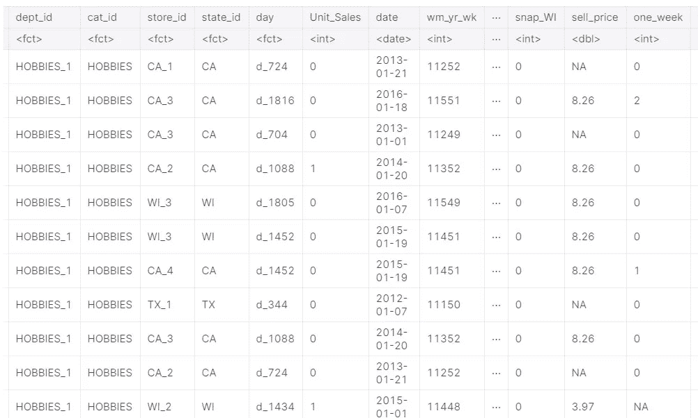