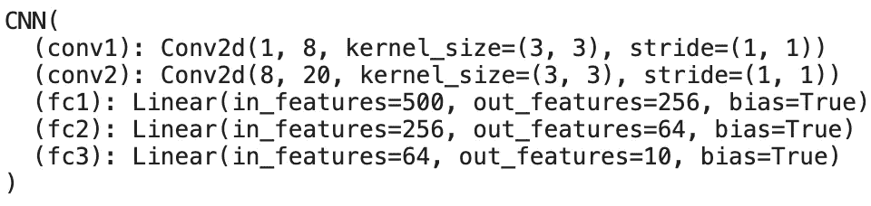
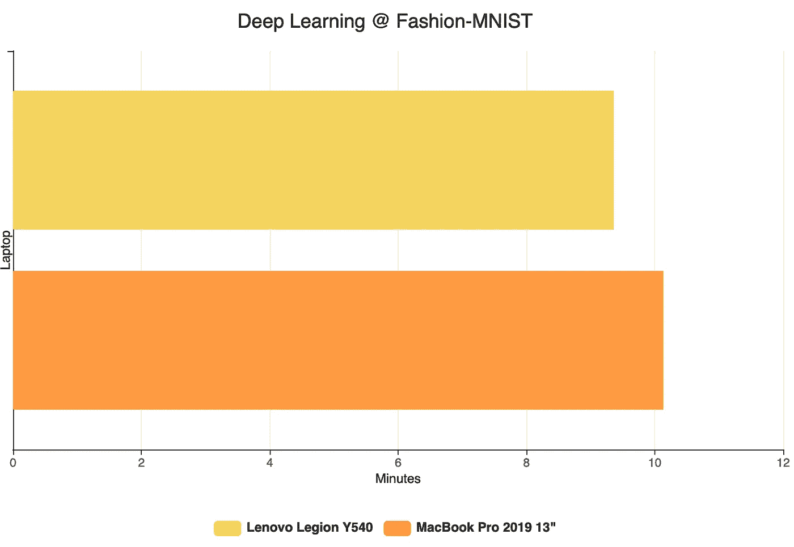

# 深度学习的 MacBook Pro？让我们试试。

> 原文：<https://towardsdatascience.com/macbook-pro-for-deep-learning-lets-try-841ab8ffee7e?source=collection_archive---------3----------------------->

## 它与英伟达 GPU 驱动的笔记本电脑相比如何？

我昨天买了一台 MacBook Pro。2019 款，13”带基础配置(后面会详细介绍)。作为一名数据科学家和深度学习爱好者，我一开始对整个苹果的想法有点怀疑，因为**深度学习需要 GPU** 在“合理”的时间内训练，而 GPU 不是 MAC 的主要卖点。

由 [Ash Edmonds](https://unsplash.com/@badashproducts?utm_source=medium&utm_medium=referral) 在 [Unsplash](https://unsplash.com?utm_source=medium&utm_medium=referral) 上拍摄的照片

尽管如此，我还是决定尝试一下，因为我早就想要一台 MacBook 了。虽然我仍然不习惯键盘(布局方面)，但对我来说，整个操作系统比 Windows 好得多。

我已经多次尝试了各种版本的 **Linux** ，但是所有的版本都感觉像是还在 alpha 测试之前，尽管事实并非如此(过热问题、睡眠问题、wifi 问题……)。

这篇文章针对的是那些面临着和我昨天一样的 MacBook 困境的数据科学家——买还是不买**。如果你没有时间通读整篇文章，简短的回答是**是的**——如果你有钱并且想要新的东西，就去买 Mac。**

您将不得不继续关注原因和性能比较。

这篇文章的结构如下:

1.  硬件比较
2.  使用的数据集和库
3.  深度学习—性能比较
4.  结论

现在，这不会是一个深度学习教程，因为我只会分享两台笔记本电脑在训练中的表现。如果您想了解这个数据集的完整概要，请告诉我。

无论如何，这个介绍比我预期的要长，所以让我们结束它，开始你来这里的目的。

# 硬件比较

直到昨天，我还没有 MacBook Pro，所以我已经在我的**联想军团 Y540** 笔记本电脑上完成了所有数据科学和深度学习的东西，规格如下:

*   CPU:英特尔 I5 9300H
*   GPU:英伟达 GeForce GTX 1650 4GB
*   内存:16GB DDR4
*   固态硬盘:512GB

虽然笔记本电脑的功能不是非常强大，但我发现它足以处理知名数据集的临时深度学习任务，甚至可以处理一些大型彩色图像。

***只是我快速说明一下***——我是用 CUDA 在 GPU 上训练模型，所以要记住这一点。

然后是**Mac**(13“2019。型号)具有以下规格:

*   CPU:英特尔 I5 QC 1.4GHz
*   GPU:英特尔 Iris Plus 645 1536MB
*   内存:8GB
*   固态硬盘:128GB

因此，仅从规格来看，它对 Mac 来说并不太好——但让我们在接下来的部分看看它的表现如何。

# 使用的数据集和库

最近在我的大学，我们处理了**时尚-MNIST** 数据集。如果你做过深度学习，我相信你对它很熟悉，但以防万一，这里有一点背景知识——来源: [Kaggle](https://www.kaggle.com/zalando-research/fashionmnist) 。

> 时尚-MNIST 是 Zalando 文章图像的数据集，由 60，000 个样本的训练集和 10，000 个样本的测试集组成。每个示例都是 28x28 灰度图像，与 10 个类别的标签相关联。[1]

更准确地说，我们有 10 类图像:

*   0: T 恤/上衣
*   1:裤子
*   2:套头衫
*   3:着装
*   4:外套
*   5:凉鞋
*   6:衬衫
*   7:运动鞋
*   8:袋子
*   9:短靴

好了，现在你已经有了数据集的一些基本信息。我唯一要做的就是说明我在使用哪个深度学习库。如果你读过我的任何帖子，你可能知道我是一个 **PyTorch** 用户，这篇文章也不会例外。

很好，现在我们知道了一切-让我们比较一下基本型号的 MacBook Pro 与支持 GPU 的 Windows 笔记本电脑之间的差异。

# 深度学习—性能比较

现在我已经开始在两台笔记本电脑上运行模型，看看 MacBook 会落后多少。在向您展示结果之前，您可能还会对模型架构感兴趣，如下图所示:

所以这里没什么特别的，我用 **ReLU** 作为隐藏层的激活函数，用**对数 softmax** 作为输出层。此外，我已经在内核大小为 2x2、步幅为 od 2 的两个卷积层之后执行了 **MaxPooling** 。是的，差点忘了——这个模型被训练了 15 个时期。

这是您的平均设置，将产生大约 150，000 个可训练参数(权重和偏差)，神经网络需要针对这些参数进行优化。

现在到了你期待已久的部分——**实际性能对比**！这是图表:

联想:9 分 36 秒，MacBook: 10 分 13 秒

如你所见，联想笔记本电脑表现更好，但**也好不了多少**。我预计会有更严重的差异，主要是因为联想笔记本电脑有“像样的”GPU，而 MacBook 没有。

因为通风系统在联想笔记本电脑上无可挑剔，而在 Mac 上几乎不存在，Mac 确实变热了，所以这是你应该考虑的另一个方面。

由于这篇文章的唯一目标是研究 MacBooks 实际上能否处理深度学习，以及它们在这方面的表现如何，这里我将停止。

# 结论

我花了很长时间才决定买苹果电脑。我一直喜欢它的想法，总体来说操作系统似乎更好，但我只是担心它在数据科学和深度学习任务方面的表现会很糟糕。

我很高兴我已经做出了改变——只是希望我能早点做出改变。

感谢阅读，我希望你喜欢它。

喜欢这篇文章吗？成为 [*中等会员*](https://medium.com/@radecicdario/membership) *继续无限制学习。如果你使用下面的链接，我会收到你的一部分会员费，不需要你额外付费。*

 [## 通过我的推荐链接加入 Medium-Dario rade ci

### 作为一个媒体会员，你的会员费的一部分会给你阅读的作家，你可以完全接触到每一个故事…

medium.com](https://medium.com/@radecicdario/membership) 

# 参考

[1][https://www.kaggle.com/zalando-research/fashionmnist](https://www.kaggle.com/zalando-research/fashionmnist)