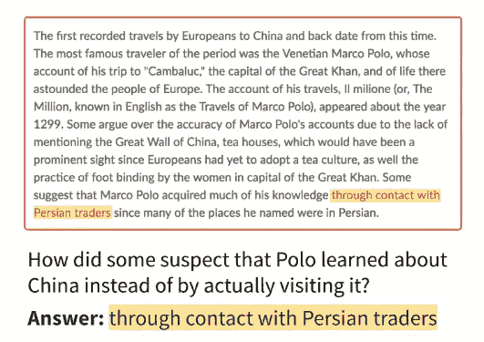
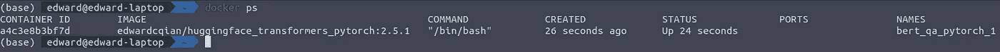

# 用 BERT 进行机器理解

> 原文：<https://towardsdatascience.com/machine-comprehension-with-bert-6eadf16c87c1?source=collection_archive---------18----------------------->

## 使用深度学习进行问题回答

迈克尔·泽兹奇在 [Unsplash](https://unsplash.com?utm_source=medium&utm_medium=referral) 上的照片

**在 Github 的资源库中可以找到** [**这里有**](https://github.com/edwardcqian/bert_QA) **。本文将介绍如何设置它。预计时间:30 分钟以内。**

机器(阅读)理解是 NLP 的领域，在这里我们教机器理解和回答使用非结构化文本的问题。

 [## 深度学习

### 成为深度学习专家。掌握深度学习的基础，打入 AI。填满的星星填满的星星…

www.coursera.org](https://www.coursera.org/specializations/deep-learning?ranMID=40328&ranEAID=J2RDo*Rlzkk&ranSiteID=J2RDo.Rlzkk-XtffRH2JEnDifWa3VrZJ1A&siteID=J2RDo.Rlzkk-XtffRH2JEnDifWa3VrZJ1A&utm_content=2&utm_medium=partners&utm_source=linkshare&utm_campaign=J2RDo*Rlzkk) 

2016 年，StanfordNLP 整合了 SQuAD(斯坦福问答数据集)数据集，该数据集由超过 10 万个根据维基百科文章制定的问题答案对组成。面临的挑战是训练一个机器学习模型来回答基于上下文文档的问题。当提供一个上下文文档(自由形式的文本)和一个问题时，模型将返回最有可能回答问题的文本子集。

来自小队数据集的示例条目

世界各地的顶级人工智能实践者解决了这个问题，但两年后，没有模型击败人类基准。然而，在 2018 年底，谷歌大脑的聪明人推出了 BERT(来自变压器的双向编码器表示)，这是一种通用语言理解模型。通过一些微调，该模型能够在与小队测试集进行比较时超过人类基准。

来自 [paper SQuAD: 100，000 多个用于机器理解文本的问题，](https://arxiv.org/pdf/1606.05250.pdf)这些是用于评估的指标:

> **完全匹配。**此指标衡量与任何一个基本事实答案完全匹配的预测的百分比。
> 
> **(宏观平均)F1 得分。**此指标衡量预测和真实答案之间的平均重叠。我们将预测和基础事实视为一袋袋的令牌，并计算它们的 F1。我们对给定问题的所有基本事实答案取最大值 F1，然后对所有问题取平均值。

基于初始小队数据集:

*   人类注释者获得了 82.304% 的精确匹配分数和 91.221% 的 F1 分数
*   最初的 BERT 模型(在排行榜上排名第 11，主要被 BERT 的其他变体击败)获得了精确匹配分数 **85.083%** 和 F1 分数 **91.835%**

今天，我将向你展示如何使用 BERT 建立你自己的阅读理解系统。**在 Github 仓库中可以找到** [**这里**](https://github.com/edwardcqian/bert_QA) **。**

要开始，你需要 Docker。🐳

## 设置 Docker

Docker 对于容器化应用程序很有用。我们将使用 Docker 使这项工作更有用，结果更具可重复性。按照这些说明在你的系统上安装 Docker。你还需要在 macos 和 windows 上自带 Docker 的`docker-compose`。如果你用的是 Linux，你可以在这里安装[。](https://runnable.com/docker/introduction-to-docker-compose)

## 从我的 Github Repo 本地保存代码

除了阵容数据和预先训练的重量，所有的代码和必要的依赖都在报告中。**注:**只有自己想训练模型才需要数据。如果没有，你可以使用我预先训练的重量。**另一个注意:**我不建议训练模型，除非你有强大的 GPU 或者大量的时间。

**如果你想自己训练模特…**

点击下载小队 2.0 数据集[。将“训练集 2.0 版”和“开发集 2.0 版”保存到`bert_QA/data`。](https://rajpurkar.github.io/SQuAD-explorer/)

**如果您想使用预先训练的重量…**

我已经用 SQuAD 2.0 数据集训练了这个模型。你可以在这里下载。解压文件并将内容保存为`bert_QA/weights`。

## 创建 Docker 容器

Docker 容器是使用 docker 映像中提供的指令构建的工作环境。我们需要一个`docker-compose.yaml`配置文件来定义我们的容器的外观。

我为 Pytorch 变形金刚做了一个定制的 docker 图片，你可以在 dockerhub 上找到。出于本教程的目的，您不需要提取任何图像，因为配置文件已经这样做了。配置文件还将把我们的本地`bert_QA`文件夹作为`/workspace`挂载到容器中。

*   通过从终端/shell 运行根目录中的`docker-compose up -d` 来启动我们的容器。第一次需要几分钟。
*   使用`docker ps`检查我们的容器是否启动并运行。

*   将 bash shell 附加到正在运行的容器:

`docker exec -it <your_container_name> bash`

## 训练模型

如果你使用我预先训练的重量，跳过这一步。我们将使用由 [huggingface](https://github.com/huggingface/transformers) 提供的默认训练脚本来训练模型。

在 bash shell 中运行:

**注意:**如果没有 GPU，per_gpu_train_batch_size 不会做任何事情

这将训练并保存模型权重到`weights`目录。

## 使用模型进行推理

现在让我们用这个模型来做一些很酷的东西。

在 shell 中启动一个 ipython 会话，并导入`ModelInference`模块以从`weights/`加载权重。将上下文文档作为参数传递给`mi.add_target_text()`。摄取完语料库后，使用`mi.evaluate()`提问。只有当模型确信答案存在于文本中时，模块才会返回答案。否则，模型将输出“未找到有效答案”。

## 结论

在过去的几年里，NLP 取得了长足的进步。预训练的 BERT 权重对 NLP 的影响类似于 AlexNet 对图像识别的影响。它实现了自然语言理解的许多新颖应用。