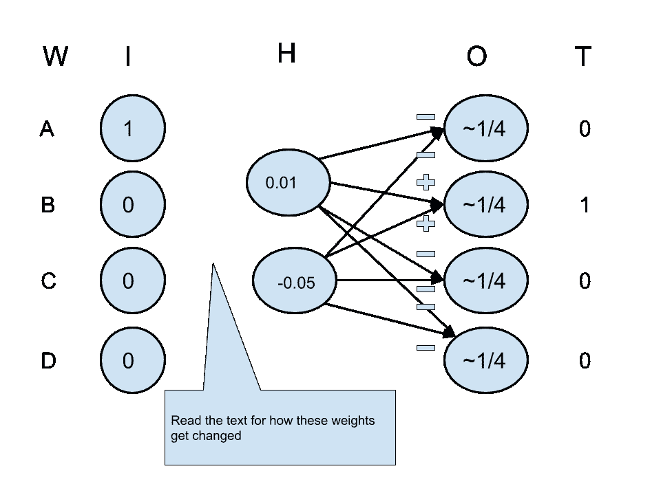

# 机器学习单词嵌入

> 原文：<https://towardsdatascience.com/machine-learned-word-embeddings-638c3fb5b916?source=collection_archive---------65----------------------->

## 没有数学的介绍

单词是许多自然语言中的关键结构。它们被赋予了意义。往往因环境而大相径庭。拿 *python* 来说。这在计算机编程和生物学中意味着完全不同的东西。

要掌握一门语言，人和计算机都是从掌握关键词开始的。这篇文章试图解释计算机是如何掌握单词的。

用适合自然语言处理或信息检索(搜索)的形式来表示单词已经有很长的历史了。出现了两大类代表:*本地*和*分布式。*

这篇文章关注的是(I)分布式的和(ii)机器学习的表示。不熟悉本地或其他分布式表示的读者可能想先阅读自然语言处理中的单词和文本表示。

从这一点开始，我们转而使用术语*单词嵌入*。这是通常用来表示“机器学习的分布式单词表示”的术语。

**为什么*机器学习*单词嵌入？**

**原因 1** 。可以仅从丰富的文档语料库中学习单词的准确和丰富的表示。举个例子。从维基百科语料库中，我们可以机器学习数百万不同单词的好单词嵌入。对它们运行算法就行了。呈现出来。

**原因二**。*领域特定的*单词嵌入可以仅仅通过在领域特定的语料库上训练来学习。例如，从关于计算机编程的文档语料库中，嵌入单词的学习者可以了解 python 在计算机编程上下文中的含义。当然，这种含义与非编程环境中的含义完全不同。

想象一下，一个对某个领域一无所知的人，比如说计算机编程，要花多长时间才能理解它的词汇？即使是最基本的。

**学习问题公式化**

从高层次来看，很明显。我们想学习单词的“准确而丰富”的表达。不过有点太笼统了。我们如何知道算法是否(以及何时)学习得足够好？人们不断地与其他人互动，所以他们缺乏理解很快暴露出来。计算机还没有出现。因此，我们希望更具体地指定学习目标。

这个怎么样？我们想学习相似单词有相似表示法的表示法。嗯，这似乎也有点宽泛。事实上，我们已经获得了有用的特异性。

很容易构建成对单词的测试集，每对都标有“相似”或“不相似”。下面是一些例子

```
{lawyer, attorney} → similar
{computer, cat} → not-similar
```

标签可以被细化，例如，我们可以引入多个相似或相异的级别。

**学习问题公式化:我们还没到那一步**

熟悉机器学习的读者可能会倾向于认为前面提到的测试集也说明了机器学习问题。并非如此。我们来解释一下。

让我们看看，如果我们把测试集的形式作为学习问题的文字说明，我们会得到什么。我们得到:*训练一个二元分类器，输入两个词，输出它们是否相似*。

虽然这是一个值得解决的问题，但这不是我们的目标。我们希望输入是一个*单个*字。我们希望算法输出这个单词的准确而丰富的表示。测试集只是作为一种间接的手段来评估学习模型对这项任务有多好。

**学习问题公式化:取两个**

好吧，让我们重新开始

```
P1: We’d like to learn representations of words in which similar words have similar representations.
```

考虑将此重新表述为

```
P2: We’d like to learn representations of words that capture their context.
```

什么是“语境”？这个词经常出现在其他词的近旁。*猫*的上下文将包括*胡须*。但不是*电脑*

有理由认为，语境表征相似的词本身也是相似的。因此，解决 P2 问题也是解决 P1 问题的好办法。

我们取得了进展。我们之前的公式包括输入两个单词。这才*一个*！

嗯。我们如何获得(*单词*，*上下文*)对的训练集？在这一点上，我们甚至不知道如何将上下文的概念塞进一个变量中，这个变量可以作为我们的预测目标！

好吧，让我们先解决“将上下文填充到变量中”的问题。我们将一个单词的上下文建模为词典中单词的概率分布。以*猫*为例。*胡须*在*猫*的上下文中的概率应该很高。*计算机*在*猫*的上下文中的概率应该很低。

**上下文向量**

我们在本帖中描述的学习方法最好在神经网络环境中描述。神经网络喜欢在向量空间上操作。也就是说，它们将输入向量映射到输出向量(或标量)，通常在两者之间会发生一些神奇的事情。

我们已经完成了输出。词典中单词的概率分布是空间中的向量，其维数是单词。(所以一百万单词词典的向量空间将有一百万个维度。)向量的一个分量的值就是相应单词的概率。

输入呢？这是一个特别的词。这也可以表示为同一空间中的概率向量。与单词相关联的维度的值为 1，其余为 0。

因此，我们当前的架构可以描述为

```
I ⇒ magic ⇒ O
```

I 和 O 是同一空间上的概率向量，而“魔术”是在它们之间发生的任何事情。

**训练集？**

为了学习，我们需要一个训练集(*单词*、*上下文*)对。不清楚如何建造。单词不会被贴上上下文的标签。

我们可以从具有代表性的文档语料库中估计单词的上下文向量。在这个词附近出现(足够频繁)的词是在它的上下文中，那些不在它的上下文中的词不是。

我们所说的“代表”是什么意思？我们指的是与我们试图学习的内容相匹配的语料库。学习计算机编程术语，我们的语料库应该由计算机编程文档组成。

**训练集简化**

建立上述训练集包括从语料库中学习各种单词的上下文向量。我们可以简化这个。相反，我们可以用一组足够接近的成对单词来训练，例如在同一个句子中。表示这样的一对( *word1* ， *word2* )。我们将此解释为单词 2 出现在单词 1 的上下文中的实例。

这里有一个例子。

```
Sentence: the **dog** and **cat** are **black** Training Set: dog → cat, cat → dog, dog → black, black → dog, cat → black, black → cat
```

训练实例仅限于加粗的实例。(剩下的就当是停用词吧。)

将来自我们语料库中所有文档的所有句子的这种对流传送到学习算法将有效地向算法揭示每个单词的上下文向量。

这种简化对我们有两方面的好处。

首先，它简化了构建训练集的过程。我们可以独立处理每个句子。简单地发出由此产生的训练对。我们甚至可以在一个流动的，即连续学习的环境中做到这一点。想象一下新文档不断到达，就像 web 级搜索引擎的索引器一样。我们可以从他们那里即时流出新的训练实例。

第二，有利于学习算法。与输入相关联的目标是概率向量，其质量集中在一个单词上。这个目标比一个任意的概率向量更清晰。

好了，现在谈谈学习算法。我们只会看到一个。传达主要思想就足够了。也就是说，那些寻求从大型语料库中的大型词典上建立工业强度单词嵌入的人需要阅读更多。

**连续词袋模型**

这个描述相对于最初的描述有所简化，尽管对于我们在这篇文章中要解决的问题来说已经很好了。

这是一个只有一个隐藏层的神经网络。

```
I ⇒ H ⇒ O
```

好了，我们用 H 代替了魔法。确实神奇！

这两个符号下面发生了什么？这在下面描述。

```
H = W1*I O=probability_normalizer(W2*H)
```

让我们解释一下数据是如何从输入流向输出的。我们从输入向量 *I* 开始。我们用矩阵 W1 乘以 *I* 。这给了我们一个隐藏向量 *H* 。接下来，我们用矩阵 W2 乘以 *H* 。得到的向量还不一定是概率向量。我们对它应用概率规格化器，把它转换成一个。这就变成了我们的输出向量 *O* 。

一些问题仍然存在。首先，学习发生在哪里？第二，这个概率规格化器的概念有点抽象。

**对第一个问题**的回应。实际上，我们到目前为止描述的是输入到输出的数据流。我们将在一两分钟后开始实际的学习。我们将学习的参数是矩阵 W1 和 W2 中的值。

**对第二个问题**的回应。下面是两个概率规格化器的具体例子。两者都假设输入是一个具有非负值的向量。

第一个，姑且称之为*简单*，只是取每个值，除以所有值的和。第二个称为 *softmax* ，首先对值取幂，然后应用简单的规格化器。softmax 是在实践中使用的。为什么？在我们描述了实际的学习算法之后，我们将给出一些直觉。

以下是两个规格化函数的例子。

```
simple([1,3,5]) → [1/9,3/9,5/9]
softmax([1,3,5]) → simple([e¹,e³,e⁵])
```

在神经网络术语中，概率归一化器是一个*矢量激活函数*的实例。

**更多要点**

鉴于学习的过程将包括学习从 *I* 预测 *O* ，一旦我们学习得足够好，我们将只提取权重矩阵 W1。我们会扔掉 W2。

我们只关心从 *I* 到 *H* 的映射。 *H* 将作为由 *I* 表示的单词的表示。(也就是说，为了学习一个好的映射 *I → H* ，我们别无选择，只能解决完整的学习问题，因为我们没有关于 *H* 的目标，只有关于 *O* 的目标。)

另一个关键点是，我们会有意将 *H* 的维度限制为远小于 *I* 和 *O* 的维度。鉴于 *I* 和 *O* 可能有几百万个维度，我们将强制 *H* 有几百个，可能一千个，也可能更少。想法是迫使学习算法学习*密集*单词表示。

理由是这样的。首先，这是否可行？是的。单词有结构，否则一开始就不会有任何单词相似的概念。所以我们应该能够将 *I* 空间压缩到一个维度更低的空间。事实上，很难想象有超过 20 个描述单词的正交潜在属性！也许我们只是想象力不够丰富。所以让我们把这个乘以五倍。甚至更好，百倍。这还是在低几千！

好的，我们认为我们已经解决了可行性问题。接下来，我们为什么要这么做？(可行不代表是个好主意。)原因是密集表示更好地概括。直觉很简单:如果我们认为单词的潜在特征比它们的数量少得多，那么强迫学习者映射到低维空间将比试图学习映射到原始向量空间更好地概括。

**最后，学习！**

我们将通过一个简单的例子来集中传达直觉。没有数学。

我们的例子是在一个只有四个单词 A，B，C，d 的词典上。我们将 H 设为二维。我们将使用训练集

```
(A,B), (B,A), (C,D), (D,C)
```

我们将从空白状态开始学习，将 W1 和 W2 中的所有值随机初始化为较小的正值或负值。接下来，我们将呈现第一个训练实例的输入 A，其编码为 1000。所有可学习的权重都接近 0；所以 *H* 会是(~0，~0)，W2* *H* 会是(~0，~0，~0，~0)。我们假设 probability_normalizer 激活函数将这个 *H* 映射到(~、~、~、~)。目标是 B，具体来说，是编码(0，1，0，0)。这个目标与预测大相径庭。所以我们需要学习。

接下来发生的事情最好用一张图来传达。



学习范例

在图中， *T* 表示目标输出。从 *H* 到 *O* 的圆弧上的+s 和-s 表示根据 O*和 *T* 之间的差值改变重量的方向。我们看到 B 的产出的权重应该增加；其余减少。(这是因为 B 的产量太低；其余的产量太高了。)*

我们还没完。我们还需要计算从 *I* 到 *H* 的权重调整。为什么？因为这些权重值也可能导致我们在输出端看到的误差。

这些调整是通过著名的反向传播算法计算的。正是这种算法，在这种隐藏的基于层的架构中利用适当选择的激活函数(在我们的情况下是概率归一化器)，提供了魔力。

接下来发生的事情最容易用数字来描述。设 *H* 1 表示 *H* 的第一个分量。 *H* 1 的当前值为 0.1。考虑 B 的输出。它看到的错误是~ 1-=。在这种情况下，如果我们能够以某种方式在 *H* 1 上设置一个合理的目标，我们就会知道将重量从 *I* 移动到 *H* 1 的方向。如果 1 的目标值大于 0.1，我们会降低权重。如果 1 的目标值小于 0.1，我们会增加权重。

嗯，估计 1 的目标和估计 1 看到的误差是一样的。这一点我们可以估计如下。考虑一个特定的输出节点。它的误差是目标输出减去实际输出。我们首先通过 probability_normalizer 反向传播这个误差，然后通过从 H1 到这个输出节点的权重。这给了我们 H1 从这个输出节点看到*的误差。输出节点上这些误差的总和。是 H1 认为的完全错误。*

让我们一步一步地解决这个问题。三个输出都有错误，其中一个(B)有错误。想象一下，这些误差通过概率归一化器成比例地反向传播。(我们只是要求你去想象，而不是假设。)加上回想一下，从 *H* 1 到 *O* 的权重是随机的，幅度很小。考虑到这两个因素，在 *H* 1 处对这些误差求和将大致抵消它们，即产量接近 0。

同样，H2 看到的误差也将接近于 0。这令人不安吗？不。在这一点上， *H* 1 和 *H* 2 都不知道它想要成为什么。 *H* 1 和 *H* 2 误差虽然可能接近 0，但也可能不同。因此，从 T36 到 T37，H1 和 H2 的权重可能会经历至少略有不同的调整。这将导致 H1 和 H2 在他们所学的东西上产生分歧。在许多训练实例中，在我们的例子中，这意味着在相同的 4 个训练实例中的多次迭代， *H* 1 和 *H* 2 将学习从输出中挑选不同的东西。引发这一现象的现象被称为*对称性破缺*。

**为什么选择 Softmax？**

哦，我们忘了。我们答应解释这个。直觉告诉我们，我们想要鼓励学习区分。这样想。我们在隐藏层中有一个神经元池。起初，他们不知道他们应该做什么。如果我们不鼓励他们开始歧视，他们可能会保持不承诺。我们都知道会发生什么。有没有在一个没有人想脱颖而出的委员会里？

嗯，softmax 功能就像一位高管，推动人们探索自己舒适区以外的地方。softmax 中的幂运算具有放大差异的效果。于是轻微的赢家(输家)变成了强大的赢家(输家)。

**延伸阅读**

【https://arxiv.org/pdf/1411.2738.pdf】T2—word 2 vec 参数学习讲解

Mikolov，Sutskever，I .，Chen，k .，Corrado，G. S .，和 Dean，J. (2013b)。词和短语的分布式表示及其组合性。神经信息处理系统进展，3111-3119 页。